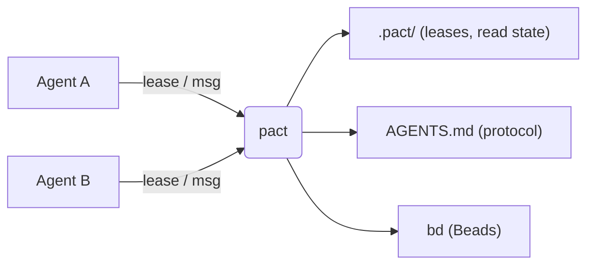
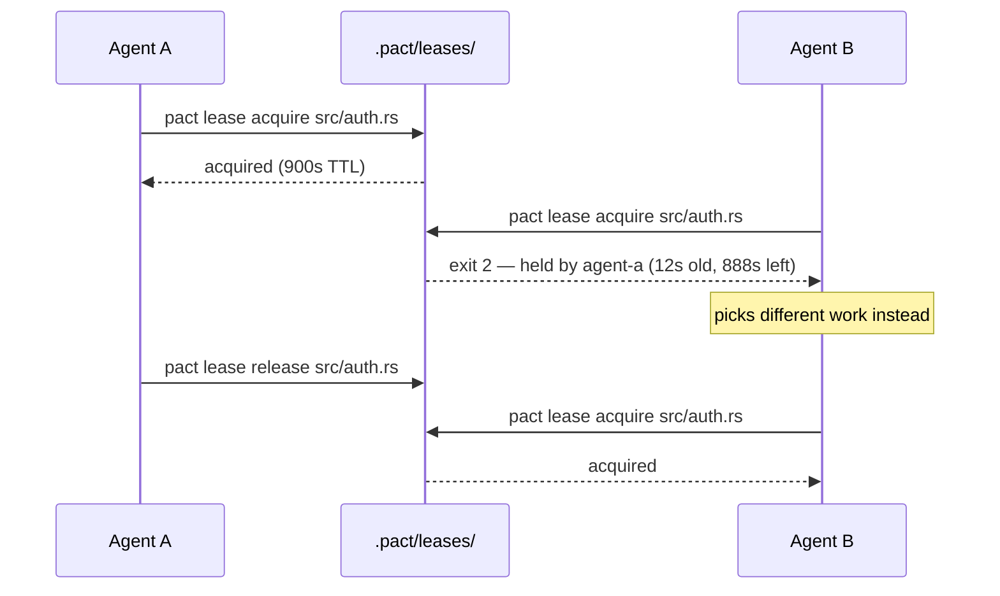
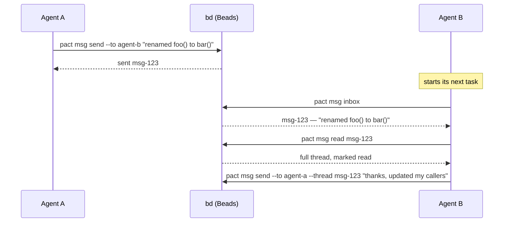

# pact

**pact** is a small, dependency-light CLI that helps multiple coding agents —
Claude Code, Codex, or anything else that can run shell commands — work on
the same repository without stepping on each other.

## The problem

Say you're running two or three agents against the same repo at once: one
fanning out a refactor, another fixing docs, a third writing tests. Without
any coordination between them:

- Agent A starts rewriting `src/api.rs` right as Agent B edits the same file
  for something unrelated. One of them loses work.
- Agent B renames a function Agent A was about to call. Agent A finds out
  the hard way, thirty minutes into a build failure.
- Neither agent has any way to say "I'm working on this" or "heads up, I
  changed the signature of X" without you personally relaying it.

pact doesn't prevent any of this by force — it gives agents a shared,
lightweight vocabulary to avoid it on their own: **leases** to claim files,
**messages** to hand off context, and **onboarding** so every agent learns
the protocol without you explaining it each session.



## Core features

### Onboarding — teach every agent the protocol once

`pact init` writes a short block into `AGENTS.md`, between
`<!-- pact:begin -->` / `<!-- pact:end -->` markers. Every agent that reads
`AGENTS.md` at the start of a session — which most coding agents already
do — picks up the coordination protocol automatically, with nothing for you
to repeat by hand.

**Use case:** you set up a new repo for multi-agent work. You run
`pact init` once and commit the result. From then on, cloning the repo and
pointing any agent at it is enough; re-running `pact init` after upgrading
pact keeps the block current without touching anything else you've written
in `AGENTS.md`.

The protocol itself is short:

- **Identity** comes from `PACT_AGENT` (or `--agent <name>`) — pact never
  guesses one for you.
- **Check your inbox first**: `pact msg inbox` at the start of a task.
- **Lease before you edit** a file another agent might touch:
  `pact lease acquire <path>`.
- **Release when done**: `pact lease release <path>`.
- **Announce interface changes**: `pact msg send --to <agent> "..."`.
- **Everything is scriptable**: every command supports `--json`.

### Leases — claim a file before you edit it

A lease is an advisory claim on a path, backed by an atomic lock file under
`.pact/leases/`. "Advisory" means pact doesn't stop anyone from editing an
unleased file — it makes checking cheap enough that agents actually do it.

**Use case:** two agents are both told to "clean up the auth module."



If Agent A crashes instead of releasing, the lease expires on its own (TTL
plus a clock-skew grace period) and Agent B's next `acquire` steals it
automatically. `--steal` forces a takeover even before expiry, for when a
human (or another agent) knows better than the lease does.

See [docs/leases.md](docs/leases.md) for the full lifecycle, the
path-encoding caveat, and garbage collection.

### Messaging — hand off context without a human relay

`pact msg` is a thin wrapper over the [Beads](https://github.com/gastownhall/beads)
CLI (`bd`): a message is a Beads issue of type `message`, threaded via
parent-child links. pact doesn't run its own message store.

**Use case:** Agent A renames a function; Agent B is mid-task on a caller of
that same function.



See [docs/messaging.md](docs/messaging.md) for how this maps onto Beads
issues, and why it doesn't rely on Beads' own `--thread` flag.

### `pact ui` — see and act on all of it at once

An interactive terminal dashboard (built on [ratatui](https://ratatui.rs))
over the leases table, your message inbox, and a live `pact doctor` panel,
with keyboard or mouse instead of re-typing CLI invocations. `Tab` or a
click switches views; `j/k`, the arrows, the scroll wheel, or a click
navigate; `Enter` opens a thread or releases a lease. Still a single
foreground process — no daemon, nothing left running after you quit.

```bash
pact ui
```

See [docs/tui.md](docs/tui.md) for the full keybindings reference.

## Install

```bash
mise run install   # cargo install --path . --force
```

Or manually:

```bash
cargo build --release
cp target/release/pact /usr/local/bin/  # or anywhere on your PATH
```

Requires `bd` (beads) on `PATH` for the `msg` subcommands; `init`, `lease`,
and `doctor` (partially) work without it. v0.1.0 targets `bd` only; `br`
(beads-rust) compatibility is a deliberate later phase.

## Commands

```
pact init [--print]
pact lease acquire <path> [--ttl <seconds>] [--steal] [--note <text>]
pact lease release <path> [--force]
pact lease ls [--all]
pact msg send --to <agent> [--thread <id>] [--subject <text>] <body>
pact msg inbox [--unread-only]
pact msg read <id>
pact doctor
pact ui
```

Every subcommand accepts a global `--agent <name>` (or `PACT_AGENT` env var)
and `--json` flag.

## Exit codes

| Code | Meaning |
|------|---------|
| 0 | success |
| 1 | generic error |
| 2 | lease held by another agent (or you don't hold the lease you're releasing) |
| 3 | Beads CLI (`bd`) not found on `PATH` |
| 4 | not in a git repository |

## FAQ

**Why advisory locking instead of mandatory?** Coding agents already fail in
ways a mandatory lock can't prevent — crashing mid-edit, ignoring the tool
entirely, or editing through a channel pact doesn't see. A lease that can be
stolen (`--steal`) or expires on its own (TTL + a clock-skew grace period)
degrades to "nothing happened" instead of a stuck repository nobody can
unblock. Advisory coordination costs agents a moment of politeness; mandatory
locking costs you a deadlock at 2am with no daemon to ask why.

**Why no daemon or MCP server?** Because then pact would be one more thing
that can crash or drift out of sync. Every command is a single invocation
that reads state, maybe changes it, and exits — see
[docs/architecture.md](docs/architecture.md).

## Learn more

- [docs/architecture.md](docs/architecture.md) — how pact, agents, and Beads
  fit together, and what pact deliberately doesn't do.
- [docs/leases.md](docs/leases.md) — the full lease lifecycle: TTL, grace
  period, steal vs. expiry, path encoding.
- [docs/messaging.md](docs/messaging.md) — how `pact msg` maps onto Beads
  issues and tracks read state.
- [docs/tui.md](docs/tui.md) — `pact ui`'s tabs and full keybindings
  reference.

## Development

Via [mise](https://mise.jdx.dev) tasks (`mise tasks ls` to list them):

```bash
mise run build   # cargo build
mise run test    # cargo test
mise run fmt     # cargo fmt
mise run lint    # cargo clippy --all-targets -- -D warnings
mise run check   # fmt-check + lint + test, same gates as CI
mise run install # cargo install --path . --force
```

Or run the underlying `cargo` commands directly if you don't use mise.

State lives under `.pact/` at the repo root (found by walking up to `.git`):
`.pact/leases/*.lock` (gitignored by `pact init`) and `.pact/read.json`
(message read-state, also gitignored, since Beads has no read/unread
lifecycle for message issues).
