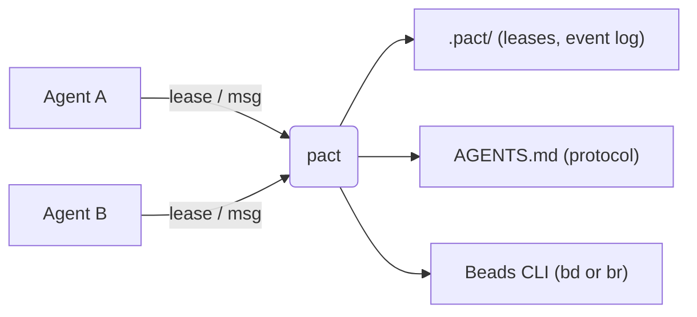

# pact

**pact** is a small, dependency-light CLI that helps multiple coding agents —
Claude Code, Codex, or anything else that can run shell commands — work on the
same repository without stepping on each other.

New here: download a binary or `cargo install` — [docs/install.md](docs/install.md)
— then run `pact init` in a repo.
Everything below is *why* pact is built the way it is; the reference material
lives in [docs/](#documentation).

## The problem

Say you're running two or three agents against the same repo at once: one
fanning out a refactor, another fixing docs, a third writing tests. Without any
coordination between them:

- Agent A starts rewriting `src/api.rs` right as Agent B edits the same file for
  something unrelated. One of them loses work.
- Agent B renames a function Agent A was about to call. Agent A finds out the
  hard way, thirty minutes into a build failure.
- Neither agent has any way to say "I'm working on this" or "heads up, I changed
  the signature of X" without you personally relaying it.

pact doesn't prevent any of this by force. It gives agents a shared, lightweight
vocabulary to avoid it on their own.

## Why these three primitives

### Onboarding, because a protocol nobody reads is not a protocol

An agent can only follow a convention it has been told. `pact init` writes the
protocol into the files agents already read at the start of a session, so you
never explain it again — and points every other instruction file in the repo
back at that one copy, because two copies drift and only one of them can be
checked for staleness.

The failure this prevents is silent: an agent that never learned the protocol
skips leases and messaging entirely, and looks exactly like a fleet that never
started. That is why `pact doctor` has an opinion about whether the protocol is
current, reachable, and would survive a clone.

→ [docs/onboarding.md](docs/onboarding.md)

### Leases, because advisory beats mandatory when the participants crash

A lease is a claim on a path, not a lock the filesystem enforces. Coding agents
fail in ways a mandatory lock cannot prevent — crashing mid-edit, ignoring the
tool, editing through a channel pact never sees. A claim that expires on its own
or can be stolen degrades to "nothing happened"; a real lock degrades to a stuck
repository nobody can unblock.

So the design goal is not exclusion, it is making the check cheap enough that
agents actually do it, and making the answer honest enough to act on: who holds
this, for how long, and what are they doing.

→ [docs/leases.md](docs/leases.md)

### Messaging, because a human relay does not scale

Agents need to hand off context — a renamed function, a changed contract, a
defect in someone else's file. pact does not run a message store: a message is a
[Beads](https://github.com/gastownhall/beads) issue, threaded via parent links.
One less thing to keep consistent, and the messages live where the project's
other work items already do.

Two properties came from watching this fail. Read state is shared rather than
local, because a sender who cannot see whether a decision landed re-sends it.
And a message can be addressed to a *path* rather than a name, because names
belong to processes that exit while the work stays.

→ [docs/messaging.md](docs/messaging.md)

## What pact deliberately is not

**No daemon.** Every command reads state, maybe changes it, and exits. A daemon
is one more thing that crashes, drifts out of sync, or has to be restarted before
anyone can work — and pact would then be part of the problem it exists to solve.

**No MCP *write* path**, though there is a read-only MCP server. Build it with
`--features mcp` and an observer that cannot run shell commands — an
orchestrator, a status pane — can ask who holds what, what is unread, and whether
the fleet is still moving. It cannot acquire a lease or send a message, and that
is not a gap to close: a lease is a promise made *by a named agent doing the
work*, so a claim no process stands behind is worse than no claim at all. The
no-daemon line above still holds — the client spawns it on stdio and ends it by
closing stdin. See [docs/mcp.md](docs/mcp.md).

**No mandatory locking.** See above: advisory degrades safely, mandatory
deadlocks at 2am with nothing to ask why.

**No config file.** Every knob is a flag, an environment variable, or a file
under `.pact/`. Configuration is a second description of your intent that can
disagree with the first.

**No Windows build.** The coordination model assumes unix semantics rather than
merely running on unix: a lease claim depends on `rename` and `hard_link`
atomicity guarantees POSIX makes and Windows does not, and the protocol pact
writes into your instruction files points agents at sh-based commands. A Windows
binary would compile and then be wrong in the one place correctness is the whole
point, so releases ship four unix targets — statically linked on Linux, because a
coordination tool that needs a matching glibc is one more thing to get right
before anyone can work.

**No cross-machine coordination.** Everything is files on one filesystem, so
two agents coordinate when they can see each other's `.pact/`. Several
`git worktree`s of one repository *do* share it — they are one repository being
edited from several directories, and isolating their leases would produce
advisory locks that advise nobody. Two clones on two machines do not, and closing
that gap needs a consensus story pact has no business inventing.

**No database of its own.** Leases are files, history is an append-only log,
messages are Beads issues, and identities are derived from all three rather than
registered. Nothing to migrate, and nothing that can be out of date with itself.

The reasoning and the boundaries are in
[docs/architecture.md](docs/architecture.md).

## Where these features came from

Almost nothing here was designed on a whiteboard. pact was used to coordinate a
real fleet of agents building something else in this repo, and then a second
fleet was pointed at pact itself — every agent required to report, with quoted
commands and exit codes, what pact had actually done to it. The findings are
beads in this repo's database; each cites evidence rather than an opinion.

The shape of that evidence matters more than the list:

- `pact lease ls` used to lead with remaining TTL. A lease 80 seconds old
  printed `3520s`, an operator read that as "long-held", and force-released a
  live agent's claim. Hence age first, an explicit state, and the holder's note —
  "what is this agent doing" is the question you have right before you reach for
  `--force`.
- `pact msg inbox` used to print every body in full and never showed a sender.
  Seven messages were ~9KB of an agent's context. Hence one line each.
- `pact msg inbox | head -1` panicked and exited 101. The message had already
  been sent; the agent read the status, concluded failure, and sent again. Hence
  a closed pipe that changes nothing about the exit code.
- 51 of 59 messages in one run were never read, because they were addressed to
  agents that had already exited. Hence delivery that follows the file.

The habit is the point: if you run agents against your own repo, ask each one
what the tooling did to it, and require a quoted command as evidence.

## Documentation

| | |
|---|---|
| [install.md](docs/install.md) | downloading a release or building from source, the lean/full profiles, choosing a Beads backend |
| [cli.md](docs/cli.md) | every command, flag, exit code and `--json` shape |
| [onboarding.md](docs/onboarding.md) | what `pact init` writes, to which files, and how to check it |
| [leases.md](docs/leases.md) | the lease lifecycle: TTL, grace period, steal vs. expiry, path identity |
| [messaging.md](docs/messaging.md) | how messages map onto Beads issues, threading, read state, addressing a path |
| [architecture.md](docs/architecture.md) | how pact, agents and Beads fit together, and the non-goals in full |
| [mcp.md](docs/mcp.md) | the optional read-only MCP server: the five tools, and why it cannot write |
| [tui.md](docs/tui.md) | `pact ui` — tabs, keybindings, and the `ui` build feature |
| [telemetry.md](docs/telemetry.md) | the optional OpenTelemetry export: what leaves the machine and what never does |
| [testing.md](docs/testing.md) | the fleet soak: scripted workers at concurrency, and what it cannot prove |
| [development.md](docs/development.md) | build, test, the CI gates and why each exists, the upstream canary |
| [mascot-animations.md](docs/mascot-animations.md) | the mascot in `pact ui`: gestures, triggers, frame data |
