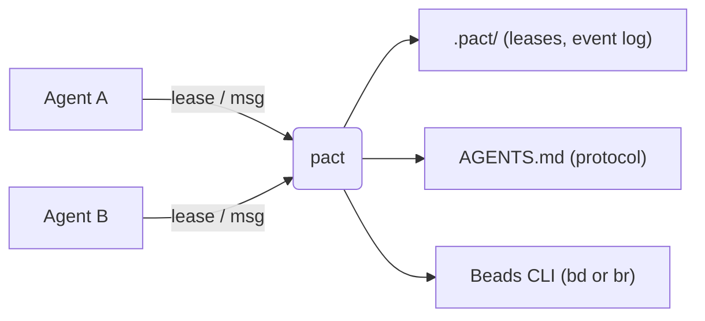
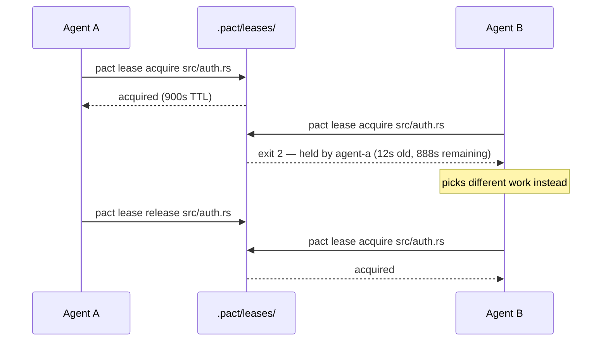
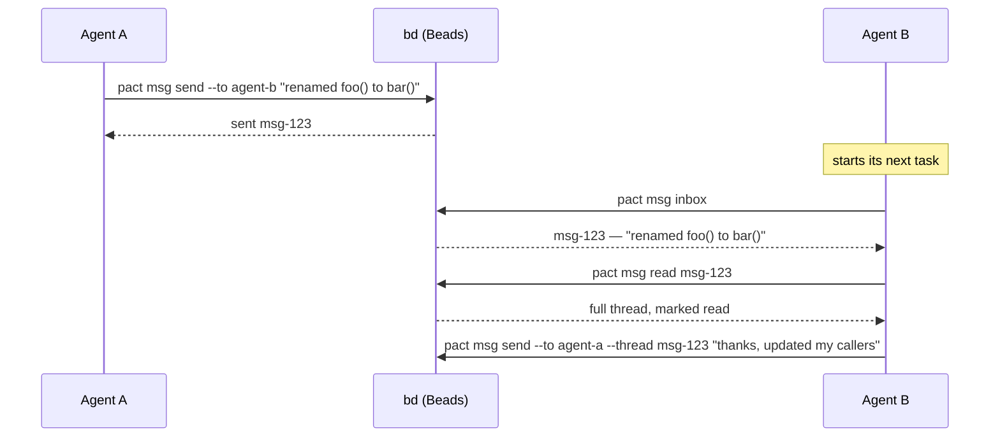

# pact

**pact** is a small, dependency-light CLI that helps multiple coding agents —
Claude Code, Codex, or anything else that can run shell commands — work on
the same repository without stepping on each other.

## The problem

Say you're running two or three agents against the same repo at once: one
fanning out a refactor, another fixing docs, a third writing tests. Without
any coordination between them:

- Agent A starts rewriting `src/api.rs` right as Agent B edits the same file
  for something unrelated. One of them loses work.
- Agent B renames a function Agent A was about to call. Agent A finds out
  the hard way, thirty minutes into a build failure.
- Neither agent has any way to say "I'm working on this" or "heads up, I
  changed the signature of X" without you personally relaying it.

pact doesn't prevent any of this by force — it gives agents a shared,
lightweight vocabulary to avoid it on their own: **leases** to claim files,
**messages** to hand off context, and **onboarding** so every agent learns
the protocol without you explaining it each session.



## Core features

### Onboarding — teach every agent the protocol once

`pact init` writes a short block into `AGENTS.md`, between
`<!-- pact:begin -->` / `<!-- pact:end -->` markers. Every agent that reads
`AGENTS.md` at the start of a session — which most coding agents already
do — picks up the coordination protocol automatically, with nothing for you
to repeat by hand.

Claude Code is the exception: it loads `CLAUDE.md`, `.claude/CLAUDE.md`,
`CLAUDE.local.md` and `.claude/rules/`, and never `AGENTS.md`. So `pact init`
also puts a marked block in `CLAUDE.md` containing a single `@AGENTS.md`
import line — a pointer, not a second copy, because two copies drift and only
one of them can be checked for staleness. Three cases, all idempotent:

| `CLAUDE.md` | what `init` does |
| --- | --- |
| absent, or without the import | writes the marked block |
| already imports `AGENTS.md` by your own line | leaves the file untouched |
| is a symlink to `AGENTS.md` | writes nothing — a self-import, and already reachable |

`pact doctor` reports this as **CLAUDE.md reaches the protocol**. Without it,
a Claude-driven fleet reads no protocol at all and silently skips leases and
messaging, which looks identical to a fleet that never started.

Other tools have their own instruction file, and the same failure: an agent
reading `GEMINI.md` joined a pact fleet having never been told the protocol
exists. So `init` also points **any agent-instruction file the repo already
has** back at `AGENTS.md`:

| File | What `init` writes into it |
| --- | --- |
| `GEMINI.md` | prose + an `@AGENTS.md` import line (Gemini CLI inlines `@file.md`) |
| `.github/copilot-instructions.md` | prose + `@AGENTS.md` (Copilot CLI expands it; VS Code's Copilot doesn't, so both halves are covered) |
| `.cursorrules`, `.windsurfrules`, `.clinerules` | prose only — these formats have no import mechanism, and a dangling `@AGENTS.md` reads like a broken link |

Three properties, each of which is the interesting part:

- **It never creates one.** `CLAUDE.md` stays the only file pact writes from
  nothing. Existence is the configuration: creating `.windsurfrules` in a repo
  that has never seen Windsurf would be pact inventing a tool you don't use.
  (`.clinerules` is skipped outright when it's a *directory*, which newer Cline
  allows.)
- **It's always a pointer, never a copy.** Only one file can be checked for
  staleness, so a second copy of the protocol text is a second thing that drifts
  unpoliced — see [docs/architecture.md](docs/architecture.md#one-copy-of-the-protocol-however-many-instruction-files).
- **`pact doctor` has the same opinion about them it has about `CLAUDE.md`**, as
  **other instruction files current**. A file pact writes and never re-checks
  goes stale in silence, which is the failure the `AGENTS.md` check already
  existed to prevent.

`.cursor/rules/` is deliberately *not* managed: it would mean creating a new
`.mdc` file, and an `.mdc` without the right frontmatter is silently never
applied — a rule pact writes and Cursor ignores is worse than no rule, because
it looks done.

**Use case:** you set up a new repo for multi-agent work. You run
`pact init` once and commit the result. From then on, cloning the repo and
pointing any agent at it is enough; re-running `pact init` after upgrading
pact keeps the block current without touching anything else you've written
in `AGENTS.md`.

**`pact init` commits what it wrote**, so "commit the result" isn't a step
you can forget. It stages exactly `AGENTS.md`, `CLAUDE.md`, `.gitignore` and any
instruction file it just pointed at `AGENTS.md`, and commits only those —
unrelated staged work stays staged, waiting for its own
commit. Re-running finds nothing to commit rather than piling up empties, and
`--no-commit` writes the files and stops. The message is a Conventional Commit,
because a generated non-conventional subject is exactly what makes `cog bump`
fail across a whole history later.

If the commit *can't* be made — a gitignored `AGENTS.md`, no configured git
identity, a rejecting hook — the files are still written, the exit status stays
`0`, and the reason goes to stderr. An init that did its job must not report
failure.

**And because that commit is load-bearing, `pact doctor` verifies it landed.** A
gitignored `AGENTS.md` fails in the worst possible way: `pact init` writes it,
`git add` refuses it without a word, every other check stays green, and the
clone that was supposed to be onboarded gets nothing. A global `~/.gitignore`
rule did exactly that to pact's own repo for its entire history. The
**protocol files reach a clone** check asks `git check-ignore` and names the
rule to go fix:

```
! protocol files reach a clone: AGENTS.md (ignored by .gitignore:1:AGENTS.md) — `git add`
  refuses these silently, so a clone gets no protocol; if that is not deliberate,
  un-ignore them (e.g. add `!AGENTS.md` to .gitignore) and commit

all checks passed, 1 warning
```

It **warns** (`!`, exit 0) rather than failing. Keeping the protocol local to one
machine is a legitimate setup, and pact doesn't get to overrule a decision you
already made — it says so out loud instead. A check left permanently red by a
deliberate choice is one people learn to skip, which would cost exactly the
visibility it exists for. The summary counts warnings so a `!` that scrolled off
the top still gets reported. `bd` outside its tested version range warns the same
way.

Untracked-but-committable is fine and says nothing at all — that's every repo
between `pact init` and its first commit.

The protocol itself is short:

- **Identity** comes from `PACT_AGENT` (or `--agent <name>`) — pact never
  guesses one for you. `pact whoami` shows what it resolved.
- **Announce intent before you research, not just before you write**:
  `pact msg inbox`, then a message saying what you're about to work on, then
  `pact lease acquire <path> --note "<what>"` — before you open the first
  file. A peer planning against the same file can renegotiate now instead of
  at the end, when both plans are sunk cost.
- **Lease before you edit** a file another agent might touch, and
  `pact lease renew <path>` if the task outlasts the TTL. Several paths in one
  `acquire` are taken all-or-nothing.
- **Release when done**: `pact lease release <path>`, or
  `pact lease release --all` so nothing gets half-forgotten.
- **Announce interface changes**: `pact msg send --to <agent> "..."`, after
  checking the recipient exists with `pact agents`. Repeat `--to` to tell
  several agents in one thread.
- **Everything is scriptable**: every command supports `--json`.

`pact init --print` writes the block to stdout instead of `AGENTS.md`, which
is the honest way to see what your agents are actually being told. It prints the
raw markdown and nothing else: `--print --json` is still the raw block, because
what you asked for is the text, not a report about it. Every other `init`
invocation honours `--json`, whose report carries `instruction_files` alongside
`agents_md`, `claude_md` and the commit fields.

### Ownership — who is this file's agent, after they've gone

A lease answers "who is holding this **right now**". Nothing answered "who is
this file's agent", "who do I send this defect to", or "who touched it last" —
and once a lease was released, a path became indistinguishable from one nobody
had ever opened.

That gap cost three separate failures in a single nine-agent run. `src/doctor.rs`
blocked two agents in sequence, forty minutes apart, because nobody held it so
`lease ls` showed it like an untouched file. One word-fix was routed to the same
agent by three different peers, then nearly applied a second time with worse
wording by an agent whose `acquire` told it nothing. And 51 of 59 messages were
never read, because they were addressed to processes that had already exited
rather than to the work.

Ownership is **derived from the lease event log**, not declared — no registry,
nothing to keep in sync, and it needs no new state because the answer was always
in `.pact/events.jsonl`. Three surfaces:

```
$ pact agents --for src/doctor.rs
src/doctor.rs: agent-one (released 12m ago)
  note: half of the bead lives here

$ pact lease acquire src/doctor.rs
acquired lease on src/doctor.rs for agent-two
note: src/doctor.rs was last released by agent-one (12m ago) — their note: half
of the bead lives here. `pact log` has the history; `pact msg send
--to-owner-of src/doctor.rs` reaches them.

$ pact msg send --to-owner-of src/doctor.rs "found a bug in your change"
```

That last one is what turns dead letters into routable mail: **a message
addressed to a path is still deliverable to whoever picks that path up**, and a
fleet whose every agent starts with `pact msg inbox` then actually receives its
predecessor's handoffs.

`pact lease ls --all` lists released paths with their last owner too. It stays
out of `lease ls --json`, which is an array of leases: a released path has no
lock, so giving it an invented TTL to fit the shape would be a lie in a typed
field. `pact agents --for <path> --json` is the scriptable answer.

The `acquire` note is advisory — it never blocks, never changes the exit code,
and says nothing when the last agent to touch the path was you.

### Leases — claim a file before you edit it

A lease is an advisory claim on a path, backed by an atomic lock file under
`.pact/leases/`. "Advisory" means pact doesn't stop anyone from editing an
unleased file — it makes checking cheap enough that agents actually do it.

**Use case:** two agents are both told to "clean up the auth module."



If Agent A crashes instead of releasing, the lease expires on its own (TTL
plus a clock-skew grace period) and Agent B's next `acquire` steals it
automatically. `--steal` forces a takeover even before expiry, for when a
human (or another agent) knows better than the lease does.

Two commands exist because a real fleet needed them: `pact lease renew <path>`
refreshes a lease a long task would otherwise outlive, and
`pact lease release --all` frees everything one agent holds in a single call,
so an agent finishing up can't half-forget (it reports only the leases it
really held — an already-expired one is swept from disk but not claimed as a
release). `acquire` takes several paths at once, all-or-nothing:

```
$ pact lease acquire src/parser.rs src/main.rs --note "new module + its mod line"
took 2 lease(s) for cli-wire:
  acquired src/parser.rs
  acquired src/main.rs
```

If any path is held by someone else, none are taken — the ones already grabbed
in that call are rolled back and the error names the path you have to negotiate
over. An agent that needs a module *and* the line that registers it can claim
both or neither, instead of sitting on half a change. Claiming isn't the same as
being allowed to edit, though: if that line belongs to another agent by
assignment, your new file never gets compiled and you can't test it — a real gap,
with a
[documented workaround](docs/leases.md#working-on-a-new-file-you-cant-compile-yet)
rather than a fix.

`pact lease ls` leads with the
lease's age, an `active` / `stale` / `expired` state, and the holder's
`--note`:

```
PATH         AGENT     HELD    STATE                       NOTE
src/main.rs  cli-wire  13m35s  active                      wiring the new CLI surface
slow.rs      agent-a   1m15s   stale (reclaimable in 15s)  long refactor
```

See [docs/leases.md](docs/leases.md) for the full lifecycle, what `stale`
means, the path-encoding caveat, and which commands garbage-collect (only
`lease ls` and `acquire`; read-only commands no longer do).

### Messaging — hand off context without a human relay

`pact msg` is a thin wrapper over the [Beads](https://github.com/gastownhall/beads)
CLI (`bd`): a message is a Beads issue of type `message`, threaded via
parent-child links. pact doesn't run its own message store.

**Use case:** Agent A renames a function; Agent B is mid-task on a caller of
that same function.



`pact msg inbox` prints one line per message — sender, subject, and the head
of the body, with `*` marking unread — so checking your mail costs an agent a
few hundred tokens instead of every body in full:

```
ID                FROM       SUBJECT                                          BODY
pact-wisp-06l  *  lease-fix  src/lease.rs is ready to wire (rnc.8/9/10/11)    src/lease.rs done, contract exactly as frozen. To wire: lea…
pact-wisp-6jz     msg-fix    src/msg.rs ready: Message.from + all_messages()  src/msg.rs is done and compiles clean on its own. Contract …

2 message(s), 1 unread (*) — `pact msg read <id>` for the full text
```

`pact msg read <id>` (or `pact msg inbox --full`) prints the full text with
the envelope: from, to, subject, time, thread. `--body-file <path|->` reads
the body from a file or stdin, so a multi-paragraph message full of quotes,
backslashes and `->` never has to survive a shell.

**One decision, one thread, however many agents.** Repeat `--to` and the
recipients' messages are stitched into a single conversation, so a fleet-wide
announcement is one thing to read and reply to instead of N near-duplicates:

```
$ pact msg send --to cli-wire --to human --subject probe --body-file -
sent 2 message(s) in thread pact-wisp-8mz
  pact-wisp-8mz → cli-wire
  pact-wisp-8mz.1 → human
```

`pact msg read pact-wisp-8mz` then returns the whole announcement. A single
`--to` prints the old one-line form and is otherwise unchanged.

**`pact msg sent` is the outbox**, and its marker answers the sender's actual
question — whether the *recipient* has looked, not whether you have:

```
$ pact msg sent
ID                TO         SUBJECT                                          BODY
pact-wisp-mbw  *  human      docs-writer done: docs match the binary          docs updated from the built binary, not the…
pact-wisp-8mz     cli-wire   probe                                            probe body with a table…

2 message(s), 1 not read yet (*) by the recipient
```

That is possible because read state moved out of a local file and into shared
`bd` labels: an agent that reads a message labels the bead `read-by-<agent>`, so
every reader is visible to everyone — including the sender. Previously read
state was per-machine bookkeeping in `.pact/read.json`, which meant a sender
could never tell whether a decision had landed, retried on a false negative, and
delivered the same notice four times. The local file is *gone*, not
supplemented: one source of truth, in the place the message already lives.

Sending to a name nobody has ever acted under prints a warning — with a
suggestion, if one is close — and **sends anyway**:

```
$ pact msg send --to tuidev "..."
warning: no agent named "tuidev" has acted in this repo (no lease, no message
sent) — did you mean tui-dev? (sending anyway)
sent pact-wisp-tdv
```

See [docs/messaging.md](docs/messaging.md) for how this maps onto Beads
issues, why the warning is advisory, and why it doesn't rely on Beads' own
`--thread` flag.

### `pact log` — what has been happening in this repo

`lease ls` shows the instantaneous set of claims, and a lease that was taken and
released while you were away leaves nothing behind at all — releasing deletes the
only record of it. `pact log` is the chronological view: lease events from
`.pact/events.jsonl`, messages derived from `bd`, merged into one feed, oldest
first.

```
$ pact log -n 5
WHEN       AGENT        EVENT     TARGET                DETAIL
5m02s ago  fixer        released  src/lease.rs          fixing confirmed findings rnc.13/21/4/22
1m21s ago  docs-writer  acquired  README.md             pact-rnc.23 docs sync
1m21s ago  docs-writer  acquired  docs/leases.md        pact-rnc.23 docs sync

3 event(s), oldest first
```

`-n` defaults to 30. Ages, not timestamps, because the question is "is this
happening now". The two sources are merged on parsed instants rather than string
order, since `bd` writes `…Z` and pact writes `…+00:00` and those sort
differently as bytes than as time. `bd` is optional, as it is for `pact agents`:
without it you get the lease half and a warning.

The history is deliberately asymmetric. Messages reach back as far as the Beads
database, while lease events start at the first `acquire` after this shipped — an
empty or missing feed is normal, not an error.

### `pact whoami` and `pact agents` — answer questions about pact with pact

`pact whoami` prints the identity, the pact binary, the repo root, `.pact/`,
and the `bd` it will use. It reports problems instead of raising them, so it
still exits 0 with no identity, no `bd`, or outside a git repo — a command you
run *because* something is broken must not break too.

```
$ pact whoami
agent      docs-writer  (from PACT_AGENT)
pact       /home/you/repo/target/debug/pact
repo root  /home/you/repo
pact dir   /home/you/repo/.pact
bd         bd  (bd version 1.1.0)
```

`pact agents` lists the identities pact has seen holding leases or in message
traffic — no registry, just the traces already on disk and in Beads:

```
$ pact agents [--for <path>]
AGENT       LAST SEEN   LEASES  SENT  RECV
cli-wire    7m46s ago   1       0     3
agents-new  13m56s ago  0       3     0
reviewer ?  21h59m ago  0       0     1

? addressed but never seen acting — nobody has ever run pact under that name,
so nobody is reading its mail (usually a typo'd --to)
```

That last row is why the command exists: `reviewer` has received a message and
never acted, so its mail has been sitting unread for a day. `bd` is optional
here — without it you still get whoever holds a lease.

### `pact ui` — see and act on all of it at once

An interactive terminal dashboard (built on [ratatui](https://ratatui.rs))
over the leases table, your message inbox, and a live `pact doctor` panel,
with keyboard or mouse instead of re-typing CLI invocations. `Tab` or a
click switches views; `j/k`, the arrows, the scroll wheel, or a click
navigate; `Enter` opens a thread or releases a lease. Still a single
foreground process — no daemon, nothing left running after you quit.

```bash
pact ui
```

**`ui` is an optional Cargo feature**, so that a repo which only wants leases
and messaging doesn't compile ratatui. A default build has no `ui` subcommand
at all — `pact ui` answers `error: unrecognized subcommand 'ui'`. Build with
`--features ui` (the `mise` tasks below already do), and check what you have
with `pact --version`, whose last line reports the enabled features.

See [docs/tui.md](docs/tui.md) for the full keybindings reference.

## Install

```bash
mise run install   # cargo install --path . --force --features ui
```

Or manually:

```bash
cargo build --release --features ui       # drop --features ui to skip `pact ui`
cp target/release/pact /usr/local/bin/    # or anywhere on your PATH
```

Requires a **Beads CLI** on `PATH` for the `msg` subcommands; `init`, `lease`,
`whoami`, `agents`, `log` and `doctor` (partially — the lease half plus a
warning) work without one. Either implementation will do:

| Backend | What it is | What its `.beads/` looks like |
|---|---|---|
| [`bd`](https://github.com/gastownhall/beads) | Go, embedded Dolt | `.beads/embeddeddolt/` |
| [`br`](https://github.com/dicklesworthstone/beads-rust) | Rust, SQLite | `.beads/<name>.db` |

**The store on disk picks the backend, not a preference.** The two don't share
data, so pact walks up for the first `.beads/`, reads which tool made it, and
uses that one. Only a repo with no Beads workspace yet gets a preference (`br`,
then `bd`), and if both stores are present — what one stray `br init` inside a
`bd` repo leaves behind — `bd` wins, because that is where the data is. The
alternative, always preferring `br`, would open an empty SQLite database in
every existing `bd` repo and cheerfully report an empty inbox.

Exit code `3` still means "no usable Beads CLI on `PATH`", and it now names
*which* one to install and why the other one you already have isn't a
substitute. Tested ranges are per backend — `bd` `1.1.0 <= v < 1.2.0`, `br`
`0.2.0 <= v < 0.3.0` — and outside them everything still runs while `pact
doctor` adds a warning, since a Beads CLI that changed its output is the
likeliest cause of a puzzling `msg` failure:

```
✓ Beads CLI: bd (bd version 1.1.2 (20e493e56))
✓ Beads CLI: br (br 0.2.19)
```

`br` is younger and its CLI still moves; the differences pact has to absorb are
listed in [docs/messaging.md](docs/messaging.md#two-backends-two-argv).

### Which binary am I running?

`-V` prints the bare `pact <semver>` line scripts grep for. `--version` prints
the build stamp, which answers the question a version number can't — *is the
binary on my PATH the one I just built?*

```
$ pact --version
pact 0.1.2
commit:   817e3611a727-dirty
built:    2026-08-02T05:49:06Z
rustc:    rustc 1.97.1 (8bab26f4f 2026-07-14)
target:   x86_64-unknown-linux-gnu
profile:  release
features: ui
```

`profile: debug` means you're running `target/debug` rather than the installed
release build; `features: none` explains a missing `pact ui`; `-dirty` means
the build had uncommitted changes. A stale `pact` on `PATH` has silently
rewritten `AGENTS.md` from an old build before — this is how you catch it.

## Commands

```
pact init [--print] [--no-commit]
pact whoami
pact agents
pact lease acquire <path>... [--ttl <seconds>] [--steal] [--note <text>]
pact lease renew <path>
pact lease release <path> [--force]
pact lease release --all
pact lease ls [--all]
pact msg send (--to <agent>... | --to-owner-of <path>...) [--thread <id>] [--subject <text>] (<body> | --body-file <path|->)
pact msg inbox [--unread-only] [--full]
pact msg sent
pact msg read <id>
pact log [-n | --limit <count>]
pact doctor
pact ui
```

Plus `pact -V` (bare version) and `pact --version` (version plus build stamp —
see [Which binary am I running?](#which-binary-am-i-running)).

Every subcommand accepts a global `--agent <name>` (or `PACT_AGENT` env var)
and `--json` flag. `--all` on `release` is mutually exclusive with both
`<path>` and `--force`; `--body-file` is mutually exclusive with the positional
body. clap rejects those combinations rather than silently ignoring one.

Batching doesn't change the shape a one-path script already parses: a single-path
`lease acquire --json` still emits the lease *object* (several paths emit an
array), and a single `--to` still prints `sent <id> to <who> (thread <id>)`.
`lease release --json` now emits an object — `{"path": …, "displaced": …}` — so a
scripted caller can see whose claim a `--force` destroyed.

## Exit codes

| Code | Meaning |
|------|---------|
| 0 | success |
| 1 | generic error |
| 2 | lease held by another agent (or you don't hold the lease you're releasing) |
| 3 | Beads CLI (`bd` or `br`) not found on `PATH` |
| 4 | not in a git repository |
| 5 | usage error — unknown subcommand, bad or missing flag value |

**5 exists so that 2 means only one thing.** clap emits 2 for any usage error,
which collided with "lease held by another agent" — and a wrapper branching on 2
read a typo as a lease conflict and went off to negotiate with a peer that does
not exist. Two agents hit that in one fleet run: an unrecognized subcommand, and
a `--thread` left valueless by shell word-splitting. The flag case is the likelier
one in a script, because a flag value is exactly what gets interpolated from a
variable. `pact --help` and `pact -V` still exit 0; bare `pact` is a usage error
and exits 5, so a script whose variable expanded to nothing cannot read it as
success.

`pact doctor` exits 1 when a check **fails** (`✗`). A check can also **warn**
(`!`) — it passed, but you should know: a Beads CLI outside its tested version range,
or protocol files a clone won't see. Warnings never change the exit code, and
`--json` carries them as `"warn": true` alongside `"ok": true`, so a script can
tell the two apart. `pact whoami` is the one command that always exits 0: a
missing identity, a missing `bd`, or an unreadable repo root are reported as
`!` problems, not raised.

**A closed pipe is not one of these codes.** `pact … | head -1` used to panic
mid-write and exit 101, which an agent reading only the status could not tell
from "the send failed" — so it retried, and the fleet got duplicate messages.
pact now drops the unwritten bytes silently and keeps whatever status its actual
work earned, normally 0. That is deliberate rather than the conventional
SIGPIPE-emulating 141: the side effect (the bead created, the lock file written)
has already landed by the time anything is printed, and losing the tail of a
report whose reader walked away is cheaper than making a completed action look
failed.

## Telemetry (optional, off by default)

pact can export OpenTelemetry traces and metrics about its own runs — how long
commands take, which leases are contended, how long messages sit unread. It is
**off unless you build it in and configure it**:

```bash
cargo build --release --features ui,otel      # switch one: not a default feature
export OTEL_EXPORTER_OTLP_TRACES_ENDPOINT=http://localhost:4318/v1/traces
export OTEL_EXPORTER_OTLP_METRICS_ENDPOINT=http://localhost:4318/v1/metrics
export OTEL_EXPORTER_OTLP_TRACES_PROTOCOL=http/json   # switch two: pact speaks
export OTEL_EXPORTER_OTLP_METRICS_PROTOCOL=http/json  # http/json over http://
```

Standard `OTEL_*` variables only — pact invents no `PACT_OTEL_*` names. Ask
`pact doctor` which of the three states you are in, because "built in",
"configured" and "actually exporting" are not the same thing:

```
✓ otel export: not built in (`cargo build --features otel`)
✓ otel export: traces + metrics → http://127.0.0.1:4318
! otel export: built in and configured, but NOT exporting —
    OTEL_EXPORTER_OTLP_PROTOCOL=grpc — pact speaks http/json and nothing else
```

What is exported is argv **shape** and bounded values: the subcommand, the exit
code, lease outcomes, message counts and ages, and the repository directory's
basename. **Never a message body or subject, a lease note, file contents, an
error string, or a repository path.** File paths appear as a span attribute on
lease operations and nowhere else.

The feature adds **no dependency** — `cargo tree --depth 1` is the same six
crates either way, with no `tokio` — and it cannot change what pact does. A
dead, missing or wedged collector leaves every exit code and every byte of
stdout identical; the worst measured cost is +32 ms on a 9 ms command, against
a collector that accepts connections and never answers.

[docs/telemetry.md](docs/telemetry.md) has the full signal inventory, every
`OTEL_*` variable honoured, and the measurements behind those claims.

## FAQ

**Why advisory locking instead of mandatory?** Coding agents already fail in
ways a mandatory lock can't prevent — crashing mid-edit, ignoring the tool
entirely, or editing through a channel pact doesn't see. A lease that can be
stolen (`--steal`) or expires on its own (TTL + a clock-skew grace period)
degrades to "nothing happened" instead of a stuck repository nobody can
unblock. Advisory coordination costs agents a moment of politeness; mandatory
locking costs you a deadlock at 2am with no daemon to ask why.

**Why no daemon or MCP server?** Because then pact would be one more thing
that can crash or drift out of sync. Every command is a single invocation
that reads state, maybe changes it, and exits — see
[docs/architecture.md](docs/architecture.md).

## Where these features came from

Almost nothing in the sections above was designed on a whiteboard. pact was
used to coordinate a real fleet of agents building something else in this repo,
and then a second fleet was pointed at pact itself — every agent required to
report, with quoted commands and exit codes, what pact had actually done to it.
The findings are the `pact-rnc` epic in this repo's Beads database
(`bd show pact-rnc`); each child bead cites evidence rather than an opinion.
A few examples, because the shape of the evidence matters more than the list:

- `pact lease ls` used to lead with remaining TTL. A lease 80 seconds old
  printed `3520s`, an operator read that as "long-held", and force-released a
  live agent's claim. Hence age-first plus an explicit state, and the note
  column — "what is this agent doing" is the question you have right before you
  reach for `--force`.
- `pact msg inbox` used to print every body in full and never showed a sender.
  Seven messages were ~9KB of an agent's context, and agents identified senders
  by reading prose in the bodies. Hence one line each, `from`, and `*`.
- One agent's `--to` typo sent a message into the void; nothing ever said so,
  and the ghost recipient sat unread for a day. Hence `pact agents`, the
  `?` marker for names that receive but never act, and the send-time warning.
- Five of five agents in the last pass opened their reports with the same
  complaint: they could not tell which pact binary they were running. Hence
  `pact whoami` printing the resolved path.

- `pact msg inbox | head -1` panicked and exited 101. The message had already
  been sent; the agent read the status, concluded the send failed, and re-sent.
  Hence a closed pipe that changes nothing about the exit code.

**The four findings the previous batch deferred have now shipped**, each because
a later fleet supplied the data-model evidence the first one lacked:
`pact-rnc.4` (one send, one thread, N recipients), `pact-rnc.7`
(`pact msg sent`), `pact-rnc.13` (`pact log`, backed by `.pact/events.jsonl`)
and `pact-rnc.17` (read state as shared `bd` labels, so a sender can see who
looked).

One residue is still open and honestly so: the owner of a *new* file still cannot
`cargo build` it when the line that registers it belongs to another agent
(`pact-rnc.21`/`pact-v66`). Multi-path `acquire` closed the coordination half —
you can claim the module and its `mod` line together — but the real problem is
ownership, not claiming, and pact has not fixed it. What has changed is that the
copy-the-crate workaround every new-file agent was rediscovering under time
pressure is now [written down](docs/leases.md#working-on-a-new-file-you-cant-compile-yet),
labelled as a workaround.

The habit is the point: if you run agents against your own repo, ask each one
what the tooling did to it, and require a quoted command as evidence. That is
where this list came from.

## Learn more

- [docs/architecture.md](docs/architecture.md) — how pact, agents, and Beads
  fit together, and what pact deliberately doesn't do.
- [docs/leases.md](docs/leases.md) — the full lease lifecycle: TTL, grace
  period, steal vs. expiry, path encoding.
- [docs/messaging.md](docs/messaging.md) — how `pact msg` maps onto Beads
  issues, multi-recipient threading, and read state as shared `bd` labels.
- [docs/tui.md](docs/tui.md) — `pact ui`'s tabs and full keybindings
  reference.
- [docs/mascot-animations.md](docs/mascot-animations.md) — the animated mascot
  in `pact ui`: every gesture, the UI event that triggers it, and the frame
  data behind it.
- [docs/telemetry.md](docs/telemetry.md) — the optional OpenTelemetry export:
  exactly what leaves the machine, what deliberately doesn't, and what happens
  when the collector is missing.

## Development

Via [mise](https://mise.jdx.dev) tasks (`mise tasks ls` to list them):

```bash
mise run build      # cargo build --features ui
mise run test       # cargo test --features ui
mise run fmt        # cargo fmt
mise run lint       # cargo clippy --all-targets --features ui -- -D warnings
mise run check-docs # scripts/check-docs.sh — README/docs vs the real CLI
mise run otel       # clippy + test the otel feature, and prove it adds no dependency
mise run check      # fmt-check + lint + test + otel + check-docs, same gates as CI
mise run install    # cargo install --path . --force --features ui
```

`check-docs` walks the built binary's `--help` output rather than a hardcoded
list, and fails if this README's `Commands` block is missing a subcommand or a
long flag *or* documents one the CLI no longer has, if any relative link in
`README.md` or `docs/` doesn't resolve, or if a `pact doctor` check isn't named
in [docs/tui.md](docs/tui.md)'s Doctor section. It exists because a link in this
file pointed at a doc that had been deleted, and nothing noticed.

Or run the underlying `cargo` commands directly if you don't use mise.

Every task builds with `--features ui`, so what you test is what you install.
CI runs clippy and test **both** ways — with and without the feature — so the
dependency-light default stays guarded even though no local task exercises it.

`otel` is guarded the same way, and for the same reason `ui` needed it: an
off-by-default feature that nothing compiles rots. Its one load-bearing line is
the dependency comparison, because "the exporter adds nothing" is a promise
that has to be enforced rather than remembered:

```bash
test "$(cargo tree --edges normal,build,dev)" \
   = "$(cargo tree --edges normal,build,dev --features otel)"
```

State lives under `.pact/` at the repo root (found by walking up to `.git`):
`.pact/leases/*.lock` and `.pact/events.jsonl` (the bounded lease-event log
behind `pact log`). Message read state is not there — it lives in `bd`, as one
`read-by-<agent>` label per reader. `pact init` gitignores the whole directory
with a single `.pact/` line, so anything else an agent writes there is covered
without a new rule.
