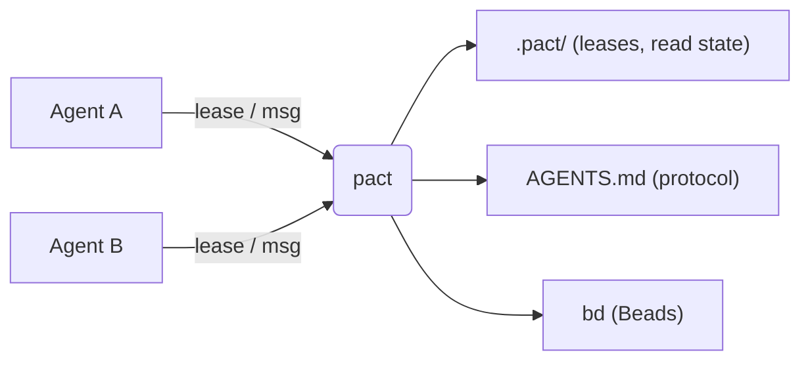
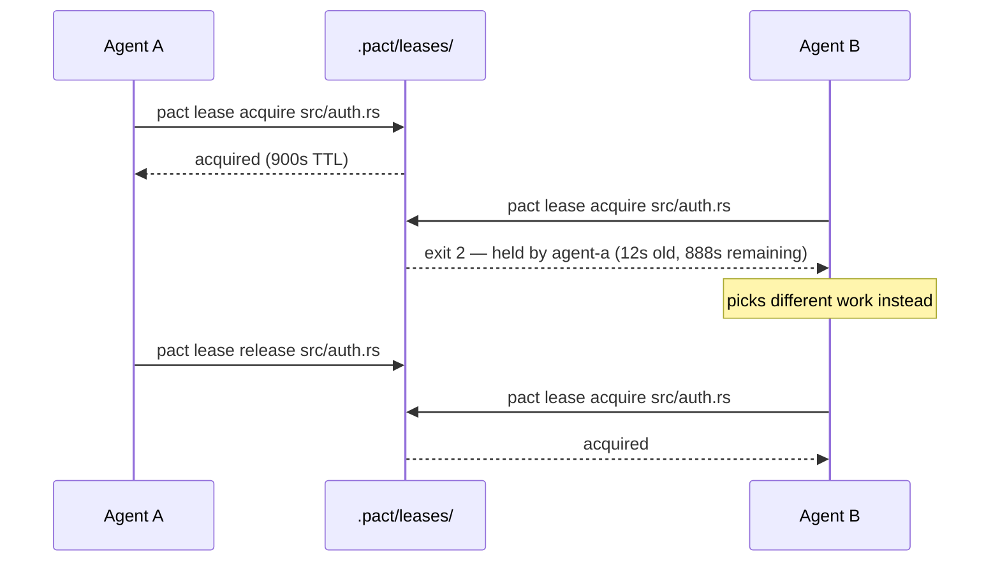
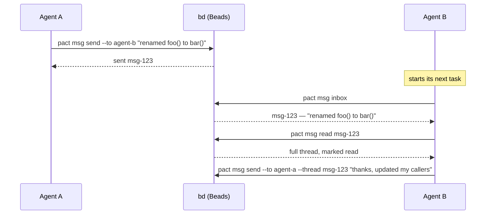

# pact

**pact** is a small, dependency-light CLI that helps multiple coding agents —
Claude Code, Codex, or anything else that can run shell commands — work on
the same repository without stepping on each other.

## The problem

Say you're running two or three agents against the same repo at once: one
fanning out a refactor, another fixing docs, a third writing tests. Without
any coordination between them:

- Agent A starts rewriting `src/api.rs` right as Agent B edits the same file
  for something unrelated. One of them loses work.
- Agent B renames a function Agent A was about to call. Agent A finds out
  the hard way, thirty minutes into a build failure.
- Neither agent has any way to say "I'm working on this" or "heads up, I
  changed the signature of X" without you personally relaying it.

pact doesn't prevent any of this by force — it gives agents a shared,
lightweight vocabulary to avoid it on their own: **leases** to claim files,
**messages** to hand off context, and **onboarding** so every agent learns
the protocol without you explaining it each session.



## Core features

### Onboarding — teach every agent the protocol once

`pact init` writes a short block into `AGENTS.md`, between
`<!-- pact:begin -->` / `<!-- pact:end -->` markers. Every agent that reads
`AGENTS.md` at the start of a session — which most coding agents already
do — picks up the coordination protocol automatically, with nothing for you
to repeat by hand.

**Use case:** you set up a new repo for multi-agent work. You run
`pact init` once and commit the result. From then on, cloning the repo and
pointing any agent at it is enough; re-running `pact init` after upgrading
pact keeps the block current without touching anything else you've written
in `AGENTS.md`.

The protocol itself is short:

- **Identity** comes from `PACT_AGENT` (or `--agent <name>`) — pact never
  guesses one for you. `pact whoami` shows what it resolved.
- **Announce intent before you research, not just before you write**:
  `pact msg inbox`, then a message saying what you're about to work on, then
  `pact lease acquire <path> --note "<what>"` — before you open the first
  file. A peer planning against the same file can renegotiate now instead of
  at the end, when both plans are sunk cost.
- **Lease before you edit** a file another agent might touch, and
  `pact lease renew <path>` if the task outlasts the TTL.
- **Release when done**: `pact lease release <path>`, or
  `pact lease release --all` so nothing gets half-forgotten.
- **Announce interface changes**: `pact msg send --to <agent> "..."`, after
  checking the recipient exists with `pact agents`.
- **Everything is scriptable**: every command supports `--json`.

`pact init --print` writes the block to stdout instead of `AGENTS.md`, which
is the honest way to see what your agents are actually being told.

### Leases — claim a file before you edit it

A lease is an advisory claim on a path, backed by an atomic lock file under
`.pact/leases/`. "Advisory" means pact doesn't stop anyone from editing an
unleased file — it makes checking cheap enough that agents actually do it.

**Use case:** two agents are both told to "clean up the auth module."



If Agent A crashes instead of releasing, the lease expires on its own (TTL
plus a clock-skew grace period) and Agent B's next `acquire` steals it
automatically. `--steal` forces a takeover even before expiry, for when a
human (or another agent) knows better than the lease does.

Two commands exist because a real fleet needed them: `pact lease renew <path>`
refreshes a lease a long task would otherwise outlive, and
`pact lease release --all` frees everything one agent holds in a single call,
so an agent finishing up can't half-forget. `pact lease ls` leads with the
lease's age, an `active` / `stale` / `expired` state, and the holder's
`--note`:

```
PATH         AGENT     HELD    STATE                       NOTE
src/main.rs  cli-wire  13m35s  active                      wiring the new CLI surface
slow.rs      agent-a   1m15s   stale (reclaimable in 15s)  long refactor
```

See [docs/leases.md](docs/leases.md) for the full lifecycle, what `stale`
means, the path-encoding caveat, and garbage collection.

### Messaging — hand off context without a human relay

`pact msg` is a thin wrapper over the [Beads](https://github.com/gastownhall/beads)
CLI (`bd`): a message is a Beads issue of type `message`, threaded via
parent-child links. pact doesn't run its own message store.

**Use case:** Agent A renames a function; Agent B is mid-task on a caller of
that same function.



`pact msg inbox` prints one line per message — sender, subject, and the head
of the body, with `*` marking unread — so checking your mail costs an agent a
few hundred tokens instead of every body in full:

```
ID                FROM       SUBJECT                                          BODY
pact-wisp-06l  *  lease-fix  src/lease.rs is ready to wire (rnc.8/9/10/11)    src/lease.rs done, contract exactly as frozen. To wire: lea…
pact-wisp-6jz     msg-fix    src/msg.rs ready: Message.from + all_messages()  src/msg.rs is done and compiles clean on its own. Contract …

2 message(s), 1 unread (*) — `pact msg read <id>` for the full text
```

`pact msg read <id>` (or `pact msg inbox --full`) prints the full text with
the envelope: from, to, subject, time, thread. `--body-file <path|->` reads
the body from a file or stdin, so a multi-paragraph message full of quotes,
backslashes and `->` never has to survive a shell.

Sending to a name nobody has ever acted under prints a warning — with a
suggestion, if one is close — and **sends anyway**:

```
$ pact msg send --to tuidev "..."
warning: no agent named "tuidev" has acted in this repo (no lease, no message
sent) — did you mean tui-dev? (sending anyway)
sent pact-wisp-tdv
```

See [docs/messaging.md](docs/messaging.md) for how this maps onto Beads
issues, why the warning is advisory, and why it doesn't rely on Beads' own
`--thread` flag.

### `pact whoami` and `pact agents` — answer questions about pact with pact

`pact whoami` prints the identity, the pact binary, the repo root, `.pact/`,
and the `bd` it will use. It reports problems instead of raising them, so it
still exits 0 with no identity, no `bd`, or outside a git repo — a command you
run *because* something is broken must not break too.

```
$ pact whoami
agent      docs-writer  (from PACT_AGENT)
pact       /home/you/repo/target/debug/pact
repo root  /home/you/repo
pact dir   /home/you/repo/.pact
bd         bd  (bd version 1.1.0)
```

`pact agents` lists the identities pact has seen holding leases or in message
traffic — no registry, just the traces already on disk and in Beads:

```
$ pact agents
AGENT       LAST SEEN   LEASES  SENT  RECV
cli-wire    7m46s ago   1       0     3
agents-new  13m56s ago  0       3     0
reviewer ?  21h59m ago  0       0     1

? addressed but never seen acting — nobody has ever run pact under that name,
so nobody is reading its mail (usually a typo'd --to)
```

That last row is why the command exists: `reviewer` has received a message and
never acted, so its mail has been sitting unread for a day. `bd` is optional
here — without it you still get whoever holds a lease.

### `pact ui` — see and act on all of it at once

An interactive terminal dashboard (built on [ratatui](https://ratatui.rs))
over the leases table, your message inbox, and a live `pact doctor` panel,
with keyboard or mouse instead of re-typing CLI invocations. `Tab` or a
click switches views; `j/k`, the arrows, the scroll wheel, or a click
navigate; `Enter` opens a thread or releases a lease. Still a single
foreground process — no daemon, nothing left running after you quit.

```bash
pact ui
```

See [docs/tui.md](docs/tui.md) for the full keybindings reference.

## Install

```bash
mise run install   # cargo install --path . --force
```

Or manually:

```bash
cargo build --release
cp target/release/pact /usr/local/bin/  # or anywhere on your PATH
```

Requires `bd` (beads) on `PATH` for the `msg` subcommands; `init`, `lease`,
and `doctor` (partially) work without it. v0.1.0 targets `bd` only; `br`
(beads-rust) compatibility is a deliberate later phase.

## Commands

```
pact init [--print]
pact whoami
pact agents
pact lease acquire <path> [--ttl <seconds>] [--steal] [--note <text>]
pact lease renew <path>
pact lease release <path> [--force]
pact lease release --all
pact lease ls [--all]
pact msg send --to <agent> [--thread <id>] [--subject <text>] (<body> | --body-file <path|->)
pact msg inbox [--unread-only] [--full]
pact msg read <id>
pact doctor
pact ui
```

Every subcommand accepts a global `--agent <name>` (or `PACT_AGENT` env var)
and `--json` flag. `--all` on `release` is mutually exclusive with both
`<path>` and `--force`; `--body-file` is mutually exclusive with the positional
body. clap rejects those combinations rather than silently ignoring one.

## Exit codes

| Code | Meaning |
|------|---------|
| 0 | success |
| 1 | generic error |
| 2 | lease held by another agent (or you don't hold the lease you're releasing) |
| 3 | Beads CLI (`bd`) not found on `PATH` |
| 4 | not in a git repository |

`pact doctor` exits 1 when a check fails. `pact whoami` is the one command
that always exits 0: a missing identity, a missing `bd`, or an unreadable repo
root are reported as `!` problems, not raised.

## FAQ

**Why advisory locking instead of mandatory?** Coding agents already fail in
ways a mandatory lock can't prevent — crashing mid-edit, ignoring the tool
entirely, or editing through a channel pact doesn't see. A lease that can be
stolen (`--steal`) or expires on its own (TTL + a clock-skew grace period)
degrades to "nothing happened" instead of a stuck repository nobody can
unblock. Advisory coordination costs agents a moment of politeness; mandatory
locking costs you a deadlock at 2am with no daemon to ask why.

**Why no daemon or MCP server?** Because then pact would be one more thing
that can crash or drift out of sync. Every command is a single invocation
that reads state, maybe changes it, and exits — see
[docs/architecture.md](docs/architecture.md).

## Where these features came from

Almost nothing in the sections above was designed on a whiteboard. pact was
used to coordinate a real fleet of agents building something else in this repo,
and then a second fleet was pointed at pact itself — every agent required to
report, with quoted commands and exit codes, what pact had actually done to it.
The findings are the `pact-rnc` epic in this repo's Beads database
(`bd show pact-rnc`); each child bead cites evidence rather than an opinion.
A few examples, because the shape of the evidence matters more than the list:

- `pact lease ls` used to lead with remaining TTL. A lease 80 seconds old
  printed `3520s`, an operator read that as "long-held", and force-released a
  live agent's claim. Hence age-first plus an explicit state, and the note
  column — "what is this agent doing" is the question you have right before you
  reach for `--force`.
- `pact msg inbox` used to print every body in full and never showed a sender.
  Seven messages were ~9KB of an agent's context, and agents identified senders
  by reading prose in the bodies. Hence one line each, `from`, and `*`.
- One agent's `--to` typo sent a message into the void; nothing ever said so,
  and the ghost recipient sat unread for a day. Hence `pact agents`, the
  `?` marker for names that receive but never act, and the send-time warning.
- Five of five agents in the last pass opened their reports with the same
  complaint: they could not tell which pact binary they were running. Hence
  `pact whoami` printing the resolved path.

**Four findings were deliberately deferred**, not missed:
`pact-rnc.4` (`--to` takes one recipient, so a decision for three agents
becomes three threads), `pact-rnc.7` (no outbox: a sender cannot confirm a
message went out, which is why one agent delivered the same notice four times
after retrying on a false negative), `pact-rnc.13` (no chronological activity
feed) and `pact-rnc.17` (no way to require acknowledgement from N agents). All
four are real and all four are multi-recipient or new-storage features — each
needs a data-model decision this batch didn't have evidence to settle, and
shipping a guess would have been worse than shipping nothing. They are open
beads with their evidence attached.

The habit is the point: if you run agents against your own repo, ask each one
what the tooling did to it, and require a quoted command as evidence. That is
where this list came from.

## Learn more

- [docs/architecture.md](docs/architecture.md) — how pact, agents, and Beads
  fit together, and what pact deliberately doesn't do.
- [docs/leases.md](docs/leases.md) — the full lease lifecycle: TTL, grace
  period, steal vs. expiry, path encoding.
- [docs/messaging.md](docs/messaging.md) — how `pact msg` maps onto Beads
  issues and tracks read state.
- [docs/tui.md](docs/tui.md) — `pact ui`'s tabs and full keybindings
  reference.

## Development

Via [mise](https://mise.jdx.dev) tasks (`mise tasks ls` to list them):

```bash
mise run build   # cargo build
mise run test    # cargo test
mise run fmt     # cargo fmt
mise run lint    # cargo clippy --all-targets -- -D warnings
mise run check   # fmt-check + lint + test, same gates as CI
mise run install # cargo install --path . --force
```

Or run the underlying `cargo` commands directly if you don't use mise.

State lives under `.pact/` at the repo root (found by walking up to `.git`):
`.pact/leases/*.lock` and `.pact/read.json` (message read-state, since Beads
has no read/unread lifecycle for message issues). `pact init` gitignores the
whole directory with a single `.pact/` line, so anything else an agent writes
there is covered without a new rule.
