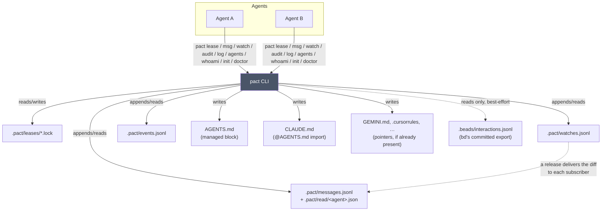

# Architecture

pact is a coordinator, not a platform: it has no server, no daemon, and no
database. **Since 0.9.0 it has no runtime backend either** — everything it does
is a file it writes under `.pact/` at your repo root. This is deliberate: the
moment coordination needs its own long-running process, it becomes one more thing
that can crash, drift out of sync, or need babysitting. pact would rather do less
and stay honest about it.



Every solid edge is a command doing what it was asked. Two dotted ones are worth
naming. `lease release` looks up who subscribed to the path and sends them the
diff without being asked, because a step agents have to remember is a step they
measurably skip ([watch.md](watch.md)). And the only thing pact reads from the
issue tracker is a committed text file, best-effort — absent or unparseable means
"no beads data" and a clean pass, never an error.

Every box other than "pact CLI" is a plain file. There's nothing in this diagram
pact needs to keep alive between invocations, and nothing it needs installed
beyond `git`.

## Where the code lives

This map is for the agent about to claim a file. It is not a directory
listing — `ls` does that. The third column is the load-bearing one: it names
the correctness argument each module *owns*, so that a plan's `files:` hint can
point at the file that owns the thing being changed, and so the next person
reaching for a split can tell a structural boundary from an incidental one.

One rule before the tables, because it decides most leases: **`src/cli/commands/<verb>.rs`
is the surface and `src/<verb>.rs` (or `src/<verb>/`) is the machinery.**
`src/cli/commands/msg.rs` decides what `pact msg` accepts and prints;
`src/msg.rs` decides what a message *is* and how it reaches disk. Changing what
a command says needs the first; changing what it does needs the second; most
real changes need both, and both must be leased.

### `src/cli/` — the clap tree, and one file per verb

| Path | Responsibility | Owned invariant |
|---|---|---|
| `main.rs` | The module list, the OTel span around the run, and the exit | Telemetry is flushed *before* `std::process::exit`, which skips destructors — a `Drop`-only flush would export exactly the successful runs and lose every failure |
| `cli/mod.rs` | The whole clap tree (`Cli`, `Command` and the per-verb action enums), `--version`'s long form, `run`'s dispatch, and the clap-error → exit-code mapping | Holds no command logic at all, so the dispatch stays a flat list of verbs; `USAGE_ERROR` and `clap_outcome` live here because the exit-code contract is decided once, at the parse boundary |
| `cli/util.rs` | The padded table, the relative age, the note flattened to one line | Every listing pact prints — `lease ls`, `log`, `msg inbox`, `msg sent`, `agents` — renders through these; a second copy is how two listings drift apart |
| `cli/commands/mod.rs` | Re-exports each handler | Handlers are reached by name, not by path, so `run` never grows a module path in its match arms |
| `cli/commands/lease.rs` | `acquire`, `renew`, `release`, `sweep`, `ls` and everything printed about a claim | The surface only — the race argument is one layer down in `lease/lifecycle.rs` and must not be restated here |
| `cli/commands/msg.rs` | `send`, `inbox`, `sent`, `read` and every message rendering | `send`'s two age thresholds sit next to the warnings they gate, so a threshold cannot move without its warning |
| `cli/commands/init.rs` | Writes the managed block, the pointer files and the `.pact/` gitignore line, and offers the commit | Refuses to write through a live lease on any target (`refuse_if_a_target_is_leased`) — a peek, not an acquire; `doctor --fix` imports the same function rather than copying the check |
| `cli/commands/doctor.rs` | Runs `doctor::checks` and renders the report; dispatches `--fix` | A missing repo root is a hard prerequisite, propagated as exit 4 rather than folded into the report — without it no other check means anything |
| `cli/commands/audit.rs` | `pact audit`'s flags (`AuditArgs`), and the summary-or-check decision | Returns an exit code instead of raising: a finding is a *result*, so it must not print `error:` and must not be confusable with a usage failure |
| `cli/commands/plan.rs` | `pact plan lint <manifest>` | Normalizes paths through the repo root exactly as `lease acquire` would, or the check and the lease it protects disagree about what they are discussing; errors are 1, warnings alone are 0 |
| `cli/commands/agents.rs` | `pact agents`, and `--for <path>` | Answers "whose file is this?" from the event log, so there is no agent registry to keep in sync and the answer survives the release |
| `cli/commands/log.rs` | The merged lease+message activity feed | One flat row shape for both sources: the question `pact log` answers does not care which store a fact came from |
| `cli/commands/watch.rs` | `watch add`/`rm`/`ls` | No exit code of its own — the registry is append-only and per-agent, so a subscription cannot conflict with anything |
| `cli/commands/context.rs` | `pact context set` | Deliberately not idempotent: setting a key twice records both rows and the later one wins, because a run that revised its policy mid-flight did revise it |
| `cli/commands/whoami.rs` | Everything pact resolved about its own environment | Every field is optional and problems are collected rather than raised — `whoami` is what you run *because* something is broken, so it must never be the thing that fails |
| `cli/commands/merge.rs` | `pact merge` | Parses `--ttl` with `lease::parse_ttl` and fails with the same exit 5: one TTL grammar across the tool |
| `cli/commands/completion.rs` | `pact completion <shell>` | Generated from `Cli::command()` — the tree clap actually parses with — so a new flag cannot leave the completions behind |
| `cli/commands/mcp.rs` | `pact mcp serve` (feature `mcp`) | Resolves no identity: an observer holds nothing and sends nothing, so there is no agent for it to be |
| `cli/commands/ui.rs` | `pact ui` (feature `ui`) | Identity is best-effort — the dashboard must open for a human who never set `PACT_AGENT` |

### `src/lease/` — the advisory claim

| Path | Responsibility | Owned invariant |
|---|---|---|
| `lease/mod.rs` | Re-export facade over the four public submodules, plus the test fixtures every submodule shares | `context_stamp` is `use`d, not `pub use`d: nothing outside `lease/` can stamp a lease transition |
| `lease/lifecycle.rs` | `acquire` and its expired-takeover and `--steal` paths, `verify_own_lease`, `renew` | **Owns the acquire race.** Every path ending in "this agent now holds the lock" is one read-decide-write over one lock file; `flock(2)` via `WriteGuard` is the only sound guard, and `verify_own_lease` is the assertion after it, not the defence |
| `lease/release.rs` | `release`, `release --all`, and the sweep | A release must say what it actually did: a real release, an idempotent no-op and a lease that expired out from under its holder are all exit 0 but tell an agent different things about its own conduct |
| `lease/store.rs` | Where a lease lives on disk: `LeaseStore`, `FileLeaseStore`, atomic write/read, the clock watermark, the lock-directory scanners | The read-only/mutating split is enforced here, not by convention: `peek` and `effective_now_readonly` leave nothing behind because a question must not mutate, while `list` sweeps because that is `lease ls`'s documented job |
| `lease/types.rs` | The lease record, path→lock-filename, TTL parsing and bounds, and the `(lease, now)` expiry decision | One repo-relative path is exactly one lock filename, and one duration is one dialect — two spellings of a file and two dialects of a TTL are the same class of bug, and each has cost this repository a lease |
| `lease/context_stamp.rs` | The branch/worktree/invocation triple a lock carries, the event row appended for every transition, and the OTel counters beside it | All three answer "where was the holder, and what did they do" and must not disagree: the triple is decided once, every metric sits next to its `log_event`, and an expiry carries the *holder's* context, never the sweeper's |

### `src/audit/` — the event log read back as history

| Path | Responsibility | Owned invariant |
|---|---|---|
| `audit/mod.rs` | The registry: `Check`, `Expect`, `CheckReport`, `run_check`, `render_check` | The registry stays an enum with an exhaustive `match`, not a table of trait objects — `Check::NAMES` is what clap renders `--check`'s help from, and forgetting an arm has to be a compile error |
| `audit/model.rs` | What an event means and what the holds were: `reconstruct`, the single pass every check reads | Double-win detection lives *here*, not in `checks/double_win.rs`: an overlap is only visible while walking open hold windows, so separating them means walking the log twice with two copies of the re-entrant/takeover argument |
| `audit/context.rs` | One pass over the log: the `--since` window, the annotations that retract lines, and the declared run context | The *order* is the correctness argument — annotations before the window, context before both — and `load` is the one place it is written down |
| `audit/summary.rs` | `pact audit` with no `--check`: the distribution | Describes, never judges — a named check is a verdict against a stated rule; this is the description a reader forms one from. `Summary` and `render_summary` stay together because the struct is a report format |
| `audit/export.rs` | `--export` and `--compare` | `--compare` reads a fixed list of JSON pointers (`COMPARED`) out of whatever `--export` wrote, so every pointer is a promise about `ExportReport`'s shape — split them and the next field rename breaks a comparison nobody re-runs until it matters |
| `audit/fixtures.rs` | The event-log fixtures every check's tests are written against (test-only) | One `ev` builder for the whole tree: a second copy is a second place for the wire format to drift |
| `audit/checks/mod.rs` | Declares one module per `--check` | Adding a check is a file here *plus* its arms in the parent — the registry deliberately did not move down with the checks |
| `audit/checks/chain_integrity.rs` | Does each chain-tracked line's `chain_hash` match the line before it? | About the log's own physical integrity, not lease behaviour — a line with no `chain_hash` is not a finding |
| `audit/checks/claim_lease_divergence.rs` | Did a hold's note name a bead belonging to somebody else? | Reads only the committed `interactions.jsonl` export, never a Beads database, so it needs no `bd` on `PATH`; it answers the retrospective question and is deliberately *less* sensitive than the live `bd show` version it replaced — fewer divergences, never more |
| `audit/checks/commit_correlation.rs` | Does real git history back what the lease log claims? | The one check that reads outside `.pact/events.jsonl`; it shells out through `git_history.rs`, a deliberate narrow widening that does not touch audit's never-open-the-Beads-store rule |
| `audit/checks/double_win.rs` | What `--check double-win` *says* about the overlaps `reconstruct` found | Holds no detection at all, by design — see `model.rs` |
| `audit/checks/merge_divergence.rs` | Did an agent start editing from a copy the previous holder never produced? | Only *adjacent* close/open pairs, and renewals skipped: a hash that differs two holds later says nothing, because the intervening holder was entitled to change the file, and a renewal would compare an agent against itself |
| `audit/checks/retry_storm.rs` | Which agents busy-retried instead of backing off | The only check about what the fleet wasted rather than what pact got wrong |
| `audit/checks/silent_contention.rs` | Was a contended path ever communicated about before its holder let go? | The window is the HOLD, not a tunable cutoff — which is what unparked the check. A watch the refused agent already held counts as communication but does not net out of the contention numbers |
| `audit/checks/stale_holds.rs` | Holds that ran past their own TTL with no renew | Judged against the TTL the opening event *recorded*, never today's compiled default — re-judging old history by a moved default rewrites its verdicts |
| `audit/checks/topology.rs` | Did this run use the topology it was supposed to? | `Expect` and its `NAMES` stay in the parent with the registry, because clap renders `--expect` from them and the round-trip tests guarding the two lists have to sit together |

### Three files over the size target, and why

The split aimed at 200–800 lines per file, sized so one bead's working set is
one file. Three land above it on purpose.

- **`lease/lifecycle.rs` (1693 lines, 992 before its tests)** — the real one.
  `acquire`, takeover, `verify_own_lease` and `renew` share a single
  correctness argument about the acquire race, stated once in the file header:
  read-decide-write, the double-win reproduced against the compiled binary at
  N=2, `flock` as the only sound guard, and TLA+'s refutation of the staleness
  heuristic that came before it. Split into four and you get four halves of one
  argument in four places, which is how it stops being checkable. **This is a
  structural boundary. Do not split it.**
- **`audit/mod.rs` (1203 lines, 661 before its tests)** — the check registry,
  `CheckReport`, and the `run_check`/`render_check` pair that construct and
  consume it field by field. Weaker than lease's, but real: the enum, its clap
  help and the exhaustive match are one mechanism.
- **`cli/commands/msg.rs` (969 lines, 673 before its tests)** — `send`,
  `inbox`, `sent` and `read` are one conversation seen from four angles.
  **This is cohesion, not an invariant**, and the difference is the point: no
  correctness argument breaks if it is split later, so a future bead may split
  it on ordinary size grounds without arguing with anything. `lifecycle.rs` may
  not.

### Three files deliberately left whole

`src/msg.rs` (1801 lines, 1044 before its tests), `src/doctor.rs` (1748 /
1283) and `src/events.rs` (1525 / 1190) are all over the target too, and were
**left alone on purpose** in the split that produced the three trees above.

No invariant argues for keeping them whole — the reason is the opposite one.
No bead needed a piece of them, so every candidate boundary would have been
chosen by a refactorer's eye rather than by a working set, and the split's own
rule is that a file is the lease, context and diff unit for a fleet agent.
Splitting them now is churn with no driver, and churn in three files that every
other module reads.

That is a decision, not an omission. If you are reaching for these because the
map above looks unfinished, it isn't; if you are reaching for them because a
bead genuinely needs one piece of `doctor.rs` under its own lease, that is the
driver, and the split is then worth doing.

## Where state lives

All of pact's own state lives under `.pact/` at the repo root, which it finds
by walking up from your current directory looking for `.git` — the same way
`git` itself finds its repo root. That means you can run `pact` from any
subdirectory and it'll find the right place.

In a **linked worktree** the state directory is not under your feet: it belongs
to the repository, not the checkout. See
[the resolution chain](#one-coordination-space-per-repository-not-per-checkout)
below.

| Path | What | Committed? |
|------|------|------------|
| `.pact/leases/*.lock` | one JSON file per active lease | no |
| `.pact/waits/*` | conflict breadcrumbs, so a wait can be measured across two processes | no |
| `.pact/watches.jsonl` | who subscribed to which path, append-only with tombstones | no |
| `.pact/messages.jsonl` | append-only message store behind `pact msg`, bounded | **yes** |
| `.pact/read/<agent>.json` | one agent's read positions, id → when they read it | no |
| `.pact/events.jsonl` | append-only lease-event log behind `pact log`, bounded | **yes** |
| `AGENTS.md` (managed block) | the coordination protocol, for agents to read | yes |
| `CLAUDE.md` (managed block) | one `@AGENTS.md` import line, because Claude Code loads `CLAUDE.md` and never `AGENTS.md` | yes |
| `GEMINI.md`, `.github/copilot-instructions.md`, `.cursorrules`, `.windsurfrules`, `.clinerules` (managed block) | a pointer back at `AGENTS.md`, and **only if the file already exists** | yes |

**Messages and read state are in that table now, and were not before 0.9.0.**
They lived in bd — a message bead per recipient, read state as a
`read-by-<agent>` label. Read state before *that* was `.pact/read.json`, so this
is the second move for one fact; [messaging.md](messaging.md#this-narrows-pact-rnc17-and-says-so-rather-than-inheriting-it-quietly)
states what the round trip costs instead of pretending it was free.

**The store is committed; the cursors are not.** `.pact/messages.jsonl` joins
`.pact/events.jsonl` as history: it is what agents said to each other, and no more
derivable than who held what. It is still capped, so mail past the cap is dropped
exactly as event-log lines are — committed does not mean permanent. The read
cursors stay local because a read position is per-machine, and committing one would
have every clone inherit its peers' read state. Sharing *who said what* while
keeping *who has read it* local is the whole line.

`pact init` writes a deny for everything under `.pact/`, then re-includes the two
files that are history:

```
.pact/*
!.pact/events.jsonl
!.pact/messages.jsonl
```

**Deny by default, and that ordering is the design.** The obvious alternative is
an allow-list of the runtime paths (`.pact/leases/`, `.pact/waits/`), which reads
as more precise and is much worse: it silently drops the property that a file an
agent *invents* under `.pact/` is ignored without anyone adding a rule for it.
That was tried first here, and staging pact's own repository with it swept in 31
fleet evidence logs and a file containing a live API key — because they had been
covered by the broad rule and suddenly were not. An allow-list of what to hide is
a list somebody has to keep complete.

The negation works because `.pact/*` ignores the *contents* of the directory
rather than the directory itself, so git still descends into it and a `!` line can
reach a file directly inside. A rule of `.pact/` would ignore the directory
outright and nothing beneath could re-include anything.

Re-running `init` on a repo that still has the older broad `.pact/` rule
**narrows it in place**, leaving every other line alone; it is idempotent, so a
second run writes nothing. One caveat about the migration: it replaces the rule,
not any comment a human wrote above it, so a hand-written "everything under
.pact/ is local" line may need deleting by hand once.

Leases, waits and watches are transient, per-machine bookkeeping — committing
them would have agents fighting over each other's in-flight claims, and would
have every clone inherit subscriptions from agents that no longer exist. Anything else an agent
drops under `.pact/` — an evidence log, a scratch file — is local too, and stays
local without needing a rule of its own. Fleet artefacts worth keeping belong
outside `.pact/` entirely; this repo keeps them in `tmp/`. The `AGENTS.md` block is
the opposite: the one artifact meant to travel with the repo, so every agent that
clones it learns the protocol on its own. `events.jsonl` is the case worth its own
section, below.

### `.pact/events.jsonl` is committed, and it is not runtime state

The same argument as [`.beads/interactions.jsonl`](#beadsinteractionsjsonl-is-committed-and-is-not-the-passive-export),
now applied to pact's own data — and it was got wrong here first.

`.pact/` used to be gitignored wholesale, on the reasoning that everything under
it is local runtime state. That is true of a lock file: a lease is a claim on a
path *right now*, it is meaningless in a clone, and committing one would have two
agents contending over a claim neither of them still holds.

It is false of the event log, for exactly the reason the section above this one
gives about bd's interaction log: **it is the only thing pact stores that it
cannot derive.** Who held what, for how long, who was blocked, whether two agents
ever held one path at once — none of it is recoverable from anywhere else once the
file is gone. Ignoring it meant every clone of every repository started with zero
coordination history, so no question about how a fleet had actually behaved could
be asked after the fact. Any retrospective on a fleet run had nothing to read.

So it is committed on purpose, and `pact doctor`'s **event log survives a clone**
check reports whether it is tracked — warning rather than failing, because an
ignored log is not a broken repository, only one that is going to lose its history
at the next clone.

The objection to committing an append-only file is merge conflicts: two agents on
two branches both append, git sees both sides changed the same trailing region,
and every merge stops. `pact init` therefore also writes

```
.pact/events.jsonl merge=union
.pact/messages.jsonl merge=union
```

to `.gitattributes`, which tells git to keep **both** sides. Both files, from one
list in the code, because they were maintained separately once and drifted: 0.9.0
made the message store committed without a merge rule, which would have made the
[per-worktree fleet pattern](fleet-patterns.md) conflict on every wave in the file
agents use to warn each other. A repository that already had the rule for the event
log gets the second one on the next `pact init` — the check is per path, not "has
pact been here". That is the correct
resolution for a log whose entries are independent and whose ordering between
unrelated agents carries no meaning. Verified rather than assumed: two branches
each appending a different event merge with no conflict, and both events survive.

**And in pact's own topology, that driver can never fire.** Worth stating, because the
opposite was predicted and measured for.

Both logs live at the **shared root**. Agents working in linked worktrees all resolve
to the same physical file and append to it directly; a worktree branch never modifies
its own checked-out copy of them. So there are no two versions for a merge to
reconcile. Measured on the quern run (37 agents, one worktree each, 38 merge commits):

```
$ git log --merges -- .pact/events.jsonl
$                                          # empty — no merge ever touched it
```

That is the structural form of the argument, and it is stronger than the statistical
one that goes with it (0 out-of-order adjacencies across 235 consecutive event pairs).
The driver had no *opportunity* to fire, so chain verification never meets a merged
interleave in-charter, and the question of what `--check chain-integrity` would make of
one does not arise.

The driver stays. It is insurance for the case the charter excludes rather than
forbids — two clones on two machines both appending, then pulling — and one line of
`.gitattributes` is cheap against a merge conflict in the file agents use to warn each
other.

One cosmetic consequence of the upgrade path, so nobody files it as a bug: a repository
that got the `events.jsonl` rule from an older pact and the `messages.jsonl` rule from
a newer one carries **two** comment blocks. `pact init` adds rules per path and
deliberately does not rewrite comments a user may have edited, so the untidiness is the
honest result of not touching your file.

The cost is the same small one bd's log has — it changes whenever coordination
happens, so it needs committing. The protocol block `pact init` writes tells
agents to fold it into the commit whose work produced the events; a missed one is
self-healing on the next commit.

### One coordination space per repository, not per checkout

Several `git worktree`s of one repository are one repository being edited from
several directories. pact treats them that way: all of them share a single
`.pact/`, so a lease taken in one is visible in the others.

That is not a convenience, it is the only correct semantic. A lease is
**advisory** — its entire value is that a peer can see it. Give each worktree its
own `.pact/` and two agents both "acquire" `src/api.ts`, both are told they
succeeded, and neither learns the other exists: an advisory lock that advises
nobody, which is strictly worse than no lock at all, because it reports success.

Resolution is two file reads, no `git` subprocess (`reach` and `commit_paths` are
the only places pact shells out to git, because gitignore semantics are not worth
reimplementing):

1. **`<root>/.git` is a directory** → an ordinary checkout. State is
   `<root>/.pact/`. This is the identity path and is byte-for-byte what pact did
   before it understood worktrees.
2. **`<root>/.git` is a file** → a linked worktree. It contains
   `gitdir: <path>`, pointing at `<common>/worktrees/<name>`. Read the
   `commondir` file in there and resolve it (usually relative) to get the common
   `.git`.
   - The common dir is named **`.git`** → it sits inside the main worktree, so
     state is `<main>/.pact/` and `<name>` becomes the worktree label.
   - Anything else (`repo.git`) → a **bare** repository with worktrees. There is
     no checkout to sit beside, so state is anchored at `<common>/pact/` —
     `pact`, not `.pact`, since nothing there is hidden beside a working tree.
   - Except when that common dir is a **submodule's gitdir**
     (`<super>/.git/modules/vendor/lib`), which is never named `.git` by
     construction and yet has a perfectly ordinary, non-bare checkout of its
     own. Where that checkout is comes from `core.worktree` in the submodule
     gitdir's own `config` — git's first-party record of where a gitdir outside
     its working tree points — and state goes to `<submodule
     checkout>/.pact/`, the same relationship a linked worktree has to a main
     checkout. Checked *before* the name heuristic, because the name heuristic
     gets this one wrong in the dangerous direction — see
     [below](#each-submodule-is-its-own-coordination-space).
3. **The gitdir path says which kind of `.git` file it is**, and it has to be
   consulted before `commondir`. A **submodule** also has a `.git` file, pointing
   at `<super>/.git/modules/<path>` — and a submodule gitdir has no `commondir`,
   because `commondir` is worktree-specific. Reading its absence as "broken
   worktree" is wrong twice: it warns about sibling worktrees that do not exist,
   and it starts stamping `branch`/`worktree` into every lock file in every
   submodule. So the path decides, and the **last** marker component wins:

   | gitdir | classified as |
   |---|---|
   | `<r>/.git/worktrees/wt` | linked worktree |
   | `<r>/.git/modules/vendor/lib` | **submodule** |
   | `<r>/.git/modules/vendor/lib/worktrees/wt` | linked worktree *of* a submodule |
   | `<r>/.git/modules/a/modules/b` | nested submodule |

   Taking the last occurrence is what makes rows three and four come out right:
   both contain `modules`, and only the final marker describes the relationship
   *this* checkout has to its gitdir.

4. **Anything unparseable** — no `gitdir:` line, a pointer to nowhere, or a
   missing `commondir` on a gitdir that really is under `worktrees/` — falls back
   to per-worktree state with a warning, printed once on stderr by whichever
   command hit it. A broken `.git` file is a reason to coordinate less, never a
   reason for `pact lease acquire` to abort in the middle of a fleet — but the
   fallback used to be announced only by a separately-run `pact doctor`, so the
   agents being partitioned by it were told nothing by the commands doing the
   partitioning. `doctor` still reports it as `state placement`.

### Each submodule is its own coordination space

Deliberately, and it is the opposite call from worktrees. Worktrees share because
they are one repository edited from several directories. A submodule is a
*different repository* that happens to live inside another one: `src/lib.rs` in
the superproject and `src/lib.rs` in the submodule are two unrelated files, and a
lease on one must not block the other. So a submodule gets `<submodule>/.pact/`,
no `branch`/`worktree` stamps, and lock files byte-identical to any ordinary
checkout's. `pact doctor` reports `state placement: submodule` as an ok — not a
warning, because nothing is wrong.

A worktree *of* a submodule joins that submodule's coordination space: same
`<submodule>/.pact/`, same board, and `pact msg` works there normally, rooted at
the submodule's checkout. `pact doctor` reports `state placement:
submodule-worktree`.

It used to report `common-gitdir` and describe the checkout as a "worktree of a
BARE repository", because the submodule's gitdir is not named `.git` and so fell
through the bare branch. The wording was the smaller half of the problem: the
submodule's own checkout did *not* join, so it and its worktree each kept a
separate `.pact/`, each independently granted a lease on the same file, and
`doctor` called both sides healthy — a split-brain with no warning anywhere,
which is the one outcome an advisory lock must never produce. Messaging was
refused there too, with advice ("add a normal worktree, or use a non-bare
clone") aimed at a bare repository that was never involved.

### Known limits of the resolution chain

All are worth knowing. None is worth code — the one that was (an absolute path
spelled from a third, non-main worktree splitting its lease, `pact-m7j.8.7`)
got its fix instead: `normalize_path`'s fallback now also tries every OTHER
linked worktree's checkout root, read from the same plain gitdir-pointer files
git already writes rather than a `git worktree list` subprocess, so the added
cost lands only on the rare path that needed a third candidate at all. See
[leases.md](leases.md#one-file-is-one-lease-however-you-spell-the-path).

- **Mixed scope is invisible across processes.** `PACT_WORKTREE_SCOPE=local` in
  one agent's environment silently partitions it from siblings that believe they
  are coordinating. `pact doctor` reports the scope in effect for *its own*
  process, and warns when `local` is set in a repository that has worktrees — but
  nothing detects the divergence itself, because each process only ever sees its
  own environment. If you run a mixed fleet, the symptom is two agents editing one
  file while both hold "the" lease.
- **A bare repository cloned into a directory named `.git`** inverts the
  bare-detection heuristic: the common dir's *name* is what distinguishes "inside
  a checkout" from "bare", so `…/foo/.git` as a bare repo would be read as a main
  worktree at `…/foo`. Pathological, and not worth code to detect.
- **A worktree literally named `modules`** (`.git/worktrees/modules`) classifies as
  a submodule, because the marker scan is lexical. Equally pathological.

Every one of those decisions is reported by `pact doctor` (`worktree`,
`coordination scope`, `state placement`, `state dir writable`, `worktree
schema marker`), because a surprising answer should be explainable without
reading `.git` files by hand.

Lock keys were already repo-root-relative, so `src/api.ts` from either checkout
is the same lock file with no encoding change. Leases additionally carry
`branch` and `worktree`, and the exit-2 conflict message names both — a peer in
another worktree is editing a copy the loser cannot see changing, so "held by
agent-a" alone invites them to check their own working copy, find it untouched,
and conclude the lease is stale. Both fields are **absent**, not null, in a
repository with no worktrees, so its lock files stay byte-identical.

**Messages follow the same rule, and it now costs nothing.**
`.pact/messages.jsonl` and `.pact/read/` resolve through the same chain the lease
files do, so `msg send` from one worktree is visible to `msg inbox` in another
because they are literally one file — no routing, no second store to accidentally
create.

#### What that routing does *not* do — and why it is checked weekly

**This section describes a hazard that no longer exists. Kept because deleting it
would lose why the guard was built.**

Until 0.9.0 messages were bd beads, the Beads store lived in the main worktree,
and the backend subprocess therefore ran *there* — inside a checkout where another
agent might be mid-task. Two hazards follow naturally from that, and it would be
reasonable to assume both:

- **index-lock contention** — `bd` racing that agent's own `git add`/`git commit`
- **staging bleed** — `bd`'s commit sweeping whatever the agent had staged

Measured against `bd` 1.1.2, **neither happened**: `bd` performed no git
operations at all for the only mutating subcommands pact issued, `create` and
`label add`. End to end — a sibling worktree sending a message while the main
worktree held a staged new file and a staged modification — `HEAD` did not move,
the staged work was neither committed nor altered, and no `.git/index.lock` was
left behind. So pact shipped **no mitigation**, deliberately.

That reasoning rested entirely on somebody else's behaviour, which is why it was
asserted rather than remembered: `scripts/canary.sh` staged decoy work, sent a
message from a real linked worktree, and failed if `HEAD` moved, if staging
changed, or if an index lock was left behind. It was verified in both directions —
green against real `bd`, red against a deliberately committing `bd` shim whose
diagnostic correctly listed the agent's swept files.

**pact issues no mutating bd subcommand at all now**, so there is nothing left in
this shape to race. The one coupling that remains is a *read* of a committed text
file, and the canary's job moves to proving that read stays tolerant of whatever a
real bd writes. See [development.md](development.md#canary-pact-against-a-real-beads-cli)
for what it asserts today.

There is a second, better lesson underneath. The subprocess boundary was doing
real work here — it insulated pact from *how* bd stores anything. It never
insulated pact from what bd's CLI *means*, and that is the distinction the
[backend section below](#one-backend-since-079) is about.

`PACT_WORKTREE_SCOPE=local` restores per-worktree isolation. It exists for the
rare case where two worktrees are deliberately unrelated projects, and `pact
doctor` warns whenever it is in effect in a repository that has worktrees,
because the leases it produces advise nobody.

**A binary older than worktree sharing is not a setting that got left off — the
code simply is not there.** A pact built before this feature landed has no
concept of a shared `.pact/`, so it resolves its own per-worktree directory,
same as any ordinary checkout — and a current binary in a sibling worktree
resolving the real shared directory has no way to know that is happening.
Both report success on the same logical path with zero visibility into each
other. Not fixable after the fact, so pact ships a forward-looking marker
instead: the moment `.pact/` is first created, `repo::pact_dir` stamps a
`SCHEMA` file into it, never backfilled onto a directory that already existed.
`pact doctor`'s `worktree schema marker` check reads it back — present means
at least one worktree-aware pact has touched this directory since it was
created; absent, in a repository with linked worktrees, means it might still
be resolved as private state by a binary that predates all of this.

### `.pact/events.jsonl`: the one thing pact stores that it can't derive

pact's bias is that state it can derive, it doesn't keep (see the next two
sections). The lease event log is the exception, and it is worth being explicit
about why rather than quietly widening the non-goal:

**Lease history cannot be derived, because releasing a lease deletes the only
record of it.** `lease ls` shows the instantaneous set; a lease taken and dropped
between two of your commands left nothing at all behind. `pact log` needed a
trace, so the trace has to be written when the transition happens.

What keeps it from becoming a database:

- **Lease events only.** Messages are already in `bd` and are derived from there
  for `pact log` — duplicating them here would create two sources of truth for
  one fact, which is the thing this whole design avoids.
- **One append-only file**, one JSON line per event, already covered by the
  `.pact/` gitignore rule.
- **A write failure never breaks a lease.** Appending is infallible by signature:
  the error is swallowed. A lease `acquire` that failed because *logging* failed
  would be a coordination bug caused by bookkeeping, which is exactly backwards.
- **Bounded, dumbly.** Past 5000 lines the file is rewritten with the newest
  4000. No rotation, no index, no sidecar state to keep in sync.
- **Unparsable lines are skipped**, not fatal, the same way an unreadable lock
  file is skipped; a missing file is an empty feed, not an error.

Consequence to expect: the feed starts at the first `acquire` after it shipped,
while `pact log`'s message half reaches back as far as the Beads database. That
asymmetry is by design — backfilling lease history from nothing would mean
inventing it.

## Introspection: derived, never stored

Two commands answer questions *about* pact, and neither adds state.

`pact whoami` reports the identity it resolved and where it resolved it from,
the pact binary actually running (`current_exe`), the repo root, `.pact/`, and
the `bd` it found. Two properties are deliberate:

- **It never fails.** No identity, no `bd`, not in a git repo — each becomes a
  reported problem, and the command still exits 0. You run `whoami` *because*
  something else broke; it must not break too.
- **It creates nothing**, including `.pact/` — a read-only question shouldn't
  write. It says `(not created yet)` instead.

`whoami` used to *probe* the Beads CLI rather than merely find it, running a
listing because `bd --version` is happy in a repo with no reachable database while
every Beads-backed pact command failed. There are no Beads-backed pact commands
left, so a probe would be reporting the health of something nothing depends on.
What it still prints is the `export BEADS_ACTOR=` line, because your own `bd`
commands do depend on it — see
[messaging.md](messaging.md#attribution-your-bd-commands-not-pacts).

`pact agents` answers "who is working in this repo" with **no registry**: it
unions the identities already visible in the two places pact writes them —
lease holders (with `acquired_at`) and message traffic (`from` and `to`) — keyed
by name, and sorts by most recent sighting. There is nothing to enrol in, and
nothing to keep in sync with reality, because it *is* the reality. Both halves
are pact's own files now, so there is no longer a case where half the answer is
unavailable because a subprocess would not run.

That derivation is also why `pact agents` distinguishes an identity that has
*acted* (held a lease or sent a message) from one that has only been *addressed*
— the latter is what a typo leaves behind, and the command marks it `?` rather
than confirming it as an agent.

The derivation cuts the other way too: `from`/`to` are read back out of the store
rather than from pact's own `--to` check, so a name that violates pact's identity
grammar (`[a-z0-9][a-z0-9-]{1,31}`) can still show up in that traffic — from a
hand-edited `messages.jsonl`, or an older pact build with a looser check. That
used to be routine rather than exotic, because anything with write access to a
shared issue tracker could plant one. `pact agents` flags such a name `[INVALID]`
rather than listing it like a real one, and `is_known`/`suggest` never treat it as
known or offer it as a correction, because no `pact` process could ever have run
under it in the first place.

`pact log` follows the same rule from the other direction: it *reads* the two
places the facts already are — the event log and the message store — and merges
them on parsed instants, keeping no third copy and no index.

### One copy of the protocol, however many instruction files

`AGENTS.md` holds the protocol text. Every other file `pact init` manages —
`CLAUDE.md`, and `GEMINI.md`, `.github/copilot-instructions.md`, `.cursorrules`,
`.windsurfrules`, `.clinerules` when the repo already has them — gets a
**pointer**, never a copy: a native `@AGENTS.md` import where the format expands
one, and prose telling the agent to go read `AGENTS.md` where it doesn't. The
constraint that forces this is `agents_md::is_current()`, the freshness check
behind `pact doctor`: it compares one file against the block pact would write
today, so a second copy of the protocol is a second thing that can drift and
only one of them is policed. Prose is a weaker mechanism than an import, but the
readers here are agents with file-read tools — "read `AGENTS.md`" is an
instruction they can execute, and a dangling `@AGENTS.md` in a format that
ignores it reads like a broken link.

Which files get a block is decided by **what the repo already has**. Existence is
the configuration; pact ships no config file, and creating `.windsurfrules` in a
repo that has never seen Windsurf would be pact inventing a tool the team
doesn't use. `CLAUDE.md` is the single exception, created when absent, because
Claude Code loads nothing else and the alternative is a fleet that reads no
protocol at all.

One layout is worth knowing about because it broke: symlinking every tool's
instruction file at `AGENTS.md` is the whole point of the agents-md convention,
and `is_file()` follows symlinks. `GEMINI.md -> AGENTS.md` therefore looked like
an ordinary target, and the pointer block was spliced *through the link*, over
the protocol block written seconds earlier in the same `pact init`. It never
converged — the pointer always wrote last, so `pact doctor` reported the block
stale and prescribed the command doing the damage. Targets that canonicalize to
`AGENTS.md` are now skipped, and the skip lives in the one iterator that feeds
the writer *and* both doctor readers, so they cannot disagree about it.

**`pact init` is the one command that writes history.** It commits the files it
wrote — `AGENTS.md`, `CLAUDE.md`, `.gitignore`, plus any instruction file it
pointed at `AGENTS.md` — because the whole onboarding model assumes they were
committed, and "remember to commit this" is a step that gets skipped. The commit is path-scoped (`git commit -- <paths>`
builds from HEAD plus those paths), so unrelated staged work stays staged
rather than being swept into a commit pact authored. `--no-commit` opts out.
pact never passes `git add -f`: a path the repo ignores is a decision pact
doesn't get to overrule, so that case is reported and left alone.

One seam exists behind this: lease persistence goes through a `LeaseStore`
trait, whose only implementation reads and writes the lock files described
above. It exists so lease *logic* can be tested without a filesystem, not
because a second backend is planned — a database or network store would
contradict "no daemon, no server" on the list below. Treat it as a test seam,
not an extension point.

**A read-only command must not mutate.** `whoami` not creating `.pact/` is one
case of a general rule that took a bug to learn: every command that only *shows*
leases used to inherit the expired-lock sweep from the listing code, so `pact
agents`, `pact doctor` and `pact ui`'s refresh timer all pruned lock files as a
side effect, and asking twice gave two answers. Collecting is now confined to
`lease ls` and `acquire` — see [docs/leases.md](leases.md).

## Locating the Beads store: the store decides, not the cwd

`src/beads.rs` is the only place pact has ever spawned a Beads process, and since
0.9.0 exactly one thing does, a diagnostic: `bd --version`, for `pact doctor` and
`pact whoami` to report. The `Beads audit sidecar` check used to add a second
(`bd config get audit.enabled`) and no longer does — it reads the filesystem,
because that read could not answer the question it was asked (pact-83r.6). The
subprocess runner behind it is **private**, which is a fence rather than a tidy-up:
a public generic `bd` runner is an open invitation to put the issue tracker back on
a pact command's hot path.

It still walks up for the first `.beads/` and reads what made it, rather than
trusting the working directory — in a linked worktree there is usually no `.beads/`
to walk up to, so cwd-based detection would fall through to a *preference* and
report on a store that is not this repository's. A tool that answers about the
wrong store is worse than one that is missing.

### One backend, since 0.7.9

pact used to support two CLIs — `bd` (Go, embedded Dolt) and `br` (beads-rust,
SQLite) — behind one adapter. They never shared a store, so selection could not be
`which(…).or(which(…))`, and they never shared argv either: `--include-infra`,
`--no-inherit-labels`, the `list --json` envelope and replies-as-dependency-edges
each needed a branch.

**The branches were affordable; the divergent guarantees were not.** `br` had no
`--id`/`--force` equivalent, so a replayed `msg send` duplicated the message —
while the protocol pact writes tells agents to re-send when they cannot confirm a
send. That made one documented behaviour safe on one backend and unsafe on the
other, and every page touching messaging had to carry the distinction.

`0.7.9` was the last release that supported `br`. A `br` workspace is now detected
and refused with a message naming that version and both ways forward, which is
deliberately *not* the "no Beads CLI found" text — `br` is still on the user's
PATH, and telling them to install what they already have would be the one useless
answer available. A stray `*.db` beside a bd store is ignored and reported, since a
second store nobody reads is worth a warning.

#### And since 0.9.0, no backend at all

This section named a risk it could not resolve, and 0.9.0 resolves it. The bet
above was that a subprocess boundary was enough insulation. It was — against the
half nobody was worried about.

**Storage churn: insulated.** bd moved from SQLite to embedded Dolt, and pact never
noticed, because it only ever spoke argv.

**CLI-semantic churn: not insulated, and never was.** bd 1.2 stopped upserting on
`create --id --force`. Four pact CLI tests broke with **no source change on pact's
side**, and `msg send` grew a duplicate-id recovery path to cope with a refusal it
had to read as proof of delivery. No boundary between two processes can protect you
from the second process changing what its own flags mean.

Messages were the only pact-owned feature standing on that surface — leases,
watches, the event log and `audit` were always plain files. So they moved to
`.pact/messages.jsonl` and the surface is gone. What survives is a **read** of
`.beads/interactions.jsonl`: a committed, append-only text file, parsed
best-effort, where absent or unparseable means "no beads data" and a clean pass.
A file format that is already committed to git cannot break pact the way a CLI's
semantics did — and if it changes, the failure mode is one check reporting less,
not a command failing.

bd is what it always should have been here: the agents' task tracker, which pact
reads and never writes.

### `.beads/interactions.jsonl` is committed, and is not the passive export

Worth stating plainly, because the two files invite exactly one mistake.

`.beads/issues.jsonl` **is** the passive export the Beads docs describe — a
dump of issue state, regenerated from the Dolt database, never the source of
truth. It is **not tracked here**, and should not be.

`.beads/interactions.jsonl` is a different thing wearing a similar name: an
append-only audit log of field changes, each carrying who changed what and the
prose reason they gave —

```json
{"kind":"field_change","actor":"…","issue_id":"pact-4xh.1",
 "extra":{"field":"status","old_value":"in_progress","new_value":"closed",
          "reason":"Skeleton compiles, clap CLI surface committed (d91a1c7)."}}
```

It is committed on purpose, and bd's own `.beads/.gitignore` deliberately does
not list it while ignoring `dolt/`, `embeddeddolt/` and the rest.

**It is not regenerable.** Verified rather than assumed: deleting the file and
running bd's `pre-commit` hook does not bring it back. Gitignoring it on the
"JSONL is just an export" reasoning would silently discard the reasoning behind
every bead ever closed — which is the provenance several beads in this repo were
diagnosed from.

The cost is real but small: it changes whenever bead state changes, so it needs
committing, and a handful of `chore(beads):` commits exist only to carry it.
Fold it into the commit whose work caused the state change where you can; a
missed one is self-healing on the next commit. What must not happen is the
tidy-up that mistakes it for the export.

## What pact deliberately doesn't do

- **No daemon or background process.** Every command is a single invocation
  that reads state, maybe changes it, and exits.
- **No MCP *write* path.** There is an optional read-only MCP server
  (`pact mcp serve`, behind the `mcp` feature — see [mcp.md](mcp.md)) so that an
  observer with no shell can still ask who holds what. It cannot acquire a
  lease, send a message or mark one read, and that is permanent: a lease is a
  promise made by a named agent doing the work, and a claim no process stands
  behind is worse than no claim, because the next agent negotiates against a
  peer that does not exist. Mutations stay on the CLI.
  This does not soften the line above — the server is a subprocess the client
  spawns, owns, and ends by closing stdin. No port, no daemon, no state.
- **No Beads database access, and no runtime dependency on the Beads CLI.** pact
  never opens `.beads/*.db`, `.beads/embeddeddolt/`, a Dolt directory or
  `issues.jsonl`. Since 0.9.0 it also does not *write* through the CLI: the one
  thing it reads is the committed `.beads/interactions.jsonl`, read-only and
  best-effort. Every pact command works with no `bd` installed at all.
- **No mandatory locking.** Leases are advisory — see
  [docs/leases.md](leases.md) for why that's a feature, not a gap.
- **No config file.** Everything is either a CLI flag, an environment variable
  (`PACT_AGENT`), or a file under `.pact/`.
- **No network I/O in the build everyone ships.** The one exception is opt-in
  twice over: a binary built with `--features otel` *and* pointed at an OTLP
  collector will POST traces and metrics about its own runs. It is off in a
  plain `cargo build`, it adds no dependency, and it can never change an exit
  code or write to stdout. [docs/telemetry.md](telemetry.md) states exactly what
  is and is not sent.
- **No stored state that could be derived.** Exactly one thing is stored that
  can't be, and is therefore committed: the lease event log, for the reason given
  above. Messages and read cursors are stored too but deliberately **not**
  committed — a message is ephemeral and a read position is per-machine.

## Exit codes are part of the contract

Because pact is meant to be driven by other programs (agents) as much as by
humans, its exit codes are documented behavior, not incidental:

| Code | Meaning |
|------|---------|
| 0 | success |
| 1 | generic error |
| 2 | lease held by another agent (or you don't hold the lease you're releasing) |
| 3 | **RETIRED in 0.9.0.** Formerly "Beads backend unavailable". No command raises it — never reuse it for a new meaning, because wrappers in the field still branch on it (see below) |
| 4 | not in a git repository |
| 5 | usage error — unknown subcommand, bad or missing flag value |

An agent scripting against pact can branch on these without parsing error
text — check the exit code, and only fall back to reading stderr for the
human-readable reason.

**3 is reserved, and no longer reachable from a `msg` command.** It existed because
`pact msg` located and ran a Beads CLI before doing anything, so a missing `bd`, a
`br`-only workspace or a subprocess killed for running past
`PACT_BEADS_TIMEOUT_SECS` all failed the send. Messages are pact's own file now, so
every `msg` command — and watch delivery, and `lease acquire`'s check for mail
about a path — works with no `bd` installed at all. The two commands that still
look for `bd`, `pact doctor` and `pact whoami`, **report** what they found instead
of raising: `doctor` as a check, `whoami` as one of the problems it always exits 0
despite. Both of the `bd` calls left in pact belong to those two commands.

The code is kept rather than recycled. A caller written against 0.8.x still
branches on it, and reusing a retired code for a different meaning is how a wrapper
silently starts doing the wrong thing.

That promise is why 5 exists. clap's own usage-error code is 2, which collided
with "lease held by another agent", so the one code agents are most likely to
branch on was ambiguous between "negotiate with a peer" and "you typo'd a flag".
The protocol block tells agents to branch on the code rather than the message,
so documenting the collision instead of removing it would have made pact's own
instruction unfollowable. `--help` and `-V` keep exiting 0; everything else clap
rejects is 5.

That table is the whole set, which is why **a closed pipe adds nothing to it**.
`pact … | head -1` used to panic in the middle of a write and exit 101; a caller
that only reads the status could not distinguish that from "the command failed",
so it retried an action that had already happened. Output now drops the unwritten
bytes silently and the process keeps whatever status its work earned. Not even the
conventional SIGPIPE-emulating 141: by the time anything is printed, the message
has been appended and the lock file written, so a non-zero status would report a
completed action as failed. A write error that is *not* a broken pipe gets a
one-line stderr warning and is likewise non-fatal.

Two conventions follow from that. `pact doctor` exits 1 when a check fails, so
it works in a CI gate. And an **advisory warning never changes the exit code**:
`acquire --steal`, `release --force` on someone else's claim, and
`msg send` to an unseen recipient all write to stderr and exit 0. Warnings are
for the reader; exit codes are for the caller, and conflating them would make
every polite heads-up look like a failure.

## Further reading

- [docs/leases.md](leases.md) — the full lease lifecycle: TTL, the
  clock-skew grace period, steal vs. expiry, and the path-encoding caveat.
- [docs/messaging.md](messaging.md) — how a message is stored, what a read cursor
  can and cannot tell a sender, and what upgrading from the bd era costs.
- [docs/tui.md](tui.md) — `pact ui`'s four screens, the drill-in stack and its
  keybindings, and the `ui` Cargo feature it lives behind.
- [docs/harness-detection.md](harness-detection.md) — which program is driving an
  agent and which model it declared: what pact reads from the environment, the
  dated captures behind each fingerprint, and why it refuses to detect a model.
- [docs/telemetry.md](telemetry.md) — the optional `otel` feature: exactly what
  is exported, what is deliberately not, and what happens when the collector is
  missing or wedged.
