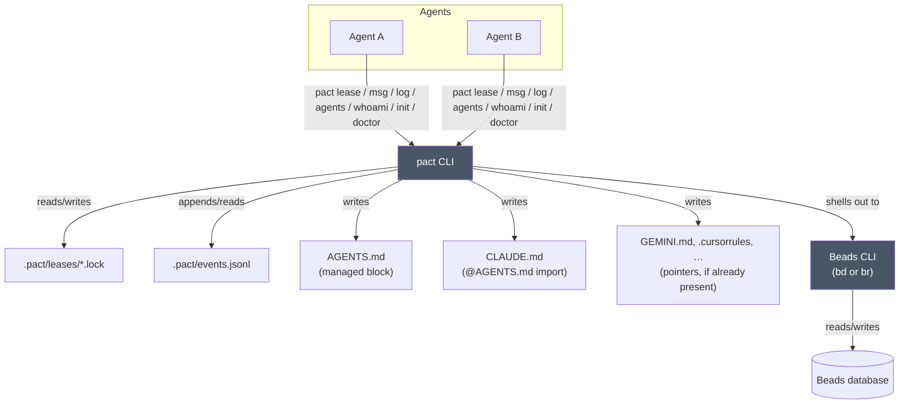

# Architecture

pact is a coordinator, not a platform: it has no server, no daemon, and no
database of its own. Everything it does is either a file it writes under
`.pact/` at your repo root, or a command it shells out to (a Beads CLI, for
messaging). This is deliberate — the moment coordination needs its own
long-running process, it becomes one more thing that can crash, drift out of
sync, or need babysitting. pact would rather do less and stay honest about it.



Every box other than "pact CLI" and "Beads CLI" is a plain file or an existing
tool. There's nothing in this diagram pact needs to keep alive between
invocations.

## Where state lives

All of pact's own state lives under `.pact/` at the repo root, which it finds
by walking up from your current directory looking for `.git` — the same way
`git` itself finds its repo root. That means you can run `pact` from any
subdirectory and it'll find the right place.

In a **linked worktree** the state directory is not under your feet: it belongs
to the repository, not the checkout. See
[the resolution chain](#one-coordination-space-per-repository-not-per-checkout)
below.

| Path | What | Committed? |
|------|------|------------|
| `.pact/leases/*.lock` | one JSON file per active lease | no |
| `.pact/waits/*` | conflict breadcrumbs, so a wait can be measured across two processes | no |
| `.pact/events.jsonl` | append-only lease-event log behind `pact log`, bounded | **yes** |
| `AGENTS.md` (managed block) | the coordination protocol, for agents to read | yes |
| `CLAUDE.md` (managed block) | one `@AGENTS.md` import line, because Claude Code loads `CLAUDE.md` and never `AGENTS.md` | yes |
| `GEMINI.md`, `.github/copilot-instructions.md`, `.cursorrules`, `.windsurfrules`, `.clinerules` (managed block) | a pointer back at `AGENTS.md`, and **only if the file already exists** | yes |

Message read state is deliberately *not* in this table: it lives in `bd`, as a
`read-by-<agent>` label on the message bead. It used to be `.pact/read.json`, and
that file is gone rather than kept alongside — see
[docs/messaging.md](messaging.md).

`pact init` writes two lines — deny everything under `.pact/`, then re-include
the one file that is history:

```
.pact/*
!.pact/events.jsonl
```

**Deny by default, and that ordering is the design.** The obvious alternative is
an allow-list of the runtime paths (`.pact/leases/`, `.pact/waits/`), which reads
as more precise and is much worse: it silently drops the property that a file an
agent *invents* under `.pact/` is ignored without anyone adding a rule for it.
That was tried first here, and staging pact's own repository with it swept in 31
fleet evidence logs and a file containing a live API key — because they had been
covered by the broad rule and suddenly were not. An allow-list of what to hide is
a list somebody has to keep complete.

The negation works because `.pact/*` ignores the *contents* of the directory
rather than the directory itself, so git still descends into it and a `!` line can
reach a file directly inside. A rule of `.pact/` would ignore the directory
outright and nothing beneath could re-include anything.

Re-running `init` on a repo that still has the older broad `.pact/` rule
**narrows it in place**, leaving every other line alone; it is idempotent, so a
second run writes nothing. One caveat about the migration: it replaces the rule,
not any comment a human wrote above it, so a hand-written "everything under
.pact/ is local" line may need deleting by hand once.

Leases and waits are transient, per-machine bookkeeping — committing them would
have agents fighting over each other's in-flight claims. Anything else an agent
drops under `.pact/` — an evidence log, a scratch file — is local too, and stays
local without needing a rule of its own. Fleet artefacts worth keeping belong
outside `.pact/` entirely; this repo keeps them in `tmp/`. The `AGENTS.md` block is
the opposite: the one artifact meant to travel with the repo, so every agent that
clones it learns the protocol on its own. `events.jsonl` is the case worth its own
section, below.

### `.pact/events.jsonl` is committed, and it is not runtime state

The same argument as [`.beads/interactions.jsonl`](#beadsinteractionsjsonl-is-committed-and-is-not-the-passive-export),
now applied to pact's own data — and it was got wrong here first.

`.pact/` used to be gitignored wholesale, on the reasoning that everything under
it is local runtime state. That is true of a lock file: a lease is a claim on a
path *right now*, it is meaningless in a clone, and committing one would have two
agents contending over a claim neither of them still holds.

It is false of the event log, for exactly the reason the section above this one
gives about bd's interaction log: **it is the only thing pact stores that it
cannot derive.** Who held what, for how long, who was blocked, whether two agents
ever held one path at once — none of it is recoverable from anywhere else once the
file is gone. Ignoring it meant every clone of every repository started with zero
coordination history, so no question about how a fleet had actually behaved could
be asked after the fact. Any retrospective on a fleet run had nothing to read.

So it is committed on purpose, and `pact doctor`'s **event log survives a clone**
check reports whether it is tracked — warning rather than failing, because an
ignored log is not a broken repository, only one that is going to lose its history
at the next clone.

The objection to committing an append-only file is merge conflicts: two agents on
two branches both append, git sees both sides changed the same trailing region,
and every merge stops. `pact init` therefore also writes

```
.pact/events.jsonl merge=union
```

to `.gitattributes`, which tells git to keep **both** sides. That is the correct
resolution for a log whose entries are independent and whose ordering between
unrelated agents carries no meaning. Verified rather than assumed: two branches
each appending a different event merge with no conflict, and both events survive.

The cost is the same small one bd's log has — it changes whenever coordination
happens, so it needs committing. The protocol block `pact init` writes tells
agents to fold it into the commit whose work produced the events; a missed one is
self-healing on the next commit.

### One coordination space per repository, not per checkout

Several `git worktree`s of one repository are one repository being edited from
several directories. pact treats them that way: all of them share a single
`.pact/`, so a lease taken in one is visible in the others.

That is not a convenience, it is the only correct semantic. A lease is
**advisory** — its entire value is that a peer can see it. Give each worktree its
own `.pact/` and two agents both "acquire" `src/api.ts`, both are told they
succeeded, and neither learns the other exists: an advisory lock that advises
nobody, which is strictly worse than no lock at all, because it reports success.

Resolution is two file reads, no `git` subprocess (`reach` and `commit_paths` are
the only places pact shells out to git, because gitignore semantics are not worth
reimplementing):

1. **`<root>/.git` is a directory** → an ordinary checkout. State is
   `<root>/.pact/`. This is the identity path and is byte-for-byte what pact did
   before it understood worktrees.
2. **`<root>/.git` is a file** → a linked worktree. It contains
   `gitdir: <path>`, pointing at `<common>/worktrees/<name>`. Read the
   `commondir` file in there and resolve it (usually relative) to get the common
   `.git`.
   - The common dir is named **`.git`** → it sits inside the main worktree, so
     state is `<main>/.pact/` and `<name>` becomes the worktree label.
   - Anything else (`repo.git`) → a **bare** repository with worktrees. There is
     no checkout to sit beside, so state is anchored at `<common>/pact/` —
     `pact`, not `.pact`, since nothing there is hidden beside a working tree.
3. **The gitdir path says which kind of `.git` file it is**, and it has to be
   consulted before `commondir`. A **submodule** also has a `.git` file, pointing
   at `<super>/.git/modules/<path>` — and a submodule gitdir has no `commondir`,
   because `commondir` is worktree-specific. Reading its absence as "broken
   worktree" is wrong twice: it warns about sibling worktrees that do not exist,
   and it starts stamping `branch`/`worktree` into every lock file in every
   submodule. So the path decides, and the **last** marker component wins:

   | gitdir | classified as |
   |---|---|
   | `<r>/.git/worktrees/wt` | linked worktree |
   | `<r>/.git/modules/vendor/lib` | **submodule** |
   | `<r>/.git/modules/vendor/lib/worktrees/wt` | linked worktree *of* a submodule |
   | `<r>/.git/modules/a/modules/b` | nested submodule |

   Taking the last occurrence is what makes rows three and four come out right:
   both contain `modules`, and only the final marker describes the relationship
   *this* checkout has to its gitdir.

4. **Anything unparseable** — no `gitdir:` line, a pointer to nowhere, or a
   missing `commondir` on a gitdir that really is under `worktrees/` — falls back
   to per-worktree state with a warning that `pact doctor` prints. A broken
   `.git` file is a reason to coordinate less, never a reason for `pact lease
   acquire` to abort in the middle of a fleet.

### Each submodule is its own coordination space

Deliberately, and it is the opposite call from worktrees. Worktrees share because
they are one repository edited from several directories. A submodule is a
*different repository* that happens to live inside another one: `src/lib.rs` in
the superproject and `src/lib.rs` in the submodule are two unrelated files, and a
lease on one must not block the other. So a submodule gets `<submodule>/.pact/`,
no `branch`/`worktree` stamps, and lock files byte-identical to any ordinary
checkout's. `pact doctor` reports `state placement: submodule` as an ok — not a
warning, because nothing is wrong.

Worktrees *of* a submodule share with each other, under the submodule's gitdir.

### Known limits of the resolution chain

None of these is worth code; all are worth knowing.

- **Mixed scope is invisible across processes.** `PACT_WORKTREE_SCOPE=local` in
  one agent's environment silently partitions it from siblings that believe they
  are coordinating. `pact doctor` reports the scope in effect for *its own*
  process, and warns when `local` is set in a repository that has worktrees — but
  nothing detects the divergence itself, because each process only ever sees its
  own environment. If you run a mixed fleet, the symptom is two agents editing one
  file while both hold "the" lease.
- **A bare repository cloned into a directory named `.git`** inverts the
  bare-detection heuristic: the common dir's *name* is what distinguishes "inside
  a checkout" from "bare", so `…/foo/.git` as a bare repo would be read as a main
  worktree at `…/foo`. Pathological, and not worth code to detect.
- **A worktree literally named `modules`** (`.git/worktrees/modules`) classifies as
  a submodule, because the marker scan is lexical. Equally pathological.
- **A worktree of a submodule reports the bare-repository wording.** Its common
  dir is the module directory, which is not named `.git`, so it takes the
  `common-gitdir` branch and `doctor` says "worktree of a BARE repository". The
  *placement* is right — all worktrees of that submodule share
  `<module-dir>/pact/` — but the explanation names the wrong reason, and that
  submodule's own main checkout does not join them.

Every one of those decisions is reported by `pact doctor` (`worktree`,
`coordination scope`, `state placement`, `state dir writable`), because a
surprising answer should be explainable without reading `.git` files by hand.

Lock keys were already repo-root-relative, so `src/api.ts` from either checkout
is the same lock file with no encoding change. Leases additionally carry
`branch` and `worktree`, and the exit-2 conflict message names both — a peer in
another worktree is editing a copy the loser cannot see changing, so "held by
agent-a" alone invites them to check their own working copy, find it untouched,
and conclude the lease is stale. Both fields are **absent**, not null, in a
repository with no worktrees, so its lock files stay byte-identical.

**Messages follow the same rule, with one visible consequence.** The Beads store
lives in the main worktree, so the backend subprocess runs there — otherwise
`msg send` from one worktree would be invisible to `msg inbox` in another, or
`bd` would initialise a second empty store in the worktree and report an empty
inbox. The trade-off, stated rather than hidden: **Beads commits land on the main
worktree's branch**, whichever branch that happens to be. In the bare-repository
case there is no main worktree at all, so `pact msg` refuses with exit 3 rather
than creating a store somewhere nobody will find again; leases and `pact log`
keep working.

#### What that routing does *not* do — and why it is checked weekly

Running the backend in the main worktree means an agent in worktree B causes `bd`
to run inside a checkout where another agent may be mid-task. Two hazards follow
naturally from that, and it would be reasonable to assume both:

- **index-lock contention** — `bd` racing that agent's own `git add`/`git commit`
- **staging bleed** — `bd`'s commit sweeping whatever the agent had staged

Measured against `bd` 1.1.2, **neither happens**: `bd` performs no git operations
at all for the only mutating subcommands pact issues, `create` and `label add`.
End to end — a sibling worktree sending a message while the main worktree held a
staged new file and a staged modification — `HEAD` did not move, the staged work
was neither committed nor altered, and no `.git/index.lock` was left behind.

So pact ships **no mitigation**, deliberately. A `doctor` check recommending a
no-git-ops mode would warn about a hazard that does not exist, and wrapping
pact's `bd` calls in an internal lease would serialise operations that never
conflict — paying a lock on every message for a measurement that says zero.

That reasoning rests entirely on somebody else's behaviour, so it is asserted
rather than remembered: `scripts/canary.sh` stages decoy work, sends a message
from a real linked worktree, and fails if `HEAD` moved, if staging changed, or if
an index lock was left behind. The failure message names the two mitigations to
reach for. The guard was verified in both directions — green against real `bd`,
and red against a deliberately committing `bd` shim, whose diagnostic correctly
listed the agent's swept files. If `bd` changes its mind, the canary says so
before a user does.

`PACT_WORKTREE_SCOPE=local` restores per-worktree isolation. It exists for the
rare case where two worktrees are deliberately unrelated projects, and `pact
doctor` warns whenever it is in effect in a repository that has worktrees,
because the leases it produces advise nobody.

### `.pact/events.jsonl`: the one thing pact stores that it can't derive

pact's bias is that state it can derive, it doesn't keep (see the next two
sections). The lease event log is the exception, and it is worth being explicit
about why rather than quietly widening the non-goal:

**Lease history cannot be derived, because releasing a lease deletes the only
record of it.** `lease ls` shows the instantaneous set; a lease taken and dropped
between two of your commands left nothing at all behind. `pact log` needed a
trace, so the trace has to be written when the transition happens.

What keeps it from becoming a database:

- **Lease events only.** Messages are already in `bd` and are derived from there
  for `pact log` — duplicating them here would create two sources of truth for
  one fact, which is the thing this whole design avoids.
- **One append-only file**, one JSON line per event, already covered by the
  `.pact/` gitignore rule.
- **A write failure never breaks a lease.** Appending is infallible by signature:
  the error is swallowed. A lease `acquire` that failed because *logging* failed
  would be a coordination bug caused by bookkeeping, which is exactly backwards.
- **Bounded, dumbly.** Past 5000 lines the file is rewritten with the newest
  4000. No rotation, no index, no sidecar state to keep in sync.
- **Unparsable lines are skipped**, not fatal, the same way an unreadable lock
  file is skipped; a missing file is an empty feed, not an error.

Consequence to expect: the feed starts at the first `acquire` after it shipped,
while `pact log`'s message half reaches back as far as the Beads database. That
asymmetry is by design — backfilling lease history from nothing would mean
inventing it.

## Introspection: derived, never stored

Two commands answer questions *about* pact, and neither adds state.

`pact whoami` reports the identity it resolved and where it resolved it from,
the pact binary actually running (`current_exe`), the repo root, `.pact/`, and
the `bd` it will shell out to. Three properties are deliberate:

- **It never fails.** No identity, no `bd`, not in a git repo — each becomes a
  reported problem, and the command still exits 0. You run `whoami` *because*
  something else broke; it must not break too.
- **It probes the Beads CLI, not just its existence.** `bd --version` is happy in
  a repo with no reachable Beads database, while every Beads-backed pact command
  fails. So `whoami` runs a listing — the query those commands actually run —
  and reports the failure as a problem. The probe is deliberately the plainest
  form both backends answer (`list --json`, no filters): a probe carrying a
  bd-only flag failed on br and announced that messaging was broken while
  `pact msg` worked perfectly, which is a diagnostic lying about the one thing
  you ran it to diagnose.
- **It creates nothing**, including `.pact/` — a read-only question shouldn't
  write. It says `(not created yet)` instead.

`pact agents` answers "who is working in this repo" with **no registry**: it
unions the identities already visible in the two places pact writes them —
lease holders (with `acquired_at`) and message traffic (`from` and `to`) — keyed
by name, and sorts by most recent sighting. There is nothing to enrol in, and
nothing to keep in sync with reality, because it *is* the reality. `bd` is
optional: without it you get the lease half, the same way `pact lease` works
without `bd`.

That derivation is also why `pact agents` distinguishes an identity that has
*acted* (held a lease or sent a message) from one that has only been *addressed*
— the latter is what a typo leaves behind, and the command marks it `?` rather
than confirming it as an agent.

`pact log` follows the same rule from the other direction: it *reads* the two
places the facts already are (`.pact/events.jsonl` and `bd`) and merges them on
parsed instants, keeping no third copy and no index.

### One copy of the protocol, however many instruction files

`AGENTS.md` holds the protocol text. Every other file `pact init` manages —
`CLAUDE.md`, and `GEMINI.md`, `.github/copilot-instructions.md`, `.cursorrules`,
`.windsurfrules`, `.clinerules` when the repo already has them — gets a
**pointer**, never a copy: a native `@AGENTS.md` import where the format expands
one, and prose telling the agent to go read `AGENTS.md` where it doesn't. The
constraint that forces this is `agents_md::is_current()`, the freshness check
behind `pact doctor`: it compares one file against the block pact would write
today, so a second copy of the protocol is a second thing that can drift and
only one of them is policed. Prose is a weaker mechanism than an import, but the
readers here are agents with file-read tools — "read `AGENTS.md`" is an
instruction they can execute, and a dangling `@AGENTS.md` in a format that
ignores it reads like a broken link.

Which files get a block is decided by **what the repo already has**. Existence is
the configuration; pact ships no config file, and creating `.windsurfrules` in a
repo that has never seen Windsurf would be pact inventing a tool the team
doesn't use. `CLAUDE.md` is the single exception, created when absent, because
Claude Code loads nothing else and the alternative is a fleet that reads no
protocol at all.

One layout is worth knowing about because it broke: symlinking every tool's
instruction file at `AGENTS.md` is the whole point of the agents-md convention,
and `is_file()` follows symlinks. `GEMINI.md -> AGENTS.md` therefore looked like
an ordinary target, and the pointer block was spliced *through the link*, over
the protocol block written seconds earlier in the same `pact init`. It never
converged — the pointer always wrote last, so `pact doctor` reported the block
stale and prescribed the command doing the damage. Targets that canonicalize to
`AGENTS.md` are now skipped, and the skip lives in the one iterator that feeds
the writer *and* both doctor readers, so they cannot disagree about it.

**`pact init` is the one command that writes history.** It commits the files it
wrote — `AGENTS.md`, `CLAUDE.md`, `.gitignore`, plus any instruction file it
pointed at `AGENTS.md` — because the whole onboarding model assumes they were
committed, and "remember to commit this" is a step that gets skipped. The commit is path-scoped (`git commit -- <paths>`
builds from HEAD plus those paths), so unrelated staged work stays staged
rather than being swept into a commit pact authored. `--no-commit` opts out.
pact never passes `git add -f`: a path the repo ignores is a decision pact
doesn't get to overrule, so that case is reported and left alone.

One seam exists behind this: lease persistence goes through a `LeaseStore`
trait, whose only implementation reads and writes the lock files described
above. It exists so lease *logic* can be tested without a filesystem, not
because a second backend is planned — a database or network store would
contradict "no daemon, no server" on the list below. Treat it as a test seam,
not an extension point.

**A read-only command must not mutate.** `whoami` not creating `.pact/` is one
case of a general rule that took a bug to learn: every command that only *shows*
leases used to inherit the expired-lock sweep from the listing code, so `pact
agents`, `pact doctor` and `pact ui`'s refresh timer all pruned lock files as a
side effect, and asking twice gave two answers. Collecting is now confined to
`lease ls` and `acquire` — see [docs/leases.md](leases.md).

## Choosing a Beads backend: the store decides, not a preference

`src/beads.rs` is the only place pact shells out to Beads, and it supports two
CLIs: `bd` (Go, embedded Dolt) and `br` (beads-rust, SQLite). They do **not**
share a store, which is why selecting one is not `which("br").or(which("bd"))`.
pact walks up for the first `.beads/` and reads what made it — `embeddeddolt/`
means bd, a `*.db` file means br — and tries only that backend. Nothing to read
yet is the only case with a genuine preference (br, then bd).

An existing store is a constraint, not a taste. On a machine with both installed,
an unconditional "prefer br" would open an empty SQLite database in every bd repo
and report an empty inbox — and a tool that says "no messages" because it opened
the wrong database is worse than one that is missing. So a store pins the
backend, the candidate list is one binary long, and a missing binary is an honest
exit 3 whose message names which one to install and why the other one already on
your `PATH` is not a substitute. When both stores are present — which is what one
stray `br init` inside a bd repo leaves behind — bd wins, because that is where
the data is.

### `.beads/interactions.jsonl` is committed, and is not the passive export

Worth stating plainly, because the two files invite exactly one mistake.

`.beads/issues.jsonl` **is** the passive export the Beads docs describe — a
dump of issue state, regenerated from the Dolt database, never the source of
truth. It is **not tracked here**, and should not be.

`.beads/interactions.jsonl` is a different thing wearing a similar name: an
append-only audit log of field changes, each carrying who changed what and the
prose reason they gave —

```json
{"kind":"field_change","actor":"…","issue_id":"pact-4xh.1",
 "extra":{"field":"status","old_value":"in_progress","new_value":"closed",
          "reason":"Skeleton compiles, clap CLI surface committed (d91a1c7)."}}
```

It is committed on purpose, and bd's own `.beads/.gitignore` deliberately does
not list it while ignoring `dolt/`, `embeddeddolt/` and the rest.

**It is not regenerable.** Verified rather than assumed: deleting the file and
running bd's `pre-commit` hook does not bring it back. Gitignoring it on the
"JSONL is just an export" reasoning would silently discard the reasoning behind
every bead ever closed — which is the provenance several beads in this repo were
diagnosed from.

The cost is real but small: it changes whenever bead state changes, so it needs
committing, and a handful of `chore(beads):` commits exist only to carry it.
Fold it into the commit whose work caused the state change where you can; a
missed one is self-healing on the next commit. What must not happen is the
tidy-up that mistakes it for the export.

## What pact deliberately doesn't do

- **No daemon or background process.** Every command is a single invocation
  that reads state, maybe changes it, and exits.
- **No MCP *write* path.** There is an optional read-only MCP server
  (`pact mcp serve`, behind the `mcp` feature — see [mcp.md](mcp.md)) so that an
  observer with no shell can still ask who holds what. It cannot acquire a
  lease, send a message or mark one read, and that is permanent: a lease is a
  promise made by a named agent doing the work, and a claim no process stands
  behind is worse than no claim, because the next agent negotiates against a
  peer that does not exist. Mutations stay on the CLI.
  This does not soften the line above — the server is a subprocess the client
  spawns, owns, and ends by closing stdin. No port, no daemon, no state.
- **No direct Beads database or JSONL access.** Messaging always shells out
  to the Beads CLI, never reads `.beads/*.db`, `.beads/embeddeddolt/` or
  `issues.jsonl` directly. If Beads changes its storage format, pact doesn't
  need to know — and this is what made supporting a second backend a matter of
  argv rather than of storage.
- **No mandatory locking.** Leases are advisory — see
  [docs/leases.md](leases.md) for why that's a feature, not a gap.
- **No config file.** Everything is either a CLI flag, an environment variable
  (`PACT_AGENT`), or a file under `.pact/`.
- **No network I/O in the build everyone ships.** The one exception is opt-in
  twice over: a binary built with `--features otel` *and* pointed at an OTLP
  collector will POST traces and metrics about its own runs. It is off in a
  plain `cargo build`, it adds no dependency, and it can never change an exit
  code or write to stdout. [docs/telemetry.md](telemetry.md) states exactly what
  is and is not sent.
- **No stored state that could be derived.** Exactly one thing is stored that
  can't be — the lease event log, for the reason given above. Message read state
  went the other way: it moved *out* of a local file and into the bead it
  describes.

## Exit codes are part of the contract

Because pact is meant to be driven by other programs (agents) as much as by
humans, its exit codes are documented behavior, not incidental:

| Code | Meaning |
|------|---------|
| 0 | success |
| 1 | generic error |
| 2 | lease held by another agent (or you don't hold the lease you're releasing) |
| 3 | Beads CLI (`bd` or `br`) not found on `PATH` |
| 4 | not in a git repository |
| 5 | usage error — unknown subcommand, bad or missing flag value |

An agent scripting against pact can branch on these without parsing error
text — check the exit code, and only fall back to reading stderr for the
human-readable reason.

That promise is why 5 exists. clap's own usage-error code is 2, which collided
with "lease held by another agent", so the one code agents are most likely to
branch on was ambiguous between "negotiate with a peer" and "you typo'd a flag".
The protocol block tells agents to branch on the code rather than the message,
so documenting the collision instead of removing it would have made pact's own
instruction unfollowable. `--help` and `-V` keep exiting 0; everything else clap
rejects is 5.

That table is the whole set, which is why **a closed pipe adds nothing to it**.
`pact … | head -1` used to panic in the middle of a write and exit 101; a caller
that only reads the status could not distinguish that from "the command failed",
so it retried an action that had already happened. Output now drops the unwritten
bytes silently and the process keeps whatever status its work earned. Not even the
conventional SIGPIPE-emulating 141: by the time anything is printed, the bead has
been created and the lock file written, so a non-zero status would report a
completed action as failed. A write error that is *not* a broken pipe gets a
one-line stderr warning and is likewise non-fatal.

Two conventions follow from that. `pact doctor` exits 1 when a check fails, so
it works in a CI gate. And an **advisory warning never changes the exit code**:
`acquire --steal`, `release --force` on someone else's claim, and
`msg send` to an unseen recipient all write to stderr and exit 0. Warnings are
for the reader; exit codes are for the caller, and conflating them would make
every polite heads-up look like a failure.

## Further reading

- [docs/leases.md](leases.md) — the full lease lifecycle: TTL, the
  clock-skew grace period, steal vs. expiry, and the path-encoding caveat.
- [docs/messaging.md](messaging.md) — how `pact msg` maps onto Beads issues,
  and why it reconstructs threads itself instead of using `bd show --thread`.
- [docs/tui.md](tui.md) — `pact ui`'s tabs and keybindings, and the `ui` Cargo
  feature it lives behind.
- [docs/telemetry.md](telemetry.md) — the optional `otel` feature: exactly what
  is exported, what is deliberately not, and what happens when the collector is
  missing or wedged.
