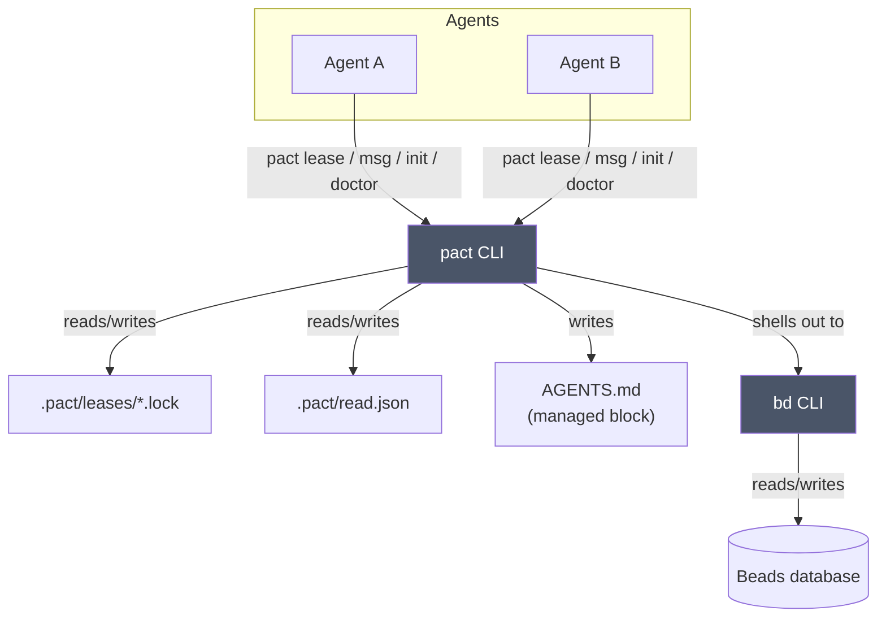

# Architecture

pact is a coordinator, not a platform: it has no server, no daemon, and no
database of its own. Everything it does is either a file it writes under
`.pact/` at your repo root, or a command it shells out to (`bd`, for
messaging). This is deliberate — the moment coordination needs its own
long-running process, it becomes one more thing that can crash, drift out of
sync, or need babysitting. pact would rather do less and stay honest about it.

Every box other than "pact CLI" and "bd CLI" is a plain file or an existing
tool. There's nothing in this diagram pact needs to keep alive between
invocations.

## Where state lives

All of pact's own state lives under `.pact/` at the repo root, which it finds
by walking up from your current directory looking for `.git` — the same way
`git` itself finds its repo root. That means you can run `pact` from any
subdirectory and it'll find the right place.

| Path | What | Committed? |
|------|------|------------|
| `.pact/leases/*.lock` | one JSON file per active lease | no (gitignored by `pact init`) |
| `.pact/read.json` | per-agent read/unread state for messages | no (gitignored) |
| `AGENTS.md` (managed block) | the coordination protocol, for agents to read | yes |

Leases and read-state are transient, per-machine, per-agent bookkeeping —
committing them would just create merge conflicts between agents that have
nothing to do with each other. The `AGENTS.md` block is the opposite: it's
the one artifact meant to travel with the repo, so every agent that clones it
learns the protocol on its own.

## What pact deliberately doesn't do

- **No daemon or background process.** Every command is a single invocation
  that reads state, maybe changes it, and exits.
- **No MCP server.** pact is a CLI; wire it into an agent however that agent
  already runs shell commands.
- **No direct Beads database or JSONL access.** Messaging always shells out
  to `bd`, never reads `.beads/*.db` or `issues.jsonl` directly. If Beads
  changes its storage format, pact doesn't need to know.
- **No mandatory locking.** Leases are advisory — see
  [docs/leases.md](leases.md) for why that's a feature, not a gap.
- **No config file, no network I/O.** Everything is either a CLI flag, an
  environment variable (`PACT_AGENT`), or a file under `.pact/`.

## Exit codes are part of the contract

Because pact is meant to be driven by other programs (agents) as much as by
humans, its exit codes are documented behavior, not incidental:

| Code | Meaning |
|------|---------|
| 0 | success |
| 1 | generic error |
| 2 | lease held by another agent (or you don't hold the lease you're releasing) |
| 3 | Beads CLI (`bd`) not found on `PATH` |
| 4 | not in a git repository |

An agent scripting against pact can branch on these without parsing error
text — check the exit code, and only fall back to reading stderr for the
human-readable reason.

## Further reading

- [docs/leases.md](leases.md) — the full lease lifecycle: TTL, the
  clock-skew grace period, steal vs. expiry, and the path-encoding caveat.
- [docs/messaging.md](messaging.md) — how `pact msg` maps onto Beads issues,
  and why it reconstructs threads itself instead of using `bd show --thread`.
- [docs/pact-scaffolding-prompt.md](pact-scaffolding-prompt.md) — the
  original design brief this project was built from.
