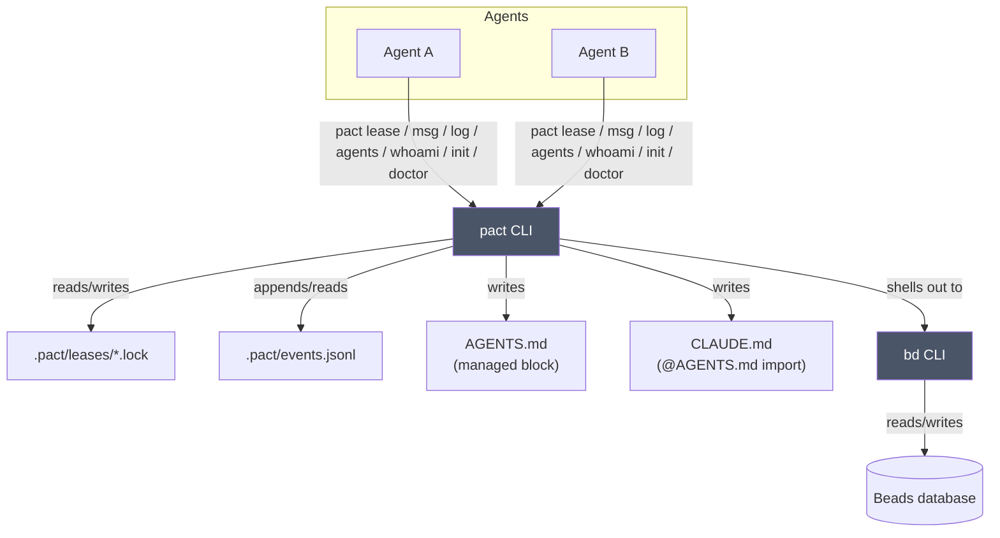

# Architecture

pact is a coordinator, not a platform: it has no server, no daemon, and no
database of its own. Everything it does is either a file it writes under
`.pact/` at your repo root, or a command it shells out to (`bd`, for
messaging). This is deliberate — the moment coordination needs its own
long-running process, it becomes one more thing that can crash, drift out of
sync, or need babysitting. pact would rather do less and stay honest about it.

Every box other than "pact CLI" and "bd CLI" is a plain file or an existing
tool. There's nothing in this diagram pact needs to keep alive between
invocations.

## Where state lives

All of pact's own state lives under `.pact/` at the repo root, which it finds
by walking up from your current directory looking for `.git` — the same way
`git` itself finds its repo root. That means you can run `pact` from any
subdirectory and it'll find the right place.

| Path | What | Committed? |
|------|------|------------|
| `.pact/leases/*.lock` | one JSON file per active lease | no |
| `.pact/events.jsonl` | append-only lease-event log behind `pact log`, bounded | no |
| `AGENTS.md` (managed block) | the coordination protocol, for agents to read | yes |
| `CLAUDE.md` (managed block) | one `@AGENTS.md` import line, because Claude Code loads `CLAUDE.md` and never `AGENTS.md` | yes |

Message read state is deliberately *not* in this table: it lives in `bd`, as a
`read-by-<agent>` label on the message bead. It used to be `.pact/read.json`, and
that file is gone rather than kept alongside — see
[docs/messaging.md](messaging.md).

`pact init` gitignores the whole directory with a single `.pact/` line rather
than one rule per file, so anything an agent writes under `.pact/` is already
covered — including `events.jsonl`, which needed no new rule. Re-running `init`
on a repo that has the older `.pact/leases/` + `.pact/read.json` pair recognises
them and appends nothing.

Leases and the event log are transient, per-machine bookkeeping — committing
them would just create merge conflicts between agents that have nothing to do
with each other. The `AGENTS.md` block is the opposite: it's the one artifact
meant to travel with the repo, so every agent that clones it learns the protocol
on its own.

### `.pact/events.jsonl`: the one thing pact stores that it can't derive

pact's bias is that state it can derive, it doesn't keep (see the next two
sections). The lease event log is the exception, and it is worth being explicit
about why rather than quietly widening the non-goal:

**Lease history cannot be derived, because releasing a lease deletes the only
record of it.** `lease ls` shows the instantaneous set; a lease taken and dropped
between two of your commands left nothing at all behind. `pact log` needed a
trace, so the trace has to be written when the transition happens.

What keeps it from becoming a database:

- **Lease events only.** Messages are already in `bd` and are derived from there
  for `pact log` — duplicating them here would create two sources of truth for
  one fact, which is the thing this whole design avoids.
- **One append-only file**, one JSON line per event, already covered by the
  `.pact/` gitignore rule.
- **A write failure never breaks a lease.** Appending is infallible by signature:
  the error is swallowed. A lease `acquire` that failed because *logging* failed
  would be a coordination bug caused by bookkeeping, which is exactly backwards.
- **Bounded, dumbly.** Past 5000 lines the file is rewritten with the newest
  4000. No rotation, no index, no sidecar state to keep in sync.
- **Unparsable lines are skipped**, not fatal, the same way an unreadable lock
  file is skipped; a missing file is an empty feed, not an error.

Consequence to expect: the feed starts at the first `acquire` after it shipped,
while `pact log`'s message half reaches back as far as the Beads database. That
asymmetry is by design — backfilling lease history from nothing would mean
inventing it.

## Introspection: derived, never stored

Two commands answer questions *about* pact, and neither adds state.

`pact whoami` reports the identity it resolved and where it resolved it from,
the pact binary actually running (`current_exe`), the repo root, `.pact/`, and
the `bd` it will shell out to. Three properties are deliberate:

- **It never fails.** No identity, no `bd`, not in a git repo — each becomes a
  reported problem, and the command still exits 0. You run `whoami` *because*
  something else broke; it must not break too.
- **It probes `bd`, not just `bd`'s existence.** `bd --version` is happy in a
  repo with no reachable Beads database, while every `bd`-backed pact command
  fails. So `whoami` runs the query those commands actually run and reports the
  failure as a problem.
- **It creates nothing**, including `.pact/` — a read-only question shouldn't
  write. It says `(not created yet)` instead.

`pact agents` answers "who is working in this repo" with **no registry**: it
unions the identities already visible in the two places pact writes them —
lease holders (with `acquired_at`) and message traffic (`from` and `to`) — keyed
by name, and sorts by most recent sighting. There is nothing to enrol in, and
nothing to keep in sync with reality, because it *is* the reality. `bd` is
optional: without it you get the lease half, the same way `pact lease` works
without `bd`.

That derivation is also why `pact agents` distinguishes an identity that has
*acted* (held a lease or sent a message) from one that has only been *addressed*
— the latter is what a typo leaves behind, and the command marks it `?` rather
than confirming it as an agent.

`pact log` follows the same rule from the other direction: it *reads* the two
places the facts already are (`.pact/events.jsonl` and `bd`) and merges them on
parsed instants, keeping no third copy and no index.

**`pact init` is the one command that writes history.** It commits the three
files it wrote — `AGENTS.md`, `CLAUDE.md`, `.gitignore` — because the whole
onboarding model assumes they were committed, and "remember to commit this"
is a step that gets skipped. The commit is path-scoped (`git commit -- <paths>`
builds from HEAD plus those paths), so unrelated staged work stays staged
rather than being swept into a commit pact authored. `--no-commit` opts out.
pact never passes `git add -f`: a path the repo ignores is a decision pact
doesn't get to overrule, so that case is reported and left alone.

One seam exists behind this: lease persistence goes through a `LeaseStore`
trait, whose only implementation reads and writes the lock files described
above. It exists so lease *logic* can be tested without a filesystem, not
because a second backend is planned — a database or network store would
contradict "no daemon, no server" on the list below. Treat it as a test seam,
not an extension point.

**A read-only command must not mutate.** `whoami` not creating `.pact/` is one
case of a general rule that took a bug to learn: every command that only *shows*
leases used to inherit the expired-lock sweep from the listing code, so `pact
agents`, `pact doctor` and `pact ui`'s refresh timer all pruned lock files as a
side effect, and asking twice gave two answers. Collecting is now confined to
`lease ls` and `acquire` — see [docs/leases.md](leases.md).

## What pact deliberately doesn't do

- **No daemon or background process.** Every command is a single invocation
  that reads state, maybe changes it, and exits.
- **No MCP server.** pact is a CLI; wire it into an agent however that agent
  already runs shell commands.
- **No direct Beads database or JSONL access.** Messaging always shells out
  to `bd`, never reads `.beads/*.db` or `issues.jsonl` directly. If Beads
  changes its storage format, pact doesn't need to know.
- **No mandatory locking.** Leases are advisory — see
  [docs/leases.md](leases.md) for why that's a feature, not a gap.
- **No config file, no network I/O.** Everything is either a CLI flag, an
  environment variable (`PACT_AGENT`), or a file under `.pact/`.
- **No stored state that could be derived.** Exactly one thing is stored that
  can't be — the lease event log, for the reason given above. Message read state
  went the other way: it moved *out* of a local file and into the bead it
  describes.

## Exit codes are part of the contract

Because pact is meant to be driven by other programs (agents) as much as by
humans, its exit codes are documented behavior, not incidental:

| Code | Meaning |
|------|---------|
| 0 | success |
| 1 | generic error |
| 2 | lease held by another agent (or you don't hold the lease you're releasing) |
| 3 | Beads CLI (`bd`) not found on `PATH` |
| 4 | not in a git repository |

An agent scripting against pact can branch on these without parsing error
text — check the exit code, and only fall back to reading stderr for the
human-readable reason.

That table is the whole set, which is why **a closed pipe adds nothing to it**.
`pact … | head -1` used to panic in the middle of a write and exit 101; a caller
that only reads the status could not distinguish that from "the command failed",
so it retried an action that had already happened. Output now drops the unwritten
bytes silently and the process keeps whatever status its work earned. Not even the
conventional SIGPIPE-emulating 141: by the time anything is printed, the bead has
been created and the lock file written, so a non-zero status would report a
completed action as failed. A write error that is *not* a broken pipe gets a
one-line stderr warning and is likewise non-fatal.

Two conventions follow from that. `pact doctor` exits 1 when a check fails, so
it works in a CI gate. And an **advisory warning never changes the exit code**:
`acquire --steal`, `release --force` on someone else's claim, and
`msg send` to an unseen recipient all write to stderr and exit 0. Warnings are
for the reader; exit codes are for the caller, and conflating them would make
every polite heads-up look like a failure.

## Further reading

- [docs/leases.md](leases.md) — the full lease lifecycle: TTL, the
  clock-skew grace period, steal vs. expiry, and the path-encoding caveat.
- [docs/messaging.md](messaging.md) — how `pact msg` maps onto Beads issues,
  and why it reconstructs threads itself instead of using `bd show --thread`.
- [docs/tui.md](tui.md) — `pact ui`'s tabs and keybindings, and the `ui` Cargo
  feature it lives behind.
