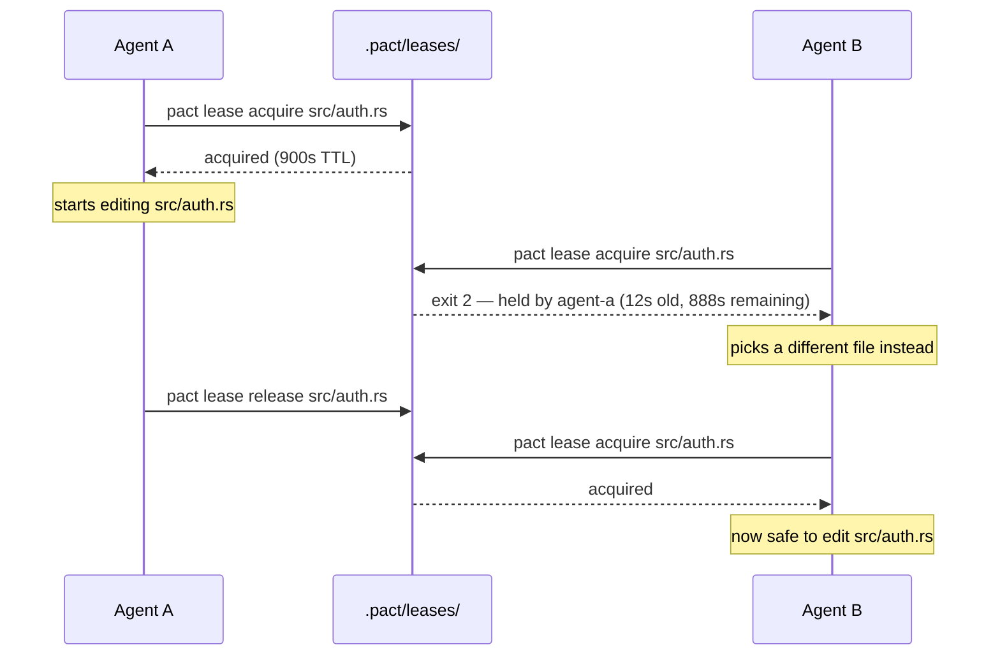

# Leases

A lease is pact's way of letting an agent say "I'm working on this file" in a
way other agents (and you) can check before stepping on it. It is **advisory**
— nothing stops an agent from editing a file it hasn't leased, the same way
nothing stops you from `git push --force` over a coworker's branch. The point
isn't to make that impossible; it's to make coordinating cheap enough that
agents actually do it.

## The shape of a lease

A lease is one JSON file: `.pact/leases/<encoded-path>.lock`, containing

```json
{
  "agent": "agent-a",
  "path": "src/auth.rs",
  "acquired_at": "2026-07-30T09:12:03Z",
  "ttl_secs": 900,
  "note": "refactoring session handling"
}
```

`<encoded-path>` replaces `/` with `__` (so `src/auth.rs` becomes
`src__auth.rs.lock`). This means a path containing a literal `__` could in
principle collide with a different path — a deliberate v1 simplification, not
an oversight; see [pact-scaffolding-prompt.md](pact-scaffolding-prompt.md).

Creating the lock file is atomic (`O_EXCL`-style creation), so two agents
racing to acquire the same lease at the same instant can't both "win" — one
gets the lease, the other gets a conflict.

## Use case: two agents, one file

You've fanned two agents out on "clean up the auth module." Neither knows
about the other's task. Without leases, they'd both edit `src/auth.rs` and
one would silently lose work. With leases:



Agent B's `acquire` fails with **exit code 2**, and the error message on
stderr names the current holder, how old the lease is, and how much TTL is
left — enough for an agent to decide whether to wait, pick different work, or
`--steal`.

## Lifecycle: expiry and stealing

A lease doesn't require its holder to still be alive. Every lease carries a
TTL (default 900 seconds) plus a fixed 30-second grace period that absorbs
clock drift between machines — a lease is only treated as expired once
`now > acquired_at + ttl + 30s`.

```mermaid
stateDiagram-v2
    [*] --> Free
    Free --> Active: acquire
    Active --> Free: release / release --all
    Active --> Active: renew / acquire (same agent) / acquire --steal (other agent)
    Active --> Stale: ttl elapses
    Stale --> Free: release / release --all
    Stale --> Active: renew, or acquire (same agent)
    Stale --> Expired: a further 30s grace elapses
    Expired --> Active: acquire (any agent)
    note right of Active
        renew keeps the original
        ttl and note; --steal warns
        and reports stolen: true
    end note
    note right of Expired
        next acquire reports
        stolen: true; swept from
        disk by the next listing
    end note
```



### The three states

`pact lease ls` labels every lease, and `pact ui` uses the same labels — one
implementation, both surfaces, so the dashboard and the CLI can't disagree.

| State | Meaning | Can another agent take it? |
|---|---|---|
| `active` | within its TTL | no (not without `--steal`) |
| `stale (reclaimable in Ns)` | past its TTL, inside the 30s grace window | not yet |
| `expired` | past TTL + 30s | yes, the next `acquire` takes it |

**`stale` is distinct from `expired` on purpose.** The 30-second grace period
exists to absorb clock drift between machines, so a lease that has merely
passed its TTL might just be a holder whose clock runs a few seconds fast. In
that window the lease is *probably* abandoned but not *provably* so, and pact
will not hand it to someone else yet. Collapsing the two would mean either
lying about reclaimability for 30 seconds, or pretending a lease that ran out
two minutes ago is still healthy. The label says which of the two you're
looking at, and how long until it changes.

The state label is derived from the same `expired` flag that garbage collection
acts on, not recomputed — so the label can never claim something the sweep
disagrees with.

### Why `lease ls` leads with age, not remaining TTL

It used to print remaining TTL first. A lease 80 seconds into a 3600s TTL
showed `3520s`, an operator read that as "this agent has held this for a long
time", and force-released a live claim. Remaining TTL is a crash-recovery
ceiling, not a duration of work: it says when pact will give up on the holder,
not how long the holder has been busy. So age leads, and `remaining_secs`
appears only inside the `stale` label, where it answers a question you can act
on. `--json` still carries every field.

Three distinct paths lead to a fresh `acquire` succeeding on an already-held
lease, and pact reports which one happened:

- **Re-entrant refresh** — the same agent acquires again (e.g. re-running a
  long task). No conflict, `acquired_at` just resets. `stolen: false`.
- **Expiry** — the holder crashed, forgot to release, or its TTL genuinely
  ran out. The next `acquire` from *any* agent takes over automatically.
  `stolen: true`.
- **Forced steal** (`--steal`) — a different agent takes over a lease that
  hasn't expired yet. This always prints a warning to stderr first, because
  unlike expiry, a human or agent is choosing to override someone else's
  active claim. `stolen: true`.

## Renewing a long task's lease

```
pact lease renew <path>
```

A task that takes longer than its TTL silently loses its claim: the agent is
still editing, but the lease has expired and the next `acquire` from anyone
else succeeds. `renew` refreshes `acquired_at` in place, keeping the original
TTL and note, so an agent doing a long job can hold on without re-stating what
it's doing:

```
$ pact lease renew src/main.rs
renewed lease on src/main.rs for cli-wire (30m0s ttl)
```

Two deliberate refusals:

- **No lease on that path**: an error, not a fresh claim. A typo'd path must
  not quietly acquire something you never asked for.
- **Held by another agent**: **exit code 2**, same as a conflicting `acquire`.
  `renew` is for extending your own claim, never for taking one.

`acquire` on a path you already hold does the same refresh, so `renew` isn't
strictly new capability — it's the version that can't accidentally create a
lease, and it's discoverable in `pact lease --help`, which was the actual
complaint.

## Releasing

```
pact lease release <path> [--force]
pact lease release --all
```

- Releasing a lease you hold: removes it.
- Releasing a lease you don't hold: **exit code 2**, unless `--force`.
- Releasing a path with no lease at all: succeeds — this is idempotent by
  design, so "release when you're done" never needs a preceding check.

`--force` succeeds where you don't hold the lease, and when it destroys a
*different* agent's live claim it says so on stderr — mirroring
`acquire --steal`, because both are a human or agent overriding someone else's
active work:

```
warning: force-released other.rs — destroyed agent-a's live claim; they were
not notified (`pact msg send --to agent-a`)
```

pact does not send that notification itself. It would need `bd`, it can fail,
and a release must not die because a notification did. The warning names the
command instead.

`--all` releases every lease the calling agent holds, in one call, and prints
what it released:

```
$ pact lease release --all
released 2 lease(s):
  docs/leases.md
  README.md
```

Holding nothing is success with an empty list (`<agent> held no leases`), so
"release everything I hold" is safe to run unconditionally at the end of a
task. This exists because an agent holding several files would release some and
announce all of them — the failure that motivated it took an hour to become
visible. `--all` is mutually exclusive with a path (clap rejects the
combination) and with `--force`, which is meaningless when you only touch your
own claims.

## Listing and garbage collection

```
pact lease ls [--all]
```

Prints the active leases: path, holder, age, state, and the holder's `--note`.
The note is there because "what is this agent doing" is the question you have
immediately before reaching for `--force`, and the CLI used to answer it with
silence.

Listing garbage-collects expired lock files from disk as a side effect — `ls`
(without `--all`) simply doesn't show you the ones it just swept away; `--all`
shows them anyway, for the moment before they're cleaned up. Note that
`pact agents` and `pact msg send` read the lease list too (to name agents and
to check a recipient), so they inherit that sweep: a read-only-looking question
can prune expired locks. That's tracked as a bug (`pact-rnc.19`), not a design
choice — it needs a non-GC read path in the lease module.

## Why advisory, not mandatory

See the FAQ in the [README](../README.md#faq) — the short version is that a
mandatory lock just moves the failure mode from "two agents edited the same
file" to "a crashed agent left a lock nobody can clear," which is worse.
