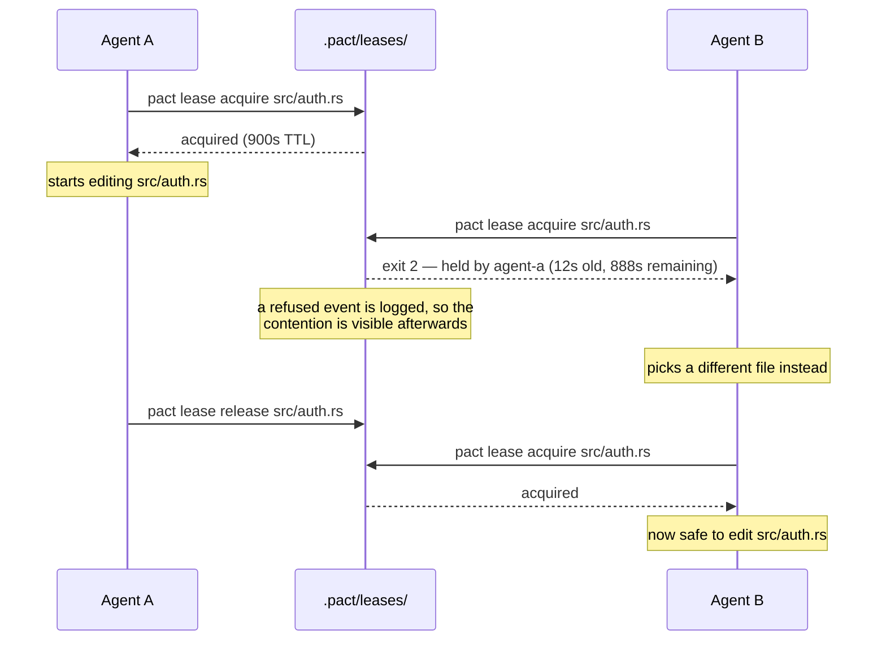

# Leases

A lease is pact's way of letting an agent say "I'm working on this file" in a
way other agents (and you) can check before stepping on it. It is **advisory**
— nothing stops an agent from editing a file it hasn't leased, the same way
nothing stops you from `git push --force` over a coworker's branch. The point
isn't to make that impossible; it's to make coordinating cheap enough that
agents actually do it.

## The signal ladder: is this holder alive?

Four rungs, cheapest and strongest first. Every consumer that has to decide
whether a quiet holder is working — the exit-2 refusal, `lease sweep --suspect`,
`pact doctor`'s fleet check — walks the same one, so they cannot disagree.

| rung | what it sees | cost |
|---|---|---|
| **silence** | the holder wrote no *event* for over half its TTL. This is what `SUSPECT` means | free, already loaded |
| **commit** | the holder has committed under this path since taking it | one `git log` |
| **pact activity** | the holder ran *any* pact command recently, including read-only ones | one small file read |

Silence alone is weak, and measurably so: pact only sees an agent when it
**mutates** something, so a worker making one deep change to one file emits
nothing at all between acquire and release. Over pact's own history, 23% of 335
completed holds ran past half their TTL — nearly a quarter of ordinary work looks
abandoned on silence alone.

The commit rung (pact-g50) closed most of that. **pact activity closes the rest**:
an agent that ran `pact msg inbox` two minutes ago is alive whether or not it has
committed, and reading the inbox is exactly what a deep-change worker does most
while being the one thing that used to leave no trace.

### It is a by-product, never a step

The record is written by the identity resolution every invocation already
performs. There is no heartbeat command and there will not be one, because the
measurement that shaped this says agents would not run it: **one renewal in 153
events** across the field runs. A liveness protocol gets renewal's compliance.

### An mtime is evidence of USAGE, not of progress

The honest limit, and every consumer inherits it. This says an agent ran a pact
command. **A spinning agent is alive AND stuck** — one retrying a refused lease
every fifteen seconds looks maximally healthy here, and is precisely what
[`--check retry-storm`](audit.md) exists to catch. The two answer different
questions and neither substitutes for the other.

### A rung that is not there

Working-tree mtime — "has this path changed on disk since the hold opened" —
would sit between commit and activity. It is **not implemented**, and named here
rather than silently omitted: under the one-worktree-per-agent topology pact
recommends, the path this process can `stat` is frequently not the copy the holder
is editing. A rung that is quietly wrong under the recommended topology is worse
than a rung that is missing.

### Machine-local, and absent is not dead

`.pact/activity/` is gitignored with `.pact/leases/`: a record of who ran a
command on *this* machine. Every consumer degrades to "no data" rather than to a
verdict — a repository whose fleet ran on an older pact has no records at all,
and reporting that as a fleet of corpses would be the worst available answer.

## Waiting for a held path: `--wait`

```bash
pact lease acquire src/api.rs --wait 20m
```

Blocks until the path is free and acquires it, or exits 2 with the usual refusal
when the budget runs out. The exit code and the message are unchanged, so a caller
that branched on either before this existed still works.

**The wait happens inside the command, and that is the point.** pact used to
answer a refusal with "subscribe with `pact watch add` and pick up other ready
work". For a subagent that is a trap rather than advice: its process is its turn
loop, so ending the turn to wait for the notification is the same as exiting, and
nothing can re-enter it. On one 12-agent fleet seven agents took that advice, four
never resumed, and the three that did resumed nine hours later within fourteen
seconds of each other, when a human woke the parent session. See
[watch.md](watch.md#watch-is-not-a-way-to-wait).

This is not the polling the protocol warns against. Polling is an *agent* spending
a turn per attempt — the behaviour `pact audit --check retry-storm` counts. `--wait`
spends no turns: one tool call that returns when the path is free.

Internally it retries with a short backoff, capped at 15 seconds and never
sleeping past the point where the hold it is waiting on becomes reclaimable. A
first cut slept for the holder's remaining TTL instead and took 30 seconds to
notice a release that happened at 6 — correct, and useless, because holds
routinely end long before their TTL: pact's own median file hold is 14 minutes
against a 45-minute default.

## Reclaiming a hold whose holder is gone

`--steal` overrides a live claim on your assertion that the holder is gone. It
writes `displaced` + `stolen` — which is exactly what trampling a working peer
writes, so [`--check double-win`](audit.md) reports both identically. Measured
over one 12-agent run: **six double-wins, every one a steal against a peer that
had genuinely died.** A fleet's most responsible behaviour appeared in the audit
as its worst, and nothing in the log could separate them.

```bash
pact lease sweep                 # holds past their own TTL
pact lease sweep --suspect       # also holds whose holder has gone quiet
pact lease sweep --suspect src/parser.rs
```

`sweep` reclaims on pact's own evidence rather than your word, and records that
evidence: a `reclaimed` event under **the sweeper**, naming the previous holder
and either how far past its TTL the hold was or how long that holder had been
silent. It refuses a hold whose holder still looks alive, and says so per path
rather than silently doing nothing — an agent that swept nothing needs to know
which of the two reasons applied. It never touches your own holds; `release` is
for those.

**Why `--suspect` exists, and why it is not the default.** Sweeping only expired
holds is the safe case — such a hold is nobody's by the lease's own terms — but
it would not have prevented any of those six double-wins. Every one was a hold
still *inside* its 45-minute TTL (32 minutes, 24, 19) whose holder had died. A
dead agent's lease reads as live for as long as its TTL says, which is precisely
the window a fleet needs to recover in. `--suspect` takes those, using the same
silence threshold `lease ls` labels SUSPECT with; it is opt-in because a quiet
holder may yet come back and an expired one cannot.

**A holder that has committed under its path is spared.** Silence is weak
evidence, and pact should say how weak: `suspect` means "no pact event from this
agent for over half its TTL", and pact only ever sees an agent when it *mutates*
something — takes a lease, sends a message, records a context row. An agent
making one deep change to one file emits none of those between acquire and
release, so sustained work and abandonment produce an identical signal. Measured
over pact's own history, **23% of all 335 completed holds ran longer than half
their TTL**, so on silence alone this sweep would reclaim roughly a quarter of
ordinary work out from under agents still doing it.

So before reclaiming a hold that is still inside its TTL, `--suspect` asks git
whether the held path has been committed to since the lease was taken. If it
has, the holder is working and the hold is left alone. This costs one `git log`
per sweep, not per lease, and the default `sweep` never runs it at all — expiry
is a statement about the clock, not about the holder, and a lapsed hold is
nobody's by its own terms whatever anyone is doing. If git is unavailable the
sweep behaves exactly as it did before: rescuing a live holder is an improvement,
never a precondition.

`lease ls`'s label is deliberately *not* filtered this way. It is advisory and
destroys nothing, it shares a code path with the TUI's refresh, and buying a
better adjective with a subprocess on that path is the trade
[the dashboard already refused once](tui.md). Read `SUSPECT` as "pact cannot
corroborate that anyone is behind this claim" — which is what it has always
meant, and is true.

**The gap this closes in `lease ls`.** A hold quiet but inside its TTL is loudly
`SUSPECT: quiet 8m12s`. A hold *past* its TTL is collected as a side effect of
the listing and leaves nothing behind — `lease ls` simply says "no active
leases". So the signal went quiet exactly where certainty was highest, and an
agent doing peer recovery saw nothing to recover. Two agents in one run reported
opposite experiences of SUSPECT for this reason. `sweep` is the deliberate,
accountable version of what the listing was doing silently.


## What pact refuses, and what it only warns about

**A path containing whitespace is refused.** No source file in a normal repository has one,
and the shape that produces it is specific: an unquoted shell variable holding a list
arrives as ONE argument, because zsh does not word-split it. pact used to accept the whole
string as a single lease. Three agents in one field run each concluded "pact caps multi-path
acquires at about 15 paths" from that — it does not, 40 paths take 0.560s — and past roughly
five the joined name exceeds `NAME_MAX` and surfaces as a raw `os error 36`.

```bash
pact lease acquire a.rs b.rs        # two leases
pact lease acquire "a.rs b.rs"      # refused: one filename with a space in it
```

**A path that does not exist only warns**, and the warning prints the RESOLVED path.
Leasing a file you are about to create is legitimate, and so is watching one. What was
missing was any signal at all — six such calls in one run, every one exit 0.

Paths resolve against the current directory, which is ordinary Unix behaviour and is exactly
how it bites: from the repository root, `pact lease acquire src/vm/mod.rs` on a project whose
file is at `treadle/src/vm/mod.rs` resolves to a path that does not exist. pact answered
`acquired lease on src/vm/mod.rs`, the caller believed it, and the lease protected nothing.
`--check commit-correlation` flagged both resulting commits afterwards. The warning names the
resolved path rather than echoing the argument back, because echoing the input is what made
that convincing.

## The shape of a lease

A lease is one JSON file: `.pact/leases/<encoded-path>.lock`, containing

```json
{
  "agent": "agent-a",
  "path": "src/auth.rs",
  "acquired_at": "2026-07-30T09:12:03Z",
  "ttl_secs": 900,
  "note": "refactoring session handling",
  "content_hash": "22aa323169fb49d41e4b2fde189212c33bc21eab"
}
```

`content_hash` is the git blob id of the file's content at the moment it was
claimed — absent, not null, when the path did not exist yet. It is what
[`pact watch`](watch.md) diffs against when the lease is released, and it lives
on the lock file because `release` already reads this struct to check ownership,
so the baseline is one field away rather than a scan back through the event log.
A `renew` deliberately inherits it rather than re-stamping: resetting the
baseline mid-hold would hide everything done before the renew.

`<encoded-path>` replaces `/` with `__` (so `src/auth.rs` becomes
`src__auth.rs.lock`). This means a path containing a literal `__` could in
principle collide with a different path — a deliberate v1 simplification, not
an oversight.

In a repository that uses `git worktree`, two more keys appear:

```json
{
  "agent": "agent-a",
  "path": "src/auth.rs",
  "acquired_at": "2026-07-30T09:12:03Z",
  "ttl_secs": 900,
  "note": "refactoring session handling",
  "content_hash": "22aa323169fb49d41e4b2fde189212c33bc21eab",
  "branch": "feat/auth",
  "worktree": "wt-auth"
}
```

Both are informational — nothing branches on either — and both are **absent**
rather than null in a repository with no worktrees, so those lock files stay
byte-identical to the block above. They exist because all worktrees of one
repository share a single `.pact/`, so the holder may be editing a checkout the
reader cannot see; `lease ls` grows a `WHERE` column and the exit-2 conflict
message becomes:

```
error: lease on src/api.ts is held by agent-a on branch main in worktree main
(0s old, 900s remaining); use --steal to override
```

Without the location, a reader inspects their own working copy, finds it
untouched, and concludes the lease is stale. See
[architecture.md](architecture.md#one-coordination-space-per-repository-not-per-checkout)
for how the shared directory is resolved.

Any key a given binary doesn't recognize — a field a newer release adds the
same way `branch`/`worktree` were, or one an older release simply predates —
round-trips unchanged through every operation that reads a lease and writes it
back (`renew`, and `acquire --steal`/its expired-reclaim takeover). A mixed
fleet where one machine hasn't upgraded yet is the ordinary way this happens,
not an edge case: without it, the older binary's renew would silently erase
whatever the newer one had stamped.

### One file is one lease, however you spell the path

The lock name has to be a *canonical* answer to "which file is this", because
two names for one file means two leases on it, and two agents each told they
hold it. That is the single failure the whole surface exists to prevent, so the
spelling is normalised before anything else happens:

| You type | From | pact leases |
|---|---|---|
| `src/auth.rs` | repo root | `src/auth.rs` |
| `auth.rs` | `src/` | `src/auth.rs` |
| `../src/auth.rs` | `tests/` | `src/auth.rs` |
| `/abs/repo/src/auth.rs` | anywhere in that checkout | `src/auth.rs` |
| `/abs/main/src/auth.rs` | a linked worktree of `/abs/main` | `src/auth.rs` |

A relative path is resolved against your working directory, then `.` and `..`
are folded **lexically** — never with `canonicalize()`, because leasing a file
that does not exist yet is a documented workflow (see below) and `canonicalize`
fails on a missing path.

**Across worktrees, "however you spell it" is covered by three candidates, tried
in order of how cheap they are to compute.** An absolute path (or a `..` that
escapes your checkout — the same code path, since it is made absolute before
anything strips it) is matched against your own checkout's root first; failing
that, against the shared coordination root, which for a linked worktree is the
main worktree where `.pact/` lives; failing that, against every OTHER linked
worktree's own checkout root, read straight from the plain gitdir-pointer files
git already writes under the main worktree's `.git/worktrees/` (no `git`
subprocess, so the third candidate costs nothing until it is actually needed).
That covers every spelling people actually produce: a path copied out of `lease
ls`'s `WHERE` column, or out of a peer's message, and pasted from any other
checkout of the same repository — including a THIRD, non-main sibling worktree
(`pact-m7j.8.7`). Before the second candidate existed, such a path matched
nothing, was kept whole, and became its own lock key — one file, two leases,
both holders told they had it, which is the exact failure this section exists
to prevent.

Case is folded only where the filesystem folds it. On macOS's default APFS,
`src/auth.rs` and `src/Auth.rs` are one file and take one lease; on Linux they
are two files and take two. Lowercasing unconditionally would be a bug rather
than caution — it would manufacture a conflict between genuinely different
files. pact probes the filesystem rather than trusting git's `core.ignorecase`,
which records what git saw at clone time and can describe a different machine.

Only the lock *filename* is folded. `pact lease ls` and every error message show
the spelling you used.

**The advisory surfaces answer the same question, and now agree with the
lock.** The prior-owner note `acquire` prints, the "unread message about"
check, and `msg send --to-owner-of`'s resolution each used to compare paths
without this normalization — reproduced live: a file released as
`src/foo.rs` from the root, then re-acquired as `foo.rs` from `src/`, showed
no prior-owner note and no pending-message note, and `--to-owner-of foo.rs`
typed from `src/` answered "no agent has ever leased foo.rs" for a file that
very much had an owner. All three now normalize before comparing
(pact-m7j.8.6), so a file's coordination history is found the same way
regardless of which command, or which CWD, asks about it.

### How much atomicity you actually get

All of it is conditional on the two racers having agreed on the lock key: where
the normalisation gap above bites, there is no race to win, just two locks.

Claiming a **free** path is atomic in both senses that matter. The lease is
written to a staging file first, then `hard_link`ed into place: the link is
atomic and fails if the destination exists, so only one of two racing agents
wins (the other gets exit 2) *and* the lock's name never appears before its
contents do.

That second half was learned the hard way. An earlier version used `O_EXCL`
(`create_new`) and then wrote the body, which gives exclusivity but not atomic
content: the file existed and was empty in between. A concurrent reader got
`EOF while parsing a value`, and `pact doctor` called it "1 unreadable lock file
(remove manually from `.pact/leases/`)" — advice that, followed during the
window, deletes a live agent's lock. Measured with a tight poller: 203
zero-byte observations in 300 acquire cycles under the old scheme, 0 under this
one.

**Taking over** an already-existing lock — reclaiming an expired lease,
`--steal`, and a re-entrant refresh by the current holder — can't use
`O_EXCL` on the lock file itself, because the file is already there. They
write a sibling temp file and `rename` it over the lock (atomic on one
filesystem), then **re-read the lock and confirm it names them** with the
exact timestamp they just wrote. If a concurrent takeover landed in between,
the loser sees the winner's name and exits 2 instead of falsely reporting
success.

That verify alone only narrows the race, from "everything since we read the
file" to "between our rename and our re-read" — it does not close it,
because two racers can each read the pre-takeover state before either
writes. That stopped being a hypothetical: research against the compiled
binary reproduced double- and even triple-wins via ordinary CLI-level `pact
lease acquire` races, no fault injection needed — roughly 20-30% of rounds
at 6-10 concurrent racers on one expired lock, and 2 of 30 rounds even at
just two racers. So takeovers are now serialized behind a real `flock(2)` on
a sibling guard file, held for the whole read-decide-write sequence, not just
the rename — the second racer, once it gets the lock, reads the first
racer's fresh write as current reality and makes its decision against that,
not against a snapshot that is already stale. The post-write verify stays in
place as a cheap check that the guard worked, not as the primary defense.

The first version of that guard used `O_EXCL` on the sibling file instead of
a real lock, reclaiming it once it looked older than a fixed threshold — the
theory being that a guard nobody had touched in that long must belong to a
crashed holder. TLA+ model checking proved that reasoning unsound: under
genuine contention, a live holder can legitimately still be inside the
critical section once the threshold elapses, no crash required — and a
waiter that reclaims on that basis steals the guard out from under a holder
who is still using it, reopening the exact double-win the guard exists to
close, through a different door. `flock` has no such heuristic to get wrong:
the kernel releases it the instant the holder's file descriptor closes, on a
clean exit or a crash alike, so there is nothing to guess about. The guard
file itself is never deleted — unlinking it while a waiter might still be
about to open that same name would let a fresh inode start an unrelated lock
series at the same path, splitting the very exclusivity this exists to
provide — so `.pact/guards/` accumulates one empty file per lock path that
has ever been contested, a deliberate and cheap cost.

## Use case: two agents, one file

You've fanned two agents out on "clean up the auth module." Neither knows
about the other's task. Without leases, they'd both edit `src/auth.rs` and
one would silently lose work. With leases:



The refusal is the step worth noticing. Exit 2 tells *B* it lost, and for a
long time that was the only trace it left: the loser picked another file and the
log recorded a clean sequence of holds, so a path six agents had queued on
looked identical to one nobody else wanted. `refused` closes that — see
[the event log](#the-event-log) below.

Agent B's `acquire` fails with **exit code 2**, and the error message on
stderr names the current holder, how old the lease is, and how much TTL is
left — enough for an agent to decide whether to wait, pick different work, or
`--steal`.

## Claiming several paths at once

```
pact lease acquire <path>...
```

Several paths in one `acquire` are taken **all-or-nothing**:

```
$ pact lease acquire src/parser.rs src/main.rs --note "new module + its mod line"
took 2 lease(s) for cli-wire:
  acquired src/parser.rs
  acquired src/main.rs
```

If any path is unavailable, pact rolls back the leases it took earlier *in that
same call* and returns that path's error, exit code 2:

```
$ pact lease acquire q2.rs q1.rs
error: lease on q1.rs is held by probe-peer (0s old, 60s remaining); use --steal to override
```

No lock for `q2.rs` is left behind, and `probe-peer`'s claim is untouched. The
error names the contended path, because that is the one thing the caller has to
act on — negotiate over `q1.rs`, or pick different work.

Two deliberate details:

- **Rollback never releases a lease you already held** when the call started.
  Re-running a long task refreshes its own claims; a failed multi-claim must not
  destroy a claim the agent walked in with.
- **Rollback is best-effort.** A lock that can't be removed expires on its own
  TTL, and a rollback failure must not mask the conflict the caller needs to see.

The motivating case is a new module and the line that registers it (`mod
parser;`): an agent that can't hold both atomically ends up sitting on half a
change. Note what this does *not* fix — if the registration line belongs to
another agent by assignment, being able to claim it doesn't mean you may edit it,
and then you can't compile your own file. See
[Working on a new file you can't compile yet](#working-on-a-new-file-you-cant-compile-yet).

A single path renders and serializes exactly as it always did, including
`--json` emitting the lease object rather than a one-element array.

### A granted lease is not a claim on the work

`bd update --claim` decides who owns the **work**. `pact lease acquire` decides who
may edit the **files**. They are separate locks, and pact grants the second without
consulting the first — so an agent that *lost* the bead claim can still be handed
every lease that bead names.

It has happened in a real run, three times, and self-corrected only because an
agent noticed and volunteered a release
([evidence](studies/field-runs.md#run-4-crucible-built-to-hurt)).

The protocol says claim first, lease second, which makes the claim look like the
serialization point. **It is not** — the lease is what protects the file.

**pact used to warn about this at acquire time and no longer does.** When a note
named a bead, `acquire` ran `bd show` and printed a note if the bead was assigned
to somebody else. That was a subprocess on the lease hot path, between an agent and
the file it is about to edit, which is the runtime dependency
[0.9.0 removed everywhere else](architecture.md#and-since-090-no-backend-at-all).

It was dropped rather than repointed at bd's committed export, and the measurement
is why: replayed over this repository's entire event log, the offline version would
have warned **zero times** — 100 acquire notes named a bead, 8 of those resolved to
an assignee at all, and all 8 resolved to their own acquirer. In a default bd
repository, where the export does not exist unless somebody switched it on, it would
have been 0 of 100 forever. The check was already silent on every failure (no note,
no bead id, no backend, no such bead, no assignee, or an assignee that is you)
precisely because backend outages are normal, and what remained after all that
silence was nothing.

The question is still asked, once, where it costs nothing and can be read
carefully:
[`pact audit --check claim-lease-divergence`](audit.md#--check-claim-lease-divergence).
That is a note and not a refusal for the same reason the live one was: pact cannot
know whether an assignee is stale, whether the bead was handed over verbally, or
whether the export is simply behind. It can only put the contradiction in front of
somebody who can resolve it.

### A lease is exclusive in time, not across worktrees

**In one shared checkout, a lease is all you need.** The file has a single state,
so the second writer sees the first writer's bytes and nothing can be lost.

Under [one worktree per agent](fleet-patterns.md) — which pact supports and every
field run so far has used — the guarantee is narrower than it looks:

```text
agent A  acquires, edits, commits to branch A, releases      (compliant)
agent B  acquires, edits a DIFFERENT COPY on branch B that
         never contained A's change, commits, releases       (compliant)
```

Both leases were honoured. Neither agent broke the protocol. **The conflict is
deferred to a merge performed later, by someone else, with no lease held by
anyone and pact not involved** — and that merge is where the corruption lands.

**git will usually merge both edits with no conflict marker**, because an additive
change to a shared `enum` or `match` is textually non-adjacent — which is exactly
the shape this topology encourages and a designed hot file attracts. One run
produced three instances that way, including duplicate match arms and six
duplicate test functions, none of them conflicting
([evidence](studies/field-runs.md#run-4-crucible-built-to-hurt)).

So `lease acquire` compares the path's content hash in *your* worktree against the
hash the last agent left when they released it, and says so when they differ:

```
warning: your copy of src/render.rs is NOT the copy agent-b left when they
released it at 2026-08-11T09:10:00Z — a lease is exclusive in time, not across
worktrees, so you may be about to edit a branch that never contained their
change. git will often merge both edits with no conflict marker. Reconcile first
(`git merge`/`git rebase`, or `pact msg send --to-owner-of src/render.rs`)
rather than at merge time, when both plans are sunk cost.
```

Advisory, exit 0, and **silent whenever it cannot tell** — no prior release on
record, a file that does not exist yet, a release logged before pact stamped
content hashes. A false alarm on every first acquire would train agents to ignore
the real one.

The same hazard reads back offline as
[`pact audit --check merge-divergence`](audit.md#--check-merge-divergence), for
the retrospective question: which paths did a successor start editing from a copy
its predecessor never produced?

**What this does not do.** It does not block, it does not merge for you, and it
cannot see a divergence pact was never told about — an agent editing without a
lease leaves no hash to compare. The window is still there; it is now loud
instead of silent.

### A lease is on a path, not on a file

`pact lease acquire src/parser.rs` succeeds when `src/parser.rs` doesn't exist
yet. That's deliberate and it's the right move for a new module — claim it while
you're still writing it, so a peer planning the same file finds out now rather
than at merge time — but nothing said so out loud, and an agent that assumed
otherwise leased the enclosing `scripts/` directory instead, which claims far
more than it meant to.

### Working on a new file you can't compile yet

Claiming the new module and its `mod` line together solves the *coordination*
half of `pact-rnc.21`. It does nothing for the *verification* half. If
`src/main.rs` belongs to another agent by assignment, you may not add
`mod parser;` to it — so your file isn't in the crate, `cargo build` never sees
it, and you cannot run the tests you just wrote. The gap is real and pact does
not close it.

What the fleet keeps rediscovering, written down once so nobody has to invent it
under time pressure: build a throwaway crate.

```bash
scratch=$(mktemp -d)
# build.rs too: this crate stamps PACT_* env vars at build time, and without it
# every compile fails with "environment variable PACT_PROFILE not defined".
cp -rf src build.rs Cargo.toml Cargo.lock "$scratch"/
# And pin it as its own workspace, or cargo walks *up* from the scratch dir and
# tries to parse whatever Cargo.toml it finds in /tmp as a parent workspace.
printf '\n[workspace]\n' >> "$scratch"/Cargo.toml
echo 'mod parser;' >> "$scratch"/src/main.rs   # the line you may not write for real
cd "$scratch" && cargo test parser
```

Both of those extra lines are here because the recipe was written without them
and did not work: the first attempt to follow it verbatim in this repo hit
`PACT_PROFILE not defined`, and the second hit a stray parent `Cargo.toml`.
A workaround nobody has run is not a workaround.

Your module compiles and its tests run in a copy nobody else is editing, the
real tree is untouched, and the owner of `src/main.rs` still adds the real
registration line when they get to it — tell them it's ready with
`pact msg send`.

**This is a workaround for a gap, not a feature**, and it should read like one.
It costs a full cold rebuild; it tests your file against a *snapshot* of a tree
your peers are actively changing, so a green result there can still be red in
the repo; and nothing reminds you to delete the scratch dir or re-run once the
`mod` line lands for real. The actual fix is a lease that can carry a named
registration point for the owning agent to apply on your behalf — option (a) of
`pact-rnc.21`, not built, tracked as `pact-v66`.

## Lifecycle: expiry and stealing

A lease doesn't require its holder to still be alive. Every lease carries a
TTL (default 2700 seconds, 45 minutes) plus a fixed 30-second grace period that
absorbs clock drift between machines — a lease is only treated as expired once
`now > acquired_at + ttl + 30s`.

That default is **calibrated, not chosen.** It was 900s until measurement showed
the p90 agent running nine minutes past expiry and the longest twenty-one minutes
past, each one stealable while its holder was still working — against exactly *one*
renewal in the whole recorded history. The protocol asks agents to renew; the data
says they do not. Rather than demand ceremony that is demonstrably skipped, the
default covers the work agents actually do
([the numbers](studies/dogfooding.md), and the caveat that no peer had ever
actually reclaimed one of those holds).

Recalibrating is a measurement rather than a guess, and safely so:
[`pact audit --check stale-holds`](audit.md#--check-stale-holds) judges each hold
against the TTL **it recorded**, so moving the default cannot rewrite the past.

```mermaid
stateDiagram-v2
    [*] --> Free
    Free --> Active: acquire
    Active --> Free: release / release --all
    Active --> Active: renew / acquire (same agent) / acquire --steal (other agent)
    Active --> Stale: ttl elapses
    Stale --> Free: release / release --all
    Stale --> Active: renew, or acquire (same agent)
    Stale --> Expired: a further 30s grace elapses
    Expired --> Active: acquire (any agent)
    note right of Active
        renew keeps the original
        ttl and note; --steal warns
        and reports stolen: true
    end note
    note right of Expired
        next acquire reports
        stolen: true; swept from
        disk by the next lease ls
    end note
```

### `--ttl` takes a duration, and a small bare number warns

`--ttl` accepts the same `<n><unit>` grammar as
[`pact audit --since`](audit.md) — `s`, `m`, `h`, `d`, `w` — so `--ttl 45m`,
`--ttl 2h` and `--ttl 1d` all mean what they read as. It did not, once, and the
inconsistency was the trap: an agent passed `--ttl 20` meaning twenty minutes,
got twenty seconds, and its lease lapsed mid-work. A second tried `--ttl 3m` and
had it rejected, because `--ttl` was bare seconds while every other duration in
pact took units.

The damage was not the short lease. It was what an *expiry* costs that a release
does not: the agent's commit landed under a lease that had already lapsed, which
[`--check commit-correlation`](audit.md#--check-commit-correlation) reports as a
commit nobody held, and because the lease expired rather than being released,
every [`pact watch`](watch.md) subscriber on that path got no release diff. The
watch guarantee did not fire and nothing said so.

A bare number still means seconds — scripts pass them, and `--ttl 2700` has to
keep working — so `--ttl 20` will go on meaning twenty seconds forever. Being
told is therefore the only thing that saves the next agent, and a bare value
under 120 prints a warning naming the unit it was read as and the spelling that
would have meant minutes. It **warns and holds anyway**, because a 20-second
lease is a real idiom: a short mutex over a directory some tool is about to write
behind you, blessed as `pact-b7x.3` and visible in `pact audit` as its own
category rather than as contention. An explicit `--ttl 20s` never warns; saying
the unit is how you say you meant it.

One grammar, not two: `src/lease.rs`'s unit table is the same as
`audit::parse_since`'s, and `ttl_grammar_matches_since_grammar` fails if either
is edited alone.



Every transition in that diagram also appends a line to `.pact/events.jsonl`, so
`pact log` can show a lease that was taken and released while you weren't
looking — see [The event log](#the-event-log) below.

### `release` tells you whether you actually held it

`pact lease release` used to print `released lease on <path>` and exit 0 for
three different situations, one of which was "you have not held this for the last
ninety seconds".

**`release` is where an agent confirms it played by the rules, and the binding rule
is commit-before-release.** An agent whose TTL ran out under it, which then commits
and releases, saw an unbroken success path and concluded it had complied. It had
not: the path was free for that whole window, and any peer could have taken it and
edited from a different worktree — the
[divergence hazard](#a-lease-is-exclusive-in-time-not-across-worktrees) above. It
happened in a real run for ninety seconds
([evidence](studies/field-runs.md#run-4-crucible-built-to-hurt)), nobody took it,
and that was luck rather than coordination.

So the four outcomes now read differently, and all of them still **exit 0** —
an idempotent release is a feature, it is just not a release:

| `outcome` | What it means |
|---|---|
| `released` | a live lock you held, removed. Carries `past_ttl_secs` when you overran and got away with it |
| `force-released` | `--force` destroyed a different agent's live claim, who is named |
| `already-expired` | your lease had lapsed and its lock was collected. Dated, with how long the path was free |
| `nothing-held` | no lock, and no expiry of yours on record |

`past_ttl_secs` is measured against your plain TTL, not TTL + grace: the grace
window is pact's tolerance for a skewed clock before it lets a *peer* reclaim, not
an extension of the promise you made.

Only this agent's own row in the log answers the `already-expired` question — a
peer's expiry on the same path says nothing about whether *you* overran. Past the
log's rewrite horizon the answer degrades to `nothing-held`, which reads as "no
expiry on record" rather than as a claim that none happened.

### Releasing several paths

`pact lease release <path>...` takes many paths, like `acquire` — because four
agents in one run assumed it already did, by analogy, and each had to release one
path per call.

**It is deliberately NOT all-or-nothing, unlike `acquire`.** Holding half of what
you need is useless, so `acquire` rolls back; releasing three of four is strictly
better than releasing none, and `release` is what an agent runs on its way out. So
every path is attempted, a refusal is warned about on stderr, and the exit code is
still 2 if any path was refused.

`--json` follows `acquire`'s convention: one path is an object, several are an
array of the same element. A refusal anywhere suppresses the payload and emits the
error object instead, so `--json` is always exactly one document.

### The three states

`pact lease ls` labels every lease, and `pact ui` uses the same labels — one
implementation, both surfaces, so the dashboard and the CLI can't disagree.

| State | Meaning | Can another agent take it? |
|---|---|---|
| `active` | within its TTL | no (not without `--steal`) |
| `SUSPECT: quiet Ns` | within its TTL, but its holder has not run a pact command for half of it | no — and see below |
| `stale (reclaimable in Ns)` | past its TTL, inside the 30s grace window | not yet |
| `expired` | past TTL + 30s | yes, the next `acquire` takes it |

#### `SUSPECT`: a stalled holder is worse than a crashed one

A crashed holder's lease expires and a peer reclaims it, which works. **A stalled
holder is worse**: it renews nothing, releases nothing, and blocks peers who are
correctly declining to steal a lease that still reads as live. In one run seven of
ten agents stalled, one of them holding a file that `lease ls` reported as `active`
with a live holder — and it cost more fleet time than every injected fault combined
([evidence](studies/field-runs.md#run-4-crucible-built-to-hurt)).

The TTL is the slowest possible detector — it says
nothing until the whole lease is over. So `lease ls` now derives a second signal
from data pact was already writing: **every command an agent runs appends an
event**, so the age of a holder's most recent event is how long since anything
was heard from them. Quiet for more than half its own TTL, and the lease is
`SUSPECT`. `pact ui` shows it in the same yellow as `stale`, from the same
`state_label()` — one implementation, both surfaces.

The threshold is half the lease's *own* TTL, not a global constant: 400 seconds of
silence is alarming on a 10-minute lease and unremarkable on a 45-minute one, and
the lease already carries the number. A lock whose holder the log has never seen
act at all reads `SUSPECT: never seen` — a hand-planted lock, or a log rewritten
past that agent's last line. An already-expired lease is never flagged; it has a
louder label of its own.

**It is advisory and deliberately weak.** `state()` still reports `active`, and
`--json` still says nothing about availability — a suspect lease is exactly as
unavailable to a peer as any other live one. An agent can legitimately think for a
long time without running a pact command. This is evidence to
[message the holder](messaging.md) about, never grounds to `--steal`: the whole
point of naming the state is that the next step is a question, not a takeover.

Costs nothing extra: one log read per listing, no new state files, no daemon.
`--json` carries `suspect` and, when the log knows, `holder_silent_secs`.

**`stale` is distinct from `expired` on purpose.** The 30-second grace period
exists to absorb clock drift between machines, so a lease that has merely
passed its TTL might just be a holder whose clock runs a few seconds fast. In
that window the lease is *probably* abandoned but not *provably* so, and pact
will not hand it to someone else yet. Collapsing the two would mean either
lying about reclaimability for 30 seconds, or pretending a lease that ran out
two minutes ago is still healthy. The label says which of the two you're
looking at, and how long until it changes.

The state label is derived from the same `expired` flag that garbage collection
acts on, not recomputed — so the label can never claim something the sweep
disagrees with.

### When the wall clock jumps

Expiry is `now > acquired_at + ttl + grace` and nothing else, so it cannot tell
"this lease really is a month old" from "the clock moved." Both directions are
covered, by two mechanisms that share no state:

- **Forward.** An age past `MAX_PLAUSIBLE_AGE_SECS` (`src/lease.rs`) says more
  about `now` than about the lease, so pact refuses to auto-expire it and
  requires an explicit `--steal`, exactly as for a live claim. The bound is
  stateless and deliberately generous — far past any TTL, and past the longest
  hold `pact audit` has ever measured here — because a lease that has genuinely
  been held for that long belongs to an agent nobody expects back, and `--steal`
  is the honest way to take it. Guessing the other way silently hands a live
  agent's path to somebody else on a machine whose clock ran forward.
- **Backward.** `.pact/clock_watermark` holds the highest `now` any pact command
  in this repo has observed. `acquire` and `renew` raise it and use the higher
  of the two as `now`; every read path — `lease ls`, `pact ui`, `doctor` —
  corrects against it but never writes it, because a question must not create
  state. Without it, an NTP step backwards would make a lease that had already
  expired read as `active` again until the clock caught up.

`is_expired` itself stays a pure function of `(lease, now)`. Both corrections
live in what the caller passes as `now`, so nothing downstream — the state
labels, the sweep, `pact audit` — has to know either mechanism exists.

### `--ttl` has no upper bound, but expiry math does

`--ttl` has no range check — nothing stops `--ttl 18446744073709551615`, and
the duration grammar above only widens that (`--ttl 99999999999w` saturates
rather than erroring). `ttl_secs` feeds `chrono::Duration::seconds` as an
`i64`, though, and a bit-for-bit cast turns any value at or past 2^63 negative:
a lease asked to last "forever" used to read back as already expired the
instant anything checked it. `ttl_as_i64` (`src/lease.rs`) is the one
conversion every reader goes through, and it caps at 100 years rather than
saturating to `i64::MAX` — `Duration::seconds` panics on a value anywhere
near that, so saturating there would trade a silent misexpiry for a hard
crash on every later check of the same lease. 100 years is not a considered
limit on how long a lease may run; it exists only so the cast can never flip
sign or blow past what `chrono` can represent. Whether pact should instead
reject an unreasonable `--ttl` outright at the CLI is still an open question
(pact-m7j.9.10) — nothing here takes a position on it either way.

### The fourth outcome: a lock file pact can't read

A lock whose `acquired_at` won't parse is treated as **epoch 0** — 1970, which
is comfortably past any TTL — so it reads as `expired` and the next `acquire`
reclaims it. The alternative, treating an unparsable timestamp as "now", would
make a corrupt file an immortal lease: nothing could reclaim it, and no agent
could ever edit that path again. Failing toward reclaimable keeps a truncated
write (a crash mid-`rename`, a half-synced filesystem) from bricking a path.

A lock that isn't valid JSON at all can't be reclaimed that way, because pact
can't tell whose it is. Those are counted separately and reported by
`pact doctor`:

```
✗ corrupt leases: 2 unreadable lock files (`pact lease acquire <path> --steal` recovers one; `pact lease release <path> --force` removes it; manual deletion from .pact/leases/ also works)
```

pact never clears one on its own, and that part is on purpose: everything else
it garbage-collects is a file it wrote and can still read, while an unreadable
one is the only case where it can't tell an abandoned lease from a live agent's
claim it merely failed to parse, and guessing wrong silently destroys someone's
lock. That used to leave manual deletion as the only way out, including for
`acquire --steal` — the one command whose entire purpose is overriding a claim
you have decided not to respect, which instead failed on the same raw serde
parse error as a plain `acquire`. The explicit overrides now reach it, and the
detail line names them, and each says what it did:

| Command | On a corrupt lock |
|---|---|
| `lease acquire` | exit 2 with the parse error — ownership is unknown, so the path is not free, the same code a confirmed live claim exits |
| `lease acquire --steal` | warns, takes the path, logs `stolen` with the parse error as its detail |
| `lease renew` | exit 2, naming `pact lease acquire <path> --steal` instead of printing a raw parse error |
| `lease release` | exit 2 naming `--force`: `existing.agent` can't be read, so a plain release would be guessing |
| `lease release --force` | warns and removes it, logging `force-released` with **no** displaced holder — no name survived to report one |

Exit 2 across every refusing row is deliberate, not incidental: AGENTS.md tells
an agent to branch on that code for "this path is not available," not on
message text, and a corrupt lock's remediation (`--steal` or `--force`) is
identical to a confirmed live claim's. It was not always consistent —
`acquire` exited 1 (generic) and `renew` exited 1 by an unexplained deliberate
choice until pact-m7j.4.8 aligned both with `release`'s original 2.

`pact doctor` also reports **orphaned staging files**: `staging-*`/`tmp-*`
debris in `.pact/leases/` from a write that died between staging and rename.
`corrupt leases` cannot see those — it only looks at `*.lock`, and a staging
file never got that extension — so without their own check they accumulate
invisibly. Doctor prescribes manual removal here too, with the added reason
that a staging file might belong to a write happening right now.

### A prior claim the lock files don't know about

An empty `.pact/leases/` — a fresh clone, or the wipe `pact doctor` just
prescribed — looks locally identical to a path nobody has ever touched. The
shared `.pact/events.jsonl` may disagree, and `acquire` now says so: when the
log's last word on the path is an `acquired` with no later
release/expiry/steal, it names that holder and when, before letting you
proceed.

```
warning: the shared event log's last word on shared.rs is an unresolved acquire by agent-a at
2026-08-01T00:00:00+00:00 (no later release/expiry/steal on record) — .pact/leases/ has no
matching lock locally, so this acquire is proceeding, but that prior claim was never closed out
```

A warning, not a refusal. The doctor-prescribed wipe produces this exact shape
and is a legitimate recovery, so blocking here would misfire on precisely the
case doctor sends people to.

### Why `lease ls` leads with age, not remaining TTL

It used to print remaining TTL first. A lease 80 seconds into a 3600s TTL
showed `3520s`, an operator read that as "this agent has held this for a long
time", and force-released a live claim. Remaining TTL is a crash-recovery
ceiling, not a duration of work: it says when pact will give up on the holder,
not how long the holder has been busy. So age leads, and `remaining_secs`
appears only inside the `stale` label, where it answers a question you can act
on. `--json` still carries every field.

Three distinct paths lead to a fresh `acquire` succeeding on an already-held
lease, and pact reports which one happened:

- **Re-entrant refresh** — the same agent acquires again (e.g. re-running a
  long task). No conflict, `acquired_at` just resets. `stolen: false`.
- **Expiry** — the holder crashed, forgot to release, or its TTL genuinely
  ran out. The next `acquire` from *any* agent takes over automatically.
  `stolen: true`.
- **Forced steal** (`--steal`) — a different agent takes over a lease that
  hasn't expired yet. This always prints a warning to stderr first, because
  unlike expiry, a human or agent is choosing to override someone else's
  active claim. `stolen: true`.

### The trust boundary: `PACT_AGENT` is self-asserted

Re-entrant refresh is decided by one plain string comparison —
`existing.agent == agent` — and `agent` is whatever `PACT_AGENT` (or
`--agent`) says. pact validates that string for *format* only
(`[a-z0-9][a-z0-9-]{1,31}`); nothing ties it to an OS process, a session, or
any credential. A PID or per-invocation nonce was considered and rejected for
this: pact is a CLI, not a daemon, so the legitimate case — the same logical
agent re-running `pact lease acquire` to extend its own claim — is already a
*different process* every time. A field that flagged "different process" as a
takeover would misfire on exactly the workflow the protocol asks agents to
use, while doing nothing for the case it was meant to catch.

The consequence: pact cannot tell "the same agent, resuming" from "a second,
unrelated process that happens to export the same `PACT_AGENT` value." Both
take the re-entrant-refresh path, and — unlike `--steal`, which is loud
specifically because it knows it's overriding a *different* agent — this path
prints nothing and reports `stolen: false`, because as far as pact can tell
nothing was overridden. A second process can hand a live, long-TTL lease a
short TTL and a different note with no warning on either side; the only trace
is a `renewed` event in `pact log`, indistinguishable from genuine
self-renewal.

This is why **no two independent agents may ever share one `PACT_AGENT`
value**, in the same repo, across worktrees, or across fleets running against
it concurrently — pact has no way to catch a collision, so it has to be
guaranteed out of band (see the [worktree-per-agent
recipe](onboarding.md#recipe-one-agent-per-git-worktree), which already
relies on exactly this: two worktrees sharing one `PACT_AGENT` are, on
purpose, one agent as far as leases are concerned).

## Crash recovery: taking over from a dead agent

The protocol tells you to pick up after a peer that died. No single command does
it, so here is the procedure, in the order that costs you least if you are wrong.

Exercised against three SIGKILLed holders in one run, where **the lease half
worked every time**. It is written down because each successor had to reconstruct
the sequence, and one of them nearly reverted a peer's work doing so
([evidence](studies/field-runs.md#run-4-crucible-built-to-hurt)).

**1. Look in the dead agent's worktree before you touch a lease.** Its uncommitted
work is the only thing here that is not recoverable from a log. A SIGKILL leaves
the working tree exactly as it was mid-edit, and it may contain the change you are
about to redo — or one you are about to overwrite. In this run a successor found
that applying its predecessor's stashed diff would have silently reverted a
*third* agent's change; it read the diff first and caught it.

**2. Establish the holder is actually gone.** Not "quiet" — gone.
`pact lease ls` flags a holder that has not run a pact command for half its TTL as
`SUSPECT`, and [that flag is deliberately weak](#suspect-a-stalled-holder-is-worse-than-a-crashed-one):
an agent can think for a long time without running anything. Confirm out of band —
the orchestrator knows what it spawned, and `pact log` shows whether the agent is
still acting anywhere else. Then message it: a dead agent cannot answer, and a
live one will.

**3. Try a plain `acquire` first, and expect exit 2.** This is not a formality —
it tells you what pact knows:

```
$ pact lease acquire src/ast.rs src/parser.rs --ttl 600 --note '...'
error: lease on src/ast.rs is held by agent-b on branch fleet/agent-b
in worktree agent-b (377s old, 223s remaining); use --steal to override
[exit 2]
```

The branch and worktree are the useful part: they tell you *where* to go looking
for step 1.

**A dead holder may have left nothing to reclaim.** One killed agent had already
released cleanly before the signal landed, so its successor found no lease at all. Exit 0 on a plain acquire is a normal outcome of this
procedure, not a sign you misread the situation.

**4. `--steal` is the carve-out for a holder you know is dead.** Not for one that
is merely slow, and not for impatience:

```
$ pact lease acquire src/ast.rs src/parser.rs --steal --ttl 600 --note '...'
warning: stealing non-expired lease on src/ast.rs held by agent-b on branch
fleet/agent-b in worktree agent-b (advisory override via --steal)
note: src/ast.rs was last acquired by agent-b (6m57s ago) — their note: ...
note: 2 unread message(s) about src/ast.rs, oldest from agent-c ...
[exit 0]
```

It names the displaced agent, its branch and worktree, how long it held, its note,
and any messages waiting on the path — which is usually the reason the last agent
stopped. Read them before you edit.

`--steal` over a live lease writes `stolen` under you and `displaced` under the
victim, so [`pact audit`](audit.md#--check-double-win) reads the takeover as a
takeover rather than as two agents holding one path.

Taking over a lease that had already **lapsed** is a different act and audit counts
it separately, as a reclaim rather than a steal. Both write `stolen`, but a reclaim
is always preceded by an `expired` row for that path and a forced override never
is — so the two are told apart structurally, not by reading the detail prose.
Routine reclaim is what TTLs are *for* and needs no justification.

**5. The bead half has no equivalent, and that is a Beads-side gap.**
`bd update <id> --claim` is claim-if-unclaimed and refuses even when the holder is
confirmed dead:

```
Error claiming proj-abc: issue already claimed by agent-b
[exit 1]
```

Both successors in that run independently fell back to:

```bash
bd update <id> -a <you> -s in_progress
```

That works, and you should use it — but know what it costs. It is a two-field
manual overwrite with no atomicity, and **it leaves no record that a takeover
happened**: in `.beads/interactions.jsonl` it is indistinguishable from a
voluntary handoff. Compare the lease side, which logs `force-released` with a
reason and the displaced identity. So say it in a message, since the store will
not: `pact msg send --to-owner-of <path> "took over <bead> from <dead agent>"`.

Fixing `--claim` is upstream in Beads, not pact's to do. The procedure is here
because pact's protocol block is what asks you to run it.

## Renewing a long task's lease

```
pact lease renew <path>
```

A task that takes longer than its TTL silently loses its claim: the agent is
still editing, but the lease has expired and the next `acquire` from anyone
else succeeds. `renew` refreshes `acquired_at` in place, keeping the original
TTL and note, so an agent doing a long job can hold on without re-stating what
it's doing:

```
$ pact lease renew src/main.rs
renewed lease on src/main.rs for cli-wire (30m0s ttl)
```

Two deliberate refusals:

- **No lease on that path**: an error, not a fresh claim. A typo'd path must
  not quietly acquire something you never asked for.
- **Held by another agent**: **exit code 2**, same as a conflicting `acquire`.
  `renew` is for extending your own claim, never for taking one.

`acquire` on a path you already hold does the same refresh, so `renew` isn't
strictly new capability — it's the version that can't accidentally create a
lease, and it's discoverable in `pact lease --help`, which was the actual
complaint.

## Releasing

```
pact lease release <path> [--force]
pact lease release --all
```

- Releasing a lease you hold: removes it.
- Releasing a lease you don't hold: **exit code 2**, unless `--force`.
- Releasing a path with no lease at all: succeeds — this is idempotent by
  design, so "release when you're done" never needs a preceding check.

`--force` succeeds where you don't hold the lease, and when it destroys a
*different* agent's live claim it says so on stderr — mirroring
`acquire --steal`, because both are a human or agent overriding someone else's
active work:

```
warning: force-released other.rs — destroyed agent-a's live claim; they were
not notified (`pact msg send --to agent-a`)
```

pact does not send that notification itself. A release must not die because a
notification did, and one sent automatically would arrive addressed to an agent
that may already have exited — the failure
[`--to-owner-of` exists to fix](messaging.md#delivery-follows-the-file-not-the-name).
The warning names the command instead, so the human or agent doing the displacing
decides what to say. (It once also needed `bd` to be installed, which is no longer
true of anything in `pact msg`.) `--json` carries the same fact for scripted callers, which is
why `release --json` emits an object rather than a bare path:

```json
{ "path": "other.rs", "displaced": "agent-a" }
```

`displaced` is `null` when you released your own claim.

That shape now has a third instance outside `lease` entirely: `pact init`
refuses (exit 2) rather than rewrite `AGENTS.md` or another instruction file
someone holds a live lease on, and `init --force` writes through it
([why](onboarding.md#init-refuses-to-write-through-a-live-lease)). It is the
one place pact honours a lease rather than merely recording it — leases stay
advisory between agents, but pact's own writer is no longer exempt from the
protocol it ships.

`--all` releases every lease the calling agent holds, in one call, and prints
what it released:

```
$ pact lease release --all
released 2 lease(s):
  docs/leases.md
  README.md
```

Holding nothing is success with an empty list (`<agent> held no leases`), so
"release everything I hold" is safe to run unconditionally at the end of a
task. This exists because an agent holding several files would release some and
announce all of them — the failure that motivated it took an hour to become
visible.

**It reports only the leases you genuinely held.** An already-expired lease was
nobody's, so calling its removal a "release" is the same overstatement the
command was written to fix. Those lock files are still deleted from disk —
leaving them would leak a lock nobody owns — they're just logged as what actually
happened (an `expired` event) rather than counted as releases. One consequence
worth knowing: an agent whose only leases had expired now correctly gets
`<agent> held no leases`, which reads like a bug and isn't. `--all` is mutually exclusive with a path (clap rejects the
combination) and with `--force`, which is meaningless when you only touch your
own claims.

## Listing and garbage collection

```
pact lease ls [--all]
```

Prints the active leases: path, holder, age, state, and the holder's `--note`.
The note is there because "what is this agent doing" is the question you have
immediately before reaching for `--force`, and the CLI used to answer it with
silence.

Listing garbage-collects expired lock files from disk as a side effect — `ls`
(without `--all`) simply doesn't show you the ones it just swept away; `--all`
shows them anyway, for the moment before they're cleaned up.

**Only `lease ls` and `acquire` collect.** Read-only commands used to inherit the
sweep, because they all went through the same listing function: `pact agents`,
`pact msg send`'s recipient check, `pact doctor`, and worst of all `pact ui`,
whose refresh timer unlinked expired locks every tick. Asking the same question
twice gave two different answers. Those callers now use a non-mutating read, so a
question that looks read-only is read-only. `pact doctor` now reports stale
leases as ``<n> stale (`pact lease ls` collects them)`` for the same reason:
after the fix, calling them garbage-collected would have been a lie.

## The event log

`.pact/events.jsonl` records one JSON line per lease transition — `acquired`,
`renewed`, `released`, `stolen`, `force-released`, `expired`, `refused` — with
the agent, the path, and a free-text detail (the `--note`, or the displaced
holder's name). `pact log` reads it.

It exists because lease history genuinely cannot be derived: `lease ls` shows
only the instantaneous set, and **releasing a lease deletes the only record of
it**. A lease taken and dropped while you looked away left no trace at all.

What keeps it small:

- **Lease events only.** Messages have their own append-only file,
  `.pact/messages.jsonl`, and are deliberately *not* duplicated here — `pact log`
  merges the two at read time instead.
- **Writing can't fail the lease.** Appending is infallible by signature; a
  logging error is swallowed, because a lease operation that failed because
  logging failed would be a coordination bug.
- **Bounded.** Past 5000 lines the file is rewritten with the newest 4000. No
  rotation, no index, no sidecar state. At roughly 150 bytes a line it stays
  under a megabyte.
- **Corrupt lines are skipped**, not fatal, exactly as an unparsable lock file
  is skipped. A missing file is an empty feed.

The `expired` event is the one whose `agent` didn't run the command that wrote
it: a lapse is noticed by whoever collects the lock, and the event belongs to the
holder whose claim ended. Without it, the feed's last word on a dead agent was
`acquired` — naming it as current holder of a file whose lock was already gone.

A denied acquire logs `refused`, under the agent who was refused (not the
holder — the holder's name and remaining TTL go in `detail` instead, the same
shape `--note` uses). Before this, a conflict left nothing in the event log at
all: `.pact/waits/`'s marker file is deliberately excluded from `pact audit`'s
history ("telemetry, not history"), and the OTEL contention counter compiles
out entirely without `--features otel` — so `pact log`/`pact audit` had no way
to show that a path was ever contended, only that it was eventually acquired.
Reproduced live on a real fleet run: paths with 6-8 distinct holders over one
build showed zero contention in the log, because there was nothing to show
either way, whether or not any agent had actually been turned away. `refused`
opens nothing and closes nothing in `reconstruct`'s hold-window math — see
[audit.md](audit.md#--check-double-win) — so its presence in a log never skews
an existing hold's duration or trips a false double-win.

### Every event records where pact was invoked from

Three fields ride on **every** event, whatever its kind:

| Field | Value |
|---|---|
| `invoked_from` | the linked worktree pact ran in, or `main`, or `outside` |
| `scope` | the coordination scope actually in force: `shared` or `local` |
| `pact_version` | the version that wrote the line |
| `protocol_hash` | which revision of the managed `AGENTS.md` block was in force |
| `head` | the repository's `HEAD` — **hold boundaries only** (see below) |

`invoked_from` says `main` literally, not the main worktree's directory name —
the field exists to be compared across repositories and runs. `outside` means
the process's working directory was not under this repository at all, which is
reachable by pointing pact at another repo with `PACT_STATE_DIR`, and is the
one value that says the lease/edit binding cannot be assumed.

`head` is the exception to "every event carries these". It is stamped only on
the kinds that open or close a hold — `acquired`, `stolen`, `released`,
`force-released` — because that is the only place it answers anything, and
stamping it everywhere would spawn a `git rev-parse` per watch delivery to
record noise. `expired` is excluded with them: the holder is gone, and `HEAD`
at collection time belongs to whoever swept the lock.

It exists because agent identity does not survive into git. Across three fleet
runs every commit carried **one** git author — 90 of 90, 62 of 62 — while the
agents were twenty-odd distinct identities. So "did this agent commit during
that agent's hold" could not be answered from git at all, and
[`--check commit-correlation`](audit.md#--check-commit-correlation) had to
infer the binding from timestamps. An open and its close now bracket an exact
commit range.

`protocol_hash` is the block **in `AGENTS.md`**, not the one this binary would
write — `pact_version` already says which binary ran, and a repository that has
not re-run `pact init` since an upgrade is still following the older text. That
distinction is the whole point: it is what makes a before/after comparison
across a protocol change interpretable instead of archaeological.
`pact audit` says so out loud when the protocol changed mid-window, because
that is precisely the case a comparison must not average over.

`scope` records what pact *did*, not what the environment said: an
unrecognised `PACT_WORKTREE_SCOPE=locale` behaves as `shared`, so `shared` is
what gets logged. Recording the raw string would put a value in the log that
pact never honoured.

**Unconditional is the whole point.** The lock file's `branch`/`worktree` pair
is stamped only when the repository actually has linked worktrees, which is
right for a lock file — a repo that never uses worktrees keeps byte-identical
locks — and useless for a log, because a gated field cannot distinguish "not
applicable" from "not recorded". These three are set in one place, the append
funnel every kind passes through, so no future event kind can quietly miss
them.

The need was measured rather than imagined. A 20-agent fleet run with one git
worktree per agent produced 62 events indistinguishable from a plain
single-checkout run: events had never carried topology, and the one place it
*was* recorded — the lock file — is deleted on release **and** gitignored, so
the run's own topology was unrecoverable by the time anyone audited it. The
fields are inside what `chain_hash` attests to, so a forged line cannot strip
or rewrite them and still verify.

Their **absence** dates a line to a pact older than this, exactly as a missing
`ttl_secs` or `chain_hash` already does. Existing logs keep verifying
untouched.

## What lease telemetry measures

Only in a build with `--features otel`, and only once a collector is configured
— see [docs/telemetry.md](telemetry.md). Nothing below changes any output, any
flag, or any exit code.

| Metric | Type | Attributes |
|---|---|---|
| `pact.lease.transitions` | counter | `pact.lease.outcome` |
| `pact.lease.hold.duration` | histogram, ms | `pact.lease.outcome`, `pact.lease.overrun` |
| `pact.lease.wait.duration` | histogram, ms | *(none)* |

`pact.lease.outcome` is one of `acquired`, `renewed`, `released`,
`force_released`, `stolen`, `reclaimed`, `expired`, `conflicted`,
`rolled_back`. Each increment sits next to the `log_event` for the same
transition, so the feed and the metric cannot disagree about what happened.

Two things the metric says that the event log cannot:

- **`reclaimed` and `stolen` are separate outcomes.** The event log writes both
  as `stolen`, and only the free-text `detail` distinguishes taking over a dead
  claim from overriding a live one — which nobody can group by. A fleet retro
  hand-counted "19 acquires / 19 releases / 0 steals" from exactly that
  ambiguity.
- **`pact.lease.overrun`** is true when a claim outlived the TTL its holder
  promised. Note that `renew` resets `acquired_at`, so a renewed lease reports
  time-since-last-renew — which is also exactly what `overrun` should mean, since
  a renewed lease has not broken its promise.

**Neither the path nor an agent name is a metric attribute.** `pact.path` is on
the `pact.lease.acquire` and `pact.lease.release` spans; the peer is in
`pact log`. A repo has thousands of files, a fleet mints agent names forever,
and nothing ages a metric series out.

### `.pact/waits/` — how a wait gets measured across two processes

`pact.lease.wait.duration` is the gap between being refused a path and finally
getting it, and pact exits in between. So a refused acquire drops a breadcrumb:

```
.pact/waits/<agent>__<path>.wait
```

Its mtime is the moment of the conflict and its contents name the agent that
blocked you (written so the directory is readable by a human, never exported).
The next successful acquire of the same path by the same agent consumes it.

It cannot live in `.pact/events.jsonl` instead: a refused acquire writes no
event, and adding one would make the **blocked** agent the answer to
`events::owner_of`, so `pact msg send --to-owner-of` would start routing mail
to the agent that *lost* the file.

Both the directory and the markers are created only in an `otel` build —
telemetry compiled out means no filesystem work at all. `release --all` sweeps
any markers you left behind, because a conflict you never retried would
otherwise leak one small file per `(agent, path)` forever — and not retrying is
exactly what the protocol tells a blocked agent to do. `lease ls` still does
not see these files — it only looks inside `.pact/leases/`. `pact doctor`'s
**stale wait markers** check does count them, purely for visibility: a nonzero
count is the normal residue of a fleet that followed the protocol, not damage,
so it warns without ever failing the check.

## Why advisory, not mandatory

See the FAQ in the [README](architecture.md#what-pact-deliberately-doesnt-do) — the short version is that a
mandatory lock just moves the failure mode from "two agents edited the same
file" to "a crashed agent left a lock nobody can clear," which is worse.
