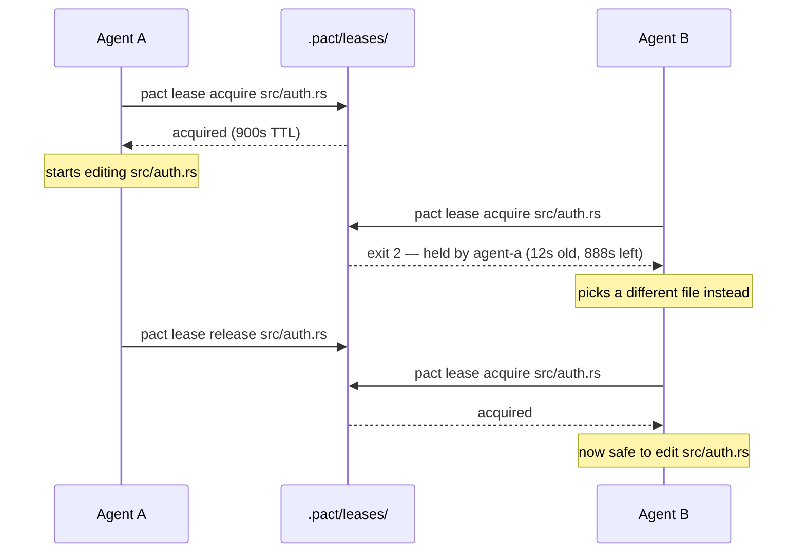
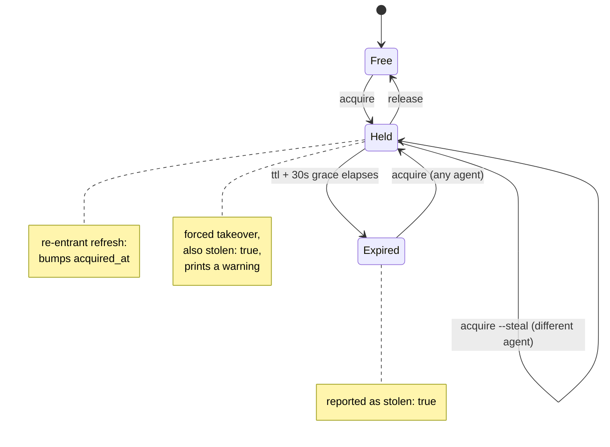

# Leases

A lease is pact's way of letting an agent say "I'm working on this file" in a
way other agents (and you) can check before stepping on it. It is **advisory**
— nothing stops an agent from editing a file it hasn't leased, the same way
nothing stops you from `git push --force` over a coworker's branch. The point
isn't to make that impossible; it's to make coordinating cheap enough that
agents actually do it.

## The shape of a lease

A lease is one JSON file: `.pact/leases/<encoded-path>.lock`, containing

```json
{
  "agent": "agent-a",
  "path": "src/auth.rs",
  "acquired_at": "2026-07-30T09:12:03Z",
  "ttl_secs": 900,
  "note": "refactoring session handling"
}
```

`<encoded-path>` replaces `/` with `__` (so `src/auth.rs` becomes
`src__auth.rs.lock`). This means a path containing a literal `__` could in
principle collide with a different path — a deliberate v1 simplification, not
an oversight; see [pact-scaffolding-prompt.md](pact-scaffolding-prompt.md).

Creating the lock file is atomic (`O_EXCL`-style creation), so two agents
racing to acquire the same lease at the same instant can't both "win" — one
gets the lease, the other gets a conflict.

## Use case: two agents, one file

You've fanned two agents out on "clean up the auth module." Neither knows
about the other's task. Without leases, they'd both edit `src/auth.rs` and
one would silently lose work. With leases:



Agent B's `acquire` fails with **exit code 2**, and the error message on
stderr names the current holder, how old the lease is, and how much TTL is
left — enough for an agent to decide whether to wait, pick different work, or
`--steal`.

## Lifecycle: expiry and stealing

A lease doesn't require its holder to still be alive. Every lease carries a
TTL (default 900 seconds) plus a fixed 30-second grace period that absorbs
clock drift between machines — a lease is only treated as expired once
`now > acquired_at + ttl + 30s`.



Three distinct paths lead to a fresh `acquire` succeeding on an already-held
lease, and pact reports which one happened:

- **Re-entrant refresh** — the same agent acquires again (e.g. re-running a
  long task). No conflict, `acquired_at` just resets. `stolen: false`.
- **Expiry** — the holder crashed, forgot to release, or its TTL genuinely
  ran out. The next `acquire` from *any* agent takes over automatically.
  `stolen: true`.
- **Forced steal** (`--steal`) — a different agent takes over a lease that
  hasn't expired yet. This always prints a warning to stderr first, because
  unlike expiry, a human or agent is choosing to override someone else's
  active claim. `stolen: true`.

## Releasing

```
pact lease release <path> [--force]
```

- Releasing a lease you hold: removes it.
- Releasing a lease you don't hold: **exit code 2**, unless `--force`.
- Releasing a path with no lease at all: succeeds — this is idempotent by
  design, so "release when you're done" never needs a preceding check.

## Listing and garbage collection

```
pact lease ls [--all]
```

Prints the active leases (holder, path, age, remaining TTL). Every
invocation of any `lease` subcommand garbage-collects expired lock files from
disk as a side effect — `ls` (without `--all`) simply doesn't show you the
ones it just swept away; `--all` shows them anyway, for the moment before
they're cleaned up.

## Why advisory, not mandatory

See the FAQ in the [README](../README.md#faq) — the short version is that a
mandatory lock just moves the failure mode from "two agents edited the same
file" to "a crashed agent left a lock nobody can clear," which is worse.
