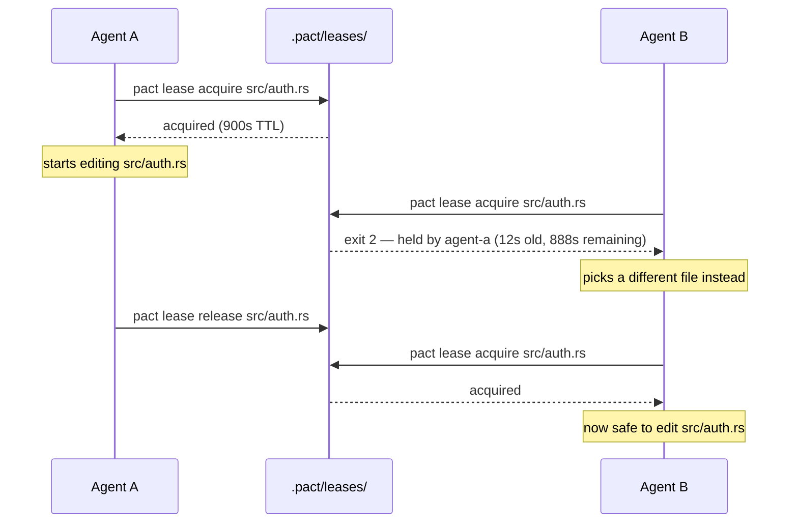

# Leases

A lease is pact's way of letting an agent say "I'm working on this file" in a
way other agents (and you) can check before stepping on it. It is **advisory**
— nothing stops an agent from editing a file it hasn't leased, the same way
nothing stops you from `git push --force` over a coworker's branch. The point
isn't to make that impossible; it's to make coordinating cheap enough that
agents actually do it.

## The shape of a lease

A lease is one JSON file: `.pact/leases/<encoded-path>.lock`, containing

```json
{
  "agent": "agent-a",
  "path": "src/auth.rs",
  "acquired_at": "2026-07-30T09:12:03Z",
  "ttl_secs": 900,
  "note": "refactoring session handling"
}
```

`<encoded-path>` replaces `/` with `__` (so `src/auth.rs` becomes
`src__auth.rs.lock`). This means a path containing a literal `__` could in
principle collide with a different path — a deliberate v1 simplification, not
an oversight.

In a repository that uses `git worktree`, two more keys appear:

```json
{
  "agent": "agent-a",
  "path": "src/auth.rs",
  "acquired_at": "2026-07-30T09:12:03Z",
  "ttl_secs": 900,
  "note": "refactoring session handling",
  "branch": "feat/auth",
  "worktree": "wt-auth"
}
```

Both are informational — nothing branches on either — and both are **absent**
rather than null in a repository with no worktrees, so those lock files stay
byte-identical to the block above. They exist because all worktrees of one
repository share a single `.pact/`, so the holder may be editing a checkout the
reader cannot see; `lease ls` grows a `WHERE` column and the exit-2 conflict
message becomes:

```
error: lease on src/api.ts is held by agent-a on branch main in worktree main
(0s old, 900s remaining); use --steal to override
```

Without the location, a reader inspects their own working copy, finds it
untouched, and concludes the lease is stale. See
[architecture.md](architecture.md#one-coordination-space-per-repository-not-per-checkout)
for how the shared directory is resolved.

### One file is one lease, however you spell the path

The lock name has to be a *canonical* answer to "which file is this", because
two names for one file means two leases on it, and two agents each told they
hold it. That is the single failure the whole surface exists to prevent, so the
spelling is normalised before anything else happens:

| You type | From | pact leases |
|---|---|---|
| `src/auth.rs` | repo root | `src/auth.rs` |
| `auth.rs` | `src/` | `src/auth.rs` |
| `../src/auth.rs` | `tests/` | `src/auth.rs` |
| `/abs/repo/src/auth.rs` | anywhere in that checkout | `src/auth.rs` |
| `/abs/main/src/auth.rs` | a linked worktree of `/abs/main` | `src/auth.rs` |

A relative path is resolved against your working directory, then `.` and `..`
are folded **lexically** — never with `canonicalize()`, because leasing a file
that does not exist yet is a documented workflow (see below) and `canonicalize`
fails on a missing path.

**Across worktrees, "however you spell it" still has a named gap.** An absolute
path (or a `..` that escapes your checkout — the same code path, since it is
made absolute before anything strips it) is matched against your own checkout's
root first and, failing that, against the shared coordination root, which for a
linked worktree is the main worktree where `.pact/` lives. Those two cover the
spelling people actually produce: a path copied out of `lease ls`'s `WHERE`
column, or out of a peer's message, and pasted from a different checkout. Before
the second candidate existed, such a path matched neither, was kept whole, and
became its own lock key — one file, two leases, both holders told they had it,
which is the exact failure this section exists to prevent.

It is not fully closed. A path spelled from a **third, non-main sibling
worktree** still matches neither root and still splits, because nothing here
enumerates every linked worktree's own checkout root (tracked as
`pact-m7j.8.7`). Until it is, spell paths relative to the checkout you are
standing in and the question does not arise.

Case is folded only where the filesystem folds it. On macOS's default APFS,
`src/auth.rs` and `src/Auth.rs` are one file and take one lease; on Linux they
are two files and take two. Lowercasing unconditionally would be a bug rather
than caution — it would manufacture a conflict between genuinely different
files. pact probes the filesystem rather than trusting git's `core.ignorecase`,
which records what git saw at clone time and can describe a different machine.

Only the lock *filename* is folded. `pact lease ls` and every error message show
the spelling you used.

### How much atomicity you actually get

All of it is conditional on the two racers having agreed on the lock key: where
the normalisation gap above bites, there is no race to win, just two locks.

Claiming a **free** path is atomic in both senses that matter. The lease is
written to a staging file first, then `hard_link`ed into place: the link is
atomic and fails if the destination exists, so only one of two racing agents
wins (the other gets exit 2) *and* the lock's name never appears before its
contents do.

That second half was learned the hard way. An earlier version used `O_EXCL`
(`create_new`) and then wrote the body, which gives exclusivity but not atomic
content: the file existed and was empty in between. A concurrent reader got
`EOF while parsing a value`, and `pact doctor` called it "1 unreadable lock file
(remove manually from `.pact/leases/`)" — advice that, followed during the
window, deletes a live agent's lock. Measured with a tight poller: 203
zero-byte observations in 300 acquire cycles under the old scheme, 0 under this
one.

**Taking over** an already-existing lock — reclaiming an expired lease,
`--steal`, and a re-entrant refresh by the current holder — can't use
`O_EXCL` on the lock file itself, because the file is already there. They
write a sibling temp file and `rename` it over the lock (atomic on one
filesystem), then **re-read the lock and confirm it names them** with the
exact timestamp they just wrote. If a concurrent takeover landed in between,
the loser sees the winner's name and exits 2 instead of falsely reporting
success.

That verify alone only narrows the race, from "everything since we read the
file" to "between our rename and our re-read" — it does not close it,
because two racers can each read the pre-takeover state before either
writes. That stopped being a hypothetical: research against the compiled
binary reproduced double- and even triple-wins via ordinary CLI-level `pact
lease acquire` races, no fault injection needed — roughly 20-30% of rounds
at 6-10 concurrent racers on one expired lock, and 2 of 30 rounds even at
just two racers. So takeovers are now serialized behind a second `O_EXCL`
guard file, held for the whole read-decide-write sequence, not just the
rename — the second racer, once it gets the guard, reads the first racer's
fresh write as current reality and makes its decision against that, not
against a snapshot that is already stale. The post-write verify stays in
place as a cheap check that the guard worked, not as the primary defense.

## Use case: two agents, one file

You've fanned two agents out on "clean up the auth module." Neither knows
about the other's task. Without leases, they'd both edit `src/auth.rs` and
one would silently lose work. With leases:



Agent B's `acquire` fails with **exit code 2**, and the error message on
stderr names the current holder, how old the lease is, and how much TTL is
left — enough for an agent to decide whether to wait, pick different work, or
`--steal`.

## Claiming several paths at once

```
pact lease acquire <path>...
```

Several paths in one `acquire` are taken **all-or-nothing**:

```
$ pact lease acquire src/parser.rs src/main.rs --note "new module + its mod line"
took 2 lease(s) for cli-wire:
  acquired src/parser.rs
  acquired src/main.rs
```

If any path is unavailable, pact rolls back the leases it took earlier *in that
same call* and returns that path's error, exit code 2:

```
$ pact lease acquire q2.rs q1.rs
error: lease on q1.rs is held by probe-peer (0s old, 60s remaining); use --steal to override
```

No lock for `q2.rs` is left behind, and `probe-peer`'s claim is untouched. The
error names the contended path, because that is the one thing the caller has to
act on — negotiate over `q1.rs`, or pick different work.

Two deliberate details:

- **Rollback never releases a lease you already held** when the call started.
  Re-running a long task refreshes its own claims; a failed multi-claim must not
  destroy a claim the agent walked in with.
- **Rollback is best-effort.** A lock that can't be removed expires on its own
  TTL, and a rollback failure must not mask the conflict the caller needs to see.

The motivating case is a new module and the line that registers it (`mod
parser;`): an agent that can't hold both atomically ends up sitting on half a
change. Note what this does *not* fix — if the registration line belongs to
another agent by assignment, being able to claim it doesn't mean you may edit it,
and then you can't compile your own file. See
[Working on a new file you can't compile yet](#working-on-a-new-file-you-cant-compile-yet).

A single path renders and serializes exactly as it always did, including
`--json` emitting the lease object rather than a one-element array.

### A lease is on a path, not on a file

`pact lease acquire src/parser.rs` succeeds when `src/parser.rs` doesn't exist
yet. That's deliberate and it's the right move for a new module — claim it while
you're still writing it, so a peer planning the same file finds out now rather
than at merge time — but nothing said so out loud, and an agent that assumed
otherwise leased the enclosing `scripts/` directory instead, which claims far
more than it meant to.

### Working on a new file you can't compile yet

Claiming the new module and its `mod` line together solves the *coordination*
half of `pact-rnc.21`. It does nothing for the *verification* half. If
`src/main.rs` belongs to another agent by assignment, you may not add
`mod parser;` to it — so your file isn't in the crate, `cargo build` never sees
it, and you cannot run the tests you just wrote. The gap is real and pact does
not close it.

What the fleet keeps rediscovering, written down once so nobody has to invent it
under time pressure: build a throwaway crate.

```bash
scratch=$(mktemp -d)
# build.rs too: this crate stamps PACT_* env vars at build time, and without it
# every compile fails with "environment variable PACT_PROFILE not defined".
cp -rf src build.rs Cargo.toml Cargo.lock "$scratch"/
# And pin it as its own workspace, or cargo walks *up* from the scratch dir and
# tries to parse whatever Cargo.toml it finds in /tmp as a parent workspace.
printf '\n[workspace]\n' >> "$scratch"/Cargo.toml
echo 'mod parser;' >> "$scratch"/src/main.rs   # the line you may not write for real
cd "$scratch" && cargo test parser
```

Both of those extra lines are here because the recipe was written without them
and did not work: the first attempt to follow it verbatim in this repo hit
`PACT_PROFILE not defined`, and the second hit a stray parent `Cargo.toml`.
A workaround nobody has run is not a workaround.

Your module compiles and its tests run in a copy nobody else is editing, the
real tree is untouched, and the owner of `src/main.rs` still adds the real
registration line when they get to it — tell them it's ready with
`pact msg send`.

**This is a workaround for a gap, not a feature**, and it should read like one.
It costs a full cold rebuild; it tests your file against a *snapshot* of a tree
your peers are actively changing, so a green result there can still be red in
the repo; and nothing reminds you to delete the scratch dir or re-run once the
`mod` line lands for real. The actual fix is a lease that can carry a named
registration point for the owning agent to apply on your behalf — option (a) of
`pact-rnc.21`, not built, tracked as `pact-v66`.

## Lifecycle: expiry and stealing

A lease doesn't require its holder to still be alive. Every lease carries a
TTL (default 2700 seconds, 45 minutes) plus a fixed 30-second grace period that
absorbs clock drift between machines — a lease is only treated as expired once
`now > acquired_at + ttl + 30s`.

That default is **calibrated, not chosen**. It was 900s until 2026-08-06, when
`pact audit` measured this repository's own 147 preserved events: median hold
842s, p90 1455s, longest 2166s — and **one renewal in the whole history**. So the
p90 agent was running 9 minutes past expiry and the longest 21 minutes past, each
one stealable while its holder was still working. The protocol asks agents to
renew; the data says they do not, once, ever. Rather than demand ceremony that is
demonstrably skipped, the default now covers the work agents actually do: 1.85x
the measured p90, 1.25x the longest hold ever recorded.

One honest limit on that evidence: there are **zero** expiry events in that
history. Holds did outrun their TTL, but no peer ever actually reclaimed one. The
bump closes a demonstrated exposure window, not a demonstrated collision.

Recalibrating is now a measurement rather than a guess, and safely so:
[`pact audit --check stale-holds`](audit.md#--check-stale-holds) judges each hold
against the TTL **it recorded**, so moving the default cannot rewrite the past.

```mermaid
stateDiagram-v2
    [*] --> Free
    Free --> Active: acquire
    Active --> Free: release / release --all
    Active --> Active: renew / acquire (same agent) / acquire --steal (other agent)
    Active --> Stale: ttl elapses
    Stale --> Free: release / release --all
    Stale --> Active: renew, or acquire (same agent)
    Stale --> Expired: a further 30s grace elapses
    Expired --> Active: acquire (any agent)
    note right of Active
        renew keeps the original
        ttl and note; --steal warns
        and reports stolen: true
    end note
    note right of Expired
        next acquire reports
        stolen: true; swept from
        disk by the next lease ls
    end note
```



Every transition in that diagram also appends a line to `.pact/events.jsonl`, so
`pact log` can show a lease that was taken and released while you weren't
looking — see [The event log](#the-event-log) below.

### The three states

`pact lease ls` labels every lease, and `pact ui` uses the same labels — one
implementation, both surfaces, so the dashboard and the CLI can't disagree.

| State | Meaning | Can another agent take it? |
|---|---|---|
| `active` | within its TTL | no (not without `--steal`) |
| `stale (reclaimable in Ns)` | past its TTL, inside the 30s grace window | not yet |
| `expired` | past TTL + 30s | yes, the next `acquire` takes it |

**`stale` is distinct from `expired` on purpose.** The 30-second grace period
exists to absorb clock drift between machines, so a lease that has merely
passed its TTL might just be a holder whose clock runs a few seconds fast. In
that window the lease is *probably* abandoned but not *provably* so, and pact
will not hand it to someone else yet. Collapsing the two would mean either
lying about reclaimability for 30 seconds, or pretending a lease that ran out
two minutes ago is still healthy. The label says which of the two you're
looking at, and how long until it changes.

The state label is derived from the same `expired` flag that garbage collection
acts on, not recomputed — so the label can never claim something the sweep
disagrees with.

### The fourth outcome: a lock file pact can't read

A lock whose `acquired_at` won't parse is treated as **epoch 0** — 1970, which
is comfortably past any TTL — so it reads as `expired` and the next `acquire`
reclaims it. The alternative, treating an unparsable timestamp as "now", would
make a corrupt file an immortal lease: nothing could reclaim it, and no agent
could ever edit that path again. Failing toward reclaimable keeps a truncated
write (a crash mid-`rename`, a half-synced filesystem) from bricking a path.

A lock that isn't valid JSON at all can't be reclaimed that way, because pact
can't tell whose it is. Those are counted separately and reported by
`pact doctor`:

```
✗ corrupt leases: 2 unreadable lock files (remove manually from .pact/leases/)
```

Deleting them is a manual step on purpose. Everything else pact garbage-collects
is a file it wrote and can still read; an unreadable one is the only case where
it can't tell an abandoned lease from a live agent's claim it merely failed to
parse, and guessing wrong silently destroys someone's lock.

### Why `lease ls` leads with age, not remaining TTL

It used to print remaining TTL first. A lease 80 seconds into a 3600s TTL
showed `3520s`, an operator read that as "this agent has held this for a long
time", and force-released a live claim. Remaining TTL is a crash-recovery
ceiling, not a duration of work: it says when pact will give up on the holder,
not how long the holder has been busy. So age leads, and `remaining_secs`
appears only inside the `stale` label, where it answers a question you can act
on. `--json` still carries every field.

Three distinct paths lead to a fresh `acquire` succeeding on an already-held
lease, and pact reports which one happened:

- **Re-entrant refresh** — the same agent acquires again (e.g. re-running a
  long task). No conflict, `acquired_at` just resets. `stolen: false`.
- **Expiry** — the holder crashed, forgot to release, or its TTL genuinely
  ran out. The next `acquire` from *any* agent takes over automatically.
  `stolen: true`.
- **Forced steal** (`--steal`) — a different agent takes over a lease that
  hasn't expired yet. This always prints a warning to stderr first, because
  unlike expiry, a human or agent is choosing to override someone else's
  active claim. `stolen: true`.

## Renewing a long task's lease

```
pact lease renew <path>
```

A task that takes longer than its TTL silently loses its claim: the agent is
still editing, but the lease has expired and the next `acquire` from anyone
else succeeds. `renew` refreshes `acquired_at` in place, keeping the original
TTL and note, so an agent doing a long job can hold on without re-stating what
it's doing:

```
$ pact lease renew src/main.rs
renewed lease on src/main.rs for cli-wire (30m0s ttl)
```

Two deliberate refusals:

- **No lease on that path**: an error, not a fresh claim. A typo'd path must
  not quietly acquire something you never asked for.
- **Held by another agent**: **exit code 2**, same as a conflicting `acquire`.
  `renew` is for extending your own claim, never for taking one.

`acquire` on a path you already hold does the same refresh, so `renew` isn't
strictly new capability — it's the version that can't accidentally create a
lease, and it's discoverable in `pact lease --help`, which was the actual
complaint.

## Releasing

```
pact lease release <path> [--force]
pact lease release --all
```

- Releasing a lease you hold: removes it.
- Releasing a lease you don't hold: **exit code 2**, unless `--force`.
- Releasing a path with no lease at all: succeeds — this is idempotent by
  design, so "release when you're done" never needs a preceding check.

`--force` succeeds where you don't hold the lease, and when it destroys a
*different* agent's live claim it says so on stderr — mirroring
`acquire --steal`, because both are a human or agent overriding someone else's
active work:

```
warning: force-released other.rs — destroyed agent-a's live claim; they were
not notified (`pact msg send --to agent-a`)
```

pact does not send that notification itself. It would need `bd`, it can fail,
and a release must not die because a notification did. The warning names the
command instead. `--json` carries the same fact for scripted callers, which is
why `release --json` emits an object rather than a bare path:

```json
{ "path": "other.rs", "displaced": "agent-a" }
```

`displaced` is `null` when you released your own claim.

`--all` releases every lease the calling agent holds, in one call, and prints
what it released:

```
$ pact lease release --all
released 2 lease(s):
  docs/leases.md
  README.md
```

Holding nothing is success with an empty list (`<agent> held no leases`), so
"release everything I hold" is safe to run unconditionally at the end of a
task. This exists because an agent holding several files would release some and
announce all of them — the failure that motivated it took an hour to become
visible.

**It reports only the leases you genuinely held.** An already-expired lease was
nobody's, so calling its removal a "release" is the same overstatement the
command was written to fix. Those lock files are still deleted from disk —
leaving them would leak a lock nobody owns — they're just logged as what actually
happened (an `expired` event) rather than counted as releases. One consequence
worth knowing: an agent whose only leases had expired now correctly gets
`<agent> held no leases`, which reads like a bug and isn't. `--all` is mutually exclusive with a path (clap rejects the
combination) and with `--force`, which is meaningless when you only touch your
own claims.

## Listing and garbage collection

```
pact lease ls [--all]
```

Prints the active leases: path, holder, age, state, and the holder's `--note`.
The note is there because "what is this agent doing" is the question you have
immediately before reaching for `--force`, and the CLI used to answer it with
silence.

Listing garbage-collects expired lock files from disk as a side effect — `ls`
(without `--all`) simply doesn't show you the ones it just swept away; `--all`
shows them anyway, for the moment before they're cleaned up.

**Only `lease ls` and `acquire` collect.** Read-only commands used to inherit the
sweep, because they all went through the same listing function: `pact agents`,
`pact msg send`'s recipient check, `pact doctor`, and worst of all `pact ui`,
whose refresh timer unlinked expired locks every tick. Asking the same question
twice gave two different answers. Those callers now use a non-mutating read, so a
question that looks read-only is read-only. `pact doctor` now reports stale
leases as ``<n> stale (`pact lease ls` collects them)`` for the same reason:
after the fix, calling them garbage-collected would have been a lie.

## The event log

`.pact/events.jsonl` records one JSON line per lease transition — `acquired`,
`renewed`, `released`, `stolen`, `force-released`, `expired` — with the agent,
the path, and a free-text detail (the `--note`, or the displaced holder's name).
`pact log` reads it.

It exists because lease history genuinely cannot be derived: `lease ls` shows
only the instantaneous set, and **releasing a lease deletes the only record of
it**. A lease taken and dropped while you looked away left no trace at all.

What keeps it small:

- **Lease events only.** Message events are derivable from `bd` and are
  deliberately *not* duplicated here.
- **Writing can't fail the lease.** Appending is infallible by signature; a
  logging error is swallowed, because a lease operation that failed because
  logging failed would be a coordination bug.
- **Bounded.** Past 5000 lines the file is rewritten with the newest 4000. No
  rotation, no index, no sidecar state. At roughly 150 bytes a line it stays
  under a megabyte.
- **Corrupt lines are skipped**, not fatal, exactly as an unparsable lock file
  is skipped. A missing file is an empty feed.

The `expired` event is the one whose `agent` didn't run the command that wrote
it: a lapse is noticed by whoever collects the lock, and the event belongs to the
holder whose claim ended. Without it, the feed's last word on a dead agent was
`acquired` — naming it as current holder of a file whose lock was already gone.

## What lease telemetry measures

Only in a build with `--features otel`, and only once a collector is configured
— see [docs/telemetry.md](telemetry.md). Nothing below changes any output, any
flag, or any exit code.

| Metric | Type | Attributes |
|---|---|---|
| `pact.lease.transitions` | counter | `pact.lease.outcome` |
| `pact.lease.hold.duration` | histogram, ms | `pact.lease.outcome`, `pact.lease.overrun` |
| `pact.lease.wait.duration` | histogram, ms | *(none)* |

`pact.lease.outcome` is one of `acquired`, `renewed`, `released`,
`force_released`, `stolen`, `reclaimed`, `expired`, `conflicted`,
`rolled_back`. Each increment sits next to the `log_event` for the same
transition, so the feed and the metric cannot disagree about what happened.

Two things the metric says that the event log cannot:

- **`reclaimed` and `stolen` are separate outcomes.** The event log writes both
  as `stolen`, and only the free-text `detail` distinguishes taking over a dead
  claim from overriding a live one — which nobody can group by. A fleet retro
  hand-counted "19 acquires / 19 releases / 0 steals" from exactly that
  ambiguity.
- **`pact.lease.overrun`** is true when a claim outlived the TTL its holder
  promised. Note that `renew` resets `acquired_at`, so a renewed lease reports
  time-since-last-renew — which is also exactly what `overrun` should mean, since
  a renewed lease has not broken its promise.

**Neither the path nor an agent name is a metric attribute.** `pact.path` is on
the `pact.lease.acquire` and `pact.lease.release` spans; the peer is in
`pact log`. A repo has thousands of files, a fleet mints agent names forever,
and nothing ages a metric series out.

### `.pact/waits/` — how a wait gets measured across two processes

`pact.lease.wait.duration` is the gap between being refused a path and finally
getting it, and pact exits in between. So a refused acquire drops a breadcrumb:

```
.pact/waits/<agent>__<path>.wait
```

Its mtime is the moment of the conflict and its contents name the agent that
blocked you (written so the directory is readable by a human, never exported).
The next successful acquire of the same path by the same agent consumes it.

It cannot live in `.pact/events.jsonl` instead: a refused acquire writes no
event, and adding one would make the **blocked** agent the answer to
`events::owner_of`, so `pact msg send --to-owner-of` would start routing mail
to the agent that *lost* the file.

Both the directory and the markers are created only in an `otel` build —
telemetry compiled out means no filesystem work at all. `release --all` sweeps
any markers you left behind, because a conflict you never retried would
otherwise leak one small file per `(agent, path)` forever — and not retrying is
exactly what the protocol tells a blocked agent to do. `lease ls` and
`pact doctor` do not see these files; they only look at `*.lock`.

## Why advisory, not mandatory

See the FAQ in the [README](architecture.md#what-pact-deliberately-doesnt-do) — the short version is that a
mandatory lock just moves the failure mode from "two agents edited the same
file" to "a crashed agent left a lock nobody can clear," which is worse.
