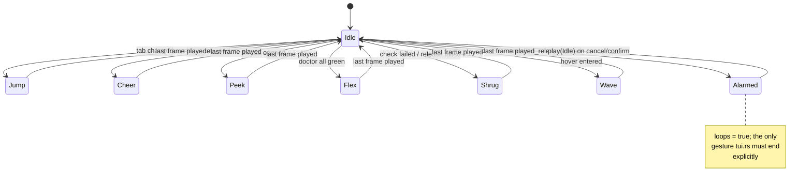

# pact ui mascot — character sheet and choreography

The mascot is a small friendly blob that lives in the corner of `pact ui` and
reacts to what you do. This file is the animation spec: it is the source of
truth for the art, the timings and the gesture-per-event mapping. `src/mascot.rs`
transcribes it; `src/tui.rs` triggers it.

The API it plugs into is frozen in the task brief (`Mascot::new/play/tick/
next_frame_in/frame/gesture`, `ART_WIDTH = 16`, `ART_HEIGHT = 5`). Nothing here
changes a signature.

## How to read the frames (implementers: read this first)

- **Every frame block below is exactly 5 lines.** Each frame's header says which
  of the 5 rows are blank (`rows 2-5`, `rows 4-5`, …). If your editor eats
  trailing blank lines when you copy a block, put them back — a blank row is
  real art, it is how the creature moves up and down inside a fixed-height box.
- **Widest line in this whole document is 13 columns**, so every frame fits
  `ART_WIDTH = 16` with room to spare. Do not centre or pad frames at render
  time; the leading spaces in the art are the horizontal position.
- **The art contains backslashes** (`\_/`, `\|`, `|/`, `/   \`, `\.---./`).
  In a normal Rust string literal each one must be written `\\`. Either double
  every backslash or — easier and less error-prone — use raw strings:

  ```rust
  const IDLE_2: [&str; 5] = ["", "   .-----.", "   |o   o|", r"  -|  -  |-", "   '-^-^-'"];
  ```

  There are **no double quotes** anywhere in the art, so `r"..."` is always safe.
- No non-ASCII anywhere. No tabs. Trailing spaces are never significant: every
  line ends at its last visible glyph.

## The creature

One silhouette, reused by every gesture, so it always reads as the same animal:

```
   .-----.
   |o   o|
  -| \_/ |-
   '-^-^-'
```

- `.-----.` skull cap, `'-^-^-'` bottom edge with two little feet
- `|o   o|` eyes, `\_/` smile, `-` neutral mouth, `~` unsure mouth, `o` open mouth
- eye vocabulary: `o` open, `-` blinked/shut, `^` happy squint, `O` alarmed wide
- the arms are the two characters that stick out of the body sides on one row:
  `-|`/`|-` at rest, `\|`/`|/` raised, `<|`/`|>` flexed, `_|`/`|_` palms-up shrug,
  and a lone `/` past the right edge for a wave

**Volume, not scale.** Squash and stretch are done by trading height for width
so the creature never looks like it changed size:

| form | interior width | body rows | used for |
|---|---|---|---|
| stretch | 3 (`o o`) | 5 | launch, mid-air rise |
| rest | 5 (`o   o`) | 4 (rows 2-5) | idle inhale, all settles |
| breath-squash | 5 | 3 (rows 3-5) | idle exhale |
| squash | 7 (`o     o`) | 3 (rows 3-5) | recover, shrug hold, flex chest |
| deep squash | 7 | 2 (rows 4-5) | crouch, landing impact |

Off-the-ground frames get a shadow line on row 5 (`-----`, shrinking to `---`
at the apex). That shadow is the only reason the jump reads as height rather
than as the creature growing.

---

## Idle

**Loops: yes. 4 frames, 800 / 800 / 160 / 500 ms (2260 ms cycle).**
Intent: *settle that never fully stops.* A slow breath (squash on the exhale,
rest on the inhale) plus one blink at the top of the cycle. The exhale frame is
deliberately the **first** frame, because every one-shot gesture falls back into
Idle from a `rest`-shaped settle frame — landing on the squash reads as one last
breath out instead of a pop.

### Idle 1 — exhale, breath-squash (rows 3-5), 800 ms

```


   .-----.
  -|o - o|-
   '-^-^-'
```

### Idle 2 — inhale, rest (rows 2-5), 800 ms

```

   .-----.
   |o   o|
  -|  -  |-
   '-^-^-'
```

### Idle 3 — blink (rows 2-5), 160 ms

```

   .-----.
   |-   -|
  -|  -  |-
   '-^-^-'
```

### Idle 4 — eyes open, hold (rows 2-5), 500 ms

Identical art to Idle 2; it is a separate frame so the blink is a flick and not
a stare.

```

   .-----.
   |o   o|
  -|  -  |-
   '-^-^-'
```

**Trigger:** nothing happening — the default state, and the fallback every
one-shot returns to.

---

## Jump

**Loops: no. 7 frames, 90 / 70 / 90 / 130 / 80 / 110 / 120 ms (690 ms).**
Intent: a real jump arc, not two frames of teleporting.

1. **anticipation** — deep crouch, wide and flat, eyes squinted with effort. The
   crouch is the frame that sells the jump; it is short (90 ms) but it is there.
2. **launch** — full stretch, interior narrowed to 3, arms trailing down, mouth
   open. Tall + thin immediately after short + wide is the squash/stretch pair.
3. **rise** — body at the top of the box, feet tucked (`-v-`), arms thrown up,
   full-size shadow on the ground.
4. **apex / overshoot** — the hang. Widest frame of the airborne set (float),
   happy eyes, and the longest hold (130 ms) so the top of the arc has weight.
   The shadow shrinks to `---`: the creature is at its highest.
5. **descend** — arms still up, legs reaching down (`/   \`), mouth back to
   neutral. Anticipating the ground.
6. **impact** — deep squash again, eyes shut. Same form as the crouch, different
   face: this one got hit by the floor.
7. **recover** — mid squash, eyes open, on its way back up to rest.

Then Idle takes over on its exhale frame, which finishes the settle.

### Jump 1 — anticipation crouch (rows 4-5), 90 ms

```


  .-------.
 -|^  -  ^|-
```

### Jump 2 — launch, full stretch (rows 1-5), 70 ms

```
    .---.
    |o o|
    | O |
   -|   |-
    '-^-'
```

### Jump 3 — airborne, rising (rows 1-4 + shadow), 90 ms

```
    .---.
   \|o o|/
    | O |
    '-v-'
    -----
```

### Jump 4 — apex, hang and float (rows 1-4 + small shadow), 130 ms

```
   .-----.
  \|^   ^|/
   | \_/ |
   '--v--'
     ---
```

### Jump 5 — descend, legs reaching (rows 2-5), 80 ms

```

    .---.
   \|o o|/
    | - |
    /   \
```

### Jump 6 — impact, deep squash, eyes shut (rows 4-5), 110 ms

```


  .-------.
 -|-  _  -|-
```

### Jump 7 — recover (rows 3-5), 120 ms

```


  .-------.
 -| o - o |-
  '--^-^--'
```

**Trigger:** the active tab actually changed (`Tab`, `Shift+Tab`, `1`/`2`/`3`,
or a click on a tab label). Why it fits: switching tabs is the one interaction
that moves the whole screen. The mascot hops with you — the biggest gesture for
the biggest change of context.

---

## Wave

**Loops: no. 5 frames, 120 / 100 / 100 / 110 / 150 ms (580 ms).**
Intent: *anticipation then a flick.* The right arm lifts once (frame 1), then
the hand alternates between the shoulder row and above the head twice. The body
never moves; only the arm does, which is what makes it read as a wave and not a
lean. Ends on a rest frame with a smile — a settle, not a hard cut.

### Wave 1 — arm lifting, anticipation (rows 2-5), 120 ms

```

   .-----.
   |o   o|/
  -| \_/ |
   '-^-^-'
```

### Wave 2 — hand up (rows 2-5), 100 ms

```

   .-----./
   |^   ^|
  -| \_/ |
   '-^-^-'
```

### Wave 3 — hand down, happy eyes (rows 2-5), 100 ms

```

   .-----.
   |^   ^|/
  -| \_/ |
   '-^-^-'
```

### Wave 4 — hand up again (rows 2-5), 110 ms

```

   .-----./
   |^   ^|
  -| \_/ |
   '-^-^-'
```

### Wave 5 — settle, arms down, smile (rows 2-5), 150 ms

```

   .-----.
   |o   o|
  -| \_/ |-
   '-^-^-'
```

**Trigger:** hover moves onto a tab or a row *from nothing hovered*
(`hovered_tab`/`hovered_row` going `None -> Some`). Why it fits: hover is "hello,
I noticed you". A wave is the smallest possible acknowledgement, and it must
never fire on every `MouseEventKind::Moved` — see the implementation notes.

---

## Cheer

**Loops: no. 5 frames, 90 / 120 / 200 / 110 / 160 ms (680 ms).**
Intent: a jump's cousin with both arms thrown over the head. Coil, up, apex with
two sparks, down, settle. Lower and slower than Jump — it is joy, not effort —
and the apex holds 200 ms so the sparks are readable.

### Cheer 1 — coil, squash, eyes squinted (rows 3-5), 90 ms

```


  .-------.
 -| ^ - ^ |-
  '--^-^--'
```

### Cheer 2 — up, arms over head (rows 1-4 + shadow), 120 ms

```
   \.---./
    |o o|
    | O |
    '-v-'
    -----
```

### Cheer 3 — apex with sparks (rows 1-4 + shadow), 200 ms

```
 . \.---./ .
    |^ ^|
    | O |
    '-v-'
    -----
```

### Cheer 4 — coming down, arms still up (rows 2-5), 110 ms

```

   \.---./
    |^ ^|
    | - |
    /   \
```

### Cheer 5 — settle, smile (rows 2-5), 160 ms

```

   .-----.
   |^   ^|
  -| \_/ |-
   '-^-^-'
```

**Trigger:** a lease was released successfully (`release`/`force-release` returns
`Ok`). Why it fits: releasing a lease is the one action in the whole UI that
unblocks another agent. It is the good ending — the only event that deserves
both arms in the air.

---

## Peek

**Loops: no. 5 frames, 120 / 130 / 260 / 130 / 150 ms (790 ms).**
Intent: curiosity as a scoot, not a teleport. Eyes flick right first
(anticipation), then the whole body slides two columns over and leans on one arm
to read what just opened, holds (260 ms — long enough to look like reading),
scoots back, settles. Note frames 2-4 move the body horizontally: that is the
only gesture that does, so it is unmistakable.

### Peek 1 — eyes flick right (rows 2-5), 120 ms

```

   .-----.
   | o  o|
  -| \_/ |
   '-^-^-'
```

### Peek 2 — scoot two columns over, arm out for balance (rows 2-5), 130 ms

```

     .-----.
    -|  o o|
     |  o  |
     '-^-^-'
```

### Peek 3 — hold, brow up, one eye wide (rows 2-5), 260 ms

```

     .--^--.
    -|  O o|
     |  o  |
     '-^-^-'
```

### Peek 4 — scoot back, still surprised (rows 2-5), 130 ms

```

   .-----.
   |o   o|
  -|  o  |-
   '-^-^-'
```

### Peek 5 — settle, neutral (rows 2-5), 150 ms

```

   .-----.
   |o   o|
  -|  -  |-
   '-^-^-'
```

**Trigger:** a message thread was opened (`open_selected_thread` returns `Ok`).
Why it fits: opening a thread is the mascot's neighbour reading over your
shoulder. Peeking is nosy in exactly the right way, and the horizontal scoot
points at the pane that just appeared.

---

## Flex

**Loops: no. 5 frames, 130 / 110 / 300 / 130 / 160 ms (830 ms).**
Intent: overshoot then hold. Coil (frame 1), then the chest snaps to the widest
form in the sheet with the arms bent up (`<|` `|>`) — that snap is the overshoot.
Frame 3 holds the pose for 300 ms with a spark over the shoulder, then it
relaxes back through rest. Longest gesture in the sheet, because a green doctor
report is worth showing off.

### Flex 1 — coil, breath-squash (rows 3-5), 130 ms

```


   .-----.
  -|^ - ^|-
   '-^-^-'
```

### Flex 2 — chest out, arms bent, overshoot (rows 2-5), 110 ms

```

  .-------.
 <|o     o|>
  |  \_/  |
  '--^-^--'
```

### Flex 3 — hold the pose, spark (rows 2-5), 300 ms

```
            *
  .-------.
 <|^     ^|>
  |  \_/  |
  '--^-^--'
```

### Flex 4 — relax back toward rest (rows 2-5), 130 ms

```

   .-----.
   |^   ^|
  -| \_/ |-
   '-^-^-'
```

### Flex 5 — settle, neutral (rows 2-5), 160 ms

```

   .-----.
   |o   o|
  -|  -  |-
   '-^-^-'
```

**Trigger:** doctor refreshed and every check passed (`report.healthy == true`).
Why it fits: "everything is green" is the mascot's own health report. Flexing is
the only gesture that is about the mascot rather than about your last keypress.

---

## Shrug

**Loops: no. 4 frames, 140 / 160 / 380 / 200 ms (880 ms).**
Intent: no bounce at all — the anti-gesture. Mouth goes unsure (`~`), arms rise
palms-up (`_|` `|_`), the head sinks *into* the body (squash, but downward and
slow instead of springy), holds 380 ms, then the arms drop. Nothing overshoots;
that flatness is the point. Same silhouette, zero energy.

### Shrug 1 — mouth goes unsure (rows 2-5), 140 ms

```

   .-----.
   |o   o|
  -|  ~  |-
   '-^-^-'
```

### Shrug 2 — arms up, palms out (rows 2-5), 160 ms

```

   .-----.
  _|o   o|_
   |  ~  |
   '-^-^-'
```

### Shrug 3 — head sinks in, hold (rows 3-5), 380 ms

```


  .-------.
 _| o ~ o |_
  '--^-^--'
```

### Shrug 4 — arms drop, settle, neutral (rows 2-5), 200 ms

```

   .-----.
   |o   o|
  -|  -  |-
   '-^-^-'
```

**Triggers (two):**

- doctor refreshed and any check failed (`report.healthy == false`)
- a lease release failed (`release failed: …` written into `status`)

Why it fits both: both are "that did not work, and it is not your fault and not
mine". A shrug says *unknown/failed* without the alarm of `Alarmed`, which is
reserved for the one genuinely dangerous state.

---

## Alarmed

**Loops: yes. 3 frames, 160 ms each (480 ms cycle).**
Intent: a vibration, not a pose. Eyes blow open (`O   O`), arms fly up, mouth
opens, and the whole body jitters one column right and back while a `!` flashes
above the head — the flash is on frames 1 and 3, off on frame 2, so the loop
reads as a pulse. A sweat drop (`,`) appears on frame 3.

**Alarmed is the only non-Idle gesture that loops**, because the state it
represents (`confirm_release == Some(_)`) persists until the user resolves it.
See the implementation notes: `tui.rs` must explicitly `play(Gesture::Idle)`
when the confirmation is cancelled or consumed, otherwise the mascot keeps
vibrating forever.

### Alarmed 1 — eyes wide, arms up, `!` on (rows 1-5), 160 ms

```
       !
   .-----.
  \|O   O|/
   |  o  |
   '-^-^-'
```

### Alarmed 2 — jitter one column right, `!` off (rows 2-5), 160 ms

```

    .-----.
   \|o   o|/
    |  o  |
    '-^-^-'
```

### Alarmed 3 — back left, `!` on, sweat drop (rows 1-5), 160 ms

```
       !
   .-----. ,
  \|O   O|/
   |  o  |
   '-^-^-'
```

**Trigger:** force-release confirmation armed (`confirm_release` becomes
`Some(_)`). Why it fits: this is the only moment in `pact ui` where the next
keypress overrides another agent's claim. The status line already turns yellow;
the mascot doing a full-body panic is a second, pre-attentive channel for
"careful". It keeps pulsing exactly as long as the armed state lasts.

---

## Trigger table

| UI event (in `src/tui.rs`) | Gesture | Why |
|---|---|---|
| `set_tab` actually changes `app.tab` (Tab / BackTab / `1`,`2`,`3` / tab-label click) | `Jump` | biggest screen change gets the biggest move |
| `lease::release(..)` returns `Ok` (own or forced) | `Cheer` | unblocks another agent: the good ending |
| `confirm_release` becomes `Some(_)` | `Alarmed` | only destructive-to-others state in the UI; loops while armed |
| `open_selected_thread` returns `Ok` | `Peek` | reading over your shoulder; scoots toward the new pane |
| `refresh_doctor` and `report.healthy` | `Flex` | all green is the mascot's own good news |
| `refresh_doctor` and `!report.healthy` | `Shrug` | unknown/failed, without alarm |
| `lease::release(..)` returns `Err` | `Shrug` | same "did not work" as a failing check |
| `hovered_tab`/`hovered_row` goes `None -> Some` | `Wave` | acknowledgement, cheapest possible |
| nothing | `Idle` | breathing loop |

## Fallback state diagram



Any `play(g)` interrupts whatever is on screen from frame 0 — no blending, no
queue. Later event wins; that is correct for a reactive mascot (the newest thing
the user did is the thing worth reacting to).

## Implementation notes

For `mascot-dev` (`src/mascot.rs`):

- Per-frame durations differ inside a gesture (hang time at an apex, long holds
  on Shrug/Flex/Peek). A frame is a `(u64 /* ms */, [&str; 5])` pair; a gesture
  is a slice of those plus a `loops: bool`.
- `frame()` returns the current frame's 5 lines. Blank rows are `""`.
- `next_frame_in` should return the remaining time of the current frame; when a
  non-looping gesture is on its last frame, returning `None` after the fallback
  to Idle has happened is fine, but Idle itself always has a next frame, so in
  practice `Some(..)` is the normal answer.
- `tick` returning `true` on the Idle 2 -> Idle 4 boundary is harmless (same art,
  one wasted redraw every ~2 s). If you want, compare art pointers and report
  `false` — cosmetic, not required.

For `tui-dev` (`src/tui.rs`):

- **Poll timeout.** `run_event_loop` currently sizes the timeout from
  `REFRESH_INTERVAL - last_refresh.elapsed()`. If that is not `min`-ed with
  `mascot.next_frame_in(now)`, every animation runs at 1 fps. That single line is
  the difference between "cool mascot" and "broken mascot".
- **`set_tab` early-returns** when the tab is unchanged, so pressing `1` while
  already on Leases must *not* Jump. Trigger from the branch that actually
  changes `self.tab`, not from the keybinding.
- **Hover floods.** `MouseEventKind::Moved` fires continuously. Wave must fire
  only on the `None -> Some` edge (and `play` restarts a gesture, so re-firing
  while Wave is already playing would freeze it on frame 0 forever). Compare the
  previous `hovered_tab`/`hovered_row` against the new one inside `update_hover`.
- **Alarmed needs an explicit exit**: `play(Gesture::Idle, now)` in
  `cancel_confirm` and wherever `confirm_release` is consumed by the second
  press. The Cheer/Shrug that follows a forced release also clears it naturally —
  just make sure the cancel path is not the one you forget.
- **Layout.** The header's inner area is 1 row tall, so a 5-row mascot cannot
  live there. Give it its own rect: split `chunks[1]` horizontally and keep the
  mascot on the right (16 columns wide + whatever border you add, 5 rows tall,
  bottom-aligned so it sits on the status line like a floor).
  **Careful:** `app.content_area` is recorded for hit-testing (`row_at`,
  `rect_contains`, `click_lease_row`). It must keep pointing at the *list* rect
  only. If the mascot's columns end up inside `content_area`, clicks on the
  mascot will select rows and the hover highlight will drift — exactly the bug
  the exact-rect work in `tab_rects` was done to avoid.
- Terminals under ~40 columns: drop the mascot rect entirely rather than
  clipping it. A half-drawn creature reads as corruption.
