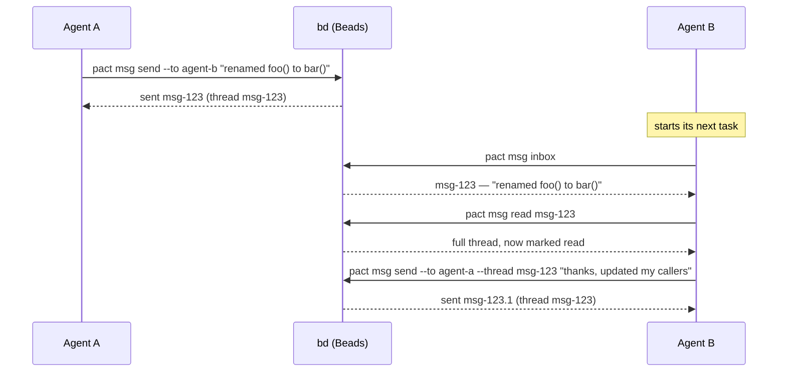
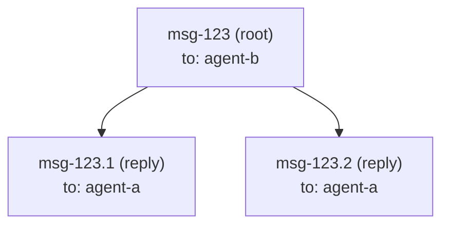

# Messaging

`pact msg` lets one agent hand context to another — "I renamed this
function," "here's why I made that call," "your turn" — without a human
relaying it in chat. Under the hood, a message is just a
[Beads](https://github.com/gastownhall/beads) issue of type `message`; pact
doesn't run its own message store.

## Use case: an interface change

Agent A is refactoring an internal API; Agent B is working on a caller of
that same function in a different part of the codebase. Agent A finishes
first:



`pact msg inbox` at the start of a task is exactly the habit the `pact init`
protocol block asks every agent to build — that's the entire point of having
a shared inbox instead of a chat log only a human reads.

## How a message maps to a Beads issue

`pact msg send --to agent-b --subject "..." "body"` runs, roughly:

```
bd create --type=message --title=<subject> --description=<body> \
           --assignee=agent-b --actor=agent-a --json
```

| Message concept | Beads field |
|---|---|
| recipient (`--to`) | `--assignee` |
| sender (`from`) | `--actor` on the way out, `created_by` on the way back |
| subject | `--title` (defaults to the first line of the body, truncated, if omitted) |
| body | `--description` |
| thread | the root message's own issue id |
| reply | a child issue, linked via `--parent <thread-id>` |
| read state | a `read-by-<agent>` label on the message bead, one per reader |

Every `bd create` pact runs passes `--no-inherit-labels`. Without it a child
inherits its parent's labels, so a reply to a message you had already read would
be born carrying your own `read-by-` label and arrive pre-read. (br doesn't have
the flag and doesn't need it — see [Two backends, two argv](#two-backends-two-argv).)
Every `bd create` also passes `--force`, which sounds alarming and isn't: its
only effect is to accept an id that doesn't start with this project's bd prefix,
which pact's message ids deliberately don't — see
[A retried send lands on the same bead](#a-retried-send-lands-on-the-same-bead).

### The `from` field

pact always passed the sender as `--actor`, but for a while it never read it
back, so `inbox` and `read` showed a message with no author. Agents identified
senders by recognising prose style in the body — which fails exactly when it
matters, on a short handoff from one of five peers.

`Message.from` is now populated on every path (`inbox`, `read`, and the
`Message` returned by `send`) from bd's `created_by`, and it is passed through
**verbatim without validation**. That matters: for a message sent through pact
it is the pact agent name (`tui-dev`), but a message bead created outside pact
carries whatever bd recorded — often a git user name (`Ada Lovelace`). A bead
with no recorded author yields an empty string, which renders as `?`. So `from`
is a useful label, not a guaranteed pact identity — don't feed it back into
`--to` without checking it against `pact agents`.

A reply (`pact msg send --thread <id> ...`) passes `--parent=<id>`, which
Beads records as a `parent-child` dependency. `pact msg read <id>` then
reconstructs the thread by fetching the root (`bd show <id> --json`) and its
direct children (`bd list --parent <id> --include-infra --json`), merging
both by `created_at`.



### Why not `bd show --thread`?

Beads' own `bd show <id> --thread` flag looks purpose-built for exactly this,
and it was the first thing tried. In the version of `bd` pact targets,
though, it only ever prints the single issue you asked for — it doesn't
actually walk parent-child replies into a conversation. That was confirmed by
creating a root message and a reply against a scratch database and comparing
`--thread` output against `bd list --parent <id> --include-infra --json`
(which *does* return the reply correctly). Rather than depend on a flag that
doesn't do what its name promises, pact reconstructs threads itself from the
parent-child links, which are reliable.

`bd list` also has no `--type` filter, so `pact msg inbox` fetches everything
assigned to you (`bd list --assignee=<agent> --include-infra --json`,
`--include-infra` because message issues are otherwise hidden from `bd list`
by default) and filters to `issue_type == "message"` on pact's side.

## Who a backend write is attributed to

Every mutating call pact makes passes `--actor=<agent>`, so a bead operation is
recorded against the agent that caused it rather than against whoever owns the
checkout. Without it, a fleet of twenty agents produces a bead history entirely
attributed to one human, and the audit trail cannot answer the one question it
exists for.

Both backends accept the same flag, checked by running them rather than read off
a version number:

| Backend | Mechanism | Precedence it documents |
|---|---|---|
| `bd` 1.1.2 | `--actor <string>` | `--actor` > `$BEADS_ACTOR` > `git user.name` > `$USER` |
| `br` 0.2.19 | `--actor <ACTOR>` | also has a richer per-agent scheme: `BR_AGENT_NAME`, `BR_HARNESS`, `BR_MODEL` |

pact uses the flag on both rather than br's env-var scheme, because one mechanism
that works everywhere beats two that have to be kept in step. `pact doctor`'s
**Beads CLI** line says which of the two it found, in either direction — the
question gets asked when a trail already looks wrong, and an absent line answers
nothing.

What this is **not** doing: setting `git config user.name`. That would mutate a
checkout other agents share in order to fake attribution for one of them, which
is the opposite of an audit trail — and in a worktree fleet the checkout being
mutated belongs to somebody else entirely.

Where it lands differs by verb, which is worth knowing before trusting a query.
Measured on `bd` 1.1.2:

| Verb pact issues | Attribution recorded |
|---|---|
| `create` (a message) | the bead's `created_by` field |
| `label add` (marking read) | accepted, but bd logs no interaction for label changes |

So a message's author is attributable today and a *reader* is not, through no
fault of pact's — the flag is passed either way, so if bd starts logging label
changes the attribution is already correct rather than needing a second pass. The
canary asserts the part that is observable: a message sent as `canary-a` must come
back with `created_by: canary-a` while the scratch repo's git user is deliberately
something else.

## Two backends, two argv

pact speaks to either Beads CLI: `bd` (Go, embedded Dolt) or `br` (beads-rust,
SQLite). Which one it uses is decided by the store on disk, not by preference —
see [install.md](install.md). The messaging *model* is identical on
both: message-typed beads, `--parent` threads, `read-by-<agent>` labels. The
argv is not, and the differences are the whole of `pact-l94`. Each was found by
running `br` 0.2.19, not inferred from bd's documentation.

| What pact needs | `bd` | `br` |
|---|---|---|
| list message beads | `list --include-infra --json` | `list --json --type=message` |
| don't inherit read labels | `--no-inherit-labels` | flag rejected, and unnecessary |
| shape of `list --json` | a bare array | `{"issues": […], "total": …}` |
| a message's replies | `list --parent=<id> --include-infra --json` | `dep list <root> --direction up --json` |
| survive a retried send | `--id=<content hash>` + `--force` on a thread root | no primitive at all — retries still duplicate |

Two of those are worth more than a table row:

- **`--no-inherit-labels` isn't missing on br, it's moot.** br rejects the flag
  outright (`error: unexpected argument`), and the obvious response — emulate it
  — would be wasted work: a br child is born with no labels at all, so the bug
  the flag prevents (a reply arriving pre-read) cannot happen there. pact omits
  it on br and keeps it on bd.
- **`br list` omits `parent` and has no `--parent` filter**, which is the one
  divergence that could have shipped as a quietly half-broken inbox: every reply
  would report itself as its own thread root, and `msg read` would find no
  replies. `br show --json` does carry `parent`, so a thread's root is found the
  same way it is on bd. Its replies are a separate, fresh `dep list <root>
  --direction up --json` query every time — not `show`'s own `dependents`
  field, which is a snapshot from whenever the root was fetched and stayed
  wrong about a reply created after that fetch until something re-fetched the
  root (`pact-m7j.6.1`). So on br every listing is one query for the ids
  (`dep list`) plus one `show` to hydrate the records — two subprocesses, but
  always current. The alternative, deriving parents from br's `<id>.<n>` id
  shape, would be pact guessing at another tool's id format.

The retry row is the newest divergence, and the only one where br is left
materially worse off rather than merely different — it gets
[its own section](#a-retried-send-lands-on-the-same-bead).

`--type` is the one place br is *ahead*: the filter bd lacks, so on br the
message-bead filter happens in the backend rather than in pact.

`pact doctor` names the backend it picked, so a puzzling `msg` result starts
with a one-line answer to "which database am I even looking at":

```
✓ Beads CLI: br (br 0.2.19)
✓ Beads CLI: bd (bd version 1.1.2 (20e493e56))
```

## One send is one thread, however many recipients

```
pact msg send --to cli-wire --to tui-dev --to human --subject "…" --body-file -
```

`--to` repeats. All the recipients' messages are stitched into a single
conversation — the first recipient's bead is the thread root, and every other
recipient's is created with `--parent=<thread root>` — so `pact msg read <root>`
returns the whole announcement:

```
$ pact msg send --to cli-wire --to human --subject probe --body-file -
sent 2 message(s) in thread pact-msg-6e5c288cf14ce99c
  pact-msg-6e5c288cf14ce99c → cli-wire
  pact-msg-6e5c288cf14ce99c.1 → human
```

The thread id is printed **once**, because that is the point: one decision to
read, one place to reply. `--to` used to take a single name, so telling three
agents about one interface change meant three unrelated threads, none of which
contained the others' replies. Recipients 2..N are parented on the thread root
rather than on the first recipient's message, because `read_thread` walks *direct*
children only — grandchildren would be invisible in the thread the reader opens,
which is the exact failure this fixes.

An empty recipient list is an error before `bd` is ever run. If a send fails part
way through, the error names who already received it, so nobody re-sends blind.

A single `--to` behaves and prints exactly as before:
`sent <id> to <who> (thread <id>)`.

### One recipient, however many times you name them

`--to a --to a` is one recipient. Duplicates are collapsed first-seen, so the
same agent never gets two copies of one announcement in one thread, and the
collapse is reported rather than swallowed:

```
$ pact msg send --to reviewer --to reviewer "ready for review"
note: 1 duplicate recipient(s) collapsed — sending one message per distinct agent
sent pact-msg-56c4a11ee7379cee to reviewer (thread pact-msg-56c4a11ee7379cee)
```

The realistic caller is not somebody typing the flag twice. The protocol tells
agents to repeat `--to` for a decision that affects several peers, so a list
built from `pact agents --json`, from a template, or by an orchestrator can
repeat a name without anyone noticing — and `pact msg sent` exists precisely
because an earlier fleet produced duplicate messages, so a single command that
manufactures them would work against the tool's own advice. It is said out loud
because a caller that repeated a name probably built the list wrongly.

## A retried send lands on the same bead

`pact msg sent` exists so a sender can check rather than guess. But when the
outcome of a send is genuinely unknowable, pact's advice is to send it again —
and until this fix that advice manufactured the duplicate it was meant to
prevent. `bd create` mints a fresh id on every call, so a retry was a second,
distinct bead with identical content, and neither `inbox` nor `sent` flagged it.

Not hypothetical. In one fleet run a sender's long send came back with no output
and an exit code it could not trust — its own harness had dropped stdout, no
fault of pact's — so it re-sent. Both beads are still in that store: same author,
same recipient, byte-identical subject, 16 minutes apart. The recipient's inbox
listed both, and it had to diff two walls of prose by eye to establish they were
one announcement (`pact-m7j.6.4`).

So on `bd` a **thread root's id is derived from its own content** — a fixed-seed
hash of sender, recipient, subject and body, passed as `--id=pact-msg-<16 hex>`.
A byte-identical retry computes the same id and upserts the same bead:

```
$ pact --agent sender msg send --to recipient --subject "long send" "the harness dropped stdout before I saw the exit code"
sent pact-msg-bf787ceef4d8f3d3 to recipient (thread pact-msg-bf787ceef4d8f3d3)
$ pact --agent sender msg send --to recipient --subject "long send" "the harness dropped stdout before I saw the exit code"
sent pact-msg-bf787ceef4d8f3d3 to recipient (thread pact-msg-bf787ceef4d8f3d3)
$ pact --agent recipient msg inbox
ID                            FROM    SUBJECT    BODY
pact-msg-bf787ceef4d8f3d3  *  sender  long send  the harness dropped stdout before I saw the exit code

1 message(s), 1 unread (*) — `pact msg read <id>` for the full text
```

The seed being *fixed* is the whole trick, and is the one line of this worth
guarding in review: a randomly seeded hash — Rust's default — would give the
retry a different id from the original and protect nothing.

A replay is not a reset. The `read-by-` labels a recipient already added survive
it, so re-sending something that has already been read does not make it unread,
and `pact msg sent` goes on saying the recipient has seen it.

Three limits, all of them permanent rather than pending:

- **`bd` only.** `br` has no equivalent primitive on `create` — no `--id`, no
  `--dedupe`, and its one lever (`--slug`) still appends a uniquifying hash on
  every call. A `br` retry duplicates exactly as it always did, and nothing on
  pact's side can emulate the missing flag.
- **Thread roots only, even on bd.** `bd create` refuses `--id` and `--parent`
  together outright (`cannot specify both --id and --parent flags`), because it
  derives a reply's id from its parent — `<root>.1`, `.2`. So a reply carries no
  key, and neither do recipients 2..N of a fan-out, which are parented on the
  root. Narrower than "every send is safe to retry", and deliberately so: the
  incident was a single long send, and covering replies would mean a second
  subprocess on *every* reply to protect the rarer case.
- **Two deliberately identical sends collide into one.** Same sender, same
  recipient, byte-identical subject and body, no thread — pact cannot tell that
  from a retry, because the key is a pure function of the send's own arguments
  and nothing is written under `.pact/` to distinguish them. Keeping the
  messaging layer stateless is worth more than the distinction, given how
  rarely two real messages are identical to the byte.

One visible consequence: **a message id no longer looks like your other Beads
ids.** Every id bd mints carries this project's own bd prefix; a pact thread
root is `pact-msg-<hash>` whatever that prefix is. That mismatch is the entire
reason every `bd create` passes `--force` — it is what makes bd accept an id
outside its own prefix, and it does nothing else here. Replies still hang off
the root in bd's own shape, so a thread reads `pact-msg-<hash>`,
`pact-msg-<hash>.1`, and so on.

## Replaying a fan-out that failed partway: `--skip`

The id trick above only covers a thread's **root** — the first `--to`.
Recipients 2..N of a fan-out are parented on that root and carry no `--id` of
their own (see the second limit above), so if `create` fails partway through —
say, recipient 3 of 4 — an identical retry re-sends to every recipient again,
duplicating the ones who already got it. The error already names them:

```
$ pact msg send --to alice --to bob --to carol --json "shared decision"
error: sending to carol: 2 recipient(s) already got this (alice, bob) — replay
with --skip for them instead of re-sending blind
```

With `--json`, that same fact is a structured shape on stderr instead of prose:

```json
{
  "already_sent": ["alice", "bob"],
  "failed_at": "carol",
  "reason": "br [...] failed (exit status: 1): ..."
}
```

Read `already_sent` back and pass each name as `--skip <agent>` (repeatable,
like `--to`) on the retry — the recipient list stays the same, but pact drops
the skipped names before sending, so only the recipient that actually failed
is attempted:

```
$ pact msg send --to alice --to bob --to carol --skip alice --skip bob "shared decision"
note: 2 recipient(s) skipped — already sent to them, not re-sending
sent pact-msg-... to carol (thread pact-msg-...)
```

This is a **new, opt-in path**, not a change to what an identical replay does:
run the exact same command again with no `--skip`, and alice/bob still
duplicate exactly as the second limit above describes. `--skip` exists for the
sender who already knows, from a failed attempt's own error, which recipients
not to touch again.

## Read state: shared labels, not a local file

An agent that reads a message adds a `read-by-<agent>` label to the bead. That's
the whole mechanism. `Message.read_by` lists every reader; `read` — the `*` in
your inbox — is just "does `read_by` contain the agent asking".

It used to live in `.pact/read.json`, a local file keyed by agent. That worked for
the reader and was useless for everyone else: **a sender could not tell whether
anyone had read a decision.** An agent with no confirmation re-sends, and that is
where the fleet's duplicate announcements came from — one notice delivered four
times after a false negative. Read state is a fact about a message, so it now
lives with the message, where every agent can see it.

Note what this *removed*: `.pact/read.json` is gone, not shadowed. Keeping both
would have meant two sources of truth for one fact. A leftover `read.json` from an
older pact is inert, and the single `.pact/` gitignore line covers it either way.
There is no migration, so the changeover resets every agent's read flags once —
an inbox full of things you already handled is expected exactly once.

`pact msg read <id>` marks every message it displays (the root plus its replies)
as read for the *current* agent; `agent-b` reading a thread doesn't affect what
`agent-a` sees. `pact msg inbox --unread-only` filters on the same labels. A
failed label write degrades to a warning rather than losing the thread body you
asked for.

## Reading your mail: one line each, full text on demand

`pact msg inbox` prints one row per message — id, an unread marker, sender,
subject, and the head of the body:

```
ID                            FROM       SUBJECT                                          BODY
pact-msg-d42443f0467ab2aa  *  lease-fix  src/lease.rs is ready to wire (rnc.8/9/10/11)    src/lease.rs done, contract exactly as frozen. To wire: lea…
pact-msg-9c4b3064b6844eb5     msg-fix    src/msg.rs ready: Message.from + all_messages()  src/msg.rs is done and compiles clean on its own. Contract …

2 message(s), 1 unread (*) — `pact msg read <id>` for the full text
```

It used to print every body in full. Seven messages was roughly 9KB, which an
agent paid for on *every* inbox check the protocol tells it to do, and it made
`pact msg read` pointless — there was nothing left to read. Bodies are now
flattened to a single line (a 40-paragraph body must not become 40 rows) and
truncated on character boundaries, so multi-byte text neither panics nor
splits. The footer restores the two-step: scan, then read what matters.

`pact msg read <id>` prints the thread in full, with the envelope pact used to
throw away:

```
[pact-msg-9c4b3064b6844eb5] from: msg-fix  to: docs-writer
subject: src/msg.rs ready: Message.from + all_messages()
at: 2026-08-07T09:42:43Z  thread: pact-msg-9c4b3064b6844eb5

src/msg.rs is done and compiles clean on its own. Contract exactly as frozen.
```

An unread message picks up a `(unread)` marker after `to:`, and a message whose
author bd never recorded shows `from: ?`.

`pact msg inbox --full` prints every message through that same renderer — one
full-text format, not two — for when you genuinely do want the whole inbox.
`--json` is complete: all nine fields, including `from`, `read` (by the agent
asking) and `read_by` (everyone who has read it).

## Reading back what you sent: `pact msg sent`

```
$ pact msg sent
ID                            TO        SUBJECT                                  BODY
pact-msg-6e5c288cf14ce99c     cli-wire  probe                                    probe body with a table
pact-msg-3b0b1318d30abf13  *  human     docs-writer done: docs match the binary  docs updated from the built binary, not the changelog.

2 message(s), 1 not read yet (*) by the recipient
```

Same shape as the inbox, with `TO` instead of `FROM`, newest first. The marker
means something different and more useful here: `*` is *the recipient hasn't
looked*, not "I haven't". `Message.read` is read-by-me, which is trivially true
for something I sent; the sender's actual question is whether the peer they told
has seen it. Answering it requires the shared read state above — with a local
`read.json` there was nothing to show.

## Bodies that don't survive a shell: `--body-file`

```
pact msg send --to <agent> --body-file <path>
pact msg send --to <agent> --body-file -     # stdin
```

A handoff message is usually the worst possible shell argument: quotes,
backslashes, `->`, `<Type>`, and a column-aligned table. Written as a
positional argument, that either gets mangled or gets abandoned — agents
reported simply dropping content rather than hand-escaping it. `--body-file`
takes it from a file or, with `-`, from stdin.

Exactly one trailing newline is stripped — the one a text file ends with, which
is punctuation rather than content. Not all trailing whitespace: a body ending in
a blank line, or in an indented code block, arrives as written. An all-whitespace body is refused: silently sending an empty message
is the same silent failure this whole area is about. `--body-file` and the
positional body are mutually exclusive; clap rejects the combination.

**"As written" stops at terminal control bytes.** Every line pact prints goes
through one writer, and that writer replaces control characters with U+FFFD,
exempting only `\n` and `\t`. A body carrying a raw ESC sequence is otherwise a
command to whatever terminal displays it — clear the screen, move the cursor,
rewrite the line above so a message appears to come from someone else — and that
was reproduced, not theorised. Multi-line and tab-aligned bodies are unaffected;
they are content, which is what the two exemptions are for. Substitution rather
than deletion, so one character in stays one character out and text meant to
stay apart cannot be silently joined. Lease notes, subjects and every other
rendered field share that writer, so the narrowing is uniform: byte-faithful
except for bytes that are terminal commands.

## Unknown recipients: warn, then send

A `--to` typo used to be invisible. One message addressed to a misspelled name
sat unread for a day, and nothing ever said so — worse, the typo showed up
alongside real agents in later listings, certifying itself.

Now `pact msg send` checks the recipient against `pact agents` and warns on
stderr, with a suggestion when one is a plausible typo (case difference, prefix,
substring, or one edit away):

```
$ pact msg send --to tuidev "..."
warning: no agent named "tuidev" has acted in this repo (no lease, no message
sent) — did you mean tui-dev? (sending anyway)
sent pact-msg-0169b2cf6f0e68f7 to tuidev (thread pact-msg-0169b2cf6f0e68f7)
```

**It warns and still sends, and still exits 0.** pact is advisory here for the
same reason its leases are: a fleet's very first message is legitimately
addressed to an agent that hasn't acted yet, so a wall would block the exact
case the protocol asks for. The lookup needs `bd`, and a failed lookup is
swallowed — a warning must never break a send that would otherwise succeed.
The warning fires on *every* send to an unseen name, including when nobody at
all has been seen yet; it doesn't go quiet after the first time.

Two things the warning deliberately does not treat as "known":

- **Having only ever received mail.** That proves somebody typed the name, which
  is precisely what a typo looks like. `pact agents` marks such names with `?`
  for the same reason.
- **`human`.** Reserved by the protocol block as the operator's mailbox. A human
  reads pact's output but never runs commands as `human`, so "never acted" is
  normal there.

One case *is* a hard error rather than a warning: a recipient that violates
pact's identity grammar (`[a-z0-9][a-z0-9-]{1,31}`). No process could ever run
pact under that name, so the message could never be read by anyone — and unlike
an unseen name, no future send will fix it.

```
$ pact msg send --to "Bad Name!" "..."
error: cannot send to "Bad Name!": no agent can run pact under that name, so
nobody could read it: invalid agent name "Bad Name!": must match [a-z0-9][a-z0-9-]{1,31}
```

## What messaging telemetry measures

Only in a build with `--features otel`, and only once a collector is configured
— see [docs/telemetry.md](telemetry.md).

| Metric | Type | Attributes |
|---|---|---|
| `pact.msg.sent` | counter | `pact.msg.addressing` (`to` \| `to-owner-of` \| `mixed`), `pact.msg.reply` (bool) |
| `pact.msg.read` | counter | *(none)* — first read by this agent only |
| `pact.msg.read_latency` | histogram, ms | *(none)* — how old a message was when first read |
| `pact.msg.unread` | gauge | `pact.msg.age_bucket` (`lt_1m`, `1m_5m`, `5m_15m`, `15m_1h`, `gt_1h`) |

**pact exports counts and ages. Never a subject, never a body, never a message
id, never a recipient's name.** The one thing a Beads span records about the
subprocess is the *shape* of its argv — flag names truncated at the `=` —
precisely because `--title=` and `--description=` carry the message you wrote.

Two details that explain the shapes chosen:

- **Unread depth is a gauge, not a counter**, because `pact ui` calls `inbox`
  on every refresh and a counter would multiply one rotting message by the
  number of times the dashboard happened to look at it. All five buckets are
  emitted every time, zeros included: a gauge keeps its last value, so a bucket
  that merely stopped being reported would read as permanently full.
- **Age is a bucketed attribute rather than a histogram** because the shared
  histogram bounds top out at 10 s — right for a `bd` subprocess, useless for
  coordination latency, where the failure worth catching is a message that sat
  unread for 38 minutes.

`pact.msg.addressing` is read off the process's argv, because by the time
`msg::send` is called `--to-owner-of <path>` has already been resolved to an
agent name and pushed onto the same list as `--to`. Known ceiling: it is a scan
of flag names, not a parse, so a *value* spelled exactly `--to` would be
miscounted — clap rejects that spelling anyway, and the cost is one mislabelled
data point.

## Command reference

```
pact msg send --to <agent> [--to <agent>...] [--thread <id>] [--subject <text>] [--skip <agent>...] (<body> | --body-file <path|->)
pact msg inbox [--unread-only] [--full]
pact msg sent
pact msg read <id>
```

All four require a Beads CLI — `bd` or `br` — on `PATH` (exit code 3 if
neither is, naming which one this repo's store needs) and a resolved
agent identity — `--agent <name>` or `PACT_AGENT` (see the
[README](../README.md) for identity resolution rules).

Messages also show up in `pact log`, merged with lease events into one
chronological feed.


## Delivery follows the file, not the name

`--to-owner-of <path>` resolves a path to the agent who last worked on it. That
is *addressing*, and addressing was never the problem.

Measured across one nine-agent fleet run, after `--to-owner-of` had shipped:

```
recipient acted again after the message was sent:  14/44  → read 14  (100%)
recipient never acted again (had exited):          30/44  → read  0    (0%)
```

Every message to a live agent was read. Every message to an exited one was not.
The read rate barely moved from the run before (86% unread → 84%) because a
better address does not help when nobody is home. Eleven of thirteen agents used
`--to-owner-of` or `agents --for`, and every one reported it routing correctly
on the first try to a name they did not know — it worked exactly as designed,
and the designed thing was the wrong thing.

So a message sent with `--to-owner-of` is now **tagged with the path**, as an
`about-<path>` label on the message bead, and `pact lease acquire` surfaces any
unread message about a path you are taking:

```
$ pact lease acquire src/otel.rs
acquired lease on src/otel.rs for third-agent
note: 1 unread message(s) about src/otel.rs, oldest from second-agent —
"BLOCKER: flush is broken". Read it before you edit: `pact msg read pact-msg-870672baca8f64d8`
```

The third agent was never the addressee and had read nothing. It gets the
message because it took the file. Every one of the 30 lost messages above was
about a file, sent to the agent who had just released it — so the moment
somebody leases that file is exactly the moment the message becomes useful
again.

Two supporting changes:

- **`msg send` says who a path resolved to, and how stale they are** — `note:
  src/otel.rs resolved to first-owner, last seen 41m ago`. A resolved name
  reads like a delivered message and is not. One agent worked around this by
  hand-adding `--to human` to all three of its sends; it was the only one that
  thought of it.
- **`pact ui` marks a message read when you select it.** 41 of 85 messages in
  that run went to `human`, who never runs `pact msg read`, so `pact msg sent`
  reported them unread forever — and the protocol's "confirm, don't re-send:
  `pact msg sent` shows whether the recipient has read it" always answered *no*
  for the most important recipient. The dashboard is the human's inbox, so
  looking at a message there counts as reading it. Selection, not display:
  merely opening the tab would wipe the unread markers that make the list worth
  having.

### The tag goes on at create time

The `about-<path>` label is passed to `bd`/`br create` in the same call that
makes the bead, not added by a `label add` afterwards. A second call is a second
thing that can fail or be raced, and the window it opened was one where the
message existed and was findable by name but not by path — exactly the state
this mechanism exists to close.

The label is `about-` plus the path with `/` as `__` and **every byte outside
`[A-Za-z0-9_:-]` replaced by `-`**. That narrowing is not cosmetic: br 0.2.19
rejects a `.` in a label outright, so before it, every tag on a real file path
— anything with an extension — failed on br and the message was delivered
untagged, with only a swallowed warning to show for it. bd accepts the wider
set, so the narrow encoding is a subset that works on both rather than a second
scheme to keep in sync. It is one-way: nothing decodes a label back to a path,
it only re-encodes the path being queried and compares.

### When that check can't run, it says so

The check runs against a backend that may be absent, wedged, or never installed
here, so "looked and found nothing" and "could not look" must not render the
same way. They don't:

| Situation | `pact lease acquire` prints |
|---|---|
| no `.beads/` in the repo at all | nothing |
| `.beads/` exists, check ran, nothing unread | nothing |
| `.beads/` exists, check ran, something unread | the `note: N unread message(s) about …` line above |
| `.beads/` exists, check could not run | `note: could not check for pending messages about <path>: <why>` |

The first row took two goes to get right. The check ran unconditionally at
first, so a repository that had never run `bd`/`br init` — the lease-only
population, who never opted into messaging at all — got "could not check for
pending messages" on every single acquire, forever, for a lookup that could not
have found anything. Silence is correct there: nothing was ever set up. Once
`.beads/` exists, a failure to check is worth a line, because something that
*was* set up has become unreachable.

None of it moves the exit code. The lease succeeded, and acquiring one has never
depended on the messaging backend — it must not start now. Each path in a batch
acquire also resolves on its own, so one path's failed lookup cannot pass for a
sibling's genuine all-clear, and one path's finding cannot make a failed check
elsewhere look like it worked. A backend missing from `PATH` is the one
exception, because it is a property of the call rather than of any path: one
line naming every path, instead of the same line repeated per path.

### When every path resolves to you

`--to-owner-of` resolves to the *last* agent to act on a path — which, right
after you take a file over, is you. pact says so and adds no recipient for that
path. When that was the only addressing given, the send used to fail outright
(`no recipients resolved — nothing to send`, exit 1), so the one agent with
something to say about the handoff was the one agent that could not say it — the
exact case `--to-owner-of` exists to spare you from guessing a name for. It now
falls back to [`human`](#unknown-recipients-warn-then-send), warns, and sends:

```
$ pact msg send --to-owner-of src/otel.rs "flush is broken; I took the file over"
note: you are yourself the last agent to work on src/otel.rs; not adding a recipient
note: every --to-owner-of path resolves to you; addressing to human so the note still reaches whoever leases it next
sent pact-msg-1b4f0ac0372a1dd2 to human (thread pact-msg-1b4f0ac0372a1dd2)
```

The fallback recipient is not the delivery. `about-<path>` is attached to every
`--to-owner-of` path whatever `to` says, and the unread-message notice above
filters on the *sender*, never on the addressee — so the note still reaches
whoever leases `src/otel.rs` next, exactly as an ordinary `--to-owner-of`
message would. Addressing it to `human` only gives it a mailbox in the meantime.
