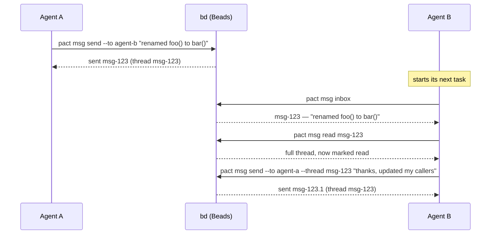
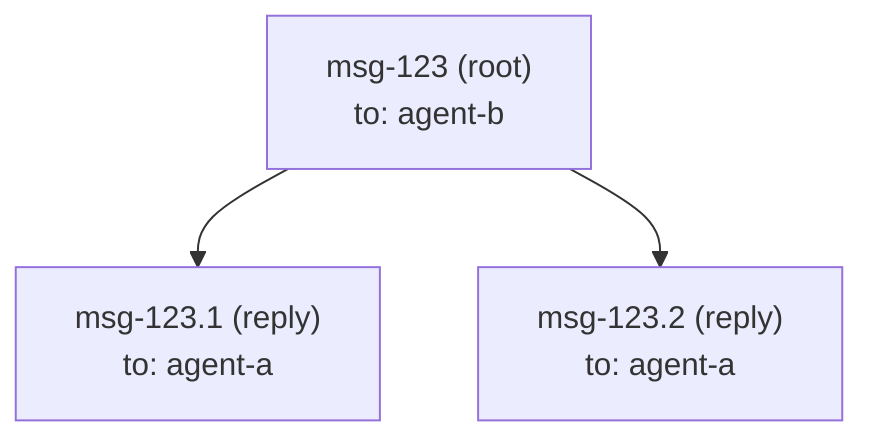

# Messaging

`pact msg` lets one agent hand context to another — "I renamed this
function," "here's why I made that call," "your turn" — without a human
relaying it in chat. Under the hood, a message is just a
[Beads](https://github.com/gastownhall/beads) issue of type `message`; pact
doesn't run its own message store.

## Use case: an interface change

Agent A is refactoring an internal API; Agent B is working on a caller of
that same function in a different part of the codebase. Agent A finishes
first:



`pact msg inbox` at the start of a task is exactly the habit the `pact init`
protocol block asks every agent to build — that's the entire point of having
a shared inbox instead of a chat log only a human reads.

## How a message maps to a Beads issue

`pact msg send --to agent-b --subject "..." "body"` runs, roughly:

```
bd create --type=message --title=<subject> --description=<body> \
           --assignee=agent-b --actor=agent-a --json
```

| Message concept | Beads field |
|---|---|
| recipient (`--to`) | `--assignee` |
| sender (`from`) | `--actor` on the way out, `created_by` on the way back |
| subject | `--title` (defaults to the first line of the body, truncated, if omitted) |
| body | `--description` |
| thread | the root message's own issue id |
| reply | a child issue, linked via `--parent <thread-id>` |

### The `from` field

pact always passed the sender as `--actor`, but for a while it never read it
back, so `inbox` and `read` showed a message with no author. Agents identified
senders by recognising prose style in the body — which fails exactly when it
matters, on a short handoff from one of five peers.

`Message.from` is now populated on every path (`inbox`, `read`, and the
`Message` returned by `send`) from bd's `created_by`, and it is passed through
**verbatim without validation**. That matters: for a message sent through pact
it is the pact agent name (`tui-dev`), but a message bead created outside pact
carries whatever bd recorded — often a git user name (`Ada Lovelace`). A bead
with no recorded author yields an empty string, which renders as `?`. So `from`
is a useful label, not a guaranteed pact identity — don't feed it back into
`--to` without checking it against `pact agents`.

A reply (`pact msg send --thread <id> ...`) passes `--parent=<id>`, which
Beads records as a `parent-child` dependency. `pact msg read <id>` then
reconstructs the thread by fetching the root (`bd show <id> --json`) and its
direct children (`bd list --parent <id> --include-infra --json`), merging
both by `created_at`.



### Why not `bd show --thread`?

Beads' own `bd show <id> --thread` flag looks purpose-built for exactly this,
and it was the first thing tried. In the version of `bd` pact targets,
though, it only ever prints the single issue you asked for — it doesn't
actually walk parent-child replies into a conversation. That was confirmed by
creating a root message and a reply against a scratch database and comparing
`--thread` output against `bd list --parent <id> --include-infra --json`
(which *does* return the reply correctly). Rather than depend on a flag that
doesn't do what its name promises, pact reconstructs threads itself from the
parent-child links, which are reliable.

`bd list` also has no `--type` filter, so `pact msg inbox` fetches everything
assigned to you (`bd list --assignee=<agent> --include-infra --json`,
`--include-infra` because message issues are otherwise hidden from `bd list`
by default) and filters to `issue_type == "message"` on pact's side.

## Read state

Beads has no read/unread lifecycle for message issues, so pact tracks it
itself in `.pact/read.json`, keyed by agent:

```json
{
  "agent-b": ["msg-123", "msg-123.1"]
}
```

`pact msg read <id>` marks every message it displays (the root plus its
replies) as read for the *current* agent — so `agent-b` reading a thread
doesn't affect what `agent-a` sees as unread. `pact msg inbox --unread-only`
filters against this same file.

Like leases, `.pact/read.json` is local, gitignored runtime state — it's
bookkeeping for you, not something to commit or sync between machines.

## Reading your mail: one line each, full text on demand

`pact msg inbox` prints one row per message — id, an unread marker, sender,
subject, and the head of the body:

```
ID                FROM       SUBJECT                                          BODY
pact-wisp-06l  *  lease-fix  src/lease.rs is ready to wire (rnc.8/9/10/11)    src/lease.rs done, contract exactly as frozen. To wire: lea…
pact-wisp-6jz     msg-fix    src/msg.rs ready: Message.from + all_messages()  src/msg.rs is done and compiles clean on its own. Contract …

2 message(s), 1 unread (*) — `pact msg read <id>` for the full text
```

It used to print every body in full. Seven messages was roughly 9KB, which an
agent paid for on *every* inbox check the protocol tells it to do, and it made
`pact msg read` pointless — there was nothing left to read. Bodies are now
flattened to a single line (a 40-paragraph body must not become 40 rows) and
truncated on character boundaries, so multi-byte text neither panics nor
splits. The footer restores the two-step: scan, then read what matters.

`pact msg read <id>` prints the thread in full, with the envelope pact used to
throw away:

```
[pact-wisp-6jz] from: msg-fix  to: docs-writer
subject: src/msg.rs ready: Message.from + all_messages()
at: 2026-07-31T09:01:12Z  thread: pact-wisp-6jz

src/msg.rs is done and compiles clean on its own. Contract exactly as frozen.
```

An unread message picks up a `(unread)` marker after `to:`, and a message whose
author bd never recorded shows `from: ?`.

`pact msg inbox --full` prints every message through that same renderer — one
full-text format, not two — for when you genuinely do want the whole inbox.
`--json` is unchanged and complete: all eight fields, including `from` and
`read`.

## Bodies that don't survive a shell: `--body-file`

```
pact msg send --to <agent> --body-file <path>
pact msg send --to <agent> --body-file -     # stdin
```

A handoff message is usually the worst possible shell argument: quotes,
backslashes, `->`, `<Type>`, and a column-aligned table. Written as a
positional argument, that either gets mangled or gets abandoned — agents
reported simply dropping content rather than hand-escaping it. `--body-file`
takes it from a file or, with `-`, from stdin.

The trailing newline a file ends with is stripped (that's punctuation, not
content). An all-whitespace body is refused: silently sending an empty message
is the same silent failure this whole area is about. `--body-file` and the
positional body are mutually exclusive; clap rejects the combination.

## Unknown recipients: warn, then send

A `--to` typo used to be invisible. One message addressed to a misspelled name
sat unread for a day, and nothing ever said so — worse, the typo showed up
alongside real agents in later listings, certifying itself.

Now `pact msg send` checks the recipient against `pact agents` and warns on
stderr, with a suggestion when one is a plausible typo (case difference, prefix,
substring, or one edit away):

```
$ pact msg send --to tuidev "..."
warning: no agent named "tuidev" has acted in this repo (no lease, no message
sent) — did you mean tui-dev? (sending anyway)
sent pact-wisp-tdv
```

**It warns and still sends, and still exits 0.** pact is advisory here for the
same reason its leases are: a fleet's very first message is legitimately
addressed to an agent that hasn't acted yet, so a wall would block the exact
case the protocol asks for. The lookup needs `bd`, and a failed lookup is
swallowed — a warning must never break a send that would otherwise succeed.
The warning fires on *every* send to an unseen name, including when nobody at
all has been seen yet; it doesn't go quiet after the first time.

Two things the warning deliberately does not treat as "known":

- **Having only ever received mail.** That proves somebody typed the name, which
  is precisely what a typo looks like. `pact agents` marks such names with `?`
  for the same reason.
- **`human`.** Reserved by the protocol block as the operator's mailbox. A human
  reads pact's output but never runs commands as `human`, so "never acted" is
  normal there.

One case *is* a hard error rather than a warning: a recipient that violates
pact's identity grammar (`[a-z0-9][a-z0-9-]{1,31}`). No process could ever run
pact under that name, so the message could never be read by anyone — and unlike
an unseen name, no future send will fix it.

```
$ pact msg send --to "Bad Name!" "..."
error: cannot send to "Bad Name!": no agent can run pact under that name, so
nobody could read it: invalid agent name "Bad Name!": must match [a-z0-9][a-z0-9-]{1,31}
```

## Command reference

```
pact msg send --to <agent> [--thread <id>] [--subject <text>] (<body> | --body-file <path|->)
pact msg inbox [--unread-only] [--full]
pact msg read <id>
```

All three require `bd` on `PATH` (exit code 3 if it isn't) and a resolved
agent identity — `--agent <name>` or `PACT_AGENT` (see the
[README](../README.md) for identity resolution rules).

There is currently no way to read back what you *sent* — only what was sent to
you. That gap is a known, open finding (`pact-rnc.7`); it is why a sender who
sees an ambiguous failure has to choose between a duplicate and a dropped
message.
