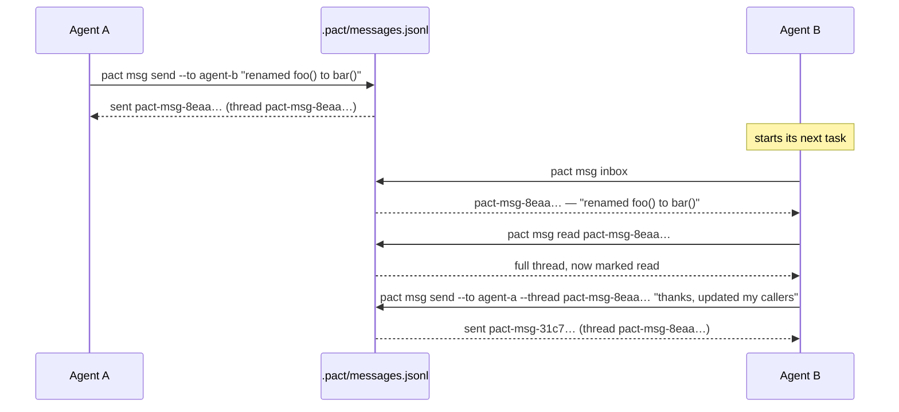
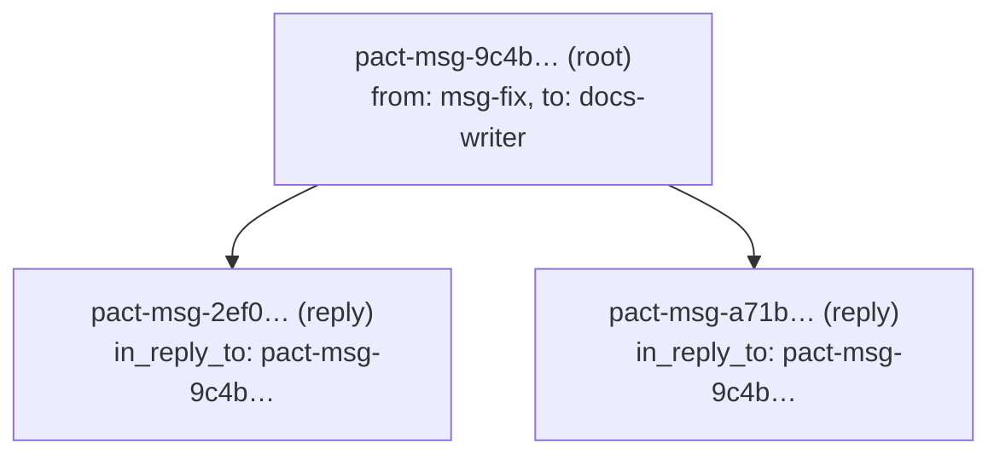

# Messaging

`pact msg` lets one agent hand context to another — "I renamed this
function," "here's why I made that call," "your turn" — without a human
relaying it in chat.

**Since 0.9.0 a message is a line in `.pact/messages.jsonl`, pact's own
append-only log.** Nothing is spawned; there is no backend to be missing. If you
are upgrading from 0.8.x, read [the cutover](#cutover-from-the-bd-era) first —
in-flight messages do not come with you.

## Use case: an interface change

Agent A is refactoring an internal API; Agent B is working on a caller of
that same function in a different part of the codebase. Agent A finishes
first:



`pact msg inbox` at the start of a task is exactly the habit the `pact init`
protocol block asks every agent to build — that's the entire point of having
a shared inbox instead of a chat log only a human reads.

## How a message is stored

One JSON object per line in `.pact/messages.jsonl`, under exactly the same
discipline as [`.pact/events.jsonl`](architecture.md#pacteventsjsonl-is-committed-and-it-is-not-runtime-state):
appended under a lock, each line chained to the one before it, a torn final line
counted and skipped rather than fatal, and a bounded line count. That reuse is
the point — one append implementation, one set of failure modes to understand,
no second invention.

**Commit it, like the event log.** `.pact/messages.jsonl` is re-included by name
in the `.gitignore` `pact init` writes, alongside `.pact/events.jsonl`, and the
protocol block asks agents to fold both into the commit whose work produced them.
They are the two things pact stores that cannot be derived from anything else: who
held what, and what agents said to each other. Left uncommitted, a clone can still
be asked who held a path but never who was warned about it.

The read CURSORS are the deliberate exception and stay local — see
[below](#read-state-local-cursors-and-what-a-sender-can-see). Sharing "who said
what" while keeping "who has read it" per-machine is what stops every clone from
inheriting its peers' inboxes.

Three real lines: a root, a reply, and a message addressed to a path.

```json
{"id":"pact-msg-9c4b3064b6844eb5","at":"2026-08-13T14:08:08.256846411+00:00","from":"msg-fix","to":["docs-writer"],"subject":"src/msg.rs ready: Message.from + all_messages()","body":"src/msg.rs is done and compiles clean on its own. Contract exactly as frozen.","thread":"pact-msg-9c4b3064b6844eb5","kind":"mail","chain_hash":"820a65b0bab59897"}
{"id":"pact-msg-2ef09ede29a18e52","at":"2026-08-13T14:08:08.267975415+00:00","from":"docs-writer","to":["msg-fix"],"subject":"thanks, updated my callers","body":"thanks, updated my callers","thread":"pact-msg-9c4b3064b6844eb5","kind":"mail","in_reply_to":"pact-msg-9c4b3064b6844eb5","chain_hash":"ead5148d6c704b52"}
{"id":"pact-msg-0997158707341c2d","at":"2026-08-13T14:08:08.297952878+00:00","from":"second-agent","to":["human"],"subject":"BLOCKER: flush is broken","body":"BLOCKER: flush is broken","thread":"pact-msg-0997158707341c2d","kind":"mail","about":["src/otel.rs"],"chain_hash":"2f2378a19c439af0"}
```

| Field | What |
|---|---|
| `id` | a hash of the message's own content — see [A retried send lands on the same message](#a-retried-send-lands-on-the-same-message) |
| `at` | when it was sent (`at`, not `ts`, to match `events::Event` rather than invent a second vocabulary) |
| `from` | the sending agent's resolved `PACT_AGENT` |
| `to` | **every** recipient of this send, first-seen order — one row for N recipients |
| `subject` | `--subject`, or the first line of the body truncated |
| `body` | as written |
| `thread` | the root message's id; a root's own id for a root |
| `kind` | `mail` for something an agent wrote, `watch-notice` for what [`pact watch`](watch.md) generated |
| `in_reply_to` | the message replied to, when `--thread` was given |
| `about` | paths from `--to-owner-of`, stored **raw** |
| `chain_hash` | this line's link to the one physically before it |

Every optional field is omitted when it has nothing to say, so a line stays as
narrow as its content — the same rule `events.jsonl` follows.

The **public** shape, which `--json` consumers were already pinned to, is not
this row: it is one `Message` per recipient, keeping `created_at` and the other
key names unchanged. A row with two recipients still yields two `Message`s, so
every `--json` shape survived the move byte-compatible.

### One id for a whole fan-out

The bd era gave each recipient of one send a distinct bead id, and stitched them
into a thread with parent links. A row carries its recipient list instead, so a
fan-out has **one** id:

```
$ pact --agent sender msg send --to cli-wire --to human --subject probe "probe body with a table"
sent 2 message(s) in thread pact-msg-8eaaaae2e91cc78f
  pact-msg-8eaaaae2e91cc78f → cli-wire
  pact-msg-8eaaaae2e91cc78f → human
```

Any recipient's id therefore resolves to the same thread, which is what
`--thread` wanted all along. It also deletes the whole parent-child fan-out that
existed only to make N beads read as one conversation — including the rule that
recipients 2..N had to be parented on the root rather than on each other, because
the thread walk only ever followed *direct* children.

### The `from` field

`from` is the sender's own resolved identity, written by pact at send time and
put through [pact's identity grammar](#unknown-recipients-warn-then-send) on the
way in. It used to come back from bd's `created_by` and was passed through
verbatim, so a message bead created outside pact could surface a git user name
(`Ada Lovelace`) or an empty author rendered as `?`.

That cannot happen to a row pact wrote. `pact agents` still marks a name
`[INVALID]` rather than listing it, because a hand-edited `messages.jsonl` is
still a file somebody can put anything in — but it is no longer the ordinary
case it was when any tool with write access to a shared issue tracker could
create one.

### Threading

A reply carries `in_reply_to` and inherits the root's `thread`. `--thread`
accepts **any** member's id, not just the root's, and resolves it to the root
before storing — an agent legitimately holds a non-root id, because `msg read`
prints every id in the thread, and a reply to a reply must join the conversation
rather than start a sub-thread nobody reading it would see.

Ids are content hashes, so they are longer than anything an agent wants to
retype: `--thread` and `msg read` both take a **prefix**. An ambiguous prefix is
an error listing the candidates, never a guess, because picking one would reply
into the wrong thread.



## Why this is not in the issue tracker any more

Messages used to be `bd` beads: `bd create --type=message` with
`--parent`/`--assignee`/`--include-infra`, and read state as one
`read-by-<agent>` label per reader. That made the agents' **task tracker a
runtime dependency of pact's coordination layer**, and bd 1.2 sent the bill:
`create --id --force` stopped upserting, four CLI tests broke with no source
change on pact's side, and `send` grew a duplicate-id recovery path to cope.

The subprocess boundary in `src/beads.rs` insulated pact against bd's **storage**
churn — Dolt, SQLite, whatever comes next — and never against its **CLI-semantic**
churn. Messages were the only pact-owned feature exposed to it. That distinction
is the whole lesson, and
[architecture.md](architecture.md#one-backend-since-079) is where it is drawn
out.

Four field runs also settled what this traffic is: `pact watch` notices dominate
it — 87 and 64 deliveries in two runs — while voluntary peer mail is near zero
([evidence](studies/field-runs.md#what-the-four-runs-actually-say-about-messaging)).
Ephemeral, pact-shaped traffic, not a backlog of issues.

bd is still here, and is still what agents track work in. pact only ever
**reads** it now, and only via the committed `.beads/interactions.jsonl` export
— see [audit.md](audit.md#--check-claim-lease-divergence).

### What got better, not just different

- **Replies are idempotent.** The deterministic id protected root messages only,
  because a bd `create` could not carry `--id` alongside `--parent`. A line in a
  file has no such restriction, so a replayed reply is a no-op too.
- **A bare-repo worktree can message.** bd needs a working tree, so the topology
  that most needs coordination was the one where agents could not talk.
- **`lease acquire` finds mail waiting on a path with no bd installed**, instead
  of [admitting it had not looked](#when-that-check-cant-run-it-says-so).
- **`about` tags store raw paths.** As bd labels they were encoded into
  `[A-Za-z0-9_:-]`, so `a.b` and `a-b` collapsed onto one tag, and a second
  fallback query existed for rows written before that charset was narrowed.
  Encoding, collision and fallback are all gone.
- **The MCP inbox answers empty instead of unavailable**, and still writes
  nothing ([mcp.md](mcp.md)).

### Cutover from the bd era

**Messages are ephemeral, and there is no importer.** A build from 0.9.0 onwards
cannot see a message bead, and pact will not convert one: the store is capped, so
mail is lost by design past the cap anyway (below), and an importer would be a
one-shot migration for data the design already treats as disposable.

So, in order:

1. **Finish your in-flight threads before you upgrade.** Anything still awaiting
   a reply when you switch binaries stays in bd, readable with `bd show <id>` and
   invisible to `pact msg`.
2. Nothing has to be cleaned up. The old beads are ordinary beads in your
   tracker; pact simply stops writing more of them, and the `read-by-` labels on
   them go inert.

**Nothing detects this for you, deliberately.** A `pact doctor` check was designed
and rejected: the only observable trigger is "`.beads/` exists and
`.pact/messages.jsonl` does not", which is also the normal state of every
repository that adopted pact *after* 0.9.0 and has not sent a message yet — most of
them, by the field data above. It would fire almost always and mean nothing. pact
also cannot count what you would be losing: the committed export carries no
`issue_type`, so a message bead is indistinguishable from a task bead there. A
one-time fact belongs in a release note, which is where this one is.

**Two things this store costs, stated rather than buried.** Past 5000 lines the
oldest are dropped down to 4000, exactly as `events.jsonl` does — for an event
log that is lossy history, for messages it is lost mail. And read state is local
again, which [narrows a property](#read-state-local-cursors-and-what-a-sender-can-see)
that was deliberately moved *into* bd.

## Attribution: your bd commands, not pact's

pact writes nothing to bd, so nothing pact runs can carry attribution on your
behalf. That makes the one thing you have to do more important, not less:
**export `BEADS_ACTOR=$PACT_AGENT` once per shell.**

`bd ready`/`bd update --claim`/`bd close` — the commands AGENTS.md's own Quick
Reference tells an agent to run directly — never pass through pact at all. Left
unset, every one of them falls through bd's precedence chain
(`--actor` > `$BEADS_ACTOR` > `git user.name` > `$USER`) to your shared
checkout's git identity. Confirmed on a real 15-agent build (pact-juz.2): all 16
`.beads/interactions.jsonl` entries attributed to the operator's own
`git user.name`, none to any of the 16 distinct pact identities
`.pact/events.jsonl` correctly tracked for the same run. `pact whoami` prints the
exact `export` line whenever an identity is resolved and `.beads/` exists.

What pact deliberately does **not** do: set `git config user.name`. That would
mutate a checkout other agents share in order to fake attribution for one of
them — and in a worktree fleet the checkout being mutated belongs to somebody
else entirely.

pact's own messages need none of this. `from` is written from the resolved
identity on the line itself, so a fleet's message history is attributed correctly
whatever any environment variable says.

## One send is one thread, however many recipients

```
pact msg send --to cli-wire --to tui-dev --to human --subject "…" --body-file -
```

`--to` repeats, and one send is one row, one id and one thread — see
[One id for a whole fan-out](#one-id-for-a-whole-fan-out) for what that prints.
`--to` used to take a single name, so telling three agents about one interface
change meant three unrelated threads, none of which contained the others'
replies.

The thread id is printed **once**, because that is the point: one decision to
read, one place to reply.

An empty recipient list is an error before anything is written. A send cannot
fail partway through any more — one row, one append — so there is no
half-delivered state to reconcile.

A single `--to` behaves and prints exactly as before:
`sent <id> to <who> (thread <id>)`.

### One recipient, however many times you name them

`--to a --to a` is one recipient. Duplicates are collapsed first-seen, so the
same agent never gets two copies of one announcement in one thread, and the
collapse is reported rather than swallowed:

```
$ pact msg send --to reviewer --to reviewer "ready for review"
note: 1 duplicate recipient(s) collapsed — sending one message per distinct agent
sent pact-msg-56c4a11ee7379cee to reviewer (thread pact-msg-56c4a11ee7379cee)
```

The realistic caller is not somebody typing the flag twice. The protocol tells
agents to repeat `--to` for a decision that affects several peers, so a list
built from `pact agents --json`, from a template, or by an orchestrator can
repeat a name without anyone noticing — and `pact msg sent` exists precisely
because an earlier fleet produced duplicate messages, so a single command that
manufactures them would work against the tool's own advice. It is said out loud
because a caller that repeated a name probably built the list wrongly.

## A retried send lands on the same message

`pact msg sent` exists so a sender can check rather than guess. But when the
outcome of a send is genuinely unknowable, pact's advice is to send it again —
and before this existed that advice manufactured the duplicate it was meant to
prevent: the store minted a fresh id on every call, so a retry was a second,
distinct message with identical content, and neither `inbox` nor `sent` flagged
it.

Not hypothetical. In one fleet run a sender's long send came back with no output
and an exit code it could not trust — its own harness had dropped stdout, no
fault of pact's — so it re-sent. Both beads are still in that store: same author,
same recipient, byte-identical subject, 16 minutes apart. The recipient's inbox
listed both, and it had to diff two walls of prose by eye to establish they were
one announcement (`pact-m7j.6.4`).

So **a message's id is derived from its own content** — a fixed-seed hash of
sender, recipient list, thread, subject and body, rendered `pact-msg-<16 hex>`. A
byte-identical retry computes the same id, and a duplicate id collapses to the
first occurrence when the store is read:

```
$ pact --agent sender msg send --to recipient --subject "long send" "the harness dropped stdout before I saw the exit code"
sent pact-msg-bf787ceef4d8f3d3 to recipient (thread pact-msg-bf787ceef4d8f3d3)
$ pact --agent sender msg send --to recipient --subject "long send" "the harness dropped stdout before I saw the exit code"
sent pact-msg-bf787ceef4d8f3d3 to recipient (thread pact-msg-bf787ceef4d8f3d3)
$ pact --agent recipient msg inbox
ID                            FROM    WHEN     SUBJECT    BODY
pact-msg-bf787ceef4d8f3d3  *  sender  45s ago  long send  the harness dropped stdout before I saw the exit code

1 message(s), 1 unread (*) — `pact msg read <id>` for the full text
```

The seed being *fixed* is the whole trick, and is the one line of this worth
guarding in review: a randomly seeded hash — Rust's default — would give the
retry a different id from the original and protect nothing.

`send` then reports the row the store **kept**, not the one it just built, so a
replay's `--json` carries the first delivery's timestamp. Without that a retry
answers with its own wall clock and a `--json` consumer trusts a value that will
never match what `inbox` and `sent` show a moment later.

A replay is not a reset either: a recipient who had already read the message has
their read cursor untouched, so re-sending does not make it unread and `pact msg
sent` goes on saying the recipient has seen it.

**Replies are covered too, and did not used to be.** On bd this key could only
ride a thread root, because `bd create` refused `--id` and `--parent` together
(`cannot specify both --id and --parent flags`) — it derived a reply's id from its
parent. A line in a file has no such restriction:

```
$ pact --agent docs-writer msg send --to msg-fix --thread pact-msg-9c4b3064b6844eb5 "thanks, updated my callers"
sent pact-msg-2ef09ede29a18e52 to msg-fix (thread pact-msg-9c4b3064b6844eb5)
$ pact --agent docs-writer msg send --to msg-fix --thread pact-msg-9c4b3064b6844eb5 "thanks, updated my callers"
sent pact-msg-2ef09ede29a18e52 to msg-fix (thread pact-msg-9c4b3064b6844eb5)
```

One limit remains, permanent rather than pending: **two deliberately identical
sends collide into one.** Same sender, same recipients, same thread,
byte-identical subject and body — pact cannot tell that from a retry, because the
key is a pure function of the send's own arguments and the timestamp is
deliberately not an input. Keeping it a pure function is worth more than the
distinction, given how rarely two real messages are identical to the byte. That
trade was already accepted in the bd era and is unchanged.

## `--skip`: leaving a recipient out

```
$ pact msg send --to alice --to bob --to carol --skip alice --skip bob "shared decision"
note: 2 recipient(s) skipped — already sent to them, not re-sending
sent pact-msg-3026c6c0dbcafbbc to carol (thread pact-msg-3026c6c0dbcafbbc)
```

`--skip <agent>` repeats like `--to`, and drops those names after every other
recipient source (`--to`, `--to-owner-of`, the `human` fallback) has built the
list — so it behaves the same however a name got in.

It exists for a failure that can no longer happen. A bd fan-out was N separate
`create` calls, so recipient 3 of 4 could fail with 1 and 2 already delivered,
and an identical retry duplicated for them; `--skip` was how a sender replayed
without re-delivering. **One append cannot partially fail**, so the
`{"already_sent": …, "failed_at": …, "reason": …}` `--json` error shape that fed
it is gone, and a `--json` failure here is the ordinary
`{"error": …, "exit_code": …}` every other command produces
([cli.md](cli.md#exit-codes)).

The flag survives because "leave this recipient out of this send" is a useful
thing to say on its own — a recipient you have already told by other means, or
one an orchestrator's template added and you do not want.

## Read state: local cursors, and what a sender can see

One file per agent, `.pact/read/<agent>.json`, mapping message id to when that
agent read it:

```json
{"read":{"pact-msg-2ef09ede29a18e52":"2026-08-13T14:08:08.275182811+00:00","pact-msg-9c4b3064b6844eb5":"2026-08-13T14:08:08.275182811+00:00"}}
```

A **map, not a high-water mark**: a mark cannot say "read 5 but not 3", and an
inbox that silently marks skipped mail read is worse than one that keeps a
slightly larger file. `Message.read_by` is assembled by scanning the directory
once per listing, so an inbox of 200 notices is one directory read rather than
200; `read` — the `*` in your inbox — is "does the asking agent's cursor contain
this id".

Cursors are gitignored, like `.pact/leases/`, because a read position is
per-machine by nature. They are also best-effort on the way in: an unreadable or
malformed cursor reads as "has read nothing", never as an error, because the cost
of getting that wrong is showing one message as unread twice — against failing a
command that had nothing to do with it. Written via a uniquely-named temp and
renamed, so a reader never sees half a cursor and two agents writing their own
cannot collide.

`pact msg read <id>` marks every message it displays (the root plus its replies)
as read for the *current* agent; `agent-b` reading a thread doesn't affect what
`agent-a` sees. `pact msg inbox --unread-only` filters on the same cursors.

### This narrows pact-rnc.17, and says so rather than inheriting it quietly

Read state used to live in `.pact/read.json`, moved **into** bd as
`read-by-<agent>` labels, and has now come back to a local file. That is a
reversal, and the reason for the original move has not been refuted — it has been
narrowed.

pact-rnc.17 moved it for a real failure: with local state **a sender could not
tell whether anyone had read a decision**, an agent with no confirmation
re-sends, and that is where one fleet's duplicate announcements came from — one
notice delivered four times after a false negative.

What holds now: **a pact fleet shares one checkout**, so every agent's cursor is
in the same `.pact/read/`, and `read_by` and `pact msg sent` answer honestly
within the case pact is actually for. What no longer holds: across two machines
they cannot. pact has never coordinated across machines
([README](../README.md#what-pact-deliberately-is-not)), so this narrows the
guarantee to exactly the scope everything else in pact already had — but it is a
narrowing, not a free move, and it is the one thing to weigh if you were relying
on `read_by` from a second clone.

The old `.pact/read.json`, and the `read-by-` labels on any bead still in your
tracker, are both inert. Nothing reads either.

## Reading your mail: one line each, full text on demand

`pact msg inbox` prints one row per message — id, an unread marker, sender,
how long ago it arrived, subject, and the head of the body:

```
ID                            FROM       WHEN         SUBJECT                                          BODY
pact-msg-d42443f0467ab2aa  *  lease-fix  12m ago      src/lease.rs is ready to wire (rnc.8/9/10/11)    src/lease.rs done, contract exactly as frozen. To wire: lea…
pact-msg-9c4b3064b6844eb5     msg-fix    1h4m ago     src/msg.rs ready: Message.from + all_messages()  src/msg.rs is done and compiles clean on its own. Contract …

2 message(s), 1 unread (*) — `pact msg read <id>` for the full text
```

It used to print every body in full. Seven messages was roughly 9KB, which an
agent paid for on *every* inbox check the protocol tells it to do, and it made
`pact msg read` pointless — there was nothing left to read. Bodies are now
flattened to a single line (a 40-paragraph body must not become 40 rows) and
truncated on character boundaries, so multi-byte text neither panics nor
splits. The footer restores the two-step: scan, then read what matters.

`pact msg read <id>` prints the thread in full, with the envelope pact used to
throw away:

```
[pact-msg-9c4b3064b6844eb5] from: msg-fix  to: unread by docs-writer
subject: src/msg.rs ready: Message.from + all_messages()
at: 2026-08-07T09:42:43Z  thread: pact-msg-9c4b3064b6844eb5

src/msg.rs is done and compiles clean on its own. Contract exactly as frozen.
```

A message whose author pact never recorded shows `from: ?`.

### One body per message, not one per recipient

`to:` is a **roster**: every recipient named exactly once, split by whether they
have acknowledged it.

```
[pact-msg-f7c0848b0c58b839] from: cli-wire  to: read by tui-dev, docs-writer — unread by lease-fix, msg-fix
```

That is a fix, not a flourish. `--json` returns one object per recipient — a
deliberate shape, so `jq -r .to` gets an agent name and not an array — and the
human renderer used to walk the same fan-out, printing the **whole body once per
recipient**. A 15-recipient broadcast cost about 280KB to read; one agent spent
149KB reading four messages. It bit hardest on the messages that mattered most,
because the protocol requires whoever changes a hot file to tell every dependent,
so the widest broadcast is by construction the one nobody can afford to read.

The renderer now groups the fan-out back into one message. `--json` is
unchanged — still one row per recipient, still byte-compatible with what
consumers pinned to. Nothing is lost in the roster either: the union of its two
lists *is* the recipient list, and "who still owes this a look" is the question a
sender actually has, which the old per-copy `(unread)` marker could only answer
one recipient at a time.

`pact msg read <id> --brief` gives the envelope, the subject and the first five
lines of each body — enough to tell a warning from a status ping on a thread too
long to read whole. The id for reading it in full is on the line above either way.

`pact msg inbox --full` prints every message through that same renderer — one
full-text format, not two — for when you genuinely do want the whole inbox.
`--json` is complete: all ten fields, including `from`, `read` (by the agent
asking), `read_by` (everyone who has read it) and `notice` (see below).

### A notification is not correspondence

The inbox lists **authored messages only**. `pact watch` release notices are
counted at the bottom, per path, and shown by
`--include-watch` or `--watch-only`:

```
2 message(s), 1 unread (*) — `pact msg read <id>` for the full text

11 watch notice(s) on 2 path(s), 10 unread: src/ast.rs ×9, src/eval.rs ×2
`pact msg inbox --include-watch` lists them, `--watch-only` shows only them
```

This is not a preference about tidiness. In one run a single release of the busiest
file emitted **nine messages in nine seconds**, one per watcher, and `lease acquire`
reported `32 unread message(s)` on that one path. Sampled across the window: 11
automatic notices to **one** authored message — and the authored one was a warning a
peer needed to read ([evidence](studies/field-runs.md#run-4-crucible-built-to-hurt)).

The fleet was not undisciplined. It was *compliant*: [watch.md](watch.md) tells
agents to subscribe to interfaces they depend on but do not own, and the cost of
following that advice is watchers × releases. So the better a fleet complies, the
deeper it buries the one message worth reading — the same failure the protocol
block already warns about ("a real `BLOCKER` sat unread for 38 minutes"), reached
structurally instead of behaviourally.

Three properties make the split safe to rely on:

- **The distinction is a stored field**, `kind`, set to `watch-notice` when
  `pact watch` generates the message and `mail` otherwise. Not a guess from the
  wording: an agent that writes "src/ast.rs changed — released by me" by hand is
  still correspondence, and there is deliberately no flag for sending a message
  *as* a notice.

  This was a bd **label** (pact-mqw.5), and the difference is worth a sentence
  because it deleted code. A label had to be applied at creation, so it was
  forward-only — measured across nine agents' inboxes in an existing store,
  `inbox` and `inbox --include-watch` returned identical counts for every one of
  them and `--watch-only` said "no watch notices" for inboxes that were mostly
  notices ([evidence](studies/field-runs.md#run-4-crucible-built-to-hurt)). A
  heuristic existed to rescue the untagged ones by pattern-matching English in
  the subject and body. A field that every row carries needs no such rescue, and
  that heuristic is gone.
- **Notices are counted, never hidden.** A count an agent can see makes skipping
  them a decision; silence would make it an accident. An inbox holding nothing
  but notices says so rather than printing `inbox empty`.
- **`--include-watch` coalesces per path, not per delivery.** Nine diffs of one
  file nine seconds apart answer one question, and only the last of them answers
  it; the earlier eight are superseded before anyone reads them. One row carries
  the change count, the latest releaser, and the id of the diff that is still
  current.

`--json` is never coalesced — a machine can group for itself, and collapsing nine
deliveries into one entry would cost it their ids. The flags choose which
messages it sees and nothing else, and every record carries `notice: true|false`
so a consumer can branch without parsing prose.

## Reading back what you sent: `pact msg sent`

```
$ pact msg sent
ID                            TO        SUBJECT                                  BODY
pact-msg-6e5c288cf14ce99c     cli-wire  probe                                    probe body with a table
pact-msg-3b0b1318d30abf13  *  human     docs-writer done: docs match the binary  docs updated from the built binary, not the changelog.

2 message(s), 1 not read yet (*) by the recipient
```

Same shape as the inbox, with `TO` instead of `FROM`, newest first. The marker
means something different and more useful here: `*` is *the recipient hasn't
looked*, not "I haven't". `Message.read` is read-by-me, which is trivially true
for something I sent; the sender's actual question is whether the peer they told
has seen it. Answering it means reading **every** agent's cursor, not just your
own — which works because a fleet shares one checkout, and is exactly the property
[narrowed above](#this-narrows-pact-rnc17-and-says-so-rather-than-inheriting-it-quietly).

### …and `pact audit --export` asks it for everybody

`msg sent` answers that question for one agent, about their own messages, and
only when they think to ask. [`pact audit --export`](audit.md#--export)'s
`unacknowledged_messages` asks it across the whole repository, so a warning
nobody acknowledged is not invisible at the end of a run:

```
1 message(s) never read by their recipient: pact-msg-c0a6b2c8 (to w5-juice,
nobody has read it). `pact msg sent` shows these as undelivered to whoever
sent them.
```

It names each message and distinguishes **nobody has read it** from **read only
by \<someone\>** — because the second is the common shape, not a corner case.
`--to-owner-of` means a message about a path *follows the path*, so whoever
leases that path next is often the one who reads it, and that agent is usually
not the addressee. The criterion stays "read by its recipient" regardless, so
this and `msg sent` can never disagree about whether a message landed.

Both cases really happen. One field run ended with a message warning that a
constant change would panic at runtime: it was acted on correctly and never
marked read, so its sender's `msg sent` reported it undelivered permanently and
nothing else said a word. Another run had two of three messages read only by
agents other than their addressee. Reported, never fatal — acting on a message
without marking it read is untidy, not broken.

**Why not `pact doctor`.** The original objection is gone and it stays where it
is anyway. Answering this used to need a real `bd list`, and `bd` takes a
`.beads/.write.lock` to serve one, while `pact doctor` is exposed over MCP as
`pact_doctor` — which [mcp.md](mcp.md) promises is strictly read-only and a test
enforces byte-for-byte. A doctor check would have quietly broken that guarantee
for every MCP observer.

Reading `.pact/messages.jsonl` and the cursors takes no lock and spawns nothing,
so that objection no longer applies. It has not been moved because the remaining
reason was always the better one: this is a **retrospective** question about a
finished run, and `pact doctor` answers "is this repository set up correctly right
now". A check that fails because an agent has not read its mail yet would fire
during every healthy run.

## Bodies that don't survive a shell: `--body-file`

```
pact msg send --to <agent> --body-file <path>
pact msg send --to <agent> --body-file -     # stdin
```

A handoff message is usually the worst possible shell argument: quotes,
backslashes, `->`, `<Type>`, and a column-aligned table. Written as a
positional argument, that either gets mangled or gets abandoned — agents
reported simply dropping content rather than hand-escaping it. `--body-file`
takes it from a file or, with `-`, from stdin.

**`-` will not wait forever.** A fleet reported `--body-file -` hanging past 120
seconds and leaving the shell unusable. It does not reproduce on 0.9.4, and the
precondition it names — a tty on stdin — cannot be reproduced from a test either,
so treat it as **open and unconfirmed**. It is guarded regardless, because of
where it sits: `msg send` is the command an agent uses to report that it is
blocked, so a hang there is the one hang an agent cannot report its way out of.

Two guards, for the two ways a read never returns. A tty on stdin means no
producer is attached at all, which is a mistake and not slowness, so it is
refused immediately and points at `--body-file <path>`. Anything else gets a
60-second ceiling — generous on purpose, because a legitimate producer may be
slow; it is a bound on the failure, not a latency target. Either way nothing is
sent, so a retry cannot duplicate. Empty stdin is unaffected and still gives the
empty-body error.

Exactly one trailing newline is stripped — the one a text file ends with, which
is punctuation rather than content. Not all trailing whitespace: a body ending in
a blank line, or in an indented code block, arrives as written. An all-whitespace body is refused: silently sending an empty message
is the same silent failure this whole area is about. `--body-file` and the
positional body are mutually exclusive; clap rejects the combination.

**"As written" stops at terminal control bytes.** Every line pact prints goes
through one writer, and that writer replaces control characters with U+FFFD,
exempting only `\n` and `\t`. A body carrying a raw ESC sequence is otherwise a
command to whatever terminal displays it — clear the screen, move the cursor,
rewrite the line above so a message appears to come from someone else — and that
was reproduced, not theorised. Multi-line and tab-aligned bodies are unaffected;
they are content, which is what the two exemptions are for. Substitution rather
than deletion, so one character in stays one character out and text meant to
stay apart cannot be silently joined. Lease notes, subjects and every other
rendered field share that writer, so the narrowing is uniform: byte-faithful
except for bytes that are terminal commands.

## Unknown recipients: warn, then send

A `--to` typo used to be invisible. One message addressed to a misspelled name
sat unread for a day, and nothing ever said so — worse, the typo showed up
alongside real agents in later listings, certifying itself.

Now `pact msg send` checks the recipient against `pact agents` and warns on
stderr, with a suggestion when one is a plausible typo (case difference, prefix,
substring, or one edit away):

```
$ pact msg send --to tuidev "..."
warning: no agent named "tuidev" has acted in this repo (no lease, no message
sent) — did you mean tui-dev? (sending anyway)
sent pact-msg-0169b2cf6f0e68f7 to tuidev (thread pact-msg-0169b2cf6f0e68f7)
```

**It warns and still sends, and still exits 0.** pact is advisory here for the
same reason its leases are: a fleet's very first message is legitimately
addressed to an agent that hasn't acted yet, so a wall would block the exact
case the protocol asks for. A failed lookup is swallowed — a warning must never
break a send that would otherwise succeed. The warning fires on *every* send to
an unseen name, including when nobody at all has been seen yet; it doesn't go
quiet after the first time.

Three things the warning deliberately does not treat as "known":

- **Having only ever received mail.** That proves somebody typed the name, which
  is precisely what a typo looks like. `pact agents` marks such names with `?`
  for the same reason.
- **`human`.** Reserved by the protocol block as the operator's mailbox. A human
  reads pact's output but never runs commands as `human`, so "never acted" is
  normal there.
- **A name that fails pact's own identity grammar**, even one with real message
  traffic. `pact agents` reads names back out of the store rather than from this
  command's check, so a hand-edited `.pact/messages.jsonl` can still show one —
  `pact agents` marks it `[INVALID]` rather than listing it as an agent, since no
  `pact` process could ever have sent under it. This used to be routine rather
  than exotic: anything with write access to a shared issue tracker could plant a
  name pact would then read back.

One case *is* a hard error rather than a warning: a recipient that violates
pact's identity grammar (`[a-z0-9][a-z0-9-]{1,31}`). No process could ever run
pact under that name, so the message could never be read by anyone — and unlike
an unseen name, no future send will fix it.

```
$ pact msg send --to "Bad Name!" "..."
error: cannot send to "Bad Name!": no agent can run pact under that name, so
nobody could read it: invalid agent name "Bad Name!": must match [a-z0-9][a-z0-9-]{1,31}
```

## What messaging telemetry measures

Only in a build with `--features otel`, and only once a collector is configured
— see [docs/telemetry.md](telemetry.md).

| Metric | Type | Attributes |
|---|---|---|
| `pact.msg.sent` | counter | `pact.msg.addressing` (`to` \| `to-owner-of` \| `mixed`), `pact.msg.reply` (bool) |
| `pact.msg.read` | counter | *(none)* — first read by this agent only |
| `pact.msg.read_latency` | histogram, ms | *(none)* — how old a message was when first read |
| `pact.msg.unread` | gauge | `pact.msg.age_bucket` (`lt_1m`, `1m_5m`, `5m_15m`, `15m_1h`, `gt_1h`) |

**pact exports counts and ages. Never a subject, never a body, never a message
id, never a recipient's name.** There is no longer a subprocess on this path to
leak one either: the `pact.beads.exec` span that redacted argv down to flag names
existed because `--title=` and `--description=` carried the message you wrote,
and `pact msg` no longer spawns anything.

Two details that explain the shapes chosen:

- **Unread depth is a gauge, not a counter**, because `pact ui` calls `inbox`
  on every refresh and a counter would multiply one rotting message by the
  number of times the dashboard happened to look at it. All five buckets are
  emitted every time, zeros included: a gauge keeps its last value, so a bucket
  that merely stopped being reported would read as permanently full.
- **Age is a bucketed attribute rather than a histogram** because the shared
  histogram bounds top out at 10 s — right for the subprocess durations they were
  chosen for, useless for coordination latency, where the failure worth catching
  is a message that sat unread for 38 minutes.

`pact.msg.addressing` is read off the process's argv, because by the time
`msg::send` is called `--to-owner-of <path>` has already been resolved to an
agent name and pushed onto the same list as `--to`. Known ceiling: it is a scan
of flag names, not a parse, so a *value* spelled exactly `--to` would be
miscounted — clap rejects that spelling anyway, and the cost is one mislabelled
data point.

## Command reference

```
pact msg send (--to <agent>... | --to-owner-of <path>...) [--thread <id>] [--subject <text>] [--skip <agent>...] (<body> | --body-file <path|->)
pact msg inbox [--unread-only] [--full] [--include-watch | --watch-only]
pact msg sent
pact msg read <id> [--brief]
```

All four need a git repository and a resolved agent identity — `--agent <name>` or
`PACT_AGENT`. **Nothing else.** No `bd`, no `.beads/`, no network, no subprocess,
so [exit 3](cli.md#exit-codes) is unreachable from every one of them.

Messages also show up in `pact log`, merged with lease events into one
chronological feed.


## Delivery follows the file, not the name

`--to-owner-of <path>` resolves a path to the agent who last worked on it. That
is *addressing*, and addressing was never the problem.

Measured across one nine-agent fleet run, after `--to-owner-of` had shipped:

```
recipient acted again after the message was sent:  14/44  → read 14  (100%)
recipient never acted again (had exited):          30/44  → read  0    (0%)
```

Every message to a live agent was read. Every message to an exited one was not.
The read rate barely moved from the run before (86% unread → 84%) because a
better address does not help when nobody is home. Eleven of thirteen agents used
`--to-owner-of` or `agents --for`, and every one reported it routing correctly
on the first try to a name they did not know — it worked exactly as designed,
and the designed thing was the wrong thing.

So a message sent with `--to-owner-of` is now **tagged with the path**, in the
row's own `about` field, and `pact lease acquire` surfaces any unread message
about a path you are taking:

```
$ pact lease acquire src/otel.rs
acquired lease on src/otel.rs for third-agent
note: src/otel.rs was last released by second-agent (0s ago) — their note: wiring flush. `pact log` has the history; `pact msg send --to-owner-of src/otel.rs` reaches them.
note: 1 unread message(s) about src/otel.rs, oldest from second-agent — "BLOCKER: flush is broken". Read it before you edit: `pact msg read pact-msg-0997158707341c2d`
```

The third agent was never the addressee and had read nothing. It gets the
message because it took the file. Every one of the 30 lost messages above was
about a file, sent to the agent who had just released it — so the moment
somebody leases that file is exactly the moment the message becomes useful
again.

Two supporting changes:

- **`msg send` says who a path resolved to, and how stale they are** — `note:
  src/otel.rs resolved to first-owner, last seen 41m ago`. A resolved name
  reads like a delivered message and is not. One agent worked around this by
  hand-adding `--to human` to all three of its sends; it was the only one that
  thought of it.
- **`pact ui` marks a message read when you select it.** 41 of 85 messages in
  that run went to `human`, who never runs `pact msg read`, so `pact msg sent`
  reported them unread forever — and the protocol's "confirm, don't re-send:
  `pact msg sent` shows whether the recipient has read it" always answered *no*
  for the most important recipient. The dashboard is the human's inbox, so
  looking at a message there counts as reading it. Selection, not display:
  merely opening the tab would wipe the unread markers that make the list worth
  having.

### The path is stored raw, on the row that carries the message

`about` is a field on the message's own line, written by the same append that
writes the message — not a second call afterwards. A second call is a second
thing that can fail or be raced, and the window it opened was one where the
message existed and was findable by name but not by path, exactly the state this
mechanism exists to close.

The path is stored **as pact normalized it**, and nothing else happens to it. As
a bd label it had to survive a label charset: `about-` plus the path with `/` as
`__` and every byte outside `[A-Za-z0-9_:-]` replaced by `-`, which collapsed
`a.b` and `a-b` onto one tag. That encoding was inherited rather than chosen —
`br` rejected a `.` in a label outright, so before the charset was narrowed every
tag on a real file path failed there — and narrowing it stranded the tags written
before it, which is why `about_path` also had to query the pre-narrowing
encoding as a fallback.

Encoding, collision and fallback query are all gone. Both sides normalize once
and compare strings: `run_msg` canonicalizes `--to-owner-of` before storing it,
and `about_path` normalizes the path being asked about, so a path typed from a
subdirectory still matches one stored from the repo root.

### When that check can't run, it says so

"Looked and found nothing" and "could not look" must not render the same way, and
they don't:

| Situation | `pact lease acquire` prints |
|---|---|
| checked, nothing unread | nothing |
| checked, something unread | the `note: N unread message(s) about …` line above |
| the store could not be read at all | `note: could not check for pending messages about <path>: <why>` |

**That table used to have four rows and a `.beads/` gate.** The check needed a
Beads store, so it was skipped entirely when `.beads/` was absent — because a
repository that never ran `bd init` could hold no messages, and the alternative
was "could not check for pending messages" on every single acquire, forever, for
the lease-only population who never opted into messaging at all. Messages are
pact's own file now, so the gate is gone with the reason for it: a repository that
has never seen an issue tracker can still have mail waiting on a path, and the
lookup can still answer.

The remaining failure row is a real read error — an unreadable file, a broken
permission — not an absent one. A missing `.pact/messages.jsonl` is an empty
store, not an error.

None of it moves the exit code. The lease succeeded, and acquiring one has never
depended on the messaging backend — and now there is no backend for it to depend
on. Each path in a batch acquire resolves on its own, so one path's failed lookup
cannot pass for a sibling's genuine all-clear, and one path's finding cannot make
a failed check elsewhere look like it worked.

### When every path resolves to you

`--to-owner-of` resolves to the *last* agent to act on a path — which, right
after you take a file over, is you. pact says so and adds no recipient for that
path. When that was the only addressing given, the send used to fail outright
(`no recipients resolved — nothing to send`, exit 1), so the one agent with
something to say about the handoff was the one agent that could not say it — the
exact case `--to-owner-of` exists to spare you from guessing a name for. It now
falls back to [`human`](#unknown-recipients-warn-then-send), warns, and sends:

```
$ pact msg send --to-owner-of src/otel.rs "flush is broken; I took the file over"
note: you are yourself the last agent to work on src/otel.rs; not adding a recipient
note: every --to-owner-of path resolves to you; addressing to human so the note still reaches whoever leases it next
sent pact-msg-1b4f0ac0372a1dd2 to human (thread pact-msg-1b4f0ac0372a1dd2)
```

The fallback recipient is not the delivery. `about-<path>` is attached to every
`--to-owner-of` path whatever `to` says, and the unread-message notice above
filters on the *sender*, never on the addressee — so the note still reaches
whoever leases `src/otel.rs` next, exactly as an ordinary `--to-owner-of`
message would. Addressing it to `human` only gives it a mailbox in the meantime.
