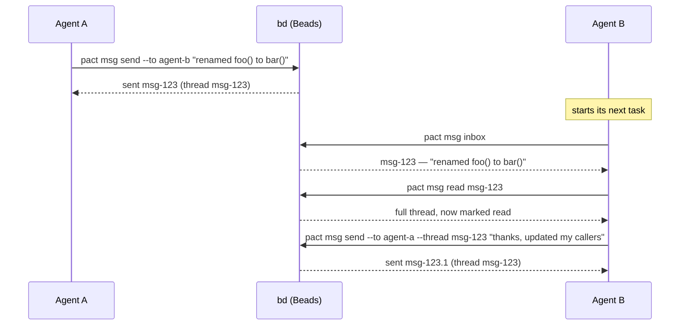
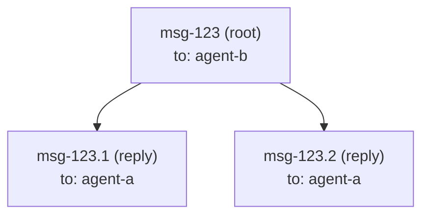

# Messaging

`pact msg` lets one agent hand context to another — "I renamed this
function," "here's why I made that call," "your turn" — without a human
relaying it in chat. Under the hood, a message is just a
[Beads](https://github.com/gastownhall/beads) issue of type `message`; pact
doesn't run its own message store.

## Use case: an interface change

Agent A is refactoring an internal API; Agent B is working on a caller of
that same function in a different part of the codebase. Agent A finishes
first:



`pact msg inbox` at the start of a task is exactly the habit the `pact init`
protocol block asks every agent to build — that's the entire point of having
a shared inbox instead of a chat log only a human reads.

## How a message maps to a Beads issue

`pact msg send --to agent-b --subject "..." "body"` runs, roughly:

```
bd create --type=message --title=<subject> --description=<body> \
           --assignee=agent-b --actor=agent-a --json
```

| Message concept | Beads field |
|---|---|
| recipient (`--to`) | `--assignee` |
| sender (`from`) | `--actor` on the way out, `created_by` on the way back |
| subject | `--title` (defaults to the first line of the body, truncated, if omitted) |
| body | `--description` |
| thread | the root message's own issue id |
| reply | a child issue, linked via `--parent <thread-id>` |
| read state | a `read-by-<agent>` label on the message bead, one per reader |

Every `bd create` pact runs passes `--no-inherit-labels`. Without it a child
inherits its parent's labels, so a reply to a message you had already read would
be born carrying your own `read-by-` label and arrive pre-read. (br doesn't have
the flag and doesn't need it — see [Two backends, two argv](#two-backends-two-argv).)

### The `from` field

pact always passed the sender as `--actor`, but for a while it never read it
back, so `inbox` and `read` showed a message with no author. Agents identified
senders by recognising prose style in the body — which fails exactly when it
matters, on a short handoff from one of five peers.

`Message.from` is now populated on every path (`inbox`, `read`, and the
`Message` returned by `send`) from bd's `created_by`, and it is passed through
**verbatim without validation**. That matters: for a message sent through pact
it is the pact agent name (`tui-dev`), but a message bead created outside pact
carries whatever bd recorded — often a git user name (`Ada Lovelace`). A bead
with no recorded author yields an empty string, which renders as `?`. So `from`
is a useful label, not a guaranteed pact identity — don't feed it back into
`--to` without checking it against `pact agents`.

A reply (`pact msg send --thread <id> ...`) passes `--parent=<id>`, which
Beads records as a `parent-child` dependency. `pact msg read <id>` then
reconstructs the thread by fetching the root (`bd show <id> --json`) and its
direct children (`bd list --parent <id> --include-infra --json`), merging
both by `created_at`.



### Why not `bd show --thread`?

Beads' own `bd show <id> --thread` flag looks purpose-built for exactly this,
and it was the first thing tried. In the version of `bd` pact targets,
though, it only ever prints the single issue you asked for — it doesn't
actually walk parent-child replies into a conversation. That was confirmed by
creating a root message and a reply against a scratch database and comparing
`--thread` output against `bd list --parent <id> --include-infra --json`
(which *does* return the reply correctly). Rather than depend on a flag that
doesn't do what its name promises, pact reconstructs threads itself from the
parent-child links, which are reliable.

`bd list` also has no `--type` filter, so `pact msg inbox` fetches everything
assigned to you (`bd list --assignee=<agent> --include-infra --json`,
`--include-infra` because message issues are otherwise hidden from `bd list`
by default) and filters to `issue_type == "message"` on pact's side.

## Two backends, two argv

pact speaks to either Beads CLI: `bd` (Go, embedded Dolt) or `br` (beads-rust,
SQLite). Which one it uses is decided by the store on disk, not by preference —
see the [README](../README.md#install). The messaging *model* is identical on
both: message-typed beads, `--parent` threads, `read-by-<agent>` labels. The
argv is not, and the differences are the whole of `pact-l94`. Each was found by
running `br` 0.2.19, not inferred from bd's documentation.

| What pact needs | `bd` | `br` |
|---|---|---|
| list message beads | `list --include-infra --json` | `list --json --type=message` |
| don't inherit read labels | `--no-inherit-labels` | flag rejected, and unnecessary |
| shape of `list --json` | a bare array | `{"issues": […], "total": …}` |
| a message's replies | `list --parent=<id> --include-infra --json` | the root's `parent-child` `dependents` |

Two of those are worth more than a table row:

- **`--no-inherit-labels` isn't missing on br, it's moot.** br rejects the flag
  outright (`error: unexpected argument`), and the obvious response — emulate it
  — would be wasted work: a br child is born with no labels at all, so the bug
  the flag prevents (a reply arriving pre-read) cannot happen there. pact omits
  it on br and keeps it on bd.
- **`br list` omits `parent` and has no `--parent` filter**, which is the one
  divergence that could have shipped as a quietly half-broken inbox: every reply
  would report itself as its own thread root, and `msg read` would find no
  replies. `br show --json` does carry `parent`, and a root's `dependents` name
  its children as `parent-child` edges. So on br every listing is a `list` for
  the ids plus one `show` to hydrate the records — two subprocesses, but
  authoritative data. The alternative, deriving parents from br's `<id>.<n>` id
  shape, would be pact guessing at another tool's id format.

`--type` is the one place br is *ahead*: the filter bd lacks, so on br the
message-bead filter happens in the backend rather than in pact.

`pact doctor` names the backend it picked, so a puzzling `msg` result starts
with a one-line answer to "which database am I even looking at":

```
✓ Beads CLI: br (br 0.2.19)
✓ Beads CLI: bd (bd version 1.1.2 (20e493e56))
```

## One send is one thread, however many recipients

```
pact msg send --to cli-wire --to tui-dev --to human --subject "…" --body-file -
```

`--to` repeats. All the recipients' messages are stitched into a single
conversation — the first recipient's bead is the thread root, and every other
recipient's is created with `--parent=<thread root>` — so `pact msg read <root>`
returns the whole announcement:

```
$ pact msg send --to cli-wire --to human --subject probe --body-file -
sent 2 message(s) in thread pact-wisp-8mz
  pact-wisp-8mz → cli-wire
  pact-wisp-8mz.1 → human
```

The thread id is printed **once**, because that is the point: one decision to
read, one place to reply. `--to` used to take a single name, so telling three
agents about one interface change meant three unrelated threads, none of which
contained the others' replies. Recipients 2..N are parented on the thread root
rather than on the first recipient's message, because `read_thread` walks *direct*
children only — grandchildren would be invisible in the thread the reader opens,
which is the exact failure this fixes.

An empty recipient list is an error before `bd` is ever run. If a send fails part
way through, the error names who already received it, so nobody re-sends blind.

A single `--to` behaves and prints exactly as before:
`sent <id> to <who> (thread <id>)`.

## Read state: shared labels, not a local file

An agent that reads a message adds a `read-by-<agent>` label to the bead. That's
the whole mechanism. `Message.read_by` lists every reader; `read` — the `*` in
your inbox — is just "does `read_by` contain the agent asking".

It used to live in `.pact/read.json`, a local file keyed by agent. That worked for
the reader and was useless for everyone else: **a sender could not tell whether
anyone had read a decision.** An agent with no confirmation re-sends, and that is
where the fleet's duplicate announcements came from — one notice delivered four
times after a false negative. Read state is a fact about a message, so it now
lives with the message, where every agent can see it.

Note what this *removed*: `.pact/read.json` is gone, not shadowed. Keeping both
would have meant two sources of truth for one fact. A leftover `read.json` from an
older pact is inert, and the single `.pact/` gitignore line covers it either way.
There is no migration, so the changeover resets every agent's read flags once —
an inbox full of things you already handled is expected exactly once.

`pact msg read <id>` marks every message it displays (the root plus its replies)
as read for the *current* agent; `agent-b` reading a thread doesn't affect what
`agent-a` sees. `pact msg inbox --unread-only` filters on the same labels. A
failed label write degrades to a warning rather than losing the thread body you
asked for.

## Reading your mail: one line each, full text on demand

`pact msg inbox` prints one row per message — id, an unread marker, sender,
subject, and the head of the body:

```
ID                FROM       SUBJECT                                          BODY
pact-wisp-06l  *  lease-fix  src/lease.rs is ready to wire (rnc.8/9/10/11)    src/lease.rs done, contract exactly as frozen. To wire: lea…
pact-wisp-6jz     msg-fix    src/msg.rs ready: Message.from + all_messages()  src/msg.rs is done and compiles clean on its own. Contract …

2 message(s), 1 unread (*) — `pact msg read <id>` for the full text
```

It used to print every body in full. Seven messages was roughly 9KB, which an
agent paid for on *every* inbox check the protocol tells it to do, and it made
`pact msg read` pointless — there was nothing left to read. Bodies are now
flattened to a single line (a 40-paragraph body must not become 40 rows) and
truncated on character boundaries, so multi-byte text neither panics nor
splits. The footer restores the two-step: scan, then read what matters.

`pact msg read <id>` prints the thread in full, with the envelope pact used to
throw away:

```
[pact-wisp-6jz] from: msg-fix  to: docs-writer
subject: src/msg.rs ready: Message.from + all_messages()
at: 2026-07-31T09:01:12Z  thread: pact-wisp-6jz

src/msg.rs is done and compiles clean on its own. Contract exactly as frozen.
```

An unread message picks up a `(unread)` marker after `to:`, and a message whose
author bd never recorded shows `from: ?`.

`pact msg inbox --full` prints every message through that same renderer — one
full-text format, not two — for when you genuinely do want the whole inbox.
`--json` is complete: all nine fields, including `from`, `read` (by the agent
asking) and `read_by` (everyone who has read it).

## Reading back what you sent: `pact msg sent`

```
$ pact msg sent
ID                TO         SUBJECT                                          BODY
pact-wisp-mbw  *  human      docs-writer done: docs match the binary          docs updated from the built binary, not the…
pact-wisp-8mz     cli-wire   probe                                            probe body with a table…

2 message(s), 1 not read yet (*) by the recipient
```

Same shape as the inbox, with `TO` instead of `FROM`, newest first. The marker
means something different and more useful here: `*` is *the recipient hasn't
looked*, not "I haven't". `Message.read` is read-by-me, which is trivially true
for something I sent; the sender's actual question is whether the peer they told
has seen it. Answering it requires the shared read state above — with a local
`read.json` there was nothing to show.

## Bodies that don't survive a shell: `--body-file`

```
pact msg send --to <agent> --body-file <path>
pact msg send --to <agent> --body-file -     # stdin
```

A handoff message is usually the worst possible shell argument: quotes,
backslashes, `->`, `<Type>`, and a column-aligned table. Written as a
positional argument, that either gets mangled or gets abandoned — agents
reported simply dropping content rather than hand-escaping it. `--body-file`
takes it from a file or, with `-`, from stdin.

Exactly one trailing newline is stripped — the one a text file ends with, which
is punctuation rather than content. Not all trailing whitespace: a body ending in
a blank line, or in an indented code block, arrives as written. An all-whitespace body is refused: silently sending an empty message
is the same silent failure this whole area is about. `--body-file` and the
positional body are mutually exclusive; clap rejects the combination.

## Unknown recipients: warn, then send

A `--to` typo used to be invisible. One message addressed to a misspelled name
sat unread for a day, and nothing ever said so — worse, the typo showed up
alongside real agents in later listings, certifying itself.

Now `pact msg send` checks the recipient against `pact agents` and warns on
stderr, with a suggestion when one is a plausible typo (case difference, prefix,
substring, or one edit away):

```
$ pact msg send --to tuidev "..."
warning: no agent named "tuidev" has acted in this repo (no lease, no message
sent) — did you mean tui-dev? (sending anyway)
sent pact-wisp-tdv
```

**It warns and still sends, and still exits 0.** pact is advisory here for the
same reason its leases are: a fleet's very first message is legitimately
addressed to an agent that hasn't acted yet, so a wall would block the exact
case the protocol asks for. The lookup needs `bd`, and a failed lookup is
swallowed — a warning must never break a send that would otherwise succeed.
The warning fires on *every* send to an unseen name, including when nobody at
all has been seen yet; it doesn't go quiet after the first time.

Two things the warning deliberately does not treat as "known":

- **Having only ever received mail.** That proves somebody typed the name, which
  is precisely what a typo looks like. `pact agents` marks such names with `?`
  for the same reason.
- **`human`.** Reserved by the protocol block as the operator's mailbox. A human
  reads pact's output but never runs commands as `human`, so "never acted" is
  normal there.

One case *is* a hard error rather than a warning: a recipient that violates
pact's identity grammar (`[a-z0-9][a-z0-9-]{1,31}`). No process could ever run
pact under that name, so the message could never be read by anyone — and unlike
an unseen name, no future send will fix it.

```
$ pact msg send --to "Bad Name!" "..."
error: cannot send to "Bad Name!": no agent can run pact under that name, so
nobody could read it: invalid agent name "Bad Name!": must match [a-z0-9][a-z0-9-]{1,31}
```

## What messaging telemetry measures

Only in a build with `--features otel`, and only once a collector is configured
— see [docs/telemetry.md](telemetry.md).

| Metric | Type | Attributes |
|---|---|---|
| `pact.msg.sent` | counter | `pact.msg.addressing` (`to` \| `to-owner-of` \| `mixed`), `pact.msg.reply` (bool) |
| `pact.msg.read` | counter | *(none)* — first read by this agent only |
| `pact.msg.read_latency` | histogram, ms | *(none)* — how old a message was when first read |
| `pact.msg.unread` | gauge | `pact.msg.age_bucket` (`lt_1m`, `1m_5m`, `5m_15m`, `15m_1h`, `gt_1h`) |

**pact exports counts and ages. Never a subject, never a body, never a message
id, never a recipient's name.** The one thing a Beads span records about the
subprocess is the *shape* of its argv — flag names truncated at the `=` —
precisely because `--title=` and `--description=` carry the message you wrote.

Two details that explain the shapes chosen:

- **Unread depth is a gauge, not a counter**, because `pact ui` calls `inbox`
  on every refresh and a counter would multiply one rotting message by the
  number of times the dashboard happened to look at it. All five buckets are
  emitted every time, zeros included: a gauge keeps its last value, so a bucket
  that merely stopped being reported would read as permanently full.
- **Age is a bucketed attribute rather than a histogram** because the shared
  histogram bounds top out at 10 s — right for a `bd` subprocess, useless for
  coordination latency, where the failure worth catching is a message that sat
  unread for 38 minutes.

`pact.msg.addressing` is read off the process's argv, because by the time
`msg::send` is called `--to-owner-of <path>` has already been resolved to an
agent name and pushed onto the same list as `--to`. Known ceiling: it is a scan
of flag names, not a parse, so a *value* spelled exactly `--to` would be
miscounted — clap rejects that spelling anyway, and the cost is one mislabelled
data point.

## Command reference

```
pact msg send --to <agent> [--to <agent>...] [--thread <id>] [--subject <text>] (<body> | --body-file <path|->)
pact msg inbox [--unread-only] [--full]
pact msg sent
pact msg read <id>
```

All four require a Beads CLI — `bd` or `br` — on `PATH` (exit code 3 if
neither is, naming which one this repo's store needs) and a resolved
agent identity — `--agent <name>` or `PACT_AGENT` (see the
[README](../README.md) for identity resolution rules).

Messages also show up in `pact log`, merged with lease events into one
chronological feed.
