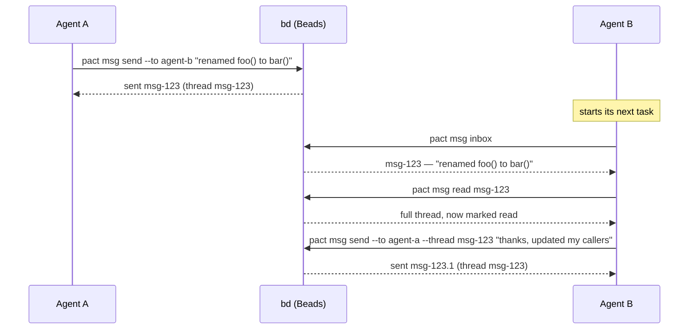
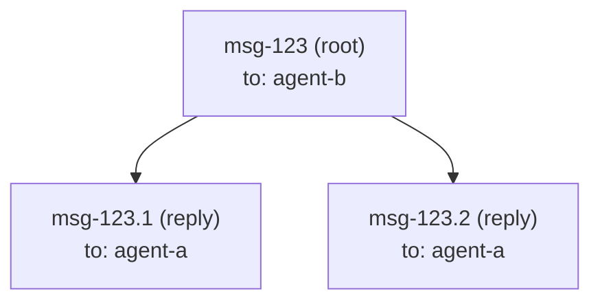

# Messaging

`pact msg` lets one agent hand context to another — "I renamed this
function," "here's why I made that call," "your turn" — without a human
relaying it in chat. Under the hood, a message is just a
[Beads](https://github.com/gastownhall/beads) issue of type `message`; pact
doesn't run its own message store.

## Use case: an interface change

Agent A is refactoring an internal API; Agent B is working on a caller of
that same function in a different part of the codebase. Agent A finishes
first:



`pact msg inbox` at the start of a task is exactly the habit the `pact init`
protocol block asks every agent to build — that's the entire point of having
a shared inbox instead of a chat log only a human reads.

## How a message maps to a Beads issue

`pact msg send --to agent-b --subject "..." "body"` runs, roughly:

```
bd create --type=message --title=<subject> --description=<body> \
           --assignee=agent-b --actor=agent-a --json
```

| Message concept | Beads field |
|---|---|
| recipient (`--to`) | `--assignee` |
| sender | `--actor` (Beads' audit-trail field) |
| subject | `--title` (defaults to the first line of the body, truncated, if omitted) |
| body | `--description` |
| thread | the root message's own issue id |
| reply | a child issue, linked via `--parent <thread-id>` |

A reply (`pact msg send --thread <id> ...`) passes `--parent=<id>`, which
Beads records as a `parent-child` dependency. `pact msg read <id>` then
reconstructs the thread by fetching the root (`bd show <id> --json`) and its
direct children (`bd list --parent <id> --include-infra --json`), merging
both by `created_at`.



### Why not `bd show --thread`?

Beads' own `bd show <id> --thread` flag looks purpose-built for exactly this,
and it was the first thing tried. In the version of `bd` pact targets,
though, it only ever prints the single issue you asked for — it doesn't
actually walk parent-child replies into a conversation. That was confirmed by
creating a root message and a reply against a scratch database and comparing
`--thread` output against `bd list --parent <id> --include-infra --json`
(which *does* return the reply correctly). Rather than depend on a flag that
doesn't do what its name promises, pact reconstructs threads itself from the
parent-child links, which are reliable.

`bd list` also has no `--type` filter, so `pact msg inbox` fetches everything
assigned to you (`bd list --assignee=<agent> --include-infra --json`,
`--include-infra` because message issues are otherwise hidden from `bd list`
by default) and filters to `issue_type == "message"` on pact's side.

## Read state

Beads has no read/unread lifecycle for message issues, so pact tracks it
itself in `.pact/read.json`, keyed by agent:

```json
{
  "agent-b": ["msg-123", "msg-123.1"]
}
```

`pact msg read <id>` marks every message it displays (the root plus its
replies) as read for the *current* agent — so `agent-b` reading a thread
doesn't affect what `agent-a` sees as unread. `pact msg inbox --unread-only`
filters against this same file.

Like leases, `.pact/read.json` is local, gitignored runtime state — it's
bookkeeping for you, not something to commit or sync between machines.

## Command reference

```
pact msg send --to <agent> [--thread <id>] [--subject <text>] <body>
pact msg inbox [--unread-only]
pact msg read <id>
```

All three require `bd` on `PATH` (exit code 3 if it isn't) and a resolved
agent identity — `--agent <name>` or `PACT_AGENT` (see the
[README](../README.md) for identity resolution rules).
