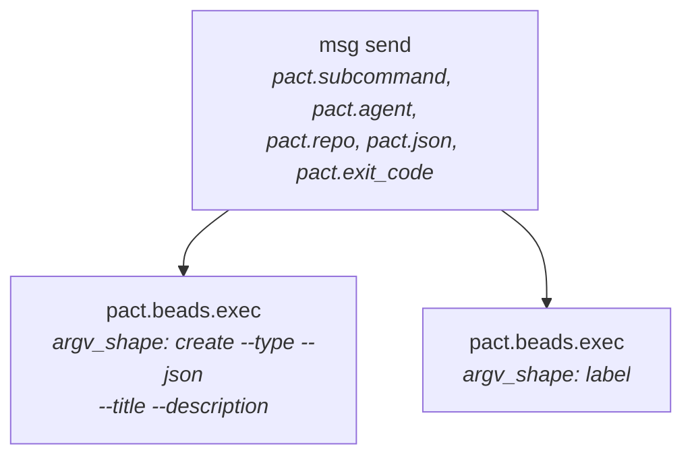

# Telemetry

pact can export OpenTelemetry traces and metrics about its own runs. It is
**off unless you both build it in and configure it**, and this page says
exactly what leaves the machine when you do.

That precision is the point. pact is a tool agents run unattended, hundreds of
times a session, against repositories that are not yours. A telemetry feature
in that position does not get to be vague about what it ships.

## Two switches, both off by default

| Switch | Off looks like | On looks like |
|---|---|---|
| Build | `cargo build` — the `otel` feature is not a default | `cargo build --features otel` |
| Runtime | no `OTEL_EXPORTER_OTLP_*` endpoint in the environment | an `http://` endpoint (see [Configuration](#configuration)) |

With the feature off, every instrument in the source is an empty
`#[inline(always)]` function and both `Span` and `Guard` are unit structs, so
`otel::span("x")` compiles to nothing at all. There is no `#[cfg]` at any call
site — the code reads the same in both builds — and no dependency is added:

```
$ cargo tree --depth 1                     # identical with and without --features otel
pact v0.2.0
├── anyhow  ├── chrono  ├── clap  ├── serde  ├── serde_json  └── thiserror
```

Six crates either way, no `tokio`, no `tonic`, no `opentelemetry`. That is not
a happy accident — it is why the OTLP client is [hand-written](#why-there-is-no-opentelemetry-sdk-here).

Ask the binary in front of you rather than guessing:

```
$ pact --version | grep features
features: ui,otel

$ pact doctor | grep 'otel export'
✓ otel export: traces + metrics → http://127.0.0.1:4318
```

## What is exported

Argv **shape** and bounded, source-controlled values. Nothing else.

Attribute keys are `&'static str` *by type*, so a key cannot come from user
input even by mistake. Values are either literals from a fixed set in the
source, numbers, booleans, or one of the four bounded strings called out below.

### Resource attributes

Attached to every span and every metric point.

| Attribute | Value | Notes |
|---|---|---|
| `service.name` | `pact` | override with `OTEL_SERVICE_NAME` |
| `service.version` | e.g. `0.2.0` | pact's own crate version |
| `pact.agent` | e.g. `docs-writer` | **only** from `PACT_AGENT`, and only if it passes the same `[a-z0-9][a-z0-9-]{1,31}` validation the rest of pact uses |

There is no `service.instance.id`. Every metrics backend folds a resource
attribute into series identity, so a fresh id per CLI invocation would mint a
brand-new series every time pact ran — and pact runs constantly. The same
reasoning is why `pact.agent` is validated rather than merely truncated: a
207-character `pact.agent` was measured shipping from a run pact itself had
already rejected with exit 1.

### Spans

One root span per invocation, named for the **argv shape** — `lease acquire`,
`msg inbox`, `audit compare`, `doctor` — plus `help` and `usage-error`. Child
spans attach to it automatically through a thread-local stack, so nothing in
pact passes a context object around.

The shape, never the arguments. `subcommand_name` maps each command to one of a
fixed set of literals, and a flag value that pact does not recognise collapses
to a catch-all (`audit other`) rather than reaching a span name. That is not
tidiness: a span name is high-cardinality by construction if user text can
reach it, and `--check`'s value, a path and a `--note` are all user text. The
same rule governs `pact.beads.exec`, which records the *shape* of the `bd`
argv and never its values — `--title` and `--description` carry a colleague's
message subject and body, and shipping those to a collector is not something an
observability change gets to do quietly.



| Span | Attributes |
|---|---|
| root (`lease acquire`, `msg send`, `doctor`, …) | `pact.subcommand`, `pact.json`, `pact.agent` (resolved, so `--agent` counts too), `pact.repo`, `pact.exit_code` |
| `usage-error` / `help` | `pact.exit_code` **only** — see below |
| `pact.lease.acquire` | `pact.path`, `pact.lease.ttl_secs`, `pact.lease.stolen` |
| `pact.lease.release` | `pact.path` |
| `pact.beads.exec` | `process.executable.name` (`bd`/`br`), `pact.beads.argv_shape`, `pact.beads.subcommand`, `pact.beads.version`, `process.exit.code` |
| `pact.init.write` | `pact.instruction_files` (a count) |
| `pact.init.commit` | — |

A non-zero exit sets the span's status to error.

The `usage-error` span is deliberately thin, and it is not a bug: it is opened
in `main`'s clap-error arm, *before* argv has been parsed, so there is no
subcommand, agent, repo or `--json` to report yet. It exists because exit 5 —
the code a mis-scripted agent actually hits, and the one the protocol block
tells agents to branch on — was previously the only documented exit code that
put nothing on the wire at all.

`pact.repo` is the repository directory's **basename**, never its path. A path
is unbounded as a dimension, and it ships your home-directory layout to a
collector for no benefit.

### Metrics

Ten instruments. All sums and histograms are **delta** temporality; durations
are in milliseconds.

| Metric | Type | Attributes |
|---|---|---|
| `pact.command.duration` | histogram | `pact.subcommand`, `pact.exit_code` |
| `pact.lease.transitions` | counter | `pact.lease.outcome` |
| `pact.lease.hold.duration` | histogram | `pact.lease.outcome`, `pact.lease.overrun` |
| `pact.lease.wait.duration` | histogram | *(none)* |
| `pact.msg.sent` | counter | `pact.msg.addressing`, `pact.msg.reply` |
| `pact.msg.read` | counter | *(none)* |
| `pact.msg.read_latency` | histogram | *(none)* |
| `pact.msg.unread` | gauge | `pact.msg.age_bucket` |
| `pact.doctor.check.status` | gauge | `pact.doctor.check` |
| `pact.beads.duration` | histogram | `process.executable.name`, `pact.beads.subcommand`, `pact.outcome` |

Bounded value sets, in full:

- `pact.lease.outcome` — `acquired`, `renewed`, `released`, `force_released`,
  `stolen`, `reclaimed`, `expired`, `conflicted`, `rolled_back`
- `pact.msg.addressing` — `to`, `to-owner-of`, `mixed`
- `pact.msg.age_bucket` — `lt_1m`, `1m_5m`, `5m_15m`, `15m_1h`, `gt_1h`
- `pact.outcome` (Beads) — `ok`, `exit`, `signal`, `spawn`
- `pact.doctor.check` — the 11 check names listed in [docs/tui.md](tui.md#doctor)
- `pact.doctor.check.status` — the *value* carries the state: `0` fail, `1`
  warn, `2` pass. Bigger is healthier, so `min()` across checks is "the worst
  thing wrong with this repo"

**No file path and no agent name is ever a metric attribute.** Both are on
spans instead. A repo has thousands of files and a fleet mints agent names
forever, and nothing ages a metric series out — `pact.lease.peer` briefly
dimensioned all three lease metrics, and five agents doing one operation each
already produced ten series. So the metric tells you the *rate* of each
outcome, and the trace tells you *which file* and *which peer*: click through,
don't group by. `pact log` and `.pact/events.jsonl` still carry the full
who-blocked-whom record.

## What is deliberately not exported

Never, in any signal:

- **Message bodies and subjects.** `pact.beads.argv_shape` records flag *names*
  only, truncated at the `=`, precisely because `--title=` and
  `--description=` carry a colleague's prose. `process.command_args` is
  unused and must stay unused.
- **Lease notes.** `--note "refactoring session handling"` is free text.
- **File contents.** pact never reads the files it leases.
- **Message ids and thread ids.**
- **Error strings.** A span records that a step failed and its exit code, not
  what the failure said.
- **Repository paths.** Only the basename, as `pact.repo`.
- **Recipient names as metric dimensions.** Counts and ages only.

File paths are the one user-controlled value that *is* exported, as `pact.path`
on the two lease spans and nowhere else. If a path in your repo is itself
sensitive, that is the attribute to know about.

Checked rather than asserted — a capture of two full scenarios, grepped for
content that must not appear:

```
a message body ("hello")        0 hits
a message body ("owner …")      0 hits
a message id   (dwrepo2-xvw)    0 hits
a lease note   (…BLUEJAY…)      0 hits
a file path    (src/a.rs)       4 hits — all in /v1/traces, none in /v1/metrics
```

## Configuration

Standard `OTEL_*` variables only. **pact invents no `PACT_OTEL_*` names.**

| Variable | Effect |
|---|---|
| `OTEL_EXPORTER_OTLP_ENDPOINT` | base URL; `/v1/traces` and `/v1/metrics` are appended |
| `OTEL_EXPORTER_OTLP_TRACES_ENDPOINT` | full URL for traces, used verbatim |
| `OTEL_EXPORTER_OTLP_METRICS_ENDPOINT` | full URL for metrics, used verbatim |
| `OTEL_EXPORTER_OTLP_PROTOCOL` | must be `http/json`, or unset; anything else turns export off |
| `OTEL_EXPORTER_OTLP_TRACES_PROTOCOL` / `_METRICS_PROTOCOL` | per-signal override of the above |
| `OTEL_EXPORTER_OTLP_HEADERS` | `k=v,k=v`, sent on every request |
| `OTEL_SERVICE_NAME` | defaults to `pact` |
| `OTEL_EXPORTER_OTLP_TIMEOUT` | per-request timeout in ms — only ever *lowered*, never raised past pact's exit budget |
| `OTEL_SDK_DISABLED=true` | off |

Two limits worth knowing before you point pact at something:

- **`http://` only.** An `https://` endpoint disables export rather than
  pretending to work. TLS means a new dependency, which is the thing this
  exporter exists to avoid. If your collector is remote and encrypted, run a
  local collector and forward from there.
- **`http/json` only.** The OTel spec's default protocol is `http/protobuf`;
  pact's default when the variable is unset is `http/json`, because pact speaks
  exactly one protocol and the spec default exists to disambiguate between
  several. An explicit `http/protobuf` or `grpc` turns pact's export off.

### The trap on a machine that already runs Claude Code

Claude Code's own telemetry is commonly configured globally, in
`~/.claude/settings.json`, as gRPC on port 4317:

```
OTEL_EXPORTER_OTLP_PROTOCOL=grpc
OTEL_EXPORTER_OTLP_ENDPOINT=http://localhost:4317
```

pact inherits that. Reading it naively, pact would POST HTTP/JSON at a gRPC
port on every single command. Instead it sees a protocol it cannot speak and
**stays silent** — correct, but silent in a way that looks identical to a
broken build if you don't know to expect it.

Turn pact on with the per-signal variables and leave the global ones alone:

```bash
export OTEL_EXPORTER_OTLP_TRACES_ENDPOINT=http://localhost:4318/v1/traces
export OTEL_EXPORTER_OTLP_METRICS_ENDPOINT=http://localhost:4318/v1/metrics
export OTEL_EXPORTER_OTLP_TRACES_PROTOCOL=http/json
export OTEL_EXPORTER_OTLP_METRICS_PROTOCOL=http/json
```

`pact doctor` will tell you which of these situations you are in — it was added
because "built in", "configured" and "actually exporting" are three different
things and the gap between the last two used to be completely silent:

```
✓ otel export: not built in (`cargo build --features otel`)
✓ otel export: built in, off (no OTEL_EXPORTER_OTLP_ENDPOINT)
✓ otel export: built in, off (OTEL_SDK_DISABLED=true)
✓ otel export: traces + metrics → http://127.0.0.1:4318
! otel export: built in and configured, but NOT exporting —
    OTEL_EXPORTER_OTLP_PROTOCOL=grpc — pact speaks http/json and nothing else
! otel export: built in and configured, but NOT exporting —
    the endpoint is not http:// — pact has no TLS…
! otel export: built in and configured, but NOT exporting —
    nope.invalid does not resolve
```

It warns (`!`) and never fails, so it cannot move `pact doctor`'s exit code.
Choosing to speak one protocol is defensible; being quiet about the choice was
the defect.

## When the collector is absent, dead, or hanging

**Telemetry never changes an exit code and never writes to stdout.** This is
the promise the whole feature is under, and `tests/cli.rs` asserts it.

Measured on a `pact lease ls`, interleaved min-of-25 so machine load moves
every variant together:

| State | Exit latency | Delta |
|---|---|---|
| default build, no `otel` | 9.4 ms | — |
| feature built in, unconfigured | 9.1 ms | +0.0 |
| healthy collector | 11.3 ms | +1.9 |
| closed port (connection refused) | 10.1 ms | +0.7 |
| **blackholed** (accepts, never replies) | **41.6 ms** | **+32.1** |
| gRPC endpoint, export stays off | 9.5 ms | +0.0 |

A blackholed collector is the expensive case and it is not free — it costs
about the whole exit budget, which is what the budget is for. `EXIT_BUDGET_MS`
is 30, split so that connect, write and read of *both* signals share deadlines
adding up to the promise rather than multiplying it.

Exit codes across all four states, with byte-identical stdout:

```
                 lease ls   contended acquire   usage error
unset                0              2                 5
healthy              0              2                 5
closed port          0              2                 5
blackholed           0              2                 5
```

A "wedged" collector means one that completes the TCP handshake and never
answers. A *closed* port fails fast and proves nothing — if you are testing
this yourself, use a listener nobody accepts from, or an unrouted address like
`192.0.2.1`.

### Why the response is read at all

Because not reading it loses data. An earlier version closed the connection as
soon as the body was written, which cancels the server's request context: a
real `otelcol` logged `stream insert: context canceled` and **dropped a batch
pact had already delivered**. pact now drains the response under the same
deadline. That drain is where most of the 32 ms above goes, and it is bought
deliberately.

### Long-lived processes

`pact ui` runs for hours, so it flushes every 10 seconds rather than only at
exit — a whole session's telemetry arriving in one 30 ms window at exit is a
session's telemetry nobody sees. Buffers are capped at 512 spans and 512 metric
points; past roughly 1500 buffered spans, serializing the batch cost more than
the entire flush budget and a release build exported *nothing at all*, silently.

Known ceiling: pact installs no signal handler, so a `pact ui` killed with
SIGTERM or SIGKILL loses at most the last ten seconds. A handler needs `libc`
or a hand-declared `extern "C"`, and neither is worth a dependency for that.

## What a malicious `OTEL_*` value can and cannot do

The request is written by hand, so the values that reach it are checked
rather than trusted. `OTEL_EXPORTER_OTLP_HEADERS` drops any pair whose name or
value carries a control character, or whose name carries a colon. The endpoint's
host and path are refused the same way, because both go verbatim into
`POST {path} HTTP/1.1` and `Host: {host}:{port}`.

The path check was added after the fact, and it is worth saying why: headers
were guarded from the start and the path was not, so
`OTEL_EXPORTER_OTLP_TRACES_ENDPOINT=http://host:4318/v1/traces\r\nX-Injected: pwned`
put `X-Injected: pwned HTTP/1.1` on the wire as its own line, confirmed against
a raw socket. The host had never been injectable, but only by accident —
`to_socket_addrs` will not resolve a name containing CRLF — and an accidental
guard stops being one as soon as the code around it moves.

A bad value **disables the signal** rather than being stripped, the same
treatment `https://` gets. Silently rewriting an endpoint somebody asked for is
worse than not exporting: `pact doctor` can say the export is off, and cannot
say "we sent your telemetry somewhere adjacent to where you pointed it".

This is a low-severity boundary — anyone who sets pact's environment can
already run commands as you — but pact is run by orchestrators that build these
values from templates and config, and one such template produced the literal
string `undefined` for every agent in a fleet here. Values assembled by a
program deserve the same scepticism as values typed by a stranger.

## Correlating with Claude Code

pact emits `session.id` as a resource attribute on both traces and metrics,
taken from `CLAUDE_CODE_SESSION_ID` — which Claude Code puts in the environment
of every subprocess it spawns, pact included, and which is byte-identical to
the `session.id` on Claude Code's own metrics and logs. Both services group on
one key, with no aliasing, so "did this agent burn tokens waiting on a lease"
is a query rather than two panels on one time axis. That mattered because the
eyeball method stops working the moment two agents run concurrently, which is
the situation pact exists for.

Verified off the wire, not from the source:

```
resourceSpans   -> service.name=pact, service.version=0.2.0,
                   pact.agent=join-test, session.id=18886d2a-…-8694ac635753
resourceMetrics -> the same four
```

**The value must be a canonical UUID or it is dropped**, and that strictness is
deliberate. A resource attribute folds into metric series identity, so an
unvalidated environment variable is a cardinality bomb — the same lesson
`pact.agent` already learned when a 207-character value was measured shipping
from a run pact itself had rejected. An empty, malformed or oversized
`CLAUDE_CODE_SESSION_ID` yields **no attribute at all**, not an empty one: an
empty string is a series too. Running pact from a plain terminal outside Claude
Code is that same absent case, which is correct — there is no session to join
to.

Two related gaps, also filed and also not implemented:

- **pact-ebe** — a refused acquire records the blocked agent and the path, but
  not the holder. `pact.lease.acquire` carries `pact.path` and sits under a
  root carrying `pact.agent`, so a dashboard can say "beta was blocked on
  `src/a.rs`" but not "by alpha". The full edge is in `pact log` meanwhile.
- **pact-ehy** — this page, now written.

The operational companion for dashboards, including the panel definitions and
a full signal inventory measured off the wire, is in `ops/signoz/README.md`.

## Why there is no OpenTelemetry SDK here

Measured, not assumed. `opentelemetry-otlp` 0.31 with `http-proto` — the
documented way to avoid gRPC — still resolves
`opentelemetry-proto/gen-tonic-messages`, which pulls `tonic` → `tokio-stream`
→ `tokio`. That is 61 crates and a compiled-in async runtime for a synchronous
CLI with six dependencies. No feature combination at 0.27, 0.30 or 0.31 avoids
it.

The second measurement decided it. A `SimpleSpanProcessor` flushing on exit
against a blackholed collector cost **1031–1079 ms** — twenty times the budget
— because the exporter blocks reading a response that never comes.

So: OTLP/HTTP+JSON, written by hand over `std::net::TcpStream`, on top of the
`serde_json` pact already depends on. Zero new crates. The full reasoning, the
configuration table and the bucket boundaries live in the module documentation
at the top of `src/otel.rs`, which is the source for this page rather than
something it paraphrases.

## Further reading

- [docs/architecture.md](architecture.md) — where pact's state lives, and what
  it deliberately doesn't do.
- [docs/leases.md](leases.md#what-lease-telemetry-measures) — the lease metrics
  in the context of the lease lifecycle.
- [docs/messaging.md](messaging.md#what-messaging-telemetry-measures) — the
  messaging metrics.
- [docs/tui.md](tui.md#doctor) — the full `pact doctor` check list.
