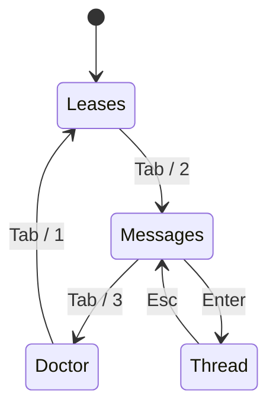

# pact ui

`pact ui` is an interactive terminal dashboard over everything else in this
project: the leases under `.pact/leases/` and the messages `pact msg`
sends/reads, plus a live `pact doctor` panel — all in one screen, with keys
instead of re-typing CLI invocations. It's built on
[ratatui](https://ratatui.rs) + its bundled [crossterm](https://github.com/crossterm-rs/crossterm)
backend, chosen because they're the actively-maintained standard for Rust
TUIs rather than something to build from scratch.

Like every other pact command, it's a single foreground process: no daemon,
nothing left running after you quit.

## Requires the `ui` Cargo feature

Everything on this page is gated behind the optional `ui` feature, so a repo
that only wants leases and messaging doesn't compile ratatui. **A default build
has no `ui` subcommand at all** — `pact ui` answers `error: unrecognized
subcommand 'ui'`, which looks like a missing install rather than a missing
feature. Build with `--features ui`:

```bash
mise run install                          # already passes --features ui
cargo install --path . --force --features ui
cargo build --release --features ui
```

`pact --version` ends with the enabled features, so `features: none` is the
one-line confirmation that this is what happened.

```bash
pact ui
```

## Tabs



`Tab` / `Shift+Tab` cycle through the three tabs; `1`/`2`/`3` jump directly
to one, or click a tab's label directly. The status line at the bottom
always shows the keys that apply to whatever you're looking at.

## Mouse

Every keyboard-driven selection also works with the mouse:

| Action | Effect |
|---|---|
| Hover a tab label or a row | highlighted, so you can see what a click would do before clicking |
| Click a tab label | switch to that tab |
| Click a row (Leases or Messages) | select it, same as moving there with `j`/`k` |
| Scroll wheel | move the selection up/down, same as `j`/`k` |

Each tab's clickable area is exactly the rect its label was rendered into —
not an equal-width guess across the header — so hit-testing can't drift out
of sync with what's on screen no matter how the label text or terminal width
changes. Hovering highlights confirm this before you commit to a click.

Clicking never triggers a release or opens a thread by itself — those stay
explicit keypresses (`Enter`/`d`, and the confirm-before-force-release
step), since they have real side effects. A click only selects.

### Leases

A live table of everything under `.pact/leases/` — path, holder, age,
remaining TTL, active/expired, and any `--note`. It refreshes every second on
its own, or immediately on `r`.

| Key | Action |
|---|---|
| `j` / `↓`, `k` / `↑` | move selection |
| `r` | refresh now |
| `Enter` / `d` | release the selected lease |
| `Esc` / `n` | cancel a pending force-release |

Releasing your own lease (matched against `--agent`/`PACT_AGENT`) happens
immediately. Releasing someone else's asks for a second `Enter`/`d` before
doing it — same principle as the CLI's `--steal`: overriding another agent's
claim is always an explicit, visible action, never silent. See
[docs/leases.md](leases.md) for the underlying lease semantics.

### Messages

Your inbox — the same query `pact msg inbox` runs, which depends on the backend:
`bd list --assignee=<agent> --include-infra` on a bd workspace,
`br list --type=message --assignee=<agent>` on a br one. Unread messages are
marked `*`. `Enter` opens the full
thread — root message plus replies — in a detail pane and marks it read;
`Esc` goes back to the list.

| Key | Action |
|---|---|
| `j` / `↓`, `k` / `↑` | move selection |
| `r` | refresh now |
| `Enter` | open the selected thread |
| `Esc` (in a thread) | back to the list |

If `bd` isn't on `PATH`, or no `--agent`/`PACT_AGENT` is set, this tab shows
that inline instead of failing the whole UI to launch — Leases and Doctor
stay fully usable either way. See [docs/messaging.md](messaging.md) for how
messages map onto Beads issues.

### Doctor

The same checks as `pact doctor`, rendered live. These are the check names
verbatim, because `scripts/check-docs.sh` compares this table against
`pact doctor --json` in both directions — a check missing here, or one named
here that the CLI does not emit, fails CI:

| Check | What it answers |
|---|---|
| `git repo` | the resolved repo root |
| `.pact/ present` | is there any state to read, and where it resolved to |
| `worktree` | ordinary checkout, main worktree, or linked worktree — and warns (`!`) when resolution fell back |
| `coordination scope` | `PACT_WORKTREE_SCOPE` in effect; warns (`!`) when `local` is isolating leases from sibling worktrees |
| `state placement` | which rule put the state directory where it is |
| `event log survives a clone` | is `.pact/events.jsonl` tracked; warns (`!`) when it is ignored, because the history dies at the next clone |
| `state dir writable` | can pact actually write there — the shared directory of a linked worktree may not be yours |
| `state dir isolation` | only meaningful under `PACT_STATE_DIR`; warns (`!`) when leases there look like they came from a different repository |
| `worktree schema marker` | only meaningful with linked worktrees; warns (`!`) when the shared `.pact/` has never been touched by a worktree-aware pact, so an older binary elsewhere on PATH may still be treating it as private state |
| `AGENTS.md block current` | does the managed block match this pact version |
| `CLAUDE.md reaches the protocol` | Claude Code loads `CLAUDE.md`, never `AGENTS.md` |
| `other instruction files current` | `GEMINI.md` and friends, same staleness question |
| `write-set symlinks` | warns (`!`) when a managed file is a symlink resolving outside the repository |
| `protocol files reach a clone` | warns (`!`) when they are gitignored |
| `otel export` | built in? configured? actually exporting? warns (`!`) when the answer to the last one is no |
| `one Beads store` | warns (`!`) when `.beads/` holds two backends' stores |
| `Beads CLI` | which binary, which version, warning outside the tested range |
| `stale leases` | how many, without collecting them |
| `corrupt leases` | lock files pact cannot read, which only a human can clear |
| `orphaned staging files` | `staging-*`/`tmp-*` debris left by a write that crashed mid-rename |
| `stale wait markers` | `.pact/waits/` markers a conflict left behind that nobody retried or swept — informational only, never a failure |

Lazy-loaded like Messages (only checked once you visit the tab, or press
`r`), since it shells out to `bd --version` the same way Messages does.

| Key | Action |
|---|---|
| `r` | re-run the checks |

## Quitting

`q` or `Ctrl-C`, from any tab. The terminal is restored even if the app
panics — a crashed TUI leaving your shell in raw mode is exactly the kind of
papercut pact tries not to introduce.
