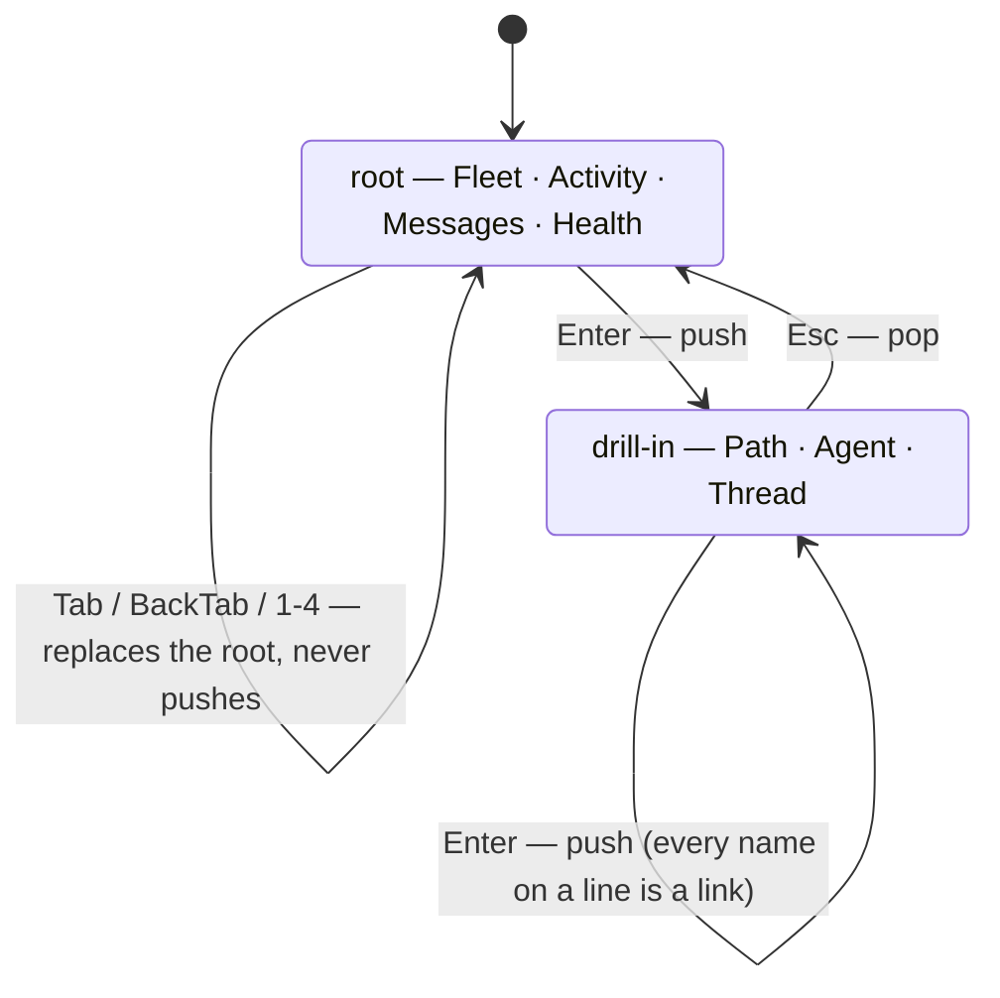

# pact ui

`pact ui` is an interactive terminal dashboard over what pact records: the
leases under `.pact/leases/`, the messages in `.pact/messages.jsonl`, the event
log in `.pact/events.jsonl`, and the checks `pact doctor` and `pact audit` run
over them. It's built on [ratatui](https://ratatui.rs) + its bundled
[crossterm](https://github.com/crossterm-rs/crossterm) backend, chosen because
they're the actively-maintained standard for Rust TUIs rather than something to
build from scratch.

Like every other pact command, it's a single foreground process: no daemon,
nothing left running after you quit.

## If you knew the older dashboard, read this first

**`Enter` no longer releases a lease. `x` does.**

The dashboard used to be three tabs — Leases, Messages, Doctor — where `Enter`
(and `d`) force-released the selected lease. That is the universal *look
closer* key wired to the one destructive action on screen, and it did what you
would expect it to do: a live agent's claim was force-released from this
dashboard by someone who meant to inspect it.

So the keys moved, and the move is enforced by the type system rather than by
convention — each screen's `on_enter` takes `&App`, so a view that tried to
mutate on `Enter` would not compile.

| Then | Now |
|---|---|
| `Enter` / `d` released the selected lease | `Enter` opens a detail view for whatever is selected, and can never write |
| — (drill-in had no key of its own) | `x` releases; someone else's lease needs a second `x` |
| `Esc` / `n` cancelled a pending force-release | `Esc` goes back one level; at a root it disarms a pending `x` |
| `Esc` also closed an open thread | `Esc` means exactly one thing everywhere: pop |
| three tabs: Leases, Messages, Doctor | four screens: Fleet, Activity, Messages, Health |
| Messages was *your* inbox | Messages is the whole fleet's conversation; `m` scopes it to yours |
| `d` released a lease | `d` re-runs the setup checks, on Health |

## Requires the `ui` Cargo feature

Everything on this page is gated behind the optional `ui` feature, so a repo
that only wants leases and messaging doesn't compile ratatui. **A default build
has no `ui` subcommand at all** — `pact ui` answers `error: unrecognized
subcommand 'ui'`, which looks like a missing install rather than a missing
feature. Build with `--features ui`:

```bash
mise run install                          # already passes --features ui
cargo install --path . --force --features ui
cargo build --release --features ui
```

`pact --version` ends with the enabled features, so `features: none` is the
one-line confirmation that this is what happened.

```bash
pact ui
```

## Four screens and one stack

There are four **roots**, one per question an operator actually asks:

| | Answers |
|---|---|
| **Fleet** | who is doing what, and who is stuck behind whom |
| **Activity** | what just happened — the live event feed |
| **Messages** | what the fleet is saying |
| **Health** | is the setup sound, and is the *run* behaving |

and three **drill-ins**, each about one entity: a **Path**, an **Agent**, a
**Thread**.



Switching root **replaces** the stack, so it is never deeper than one root plus
its drill-ins; the header shows the whole stack as a breadcrumb
(`Fleet > src/lease.rs > docs-story`), which is also what tells you where `Esc`
goes. Drill-ins are identified by name and not by row number, so the thing you
opened stays the thing you are looking at across a refresh that reordered the
list behind it — the same reason every list restores its cursor by identity
(path, agent, message id, event id) rather than by index. An index means a
different row the moment another agent releases a lease, which is a bad
property for any list and was an unsafe one when the release key was `Enter`.

The current view refreshes every second on its own, or immediately on `r`.

## Keys

These mean the same thing on every screen:

| Key | Action |
|---|---|
| `Tab` / `Shift+Tab` | next / previous root |
| `1` `2` `3` `4` | jump to Fleet / Activity / Messages / Health |
| `Enter` | drill into the selection — **never mutates anything** |
| `Esc` | clear an open filter; otherwise back one level; at a root, disarm a pending `x` |
| `/` | filter the list on screen — see [Filtering](#filtering) |
| `r` | refresh now |
| `q` / `Ctrl-C` | quit |

Everything else belongs to the screen you are on, movement included, and the
status line at the bottom always shows that screen's keys first — leading with
the one that changes something, where the screen has one.

| Screen | Keys |
|---|---|
| **Fleet** | `j`/`k` (`↓`/`↑`) move · `h`/`l` (`←`/`→`) switch pane · `x` release · `Enter` open the selected agent or path |
| **Activity** | `j`/`k` move · `g`/`G` top/bottom · `h`/`l` flip what `Enter` opens (path ⇄ agent) · `c` whole fleet / narrowed |
| **Messages** | `j`/`k` move · `m` mine / whole fleet · `Enter` open the thread |
| **Path / Agent** | `j`/`k` next / previous *link* (headings and plain facts are skipped) · `Enter` follow it |
| **Health** | `g` run the git-backed checks · `d` re-run the setup checks · `s` show every setup check · `j`/`k` move |
| **Thread** | none — it is a page; `Esc` pops it |

## Filtering

`/` opens an incremental filter over whatever list the current screen is
showing, and narrows as you type. It earns its place at fleet scale: twenty
agents leave sixty leases in one path-sorted table.

There is no filter bar. The query and the count take over the status line —
`/lease   3 of 60 shown   esc: clear` — because an extra line inside the content
area would shift every row down by one while hit-testing kept the old
arithmetic, which is the click-lands-on-the-wrong-row defect this dashboard has
already paid for once. For the same reason the narrowing happens where a screen
builds its rows, not at render time: `Enter` and a click see the same short list
your cursor is on.

**While the filter is open, every printable key types.** That includes the ones
that are commands otherwise — `j`, `k`, `x`, `m`, `c`, `g`, `s`, `d`, `r` and
`1`-`4` — so a release cannot be triggered by accident mid-query, and `q` types
a `q` rather than quitting. `Ctrl-C` still quits, always.

Still live while filtering, because none of them is a character: the arrow keys
and the wheel move the selection, `Enter` opens it, `Tab`/`Shift+Tab` switch
root, and the mouse still selects and switches tabs.

`Esc` **clears the filter first and pops the view only once there is nothing to
clear**, so a filtered drill-in takes two `Esc`s and neither of them surprises
you. That keeps `Esc` meaning one thing — get rid of the transient state in
front of you — with the filter sitting in front of the view stack. Any
navigation clears it too: a query belongs to the list it was typed over.

What each screen matches on, case-insensitively, one field at a time (a query
never spans two columns):

| Screen | Matches |
|---|---|
| **Fleet** | leases by path, holder and note; the roster by agent name |
| **Activity** | agent, event kind, target path, detail |
| **Messages** | sender, recipient, subject |
| **Health** | check name and finding text |
| **Path / Agent** | the line text |

The agent whose work Fleet's right pane is showing is never filtered out from
under the cursor, so a query cannot silently re-scope the pane. The Messages
unread badge counts the whole scope and never the filtered subset, and the watch
notices — a summary, not a list — are left alone. Filtering runs over rows
already projected from the per-tick read model, so typing re-parses nothing.

## Mouse

| Action | Effect |
|---|---|
| Hover a tab label or a row | highlighted, so you can see what a click would do before clicking |
| Click a tab label | switch to that root |
| Click a row | select it, same as moving there with `j`/`k` |
| Scroll wheel | move the selection up/down — routed through the same key handler as `j`/`k`, so the two cannot drift apart |

**A click only ever selects.** It does not open a drill-in and it cannot
release a lease; opening is `Enter`'s job and releasing is `x`'s, on every
screen. The one thing selection does write is a read cursor, and only for your
own mail — see [Messages](#messages) below.

Each tab's clickable area is exactly the rect its label was rendered into — not
an equal-width guess across the header — so hit-testing can't drift out of sync
with what's on screen, badges included: `Messages (3)` is measured at the width
it was drawn, or every tab after it would sit outside its own hit-box. Rows are
hit-tested against the scroll offset the current frame rendered with, so a click
on a scrolled list lands on the row you clicked.

## Fleet

Two panes. On the left, the **roster**: every agent this repo has ever seen,
most recently active first, with what it holds, when it was last seen, and its
unread count — plus an `(all leases)` row that puts the whole unfiltered lease
table back. On the right, the selected agent's **work** (path, holder, age,
state, note), and beneath it the **waiting-on** panel.

The roster is the point of the screen: an operator reasons about actors, and
"what is agent X doing" used to mean reading every row of a path-sorted table,
while "which agents are idle" could not be asked at all — a finished agent's
locks are gone, so it vanished from a lease-only view. The roster merges live
locks with event and message history, so an agent that has released everything
is still there.

A roster name no pact process could have run under is shown as
`[INVALID] <name>` in red, with the flag in front so it survives a truncated
column — something other than pact wrote that name into the store, and it must
not render like a peer.

`Enter` opens the selected roster agent, or the selected path from the work
table — whichever pane has focus (`h`/`l`). `(all leases)` is a filter and not
an entity, so there is nothing to open on it.

Below the work table, one line per blocked agent: **who is stuck, on what, for
how long, behind whom, and whether they subscribed or are polling.**

```
docs-story wants docs/tui.md · 4m12s waiting · held by orchestrator (9m30s left) · subscribed
poller     wants src/lease.rs · 8m01s waiting · held by builder (2m10s left) · RETRYING · 33 refusals
```

Everything on that line is already in the event log and nothing surfaced it: a
`refused` event carries the holder and the holder's own remaining lease, the
watch registry says whether the blocked agent then subscribed like
[docs/watch.md](watch.md) tells it to, and `pact audit --check retry-storm`
says whether it polled instead — that verdict, not a second implementation of
"is this a poll loop" that could disagree with it.

Two things the panel states rather than implying:

- **What "still blocked" means.** A refusal outlives the hold it named by a
  grace period and no longer, and the panel's title says which grace it was
  computed under. Otherwise a two-hour-old refusal reads as somebody currently
  stuck.
- **A holder that has gone quiet is named as quiet**, not merely coloured. Seven
  of ten agents in one run stalled while every row read green, and
  `orchestrator (39m53s left)` is exactly the reassuring sentence that hid it.

`x` releases the selected lease. Your own (matched against
`--agent`/`PACT_AGENT`) goes immediately; someone else's arms a
force-release — the status line turns yellow and names the holder — and needs a
second `x`, or `Esc` to disarm. Same principle as the CLI's `--steal`:
overriding another agent's claim is always explicit and visible, never silent.
When it happens, the status line names the agent you displaced, because "who
did I just step on" is the one fact you need in order to go and tell them. See
[docs/leases.md](leases.md) for the underlying semantics.

## Activity

The live event feed — `pact log` in the dashboard, so that "nothing is
happening" and "everything finished" stop looking identical. It reads top to
bottom, newest last, and **follows the tail only while the selection is on the
last row**: scroll up and it stops following, `G` puts you back on the tail and
resumes it. Auto-scroll that fights an operator who has scrolled up is worse
than none.

Event kinds are coloured by what they mean, not individually: `acquired`,
`released`, `renewed` and `watched` are traffic; `refused`, `stolen`, `expired`
and `force-released` are contention; `notified` and `annotation` are the
subscription machinery working. A kind this build does not know about is left
uncoloured rather than guessed into a class — the log outlives any one binary's
idea of what can be in it.

The header line reports the rate over the last five minutes, how many rows are
shown, whether it is following, what the feed is narrowed to, and what `Enter`
will open.

The feed is **narrowed by what you selected on Fleet** — that contextual
narrowing *is* the navigation. `c` toggles back to the whole fleet and is the
only way to reach the global feed, since Fleet always has something selected.
`h`/`l` flip whether `Enter` opens the selected event's path or its agent; most
events have both, but not all have a path.

Ages and detail text come from the same formatters `pact log` uses, so the feed
and the CLI cannot disagree about how old something is.

## Messages

The **whole fleet's conversation**, not one agent's inbox. The operator running
the dashboard is usually not a fleet member, so scoping this to `PACT_AGENT`
showed them an empty screen while the fleet was talking — and with an identity
set it hid the thing they most want to catch, a contract change announced
between two other agents. `m` scopes to mail addressed to you, and only does
anything when there is an identity to scope to.

`pact watch` notices are split out into their own pane, coalesced per path
(`docs/tui.md  x9  latest from spine`). They are machine output; an agent asking
a peer for a decision is not. The CLI has always kept the two apart
(`--include-watch` / `--watch-only`) and this reuses that split rather than
re-deriving it. Notices are also left out of the tab's unread badge: a badge
that machine output can run up is a badge nobody reads.

`Enter` opens the selected message's thread — root plus replies, read-only.
**Opening a thread does not mark anything read**, deliberately: a read cursor
is what a *sender* checks to decide whether their message landed, and a
1 Hz-refreshing pane that wrote one would tell every sender in the thread that
their message had reached an agent who never saw it.

What *does* mark a message read is **selecting it, and only when it is
addressed to you**. The dashboard is the human's inbox — 41 of 85 messages in
one fleet run were addressed to `human`, who never runs `pact msg read`, so
`pact msg sent` reported every one of them unread forever. Marking mail
addressed to someone else would write your name into a cursor that tells its
real recipient's sender nothing, so it doesn't. Merely opening the screen marks
nothing either; that would destroy the unread markers that make the list worth
having.

The message store has had nothing to do with the issue tracker since 0.9.0, so
this screen works with no `bd` installed at all — which is exactly the
situation, a fresh clone with no tooling, where you most need to read what the
fleet said. See [docs/messaging.md](messaging.md).

## Path and Agent

The two drill-ins `Enter` opens, each one flat list of lines, and **every entity
reference on a line is a link**: an agent name opens the agent, a path opens the
path, a message id opens its thread. `j`/`k` step between links and skip the
headings and plain facts, since there is nothing to do on those.

A **path** shows who holds it, who is waiting on it, who is watching it, the
messages sent *about* it (`pact msg send --to-owner-of`, which is how a handoff
outlives the agent that started it), and its recent history — including who last
held it after the lock is gone.

An **agent** shows what it holds now, what it is blocked on, what it sent and
whether anyone read it, what it received, and its recent events.

Both are read-only in the strict sense: every fact comes off the same per-tick
parse the rest of the dashboard uses, nothing marks a message read, and nothing
collects an expired lock. `pact lease ls` sweeps expired leases and this
deliberately does not — a dashboard that garbage-collected them would delete the
evidence you opened it to look at. A question must not change its own answer.

## Health

Three sections, because "is my repository set up right" and "is this run going
well" are different questions and only one of them stays interesting after the
first ten minutes.

- **SETUP** — the `pact doctor` checks below. Collapsed to a one-line verdict
  while everything is green, expanded the moment it is not; `s` shows all of
  them regardless, `d` re-runs them.
- **BEHAVIOUR** — the offline `pact audit` checks over the live event log:
  `stale-holds`, `double-win`, `silent-contention`, `claim-lease-divergence`
  and `retry-storm`. These read `.pact/` (and, for the divergence check, the
  committed Beads export) and spawn nothing, so they re-run whenever the event
  log grows.
- **DEEP** — `commit-correlation` and `merge-divergence`, which read git
  history. Behind `g`, and the screen says so, because the ui pauses while they
  run.

A finding that names a path is a link: `Enter` opens that path. "Could not run"
is kept distinct from "found nothing", exactly as `pact audit` keeps them —
see [docs/audit.md](audit.md) for what each check proves.

The tab label carries the verdict (`Health`, `Health !`, `Health ✗`) so a
failing check is impossible to miss from another screen, which was the one job
the old Doctor tab was doing and the thing demoting it must not lose. The
behaviour half of that badge is free — it comes off the per-tick parse — and the
setup half is re-run on a slow clock of its own, never on the 1 Hz one, because
`pact doctor` spawns `bd`. The dashboard once spawned `bd` about ten times a
second for a lesser reason than this.

### Doctor

The SETUP section runs exactly the checks `pact doctor` does. These are the
check names verbatim, because `scripts/check-docs.sh` compares this table
against `pact doctor --json` in both directions — a check missing here, or one
named here that the CLI does not emit, fails CI:

| Check | What it answers |
|---|---|
| `git repo` | the resolved repo root |
| `.pact/ present` | is there any state to read, and where it resolved to |
| `worktree` | ordinary checkout, main worktree, or linked worktree — and warns (`!`) when resolution fell back |
| `coordination scope` | `PACT_WORKTREE_SCOPE` in effect; warns (`!`) when `local` is isolating leases from sibling worktrees |
| `state placement` | which rule put the state directory where it is |
| `event log survives a clone` | is `.pact/events.jsonl` tracked; warns (`!`) when it is ignored, because the history dies at the next clone |
| `message store survives a clone` | the same question for `.pact/messages.jsonl`, which became committed in 0.9.0 and had no check — so a repo could sit gitignored while carrying a `merge=union` attribute with nothing reporting it |
| `state dir writable` | can pact actually write there — the shared directory of a linked worktree may not be yours |
| `state dir isolation` | only meaningful under `PACT_STATE_DIR`; warns (`!`) when leases there look like they came from a different repository |
| `worktree schema marker` | only meaningful with linked worktrees; warns (`!`) when the shared `.pact/` has never been touched by a worktree-aware pact, so an older binary elsewhere on PATH may still be treating it as private state |
| `AGENTS.md block current` | does the managed block match this pact version |
| `no duplicated instruction blocks` | a heading repeated outside pact's own block — a different tool duplicating its own section, not pact's |
| `CLAUDE.md reaches the protocol` | Claude Code loads `CLAUDE.md`, never `AGENTS.md` |
| `other instruction files current` | `GEMINI.md` and friends, same staleness question |
| `write-set symlinks` | warns (`!`) when a managed file is a symlink resolving outside the repository |
| `protocol files reach a clone` | warns (`!`) when they are gitignored |
| `otel export` | built in? configured? actually exporting? warns (`!`) when the answer to the last one is no |
| `one Beads store` | warns (`!`) when `.beads/` holds two backends' stores |
| `Beads CLI` | which binary, which version — informational, since no pact command depends on `bd` at run time |
| `Beads actor attribution` | warns (`!`) when multiple pact agent identities never appear as any Beads actor — direct `bd` commands bypassing pact's `--actor` |
| `Beads audit sidecar` | whether `.beads/interactions.jsonl` — the export `pact audit --check claim-lease-divergence` reads — exists at all. Warns (`!`) when it does not, because that check and `Beads actor attribution` then pass in silence, which is indistinguishable from a clean fleet; the warning names both ways to turn recording on and pre-empts bd's spurious "not a recognized config key". Never fails: the sidecar is optional. Deliberately does **not** claim recording is currently on — `BD_AUDIT_ENABLED=1` leaves no trace pact can read |
| `stale leases` | how many, without collecting them |
| `corrupt leases` | lock files pact cannot read, which only a human can clear |
| `orphaned staging files` | `staging-*`/`tmp-*` debris left by a write that crashed mid-rename |
| `stale wait markers` | `.pact/waits/` markers a conflict left behind that nobody retried or swept — informational only, never a failure |

The terminal is restored even if the app panics — a crashed TUI leaving your
shell in raw mode is exactly the kind of papercut pact tries not to introduce.
