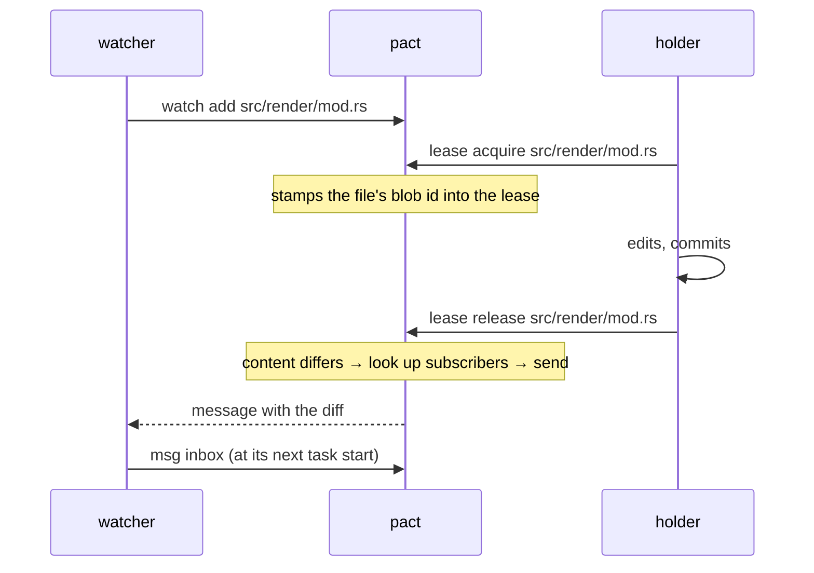

# `pact watch`

Subscribe to paths. When a holder releases one, pact sends you the diff of
what they changed, as a message, automatically.

```bash
pact watch add src/render/mod.rs    # one file
pact watch add src/render/          # everything under a directory
pact watch ls                       # every subscription in force
pact watch rm src/render/mod.rs
```

## Why it exists

The protocol has asked agents to announce interface changes by hand for pact's
whole life. That request has now been tuned by prose in **both directions**,
and overshot both times.

**Unrestrained, agents spammed.** Before
[`107e7c4`](../src/agents_md.rs), the managed block said nothing to hold
messaging back, and pact's own fleet runs produced **223 message beads**. One
run alone sent 85 messages of which **41 were status pings** — "X starting", "X
done" — to a recipient who reads a dashboard, not a mailbox. A real
`BLOCKER: pact init deletes the protocol` sat unread for **38 minutes** inside
that noise.

**Restrained, they went silent.** So the block was changed: the lease note IS
the announcement, and messages are reserved for what needs something back. Across
the three fleet runs after that change, **28 agents sent 4 messages between them**.

And the collapse took the load-bearing messages with it: one of those four is the
only reason a `write_buffer` overflow did not ship, and three of the four were
never read by the agent they were addressed to
([the per-run counts](studies/field-runs.md#what-the-four-runs-actually-say-about-messaging)).

The conclusion is not that agents are lazy. It is that **voluntary messaging is
bimodal under prose — spam or silence, with no reachable middle.** Exhortation
cannot dial it, because the behaviour is off the agent's critical path either
way.

So `pact watch` does not ask for anything at announce time. Subscription is a
one-off registration, and delivery rides `lease release` — a command those same
runs performed **31 times out of 31**, with zero stale holds. Adherence stops
being aspirational and becomes structural.

## The model: a registry, not a watcher

There is **no daemon, no polling, no background process and nothing that
waits.** `pact watch` is a registry. `pact lease release` reads it, sends
whatever messages it implies, and exits.

Since 0.9.0 there is no backend either: a notice is a line appended to
`.pact/messages.jsonl`, so delivery spawns nothing and cannot fail for want of an
issue tracker. That matters more here than for authored mail, because this is the
path nobody chose to be on — an agent releasing a lease did not ask to send nine
messages, and a delivery failure it never sees is one it cannot retry.



The subscriber receives it at their next `pact msg inbox`, which the protocol
already asks for at task start. No process ever blocks on another.

## What gets sent

One message per subscriber — not one message with several recipients, since
each is a separate conversation about a file *they* watch and a shared thread
would put unrelated agents into each other's replies. It carries:

- the path, the holder, and what they changed as a unified diff
- the holder's `HEAD` short hash at release
- **in a repository with worktrees, the branch the change is on** — and that the
  notice is a contract notice rather than a code delivery ([why](#the-worktree-caveat))
- **how to reply in the same thread**, naming the holder
- a reminder that `pact watch rm <path>` stops it

The reply line is not decoration. In the first field run, **0 of 33**
hand-written messages replied into the notification that prompted them — even
though four were explicit acknowledgements of a received diff, and others
adapted to one. The body's only call to action was how to unsubscribe: the one
instruction pact gave a subscriber at the moment they had a question was how to
stop hearing from you. It now says how to answer first, and how to leave
second.

The message is tagged with the path, so it follows the file the way
`--to-owner-of` messages do: whoever leases that path next is told one is
waiting, even if the original subscriber has exited.

### And it is tagged as a notice, because the cost is watchers × releases

A notice is stored with `kind: "watch-notice"`, and `pact msg inbox` shows
authored messages by default with notices counted per path
([why](messaging.md#a-notification-is-not-correspondence)).

`kind` is a **first-class field on the message row**, not an inbox filter and not
a label. That is what makes the split trustworthy in both directions: every row
carries it, so nothing has to be classified after the fact by pattern-matching
its wording. It was a bd label until 0.9.0, and a label could only be applied at
creation — which left every notice written before the label shipped
unclassifiable, and a heuristic in the code to guess at them.

That tag exists because this feature's own advice creates the pile. The first
fleet to follow it — ten agents all watching one designed hot file — turned a
single release into **nine messages in nine seconds**, and `lease acquire`
reported `32 unread message(s) about src/ast.rs`. Across that window: 11
automatic notices to 1 authored message, and the authored one was the warning
somebody actually needed.

So the advice above is unchanged and still right — subscribe to the interfaces
you depend on — but the delivery had to stop competing with correspondence for
the same queue. **The better a fleet complies, the worse the ratio gets**, which
makes this a property of the mechanism rather than of the fleet.

`pact msg inbox --include-watch` collapses them one row per **path**, not per
delivery, and points `msg read` at the latest diff. Eight superseded diffs of one
file are a number; the ninth is the answer.

### The diff is against the content at acquire time

Not against `HEAD`, and not against the index. The protocol now tells agents to
[commit before releasing](leases.md), so by release time the working tree is
usually clean and every working-tree-relative diff would be empty.

So `lease acquire` records the path's git blob id — with `git hash-object -w`,
which *writes* the blob rather than only naming it. That blob is the fixed
point the release-time diff is computed against, and it survives the holder
committing. The cost is an unreferenced loose object that `git gc` prunes;
losing the diff would be permanent.

A path that did not exist at acquire time records no hash and sends no
notification. "I cannot tell what changed" is better answered with silence than
with a message saying so on every lease taken to create a file.

### Size cap

Diffs are cut at **1000 lines**, with a notice naming the holder's `HEAD`:

```
[diff truncated after 1000 of 4130 lines — see commit 976b4ef]
```

The reader is an agent with a context window, so a very large refactor pasted
into an inbox is worse than a pointer to it — the reader stops reading.

**The figure is measured and expected to move.** It started at 200, chosen
before any field data existed, and the first real run truncated *half* of
everything it delivered: 44 of 87 diffs, whose real sizes were median 397 lines
and largest 839 — nowhere near the size the cap was imagined for. 1000 delivers
every diff that run produced, in full.

Truncating costs more here than it would for a human. A cut diff degrades to
"go and run `git show`", a second step off the critical path — the exact
category of voluntary step this whole feature exists because agents skip.

### Reserved keys get the fact, not a diff

A lease on `.pact/internal/<purpose>` — a merge mutex, a store lock — stands for a
name, not a file. There is no blob at acquire and none at release, so there is
nothing to diff, and until pact-bsf a release on one sent **nothing at all**.

That silence landed on exactly the paths a fleet serializes on. Measured in the
millrace run: an agent was refused the merge mutex, subscribed with `pact watch add`
exactly as the refusal advises, and was never told when it went free. The holder
released 32 seconds later; the waiter acquired **3m01s after that**, having fallen
back to polling. `pact audit` reported `watch 1 active; 0 diff(s) delivered`.

A waiter on a mutex does not want a diff — it wants the fact of release. Releasing a
reserved key now sends a short notice saying the path is free, carrying no diff and
saying why there is none. It deliberately does **not** tell you to go and acquire:
several agents may watch one mutex and only one can win, so the notice reports a fact
rather than issuing an instruction that is wrong for everybody but the fastest reader.

The file path is unchanged: a real file with no recorded baseline still notifies
nobody, because "I cannot tell what changed" is not worth a message.

## Subscriptions

Exact paths or directory prefixes. **No globs in v1.**

| You write | You get |
|---|---|
| `pact watch add src/api.rs` | that file only |
| `pact watch add src/render/` | everything under `src/render/` |
| `pact watch add src/render` (a real directory) | the same — an existing directory can only mean its contents |

Prefix matching respects path boundaries, so a watch on `src/render` never
matches `src/renderer.rs`.

Identity is `PACT_AGENT`, like every other command. **You are never your own
subscriber**: an agent watching a directory it also works in would otherwise
message itself on every release. Holding both an exact and a covering prefix
subscription makes you one recipient, not two copies.

`.pact/watches.jsonl` is append-only with tombstones — `rm` writes an `unwatch`
record rather than editing — and chain-hashed like the event log, so a
hand-edited subscription is detectable. Unlike `events.jsonl` it stays
**gitignored**: a subscription is live state belonging to a running fleet, like
a lease. Committing it would have every clone inherit subscriptions from agents
that no longer exist.

## Guarantees, and what they cost

**Delivery can never fail a release.** `notify_release` is infallible by
signature and runs only *after* the lock is removed, the event written and the
metric counted. No notification failure can leave a lease held, change an exit
code, or alter what `lease release` prints. This is the same doctrine
[`events::append`](../src/events.rs) already follows: a lost notification costs
one missed diff, a stuck lease blocks a peer until its TTL lapses.

Failures are not silent, only non-fatal — they are recorded as
`watch-delivery-failed` events, so `pact log` and `pact audit` show them.

**The largest of those failures has been removed rather than reported better.**
Delivery used to begin by locating a `bd` binary and give up here if there was
none — so the one part of the protocol that runs *without an agent choosing to
run it*, on a path an agent is walking away from, depended on somebody having
installed the issue tracker. What remains is an append to a file under `.pact/`,
which fails only for the reasons any write to `.pact/` fails.

**Expiry does not deliver.** Only `release` and `--force` release do. A lapsed
lease means nobody is present to have changed anything deliberately, and the
content difference is as likely to be a peer's edit as the dead holder's.

**`pact audit` reports the mechanism's own health**, so a fleet can tell "no
diffs delivered because nothing changed" from "no diffs delivered because none
got through":

```
  watch  3 active; 7 diff(s) delivered
```

## The worktree caveat

Under the [orchestrated-wave topology](fleet-patterns.md), the releasing agent's
working tree is its own worktree, so the diff is against **its branch state**,
before the orchestrator merges it.

The content is correct — that really is what the holder changed. But a
subscriber sees the change *pre-merge*, and if the merge alters it, what
finally lands may differ. Treat it as early warning rather than as the final
word: it arrives while there is still time to object, which is the point.

### So the notice says which branch, and that it is not a delivery

A subscriber's reasonable next move on "`src/x.rs` changed — released by peer"
is to go and look at `src/x.rs`. In a worktree fleet that file is unchanged and
will stay unchanged: the holder wrote it on **their** branch in **their**
worktree, and the only path into the subscriber's tree is orchestrator-merges-to-
shared, then subscriber-merges-shared.

An agent that had done exactly what the protocol asks — `watch add` on an
interface it depended on but did not own — worked this out for itself, wrote
*"their file can never reach mine; waiting was structurally pointless"*, and
killed the waiter it had started. Nothing in the notice had told it otherwise.

So when — and **only** when — the repository has linked worktrees, the notice
adds:

```
This is a contract notice, not a code delivery: agent-a wrote this on branch
fleet/agent-a, in their own worktree. It cannot appear in your tree until
fleet/agent-a merges and you merge that. Read the diff for what the contract
now says and carry on — the file will not change under you, so there is
nothing to wait for.
```

The gate is the same `has_worktrees` test that decides whether a lock file
carries `branch` at all, resolved from the same repository root in the same
process, so the notice and the lease cannot disagree about where the holder was.
In a plain checkout it is omitted, because there the notice really *is* a code
delivery — the diff describes the file already sitting in the reader's tree, and
a paragraph explaining that it does not would be a lie plus four lines of
context.

## Event kinds

`pact log` and `pact audit` gain four:

| kind | meaning |
|---|---|
| `watched` | a subscription was registered |
| `unwatched` | one was retired |
| `notified` | a diff was delivered — carries the subscriber and the message id |
| `watch-delivery-failed` | a delivery did not happen, and why |

None of them is a **custody** event: they say nothing about who held a path.
`pact agents --for <path>`, `lease acquire`'s prior-claim note and
`msg send --to-owner-of` all ignore them, along with `refused`. See
[`events::is_custody`](../src/events.rs).
