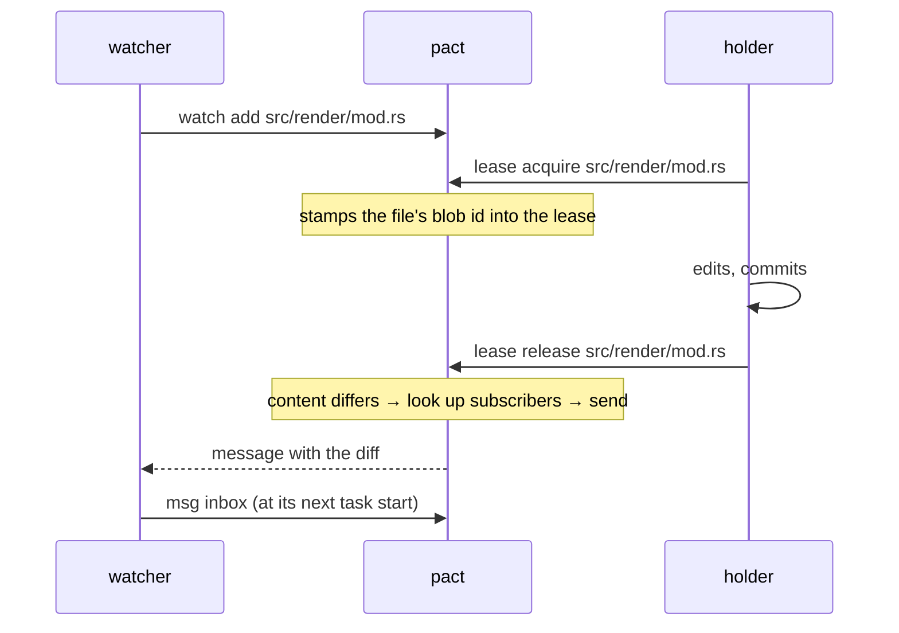

# `pact watch`

Subscribe to paths. When a holder releases one, pact sends you the diff of
what they changed, as a message, automatically.

```bash
pact watch add src/render/mod.rs    # one file
pact watch add src/render/          # everything under a directory
pact watch ls                       # every subscription in force
pact watch rm src/render/mod.rs
```

## Why it exists

The protocol has asked agents to announce interface changes by hand for pact's
whole life. That request has now been tuned by prose in **both directions**,
and overshot both times.

**Unrestrained, agents spammed.** Before
[`107e7c4`](../src/agents_md.rs), the managed block said nothing to hold
messaging back, and pact's own fleet runs produced **223 message beads**. One
run alone sent 85 messages of which **41 were status pings** — "X starting", "X
done" — to a recipient who reads a dashboard, not a mailbox. A real
`BLOCKER: pact init deletes the protocol` sat unread for **38 minutes** inside
that noise.

**Restrained, they went silent.** So the block was changed: the lease note IS
the announcement, and messages are reserved for what needs something back.
Across the three fleet runs since, **28 agents sent 4 messages between them** —
pact's own fleet 0, arkanoid 3, megablast 1.

And the collapse took the load-bearing messages with it. megablast's single
surviving message is the only reason a `write_buffer` overflow did not ship: an
agent that had changed a constant in a file it owned told the owner of a
*different* file which term to update. Three of those four messages were never
read by the agent they were addressed to.

The conclusion is not that agents are lazy. It is that **voluntary messaging is
bimodal under prose — spam or silence, with no reachable middle.** Exhortation
cannot dial it, because the behaviour is off the agent's critical path either
way.

So `pact watch` does not ask for anything at announce time. Subscription is a
one-off registration, and delivery rides `lease release` — a command those same
runs performed **31 times out of 31**, with zero stale holds. Adherence stops
being aspirational and becomes structural.

## The model: a registry, not a watcher

There is **no daemon, no polling, no background process and nothing that
waits.** `pact watch` is a registry. `pact lease release` reads it, sends
whatever messages it implies, and exits.



The subscriber receives it at their next `pact msg inbox`, which the protocol
already asks for at task start. No process ever blocks on another.

## What gets sent

One message per subscriber — not one message with several recipients, since
each is a separate conversation about a file *they* watch and a shared thread
would put unrelated agents into each other's replies. It carries:

- the path, the holder, and what they changed as a unified diff
- the holder's `HEAD` short hash at release
- a reminder that `pact watch rm <path>` stops it

The message is tagged with the path, so it follows the file the way
`--to-owner-of` messages do: whoever leases that path next is told one is
waiting, even if the original subscriber has exited.

### The diff is against the content at acquire time

Not against `HEAD`, and not against the index. The protocol now tells agents to
[commit before releasing](leases.md), so by release time the working tree is
usually clean and every working-tree-relative diff would be empty.

So `lease acquire` records the path's git blob id — with `git hash-object -w`,
which *writes* the blob rather than only naming it. That blob is the fixed
point the release-time diff is computed against, and it survives the holder
committing. The cost is an unreferenced loose object that `git gc` prunes;
losing the diff would be permanent.

A path that did not exist at acquire time records no hash and sends no
notification. "I cannot tell what changed" is better answered with silence than
with a message saying so on every lease taken to create a file.

### Size cap

Diffs are cut at **200 lines**, with a notice naming the holder's `HEAD`:

```
[diff truncated after 200 of 4130 lines — see commit 976b4ef]
```

The reader is an agent with a context window. A 4000-line refactor pasted into
an inbox is worse than a pointer to it, because the reader stops reading.

## Subscriptions

Exact paths or directory prefixes. **No globs in v1.**

| You write | You get |
|---|---|
| `pact watch add src/api.rs` | that file only |
| `pact watch add src/render/` | everything under `src/render/` |
| `pact watch add src/render` (a real directory) | the same — an existing directory can only mean its contents |

Prefix matching respects path boundaries, so a watch on `src/render` never
matches `src/renderer.rs`.

Identity is `PACT_AGENT`, like every other command. **You are never your own
subscriber**: an agent watching a directory it also works in would otherwise
message itself on every release. Holding both an exact and a covering prefix
subscription makes you one recipient, not two copies.

`.pact/watches.jsonl` is append-only with tombstones — `rm` writes an `unwatch`
record rather than editing — and chain-hashed like the event log, so a
hand-edited subscription is detectable. Unlike `events.jsonl` it stays
**gitignored**: a subscription is live state belonging to a running fleet, like
a lease. Committing it would have every clone inherit subscriptions from agents
that no longer exist.

## Guarantees, and what they cost

**Delivery can never fail a release.** `notify_release` is infallible by
signature and runs only *after* the lock is removed, the event written and the
metric counted. No notification failure can leave a lease held, change an exit
code, or alter what `lease release` prints. This is the same doctrine
[`events::append`](../src/events.rs) already follows: a lost notification costs
one missed diff, a stuck lease blocks a peer until its TTL lapses.

Failures are not silent, only non-fatal — they are recorded as
`watch-delivery-failed` events, so `pact log` and `pact audit` show them.

**Expiry does not deliver.** Only `release` and `--force` release do. A lapsed
lease means nobody is present to have changed anything deliberately, and the
content difference is as likely to be a peer's edit as the dead holder's.

**`pact audit` reports the mechanism's own health**, so a fleet can tell "no
diffs delivered because nothing changed" from "no diffs delivered because none
got through":

```
  watch  3 active; 7 diff(s) delivered
```

## The worktree caveat

Under the [orchestrated-wave topology](fleet-patterns.md), the releasing agent's
working tree is its own worktree, so the diff is against **its branch state**,
before the orchestrator merges it.

The content is correct — that really is what the holder changed. But a
subscriber sees the change *pre-merge*, and if the merge alters it, what
finally lands may differ. Treat it as early warning rather than as the final
word: it arrives while there is still time to object, which is the point.

## Event kinds

`pact log` and `pact audit` gain four:

| kind | meaning |
|---|---|
| `watched` | a subscription was registered |
| `unwatched` | one was retired |
| `notified` | a diff was delivered — carries the subscriber and the message bead id |
| `watch-delivery-failed` | a delivery did not happen, and why |

None of them is a **custody** event: they say nothing about who held a path.
`pact agents --for <path>`, `lease acquire`'s prior-claim note and
`msg send --to-owner-of` all ignore them, along with `refused`. See
[`events::is_custody`](../src/events.rs).
